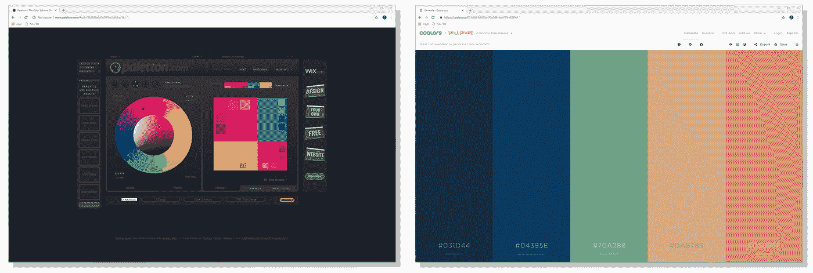
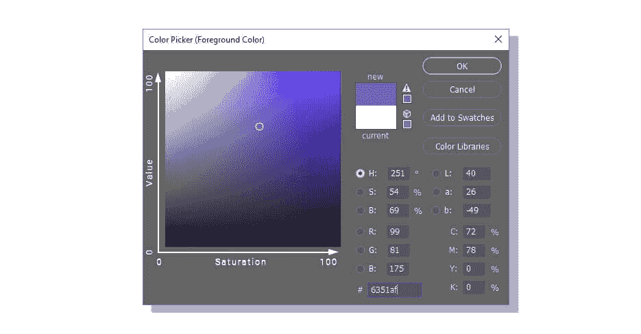

# 数据可视化的 11 个设计技巧

> 原文：<https://www.dataquest.io/blog/design-tips-for-data-viz/>

October 25, 2018

这里有一个很容易忘记的重要事实:**我们的数据只有在可以理解的情况下才有帮助。**

大多数时候，让数据变得可理解意味着创建某种数据可视化。虽然简单的条形图可能适合内部工作，但使您的数据在视觉上可以理解并具有吸引力可以帮助它获得更多关注，并帮助您脱颖而出，无论您的受众是整个互联网还是只是您公司在每周会议上的首席执行官。

但是平面设计的世界是混乱和主观的，大多数数据科学家可能没有时间去钻研学习设计。幸运的是，你不必！这里有一些简单的规则和技巧，你可以遵循，使你的数据看起来更好。

## 挑选好颜色，欺骗

颜色选择对于数据可视化很重要，但是当涉及到颜色时，很容易陷入混乱。如果你想走 DIY 路线，我们有一篇关于[为你的数据可视化](https://www.dataquest.io/blog/what-to-consider-when-choosing-colors-for-data-visualization/)选择颜色的长文。但是你可以走更容易的路:

让网站选择你的颜色:如果你想让一台机器完全选择你的颜色，[酷派](https://coolors.co/app)是一个很好的网站，它会为你做所有的工作。按空格键生成随机匹配的配色方案，直到你找到一个你喜欢的。请注意，您可以“锁定”您喜欢的颜色，然后按空格键以找到更多与之匹配的颜色。

Paletton 是另一个很棒的在线工具，它可以让你选择或输入一种基本颜色，然后根据你选择的其他参数生成各种匹配的颜色。玩三色和四色选项会分别给你一些好的三色和四色方案。别忘了，你可以尝试色调和距离设置，以获得更多的选项(如果你不喜欢默认设置 30，尝试将距离移动到 60 或 90)。

Paletton 还提供了模拟各种色盲的选项，这样即使对于色盲的人来说，你也可以确定你所选择的颜色是彼此不同的。

从照片中窃取你的颜色:生成简单调色板的一个有趣而简单的技巧是选择一张你喜欢的颜色的照片，然后在图像编辑器中打开它，对它进行像素化处理(在 Photoshop 中，你可以通过效果>像素化>马赛克来做到这一点)。反复像素化它(或者只是增加单元大小，取决于你的软件)，你会留下几个代表你照片颜色的巨大像素。通常，这些颜色在一起会很好，所以你可以简单地复制它们并在你的数据 viz 设计中使用它们。

从另一个设计中窃取你的颜色:显然，你不应该在任何形式的设计竞赛中这样做，但对于像公司内部演示这样的工作，从其他设计中借用一些或全部颜色是完全可行的选择。如果你的公司有以前的演示文稿，或者有预先定义的调色板的品牌指南，那么你绝对应该利用这些资源，而不是试图重新发明轮子。

## 保持最小化

这是一个你可以应用到设计的几乎每个方面的建议:不要包含任何超过理解你正在创建的图表所必需的东西。

几个例子:

消除不必要的网格线(通常不需要网格线)

消除任何对获取图表要点不必要的标注或标签

减少线形图和其他图形元素的粗细

如果你可以用一个标注来更简单地传达重要信息，那么就完全去掉 Y 或 X 轴刻度和标签。删除任何多余的数据点(但不要删除太多，以免图表产生误导)。

避免使用小数位，四舍五入到整数即可，除非小数对于表达数据的含义是必不可少的。

## 使用一种字体、两种粗细和相应的字体大小

匹配字体和排版就像匹配颜色一样复杂，但是你可以通过选择一种主流字体(当有疑问时，从 [Google Fonts](https://fonts.google.com/?category=Serif,Sans+Serif&sort=popularity) 中选择一种最流行的字体)并坚持在你的整个设计中只使用*这种字体来完全避免这个问题。限制自己使用两种或最多三种具有强烈对比的不同字体粗细。*

例如，如果我们选择字体[robot to](https://fonts.google.com/specimen/Roboto)，我们可能会选择只使用“亮”和“黑”字体。这两种字体在同一个设计中会很合适(因为它们是同一个字体的一部分)，但是你可以用“黑色”来表示标题和其他关键信息，用“浅色”来表示不太重要的、不太引人注目的细节。

为你的类型选择尺码时，要使它们成比例。例如，您可以使用六的倍数:

*   坐标轴标签:12 磅
*   标注和数据标签:18 磅
*   标题:24 磅

## 丢掉图标

当将数据放在一起讲述一个故事时，除了数据可视化之外，添加一些更具体的视觉元素总是很有诱惑力的。但是购物车图标真的给我们的销售趋势图添加了任何有意义的信息吗？大概不会。有些情况下，包含图标可能会有所帮助，但十有八九它们只是添加了视觉噪音，会扰乱我们的设计，而不会增加任何意义。

## 使用值和饱和度来黑你的观众的眼睛

在设计中，颜色的*值*是其亮度的量度，而*饱和度*是颜色强度的量度。你可以把它们想象成一个图表的两个轴，纵轴代表从 0 到 100 的值，横轴代表从 0 到 100 的饱和度。

你可以利用这些概念来控制观众看你图表时的眼睛，因为观众的眼睛自然会被吸引到*对比度*的区域。因此，如果您想要将注意力吸引到可视化的特定区域，请使用其值和饱和度(或两者)与图表其余部分的值和饱和度之间的强烈对比来突出它。例如，在这些图像中，你的眼睛画在哪里？

## 不要将文本放在正中央

这条建议只适用于那些经常使用标题页制作幻灯片或其他演示文稿的人，但是如果你就是这样的人，这是一条致命的建议:不要把标题放在页面或屏幕的正中央。相反，把它们放在稍微高于那个点的位置。你会发现这通常会让你的设计“感觉”好很多。

(我们已经听到设计师解释说，因为人类每天都在经历重力，我们下意识地给我们正在看的图像添加了一点“重力”，因此完美居中的文本“感觉”有点低，就像要从屏幕上掉下来一样。我们不确定是否有任何实际的科学支持，但不可否认，高于中心的标题通常“感觉”更好。)

## 动画只有在有意义的时候才会出现

动画图表在数据可视化领域越来越常见，有一些简单的工具可以让制作这种图表变得非常容易。但是值得记住的是，像任何设计工具一样，只有在有充分的理由使用它们时，才应该使用它们。例如，运动可以用来帮助说明一个值随时间的演变，或者引起对图表中特别重要的一点的注意(因为我们的眼睛自然会被运动吸引)。但这也可能是一种无意义的、令人不快的干扰，而且如果你的项目是在网上进行的，它还可能会减慢项目的加载时间。

以上动画都不是必须的。如果你不关心加载时间，右边图表中的向上运动元素可以用来传达增长。然而，左边图表的晃动会分散注意力，不会增加任何价值。

## 眯着眼看你的设计

眯着眼看是测试设计有效性的一种快速而又肮脏的方式——当你眯着眼看时，设计中最重要的元素应该仍然可见，而不太重要的细节被模糊掉了。你会发现更大和更高对比度的元素在斜视时最容易看到，所以如果你在斜视你的设计时没有获得关键信息，那么调整颜色值和饱和度以增加关键区域的对比度，或者调整关键数据点的大小(在可能的情况下)是使这些元素更加“流行”的好方法。

仔细看看下面的图表，看看你是否能看出哪种设计能更好地快速传达关键信息。

## 测试您的设计

斜视图是一种快速自测你的设计的方法，但是对于任何重要的项目，你也应该和其他人一起测试你的设计。特别是，你要询问他们的快速收获(看看你的设计首先传达了哪些信息)，并询问他们是否看到了数据之间的任何联系。

第二个问题特别重要，因为人们有时会根据诸如接近度之类的东西得出结论——图表 A 紧挨着图表 B，所以人们假设数据是相关的——这可能是你没有预料到的。在一小部分观众面前测试你的设计，并获得他们的反馈，这将有助于你在向你的主要观众展示之前，确保它传达了你想要的东西。

## 黄金法则:可读性第一

试图让你的数据看起来漂亮很容易，但请记住，好的设计首先是关于*交流信息*，美学是第二位的。在一个完美的世界里，你的设计将既清晰*又漂亮*，但是如果你只能选择一个，每次都选清晰。难看但可读的图表仍然传达信息，漂亮但不可读的图表毫无用处。

设计是一门几乎和数据科学一样深入的学科，但是你不必成为一名专业的设计师来创建既有效又有吸引力的数据可视化。以下是为希望提高数据设计技能的数据科学家提供的一些额外设计资源:

*   Venngage 有一个 [data viz 设计指南](https://venngage.com/blog/data-visualization/?msID=a9eafc35-99c8-4ee9-975c-b48bcbf9fe55)，其中包括一些很棒的例子。
*   从第 8 页开始，Hubspot 的 data viz design PDF 提供了一些针对特定图表类型的最佳实践技巧。
*   [Geckoboard 提供了一张可打印的数据可视化提示海报](https://www.geckoboard.com/learn/data-literacy/data-visualization-tips/)，你可以挂在办公室里，让一些重要的指导方针在你的脑海中保持新鲜。
*   我们自己的色彩数据指南，即，其中包括许多其他优秀的色彩资源的链接
*   [Data Viz Project 的大型图表类型图库](https://datavizproject.com/)为每种图表类型提供了真实世界的示例，其中许多非常精彩，令人振奋。
*   加州大学伯克利分校有一个关于数据可视化图形设计的 30 分钟视频,如果你有时间的话，其中有一些很好的信息。
*   关于设计信息图的酷指南，这是向大量观众展示数据科学项目的好方法。
*   [Visme 博客中关于基于数据的演示的绝佳演示技巧](https://visme.co/blog/presentation-tips/)。

## 获取免费的数据科学资源

免费注册获取我们的每周时事通讯，包括数据科学、 **Python** 、 **R** 和 **SQL** 资源链接。此外，您还可以访问我们免费的交互式[在线课程内容](/data-science-courses)！

[SIGN UP](https://app.dataquest.io/signup)