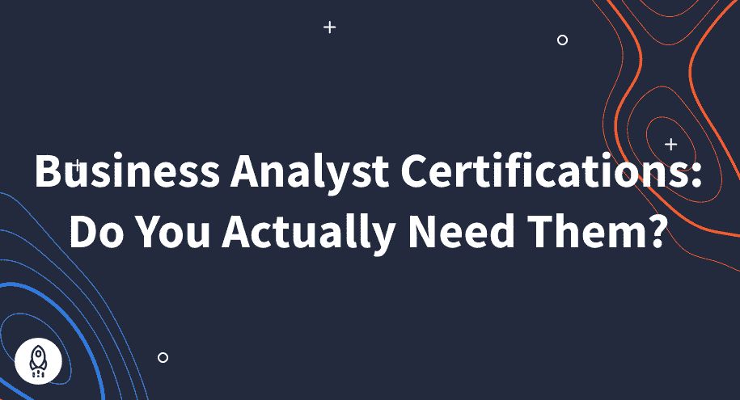

# 商业分析师认证:你真的需要它们吗？

> 原文：<https://www.dataquest.io/blog/do-you-need-business-analysis-certifications/>

July 18, 2022

## 业务分析师需要认证，对吗？不一定。技能掌握是游戏的名字。

商业分析是一个有利可图和受欢迎的职业领域。商业分析师的报告是组织决策的核心——他们的薪水反映了他们的价值。

如果你正在考虑成为一名商务人士，或者有转行的想法，你可能想知道你是否需要一个商业分析师证书来说服雇主你是合格的。简短回答:*你没有。*

在本文中，我们将回顾市场上各种商业分析师认证，包括它们的价值以及如何向雇主展示你的技能。

### 不同业务分析师认证的列表

有各种各样的机构提供适合不同经验水平的认证。我们来看几个。

#### 认证分析专家

一个突出的认证是[认证分析专家(CAP)认证](https://www.certifiedanalytics.org/cap)。CAP 认证有强大的课程和积极的评论，但这个认证需要 695 美元，你需要相关领域的硕士或学士学位，以及至少三年的经验。这当然是一条你可以走的路，但是如果你没有相关领域的学位，可能会花更长的时间和更多的钱。

#### 国际商业分析研究所

[国际商业分析研究所(IIBA)](https://www.iiba.org/business-analysis-certifications/iiba-certifications/) ，来自加拿大的著名国际组织，是提供特定商业分析师认证的唯一选择。他们提供三种级别的商业分析师认证。入门级认证为[经营分析(ECBA)](https://www.iiba.org/business-analysis-certifications/ecba/) 入门证书。参加并通过 ECBA 考试证明你有基本的商业分析知识，这足以让你进入初级商业分析师的大门。对于 ECBA 认证，你需要参加一个考试，支付[申请和考试费用](https://www.iiba.org/business-analysis-certifications/certification-fees/)(大约 600 美元)，并完成 21 个专业小时的培训课程(亲自或在线)。

#### 国际商业分析资格委员会

[国际商业分析资格委员会(IQBBA)](https://www.iqbba.org/en/home.html) 采取了一种更加注重 IT 的商业分析方法。虽然高级课程适用于经验丰富的业务分析师，但[基础水平认证](https://www.iqbba.org/en/scheme/foundation-level.html)是全面发展的业务分析师的基础。这个认证平台向潜在的业务分析师传授该领域的基础知识，包括设计业务解决方案、评估解决方案以及收集和分析数据等技能。创新是该认证的关键部分，它强调了开发创新解决方案以获得市场竞争优势的重要性。

#### 项目管理研究所

与这里列出的其他认证不同，[项目管理学院(PMI)](https://www.pmi.org/) 提供的业务分析认证侧重于项目管理。这是因为 PMI 将业务分析视为项目经理的宝贵工具。如果你的目标是项目管理，但你希望业务分析技能在竞争中获得优势， [PMI-PBA](https://www.pmi.org/certifications/business-analysis-pba) 是一个可行的选择。PBA 代表“商业分析专业人士”，这个头衔表明了潜在雇主在你的面试开始前需要知道的一切。有了这个认证，你不仅可以设置项目参数，还可以从头到尾管理项目。

#### 认证测试员基础水平

国际软件测试资格委员会 [(ISTQB)](https://www.istqb.org/) 不提供特定的业务分析课程。然而，认证测试员基础水平 [(CTFL)](https://www.istqb.org/certifications/certified-tester-foundation-level) 教育和认证软件开发相关职位的员工。与软件开发团队密切合作的业务分析师将从 CTFL 中受益。

### 对于入门级 BAs 来说，认证是多余的

很容易认为积累证书会让你成为更受欢迎的求职者。认证越多越好，对吗？

没那么快。

不要错误地认为工作需要证书。随着对商业分析师需求的增加，这是一个雇员的就业市场。虽然证书在你的简历上肯定会很好看，但你并不需要它。

现实情况是，证书并没有教会你实际工作所需的硬技能，而这正是雇主们想要的。

除了 CTFL，其他的认证都不是很专业，从长远来看对你没有好处。例如，通过编写定制的 SQL 或 Python 脚本来收集和分析数据，会让你在雇主面前看起来像个摇滚明星。背行业行话和流程都比不上。

当你找工作时，想要尽可能多的证书是可以理解的，但是，与项目经理不同，他们通常需要有项目管理专业人员(PMI-PMP)证书，业务分析师不需要*证书来获得工作(尽管有些证书会有帮助——见下文)。*

所以，如果你想获得认证，就去证明你已经知道的东西。当你已经知道如何做这份工作时，认证只是帮助你的简历脱颖而出。

### 让你的技能来说话

事实是，雇主正在寻找能做好这项工作的人，他们需要证明这一点。他们花在你身上的时间越少，你就能越快证明自己的价值。

无论您是想成为 IT 业务分析师还是更一般的业务分析师，您都希望显示出对 Microsoft Power BI 和 Excel 等应用程序以及 SQL 等编程语言的熟练程度。

通过完成我们的[业务分析师](https://www.dataquest.io/path/business-analyst/)课程，您将学习如何使用这些应用程序，并且您将完成八个项目，这些项目模拟了您作为业务分析师必须完成的真实任务。这给了你一个机会来检验你的技能，并把你的作品收集成作品集展示给雇主。

除了你的作品集，我们相信一个*技能*认证，即*专门展示你的行动能力*远比一个普通的*商业分析师*认证更有价值。通过这种级别的考试将证明你可以与利益相关者合作，为项目设定适当的要求，并将你收集的数据模型化为有效的视觉辅助工具，为决策者的下一步行动提供建议。Dataquest 的业务分析师课程将帮助你准备好通过这样的考试(我们将为你的 [PL-300 认证](https://docs.microsoft.com/en-us/learn/certifications/exams/pl-300)提供 50%的折扣)。

因此，建立您的投资组合并获得 Power BI 认证将帮助您成为一名业务分析师，并确保您能够言出必行。