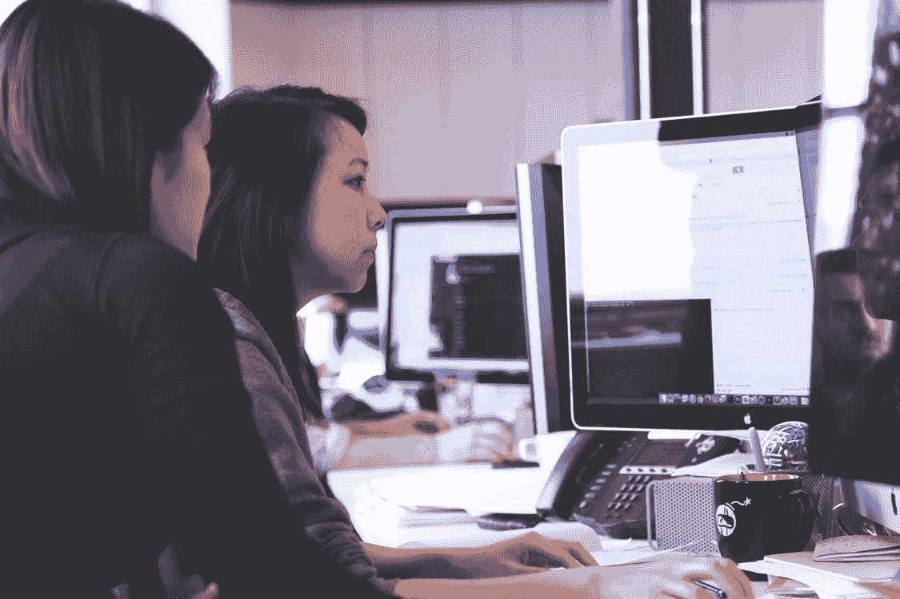

# 分享目标对你成功的机会有帮助还是有伤害？

> 原文：<https://www.dataquest.io/blog/does-sharing-goals-help-or-hurt-your-chances-of-success/>

October 22, 2018

所以你决定要学习数据科学。你应该在社交媒体上分享你的目标，还是和一个负责任的伙伴分享？还是应该默默工作，直到你学到足够多的知识，可以称自己为数据科学家？

心理学研究表明，分享你的目标可能会对你真正实现目标的机会产生影响。但是要注意:这里没有简单的“分享/不分享”的答案。事实证明，分享的心理要比这复杂得多。

(警告:由于我们在谈论科学研究，本文中的几乎每个链接都是 PDF 链接)。

## 你应该和一个“负责任的伙伴”分享吗？

传统智慧认为分享是个好主意，因为有人让你负责能帮助你实现目标。研究表明这是真的，但只是在特定条件下。[对各种目标跟踪和分享研究的元分析表明](https://projects.iq.harvard.edu/files/lernerlab/files/lerner_tetlock_1999.pdf)问责制的影响会有很大的不同，这取决于*谁*让你负责，以及我们所说的*哪种*问责制。

至于谁是谁，你的责任伙伴应该是一个朋友。[像这样的研究](https://selfdeterminationtheory.org/SDT/documents/1993_EnzleAnderson_JPSP.pdf)表明，当你的进步被一个陌生人监控时，它实际上可能是*德*激励。此外，与朋友分享可能与更高的成功率相关。盖尔·马修斯博士最近开展的这项研究发现，告诉朋友自己对某个目标的承诺的受试者比没有告诉朋友的受试者更有可能实现这个目标。

也不应该是普通朋友。像这样的研究表明，从给予你*过程赞扬*(基于你的努力和你实际所做的赞扬)的人那里得到反馈，会比向给予你*个人赞扬*(基于你天生的能力或身份的赞扬)的人报告给你带来更好的结果。

换句话说，你想要一个会说“哇，你真的很努力！”而不是“哇，你真聪明！”事实上，拥有一个给你*人称赞的人*(“你真聪明！”)可能比完全得不到反馈更糟糕。如果你一直被告知你的成功是由于天生的天赋，当你遇到挑战和失败时，你更有可能把它视为你的先天不足，而不是可以通过更多努力或更好的策略来克服的东西。

你也想找到一个愿意根据你的需求来提供反馈的朋友，因为随着你学习的进展，你的需求可能会改变。研究人员发现，在学习新事物的早期，最好能得到积极的反馈。但是你越有经验，你对负面反馈的回应就越多。

原因是，通常在一个新项目或学习课程的早期阶段，我们的自我评估将集中在我们的承诺程度上。积极的反馈有助于我们肯定和巩固这种承诺。但是随着我们越来越深入，我们倾向于评估实际的进展。在这一点上，获得负面反馈往往会带来更好的结果，因为它会推动我们继续努力。在那个阶段，积极的反馈会让我们把脚从油门上移开。

总之:如果某人是你的朋友，与他人分享可能会有所帮助，如果那个朋友小心翼翼地给你过程上的赞扬，而不是赞扬你的内在品质，并愿意随着你学习的进展从注重积极反馈转向更多的消极反馈，可能会特别有帮助。

## 你应该分享什么？

所以你已经找到了合适的朋友来做你的责任伙伴。现在，你实际上告诉他们什么？这也很重要。在上面提到的马修斯研究中，与朋友分享目标的受试者比那些不分享的受试者更有可能成功，但是定期给朋友写进度报告的受试者甚至更有可能实现他们的目标。

这可能反映了心理学文献中提出的一个更广泛的观点。对一个*过程*负责可能比对一个*结果*负责更好。像[这个](https://www.gwern.net/docs/sunkcosts/1992-simonson.pdf)和[这个](https://www.sciencedirect.com/science/article/pii/S0749597896900011?via%3Dihub)这样的研究发现，如果你被要求对结果负责，问责制最终会给你带来狭隘的视野，并阻碍批判性的创新思维。

这可能是因为对结果负责会鼓励你在你想要产生的结果的背景下证明你所做的一切，而不是诚实地评估你的行为。这可能会让你继续朝着那个结果努力，即使在调整你的目标变得更加有益之后。

另一方面，对一个*过程*负责与更好的结果相关，因为它让你致力于工作，但让你自由地批判性地评估，并随着你的进展对你的目标进行合乎逻辑的调整。

换句话说:不要告诉你的朋友你将成为一名数据科学家。告诉他们你每周将花 10 个小时学习和编码(然后每周给他们发送你所做的更新)。

还有一个原因，你不应该告诉朋友你的目标是成为一名数据科学家。对于我们中的许多人来说，成为数据科学家是一个职业目标，但它也是一个*身份目标*—我们喜欢被他人视为数据科学家的想法。那种想要改变我们身份的愿望可以成为一种激励力量，帮助我们朝着目标前进。但是[最近的一项研究表明，公开分享身份目标会破坏他们。当你说你打算成为一名数据科学家时，人们可能会在你真正成为数据科学家之前就开始把你视为一名数据科学家(你也可能开始这样看待自己)。那种*成为*数据科学家的感觉是你努力工作的回报的一部分，所以如果你在达到目标之前已经得到了一点，你可能就没有坚持到底的内在动力了。](http://www.psych.nyu.edu/gollwitzer/09_Gollwitzer_Sheeran_Seifert_Michalski_When_Intentions_.pdf)

回顾:这里的教训是，如果你要分享，你应该分享关于你承诺要做的工作的*过程目标*。

## 社交媒体呢？

当谈到社交媒体分享时，答案明显更加模糊。

上面讨论的更广泛的研究表明，社交媒体分享可能是一个坏主意，因为它是与陌生人而不是朋友分享，并且它给你很少的机会来调节你得到的反馈类型是否有用。此外，像这样的研究表明，听到竞争可能会阻止学生学习，社交媒体充满了其他人学习和成功的故事。

另一方面，这些研究中没有一项是专门针对社交媒体的(其中许多是在社交媒体存在之前进行的)。还有一些研究着眼于社交媒体分享，并发现社交分享和目标实现之间的相关性。[例如，这项关于减肥的研究](https://link.springer.com/article/10.1007%2Fs13142-012-0183-y)发现，加入 Twitter 社区并在社交媒体上分享进展和技巧与有效减肥有关。

然而，尚不清楚这些结果在多大程度上可能取决于参与的特定社区，以及它们是否可能被暴露于竞争的负面影响所抵消(在数据科学等不断增长的领域中有很多)。说到社交媒体，我们唯一能确定的是是否需要更多的研究。

## 外卖食品

在我们得意忘形之前，有一些重要的警告:

1.  一些科学研究不能证明任何事情，心理学——就像科学研究的所有领域一样——是一个不断发展的领域，随着新信息的出现，主流观点可能会发生变化。
2.  每个人都是不同的，对你最有效的方法可能与多年来对大多数参与者最有效的方法不同。
3.  我们只是在谈论*优化*你的机会。决定你成功的最关键因素是你付出了多少努力。在最好的情况下，像这样的提示可以给你一个微小的统计优势。

综上所述，如果你想最大化你实现目标的机会，看起来你*应该*分享它们，但是在这样做的时候，你应该遵循以下指导方针:

*   **与朋友分享，而不是陌生人**。如果可能的话，选择那些在给你反馈时愿意满足你的要求的人(见下面的第 4 和第 5 条),否则他们最终可能会带来更多的伤害而不是帮助。
*   **分享过程目标，而不是结果或身份**。不要告诉你的朋友你计划在四个月后成为一名数据科学家。告诉他们你计划每周花 10 个小时来学习、编码和构建项目。
*   **用书面更新经常签到**。
*   **要求“过程表扬”而不是“个人表扬”**或者选择一个自然倾向于称赞你的努力或你在完成任务时采用的策略的朋友，而不是称赞你与生俱来的智力或天赋。
*   **先寻求正面反馈，然后在**寻求负面反馈。
*   在社交媒体上打自己的电话，但避免关注竞争。特别是在早期，你想的是你在做什么*，而不是其他人在做什么。*

还不是学生？[加入我们，开始免费学习数据科学](https://app.dataquest.io/signup)。

已经是学生了？在 Twitter 上给我们留言[,让我们知道什么最适合你——你是与世界分享你的过程还是秘密工作？](https://twitter.com/dataquestio)