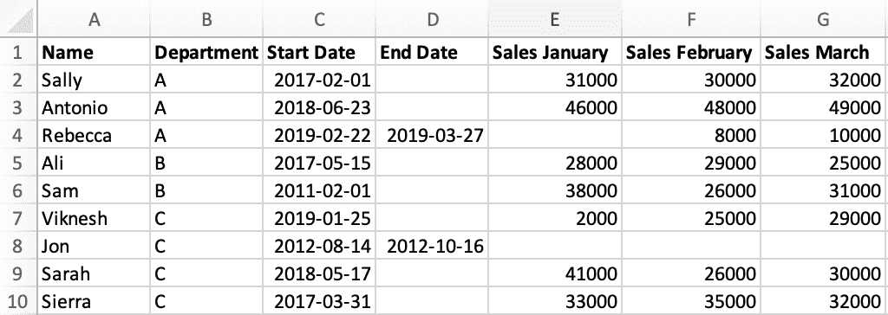
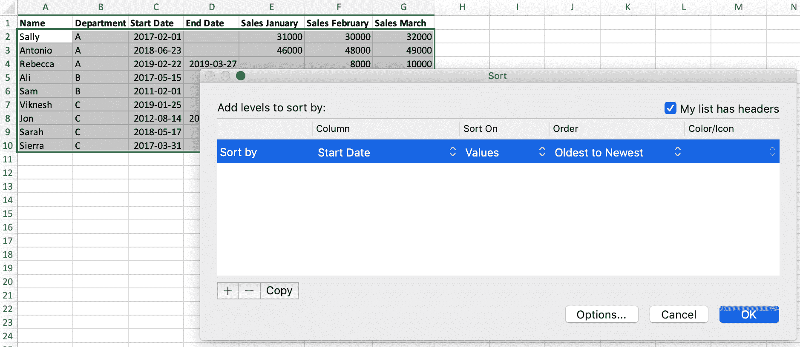
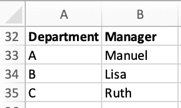
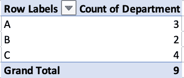
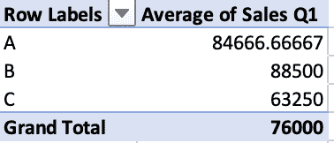

# Excel 与 Python:如何完成常见的数据分析任务

> 原文：<https://www.dataquest.io/blog/excel-vs-python/>

December 3, 2019

在本教程中，我们将通过查看如何跨两种平台执行基本分析任务来比较 Excel 和 Python。

Excel 是世界上最常用的数据分析软件。为什么？一旦你掌握了它，它就很容易掌握并且相当强大。相比之下，Python 的名声是更难使用，尽管一旦你学会了它，你可以做的事情几乎是无限的。

但是这两个数据分析工具实际上是如何比较的呢？他们的名声并不真正反映现实。在本教程中，我们将了解一些常见的数据分析任务，以展示 Python 数据分析的易用性。

本教程假设您对 Excel 有中级水平的了解，包括使用公式和数据透视表。

我们将使用 Python 库 **pandas** ，它的设计是为了方便 Python 中的数据分析，但是本教程不需要任何 Python 或 pandas 知识。

## 为什么要用 Python vs Excel？

在我们开始之前，您可能想知道为什么 Python 值得考虑。你为什么不能继续用 Excel 呢？

尽管 Excel 很棒，但在某些领域，像 Python 这样的编程语言更适合某些类型的数据分析。以下是我们的文章中的一些理由【Excel 用户应该考虑学习编程的 9 个理由:

1.  您可以阅读和处理几乎任何类型的数据。
2.  自动化和重复性的任务更容易。
3.  处理大型数据集要快得多，也容易得多。
4.  别人更容易复制和审核你的作品。
5.  查找和修复错误更加容易。
6.  Python 是开源的，所以你可以看到你使用的库背后是什么。
7.  高级统计和机器学习能力。
8.  高级数据可视化功能。
9.  跨平台稳定性—您的分析可以在任何计算机上运行。

需要说明的是，我们并不提倡抛弃 Excel 它是一个有很多用途的强大工具！但是作为一个 Excel 用户，能够利用 Python 的强大功能可以节省您数小时的时间，并开启职业发展的机会。

值得记住的是，这两种工具可以很好地协同工作，您可能会发现有些任务最好留在 Excel 中，而其他任务将受益于 Python 提供的强大功能、灵活性和透明性。

## 导入我们的数据

让我们先熟悉一下我们将在本教程中使用的数据。我们将使用一家有销售人员的公司的虚构数据。下面是我们的数据在 Excel 中的样子:



我们的数据被保存为一个名为`sales.csv`的 CSV 文件。为了在 pandas 中导入我们的数据，我们需要从导入 pandas 库本身开始。

```py
import pandas as pd
```

上面的代码导入了熊猫，并将**的别名**赋予了语法`pd`。这听起来可能很复杂，但它实际上只是一种昵称——这意味着将来我们可以只使用`pd`来指代`pandas`,这样我们就不必每次都打出完整的单词。

为了读取我们的文件，我们使用`pd.read_csv()`:

```py
sales = pd.read_csv('sales.csv')
sales
```

|  | 名字 | 部门 | 开始日期 | 结束日期 | 销售一月 | 销售二月 | 销售进行曲 |
| --- | --- | --- | --- | --- | --- | --- | --- |
| Zero | 俏皮话 | A | 2017-02-01 | 圆盘烤饼 | Thirty-one thousand | Thirty thousand | Thirty-two thousand |
| one | 安东尼奥 | A | 2018-06-23 | 圆盘烤饼 | Forty-six thousand | Forty-eight thousand | Forty-nine thousand |
| Two | 丽贝卡(女子名ˌ寓意迷人的美) | A | 2019-02-22 | 2019-03-27 | 圆盘烤饼 | Eight thousand | Ten thousand |
| three | 阿里 | B | 2017-05-15 | 圆盘烤饼 | Twenty-eight thousand | Twenty-nine thousand | Twenty-five thousand |
| four | 萨姆（男子名） | B | 2011-02-01 | 圆盘烤饼 | Thirty-eight thousand | Twenty-six thousand | Thirty-one thousand |
| five | 维克内什 | C | 2019-01-25 | 圆盘烤饼 | Two thousand | Twenty-five thousand | Twenty-nine thousand |
| six | 【男性名字】乔恩 | C | 2012-08-14 | 2012-10-16 | 圆盘烤饼 | 圆盘烤饼 | 圆盘烤饼 |
| seven | 撒拉 | C | 2018-05-17 | 圆盘烤饼 | Forty-one thousand | Twenty-six thousand | Thirty thousand |
| eight | 锯齿山脊 | C | 2017-03-31 | 圆盘烤饼 | Thirty-three thousand | Thirty-five thousand | Thirty-two thousand |

我们将`pd.read_csv()`的结果赋给一个名为`sales`的变量，我们将用它来引用我们的数据。我们还将变量名放在代码的最后一行，它将数据打印在一个格式良好的表中。

很快，我们可以注意到 pandas 表示数据的方式与我们在 Excel 中看到的有一些不同:

*   在 pandas 中，行号从 0 开始，而在 Excel 中是从 1 开始。
*   pandas 中的列名取自数据，而 Excel 中的列用字母标记。
*   在原始数据中有缺失值的地方，pandas 用占位符`NaN`来表示该值缺失，或者用 **null** 。
*   销售数据的每个值都添加了一个小数点，因为 pandas 将包含 null ( `NaN`)值的数值存储为称为 **float** 的数值类型(这对我们没有任何影响，但我们只想解释为什么会这样)。

在我们学习我们的第一个 pandas 操作之前，我们将快速了解一下我们的数据是如何存储的。

让我们使用`type()`函数来看看我们的`sales`变量的类型:

```py
type(sales)
```

```py
pandas.core.frame.DataFrame
```

这个输出告诉我们，我们的`sales`变量是一个**数据帧**对象，这是 pandas 中的一个特定类型的对象。在 pandas 中，大多数时候当我们想要修改数据帧时，我们会使用一种称为数据帧**方法**的特殊语法，它允许我们访问与数据帧对象相关的特定功能。当我们完成我们在熊猫中的第一个任务时，我们将看到一个这样的例子！

## 分类数据

让我们学习如何在 Excel 和 Python 中对数据进行排序。目前，我们的数据还没有分类。在 Excel 中，如果我们想按`"Start Date"`列对数据进行排序，我们应该:

*   选择我们的数据。
*   点击工具栏上的“排序”按钮。
*   在打开的对话框中选择“开始日期”。



在熊猫身上，我们使用`DataFrame.sort_values()`方法。我们刚才简要地提到了方法。为了使用它们，我们必须用我们想要应用该方法的数据帧的名称替换`DataFrame`——在本例中是`sales`。如果您在 Python 中使用过列表，您将会熟悉来自`list.append()`方法的这种模式。

我们向该方法提供列名，告诉它根据哪一列进行排序:

```py
sales = sales.sort_values("Start Date")
sales
```

|  | 名字 | 部门 | 开始日期 | 结束日期 | 销售一月 | 销售二月 | 销售进行曲 |
| --- | --- | --- | --- | --- | --- | --- | --- |
| four | 萨姆（男子名） | B | 2011-02-01 | 圆盘烤饼 | Thirty-eight thousand | Twenty-six thousand | Thirty-one thousand |
| six | 【男性名字】乔恩 | C | 2012-08-14 | 2012-10-16 | 圆盘烤饼 | 圆盘烤饼 | 圆盘烤饼 |
| Zero | 俏皮话 | A | 2017-02-01 | 圆盘烤饼 | Thirty-one thousand | Thirty thousand | Thirty-two thousand |
| eight | 锯齿山脊 | C | 2017-03-31 | 圆盘烤饼 | Thirty-three thousand | Thirty-five thousand | Thirty-two thousand |
| three | 阿里 | B | 2017-05-15 | 圆盘烤饼 | Twenty-eight thousand | Twenty-nine thousand | Twenty-five thousand |
| seven | 撒拉 | C | 2018-05-17 | 圆盘烤饼 | Forty-one thousand | Twenty-six thousand | Thirty thousand |
| one | 安东尼奥 | A | 2018-06-23 | 圆盘烤饼 | Forty-six thousand | Forty-eight thousand | Forty-nine thousand |
| five | 维克内什 | C | 2019-01-25 | 圆盘烤饼 | Two thousand | Twenty-five thousand | Twenty-nine thousand |
| Two | 丽贝卡(女子名ˌ寓意迷人的美) | A | 2019-02-22 | 2019-03-27 | 圆盘烤饼 | Eight thousand | Ten thousand |

我们的数据框架中的值已经用一行简单的熊猫代码进行了排序！

## 合计销售值

我们数据的最后三列包含一年前三个月的销售额，称为第一季度。我们的下一个任务是在 Excel 和 Python 中对这些值求和。

让我们先来看看我们是如何在 Excel 中实现这一点的:

*   在单元格`H1`中输入新的列名`"Sales Q1"`。
*   在像元 H2 中，使用`SUM()`公式并使用坐标指定像元的范围。
*   将公式向下拖动到所有行。


在 pandas 中，当我们执行一个操作时，它会立刻自动应用到每一行。我们将通过使用列表中的名称来选择三列:

```py
q1_columns = sales[["Sales January", "Sales February", "Sales March"]]
q1_columns
```

|  | 销售一月 | 销售二月 | 销售进行曲 |
| --- | --- | --- | --- |
| four | Thirty-eight thousand | Twenty-six thousand | Thirty-one thousand |
| six | 圆盘烤饼 | 圆盘烤饼 | 圆盘烤饼 |
| Zero | Thirty-one thousand | Thirty thousand | Thirty-two thousand |
| eight | Thirty-three thousand | Thirty-five thousand | Thirty-two thousand |
| three | Twenty-eight thousand | Twenty-nine thousand | Twenty-five thousand |
| seven | Forty-one thousand | Twenty-six thousand | Thirty thousand |
| one | Forty-six thousand | Forty-eight thousand | Forty-nine thousand |
| five | Two thousand | Twenty-five thousand | Twenty-nine thousand |
| Two | 圆盘烤饼 | Eight thousand | Ten thousand |

接下来，我们将使用`DataFrame.sum()`方法并指定`axis=1`，这告诉 pandas 我们想要对行求和而不是对列求和。我们将通过在括号内提供新的列名来指定它:

```py
sales["Sales Q1"] = q1_columns.sum(axis=1)
sales
```

|  | 名字 | 部门 | 开始日期 | 结束日期 | 销售一月 | 销售二月 | 销售进行曲 | 销售 Q1 |
| --- | --- | --- | --- | --- | --- | --- | --- | --- |
| four | 萨姆（男子名） | B | 2011-02-01 | 圆盘烤饼 | Thirty-eight thousand | Twenty-six thousand | Thirty-one thousand | Ninety-five thousand |
| six | 【男性名字】乔恩 | C | 2012-08-14 | 2012-10-16 | 圆盘烤饼 | 圆盘烤饼 | 圆盘烤饼 | Zero |
| Zero | 俏皮话 | A | 2017-02-01 | 圆盘烤饼 | Thirty-one thousand | Thirty thousand | Thirty-two thousand | Ninety-three thousand |
| eight | 锯齿山脊 | C | 2017-03-31 | 圆盘烤饼 | Thirty-three thousand | Thirty-five thousand | Thirty-two thousand | One hundred thousand |
| three | 阿里 | B | 2017-05-15 | 圆盘烤饼 | Twenty-eight thousand | Twenty-nine thousand | Twenty-five thousand | Eighty-two thousand |
| seven | 撒拉 | C | 2018-05-17 | 圆盘烤饼 | Forty-one thousand | Twenty-six thousand | Thirty thousand | Ninety-seven thousand |
| one | 安东尼奥 | A | 2018-06-23 | 圆盘烤饼 | Forty-six thousand | Forty-eight thousand | Forty-nine thousand | One hundred and forty-three thousand |
| five | 维克内什 | C | 2019-01-25 | 圆盘烤饼 | Two thousand | Twenty-five thousand | Twenty-nine thousand | Fifty-six thousand |
| Two | 丽贝卡(女子名ˌ寓意迷人的美) | A | 2019-02-22 | 2019-03-27 | 圆盘烤饼 | Eight thousand | Ten thousand | Eighteen thousand |

在熊猫身上，我们使用的“配方”没有被储存。相反，结果值被直接添加到我们的数据帧中。如果我们想对新列中的值进行调整，我们需要编写新的代码来完成。

## 加盟经理数据

在我们的电子表格中，我们也有一个小的数据表，关于谁管理每个团队:



让我们看看如何在 Excel 和 Python 中将这些数据连接到一个`"Manager"`列中。在 Excel 中，我们:

*   首先将列名添加到单元格`I1`中。
*   在单元格`I2`中使用`VLOOKUP()`公式，指定:
    *   从单元格`B2`(部门)中查找值
    *   在管理器数据的选择中，我们使用坐标来指定
    *   我们希望从该数据的第二列中选择值。
*   单击并向下拖动公式至所有单元格。


要在 pandas 中处理这些数据，首先我们需要从第二个 CSV 导入它，`managers.csv`:

```py
managers = pd.read_csv('managers.csv')
managers
```

|  | 部门 | 经理 |
| --- | --- | --- |
| Zero | A | 曼纽尔 |
| one | B | elizabeth 的昵称 |
| Two | C | 怜悯 |

为了使用 pandas 将`mangers`数据连接到`sales`,我们将使用`pandas.merge()`函数。我们按顺序提供以下论据:

*   `sales`:我们要合并的第一个或左侧数据帧的名称
*   `managers`:我们要合并的第二个或右侧数据帧的名称
*   `how='left'`:我们想要用来连接数据的方法。`left`连接指定无论如何，我们都要保留左边(第一个)数据帧中的所有行。
*   `on='Department'`:我们将要连接的两个数据帧中的列名。

```py
sales = pd.merge(sales, managers, how='left', on='Department')
sales
```

|  | 名字 | 部门 | 开始日期 | 结束日期 | 销售一月 | 销售二月 | 销售进行曲 | 销售 Q1 | 经理 |
| --- | --- | --- | --- | --- | --- | --- | --- | --- | --- |
| Zero | 萨姆（男子名） | B | 2011-02-01 | 圆盘烤饼 | Thirty-eight thousand | Twenty-six thousand | Thirty-one thousand | Ninety-five thousand | elizabeth 的昵称 |
| one | 【男性名字】乔恩 | C | 2012-08-14 | 2012-10-16 | 圆盘烤饼 | 圆盘烤饼 | 圆盘烤饼 | Zero | 怜悯 |
| Two | 俏皮话 | A | 2017-02-01 | 圆盘烤饼 | Thirty-one thousand | Thirty thousand | Thirty-two thousand | Ninety-three thousand | 曼纽尔 |
| three | 锯齿山脊 | C | 2017-03-31 | 圆盘烤饼 | Thirty-three thousand | Thirty-five thousand | Thirty-two thousand | One hundred thousand | 怜悯 |
| four | 阿里 | B | 2017-05-15 | 圆盘烤饼 | Twenty-eight thousand | Twenty-nine thousand | Twenty-five thousand | Eighty-two thousand | elizabeth 的昵称 |
| five | 撒拉 | C | 2018-05-17 | 圆盘烤饼 | Forty-one thousand | Twenty-six thousand | Thirty thousand | Ninety-seven thousand | 怜悯 |
| six | 安东尼奥 | A | 2018-06-23 | 圆盘烤饼 | Forty-six thousand | Forty-eight thousand | Forty-nine thousand | One hundred and forty-three thousand | 曼纽尔 |
| seven | 维克内什 | C | 2019-01-25 | 圆盘烤饼 | Two thousand | Twenty-five thousand | Twenty-nine thousand | Fifty-six thousand | 怜悯 |
| eight | 丽贝卡(女子名ˌ寓意迷人的美) | A | 2019-02-22 | 2019-03-27 | 圆盘烤饼 | Eight thousand | Ten thousand | Eighteen thousand | 曼纽尔 |

如果一开始这看起来有点混乱，那没关系。Python 中连接数据的模型不同于 Excel 中使用的模型，但它也更强大。请注意，在 Python 中，我们使用清晰的语法和列名来指定如何连接数据。

## 添加条件列

如果我们看一下`"End Date"`列，我们可以看到并非所有的员工都还在公司——那些价值缺失的员工仍在工作，但其余的已经离开了。我们的下一个任务是创建一个列，告诉我们每个销售人员是否是当前雇员。我们将在 Excel 和 Python 中执行此操作。

从 Excel 开始，要添加该列，我们:

*   向单元格`J1`添加新的列名。
*   使用`IF()`公式检查单元格`D1`(结束日期)是否为空，如果是，用`TRUE`填充`J2`，否则用`FALSE`。
*   将公式拖到下面的单元格中。


在 pandas 中，我们使用`pandas.isnull()`函数来检查`"End Date"`列中的空值，并将结果分配给一个新列:

```py
sales["Current Employee"] = pd.isnull(sales['End Date'])
sales
```

|  | 名字 | 部门 | 开始日期 | 结束日期 | 销售一月 | 销售二月 | 销售进行曲 | 销售 Q1 | 经理 | 当前员工 |
| --- | --- | --- | --- | --- | --- | --- | --- | --- | --- | --- |
| Zero | 萨姆（男子名） | B | 2011-02-01 | 圆盘烤饼 | Thirty-eight thousand | Twenty-six thousand | Thirty-one thousand | Ninety-five thousand | elizabeth 的昵称 | 真实的 |
| one | 【男性名字】乔恩 | C | 2012-08-14 | 2012-10-16 | 圆盘烤饼 | 圆盘烤饼 | 圆盘烤饼 | Zero | 怜悯 | 错误的 |
| Two | 俏皮话 | A | 2017-02-01 | 圆盘烤饼 | Thirty-one thousand | Thirty thousand | Thirty-two thousand | Ninety-three thousand | 曼纽尔 | 真实的 |
| three | 锯齿山脊 | C | 2017-03-31 | 圆盘烤饼 | Thirty-three thousand | Thirty-five thousand | Thirty-two thousand | One hundred thousand | 怜悯 | 真实的 |
| four | 阿里 | B | 2017-05-15 | 圆盘烤饼 | Twenty-eight thousand | Twenty-nine thousand | Twenty-five thousand | Eighty-two thousand | elizabeth 的昵称 | 真实的 |
| five | 撒拉 | C | 2018-05-17 | 圆盘烤饼 | Forty-one thousand | Twenty-six thousand | Thirty thousand | Ninety-seven thousand | 怜悯 | 真实的 |
| six | 安东尼奥 | A | 2018-06-23 | 圆盘烤饼 | Forty-six thousand | Forty-eight thousand | Forty-nine thousand | One hundred and forty-three thousand | 曼纽尔 | 真实的 |
| seven | 维克内什 | C | 2019-01-25 | 圆盘烤饼 | Two thousand | Twenty-five thousand | Twenty-nine thousand | Fifty-six thousand | 怜悯 | 真实的 |
| eight | 丽贝卡(女子名ˌ寓意迷人的美) | A | 2019-02-22 | 2019-03-27 | 圆盘烤饼 | Eight thousand | Ten thousand | Eighteen thousand | 曼纽尔 | 错误的 |

## 数据透视表

Excel 最强大的功能之一是数据透视表，它使用聚合来简化数据分析。我们将看看 Excel 和 Python 中两种不同的数据透视表应用程序。

我们将从 Excel 中的数据透视表开始，它计算每个部门的员工人数:



这个操作——计算一个值在一列中出现的次数——非常常见，以至于在 pandas 中它有自己的语法:`Series.value_counts()`。

series 类型对本教程来说是新的，但它与我们已经了解过的 DataFrame 非常相似。系列只是单个行或列的熊猫代表。

让我们用熊猫法来计算每个部门的雇员人数:

```py
sales['Department'].value_counts()
```

```py
C    4
A    3
B    2
Name: Department, dtype: int64
```

第二个数据透视表示例也按部门进行聚合，但计算的是 Q1 的平均销售额:



为了在熊猫中计算这个，我们将使用`DataFrame.pivot_table()`方法。我们需要指定一些参数:

*   `index`:聚合所依据的列。
*   `values`:我们要使用其值的列。
*   `aggfunc`:我们想要使用的聚合函数，在这里是`'mean'` average。

```py
sales.pivot_table(index='Department', values='Sales Q1', aggfunc='mean')
```

|  | 销售 Q1 |
| --- | --- |
| 部门 |  |
| --- | --- |
| A | 84666.666667 |
| B | 88500.000000 |
| C | 63250.000000 |

## Excel vs Python:总结

在本教程中，我们学习了以下 Excel 功能的 Python 等价物:

*   分类数据
*   `SUM()`
*   `VLOOKUP()`
*   `IF()`
*   数据透视表

对于我们看到的每个例子，pandas 语法的复杂性与您在 Excel 中使用的公式或菜单选项相似。但是 Python 提供了一些优势，比如更快地处理大型数据集，更多的定制和复杂性，以及更透明的错误检查和审计(因为您所做的一切都清楚地显示在代码中，而不是隐藏在单元格中)。

精通 Excel 的人完全有能力跨越到使用 Python。从长远来看，将 Python 技能添加到您的技能集将使您成为更快、更强大的分析师，并且您将发现新的工作流，这些工作流利用 Excel 和 Python 进行比单独使用 Excel 更高效、更强大的数据分析。

如果你想学习如何用 Python 分析数据，我们的 Python path 中的 [Data Analyst 旨在教你你需要知道的一切，即使你以前从未编写过代码。在开始学习我们在本教程中使用的 pandas 库之前，您将从两门教授 Python 基础知识的课程开始。](https://www.dataquest.io/path/data-analyst/)