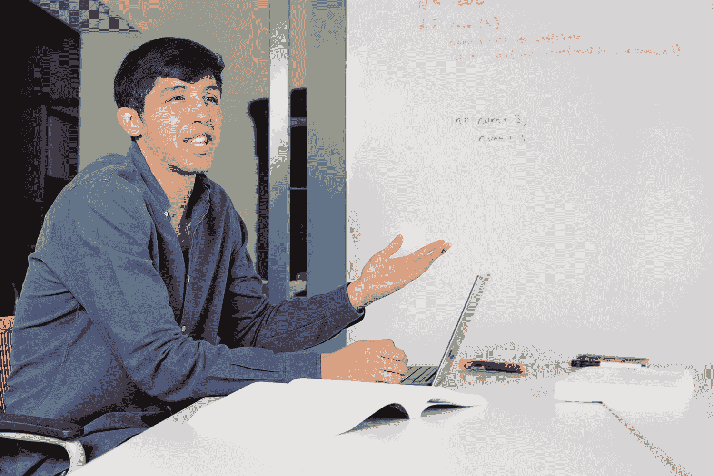

# 四年后，仍然每天使用来自 Dataquest 的数据科学技能

> 原文：<https://www.dataquest.io/blog/franco-sosa/>

January 15, 2020

***更新了！**我们在 2016 年首次介绍了弗朗西斯科·索萨，但我们在 2020 年再次与他联系，以了解他对自己的数据科学技能的感受。*

像许多 Dataquest 的学生一样，弗朗西斯科·索萨是从 Excel 进入数据科学的。

他是一名人力资源分析师，使用 Excel 分析数据和解决问题。他正在产生影响，但他可以看出 Excel 在拖他的后腿。他决定尝试学习编程。

他尝试了 Codecademy、Udacity 和 DataCamp，但觉得它们都太基础了:“它们牵着你的手，”弗朗西斯科说。“你不用想了。说明书确切地告诉你该做什么。你以为你在学习，但你没有。”

弗朗西斯科发现 Dataquest 的方法令人耳目一新。他需要学习的指导就在那里，但平台提供了更多的挑战。“在困难的时候，你学得更好，你需要努力找到解决办法，”他当时说。Dataquest 在太容易和太难以至于你气馁之间找到了平衡

四年后，他仍然有这种感觉。他现在是 Healthcare.com 的一名数据科学家，他说:“我肯定还在使用我在 Dataquest 学到的技能。我每天都在使用这些技能。”

## 工作数据科学家的生活

当然，数据科学家的生活中没有典型的一天，但 Francisco 说，大多数时候，他都在使用 Python 处理与数据科学或数据工程相关的任务。“我做的大部分工作是将机器学习模型投入生产，”他说，但数据团队的成员应该能够构建端到端的产品，所以他的工作也需要一些数据工程。

它还包括许多熊猫，弗朗西斯科说这是数据团队大多数数据清理和探索任务的首选工具。这是他从 Dataquest 得到的一些东西，他提醒我们:“我认为 Dataquest 中的熊猫课程可能是我做过的最好的课程。那是我推荐给大家的。”

在他的职业生涯发生重大转变的四年后，很明显，弗朗西斯科正在他想要的地方:作为一家快速发展的公司的专门团队的一部分，每天做数据科学。

## 如何像弗朗西斯科一样

早在 2016 年，当弗朗西斯科·索萨第一次开始寻找数据工作时，他面临着一个真正的挑战:没有多少可以找到。

“因为危地马拉不是最先进的国家，”他告诉我们，“我开始关注那些可能拥有大量数据的公司。我找到了一些有趣的公司，但他们的网站上没有列出任何职位。”

但是弗朗西斯科并没有气馁。相反，他申请了他能找到的任何工作，并试图在对话中加入数据。“我会得到一份营销工作的面试机会，然后在面试中我会谈论我可以用数据做些什么来帮助公司。”

而且成功了！2016 年，弗朗西斯科被外包公司 Allied Global 聘为数据科学家，他加入了一个新成立的数据科学家团队，致力于优化该公司呼叫中心的运营方式。

> “我肯定还在使用我在 Dataquest 中学到的技能。我每天都在使用这些技能。”

在跳槽之前，他在那里工作了大约一年，并继续以数据科学家的身份从事自由职业咨询工作，最终担任了另一份全职工作:他目前在 healthcare.com 的工作。

他建议像他一样对职业转换感兴趣的 Dataquest 学生在完成平台上的指导项目后，通过构建自己的项目来实践他们在 Dataquest 课程中所学的内容。他说:“我认为处理真实数据和真实问题会暴露你技能上的弱点，这是你学到最多的地方。”。

“申请工作的时候，”他说，“看着招聘启事和上面列出的所有技能真的很吓人。但是不要害怕，也不要认为你需要 100%掌握所有的技能，或者甚至拥有他们列出的所有技能。申请就行。”

“数据科学领域的招聘人员通常并不确切知道他们在寻找什么。他们只是上网看看其他一些招聘信息，然后复制数据科学家可能拥有的所有技能。所以你应该申请。”