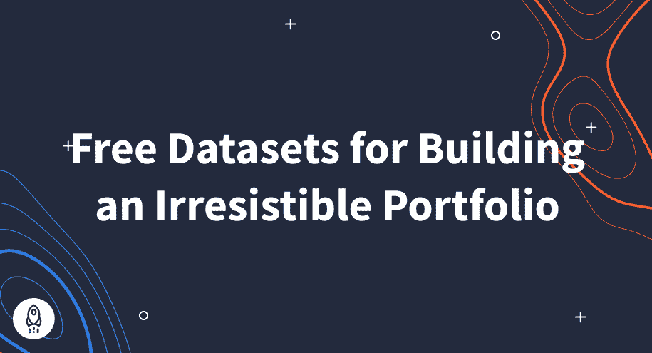
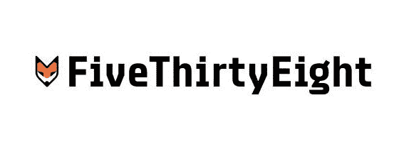
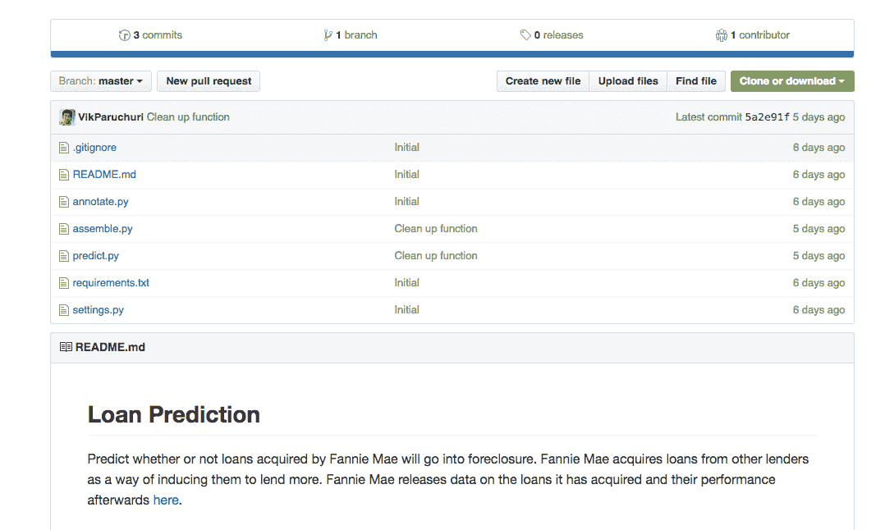

# 40 个免费数据集，打造不可抗拒的投资组合(2023)

> 原文：<https://www.dataquest.io/blog/free-datasets-for-projects/>

December 21, 2022

在本帖中，我们将向您展示在哪里可以找到以下领域各种项目的数据集:

*   擅长
*   计算机编程语言
*   稀有
*   数据科学
*   数据可视化
*   数据清理
*   机器学习
*   概率与统计

无论您是想通过展示您可以很好地可视化数据来加强您的投资组合，还是您有几个小时的空闲时间并想练习您的机器学习技能，本文都有您需要的一切。

## **寻找数据集来构建项目？我们已经为你准备好了**

如果你想找到免费的数据集，这样你就可以通过构建项目来学习，我们为你提供了很多选择。

在 Dataquest，我们的大多数[课程](https://www.dataquest.io/data-science-courses/)都包含项目，供您使用真实的高质量数据集完成。这些项目旨在帮助你展示你的技能，并给你一些东西添加到你的投资组合中。

如果你有兴趣，可以看看下面我们提供的一些项目。注册完全免费，数据集可以下载。

### 擅长

*   **[确定可能流失的客户:](https://app.dataquest.io/m/668)** 使用 Excel 数据集为电信提供商进行探索性数据分析(EDA)，以确定有流失风险的客户。
*   **[分析零售:](https://app.dataquest.io/m/697)** 处理零售数据，探索趋势和关系。建立基本模型来确认你的见解的统计意义。

我们的数据分析与 Excel 路径包含 2 个其他项目。在这里免费注册。

### 数据清理(Python)

*   [**分析星战调查:**](https://app.dataquest.io/m/201) 利用调查数据更好地了解星战粉丝。
*   [**探索易贝汽车销售数据:**](https://app.dataquest.io/m/294) 使用易贝二手车清单的定制报废数据集来练习数据清理和数据探索。
*   [**查找 I-94 上的繁忙交通指标:**](https://app.dataquest.io/m/524) 使用关于州际公路上交通的数据集，并执行探索性数据可视化。
*   [**探索黑客新闻帖子:**](https://app.dataquest.io/m/356) 使用来自黑客新闻提交的数据集练习使用 Python 中的循环、清理字符串和日期。

我们的 Python 路径数据清理包含 4 个其他项目。在这里免费注册。

### 数据分析和可视化(Python)

*   [**创建欧元汇率数据可视化:**](https://app.dataquest.io/m/529) 使用欧洲中央银行的数据集，使用 Matplotlib 创建可视化。
*   [**确定哪些移动应用吸引更多用户:**](https://www.dataquest.io/path/data-analysis-and-visualization-with-python/) 使用两个独立的数据集分析 Android 和 iOS 应用，确定有可能吸引用户的应用类型。

我们的 Python path 数据分析和可视化包含 3 个其他项目。在这里免费注册。

### 数据分析

*   **[调查新冠肺炎趋势:](https://app.dataquest.io/m/505)** 使用 Kaggle 数据集和 RStudio 分析重要的新冠肺炎趋势。
*   **[分析书店的销售数据:](https://app.dataquest.io/m/498)** 使用数据集应用控制流循环和函数，创建可重用的数据工作流。

我们的 R 基础数据分析路径包含 2 个其他项目。在这里免费注册。

### 机器学习(Python)

*   [**预测房屋销售价格:**](https://app.dataquest.io/m/240) 利用美国某城市的房屋数据建立并改进线性回归模型。
*   [**预测股市:**](https://app.dataquest.io/m/65) 利用 S & P 500 指数的历史数据对未来价格进行预测。
*   [**预测自行车租赁:**](https://app.dataquest.io/m/213) 使用自行车租赁数据集，并应用决策树和随机森林来预测未来自行车租赁的数量。

我们的 Python 路径机器学习介绍包含 15 个其他项目。[在这里免费报名](https://www.dataquest.io/path/machine-learning-intro-with-python/)。

### 概率和统计(Python)

*   [**调查 Fandango 电影评分:**](https://app.dataquest.io/m/288) 使用我们团队制作的自定义数据集，进行实际分析，确定 Fandango 电影评分系统是否存在偏差。
*   [**寻找广告投放的最佳市场:**](https://app.dataquest.io/m/310) 使用 freeCodeCamp 的调查数据，为一个电子学习平台确定最有效的广告市场。
*   [**构建垃圾邮件过滤器:**](https://app.dataquest.io/m/433) 使用垃圾短信收集数据集，使用条件概率和朴素贝叶斯构建垃圾邮件过滤器。

我们的概率和统计与 Python 路径包含 9 个其他项目。[在这里免费报名](https://www.dataquest.io/path/probability-and-statistics-with-python/)。

## **数据可视化项目的公共数据集**

一个典型的数据可视化项目可能是类似于“我想制作一个关于美国各州收入差异的信息图”的东西。在为数据可视化项目寻找好的数据集时，有一些注意事项需要记住:

*   它不应该是杂乱的，因为你不想花很多时间清理数据。
*   它应该细致入微，足够有趣，可以制作图表。
*   理想情况下，每一列都应该得到很好的解释，这样可视化才会准确。
*   数据集不应该有太多的行或列，所以很容易处理。

为数据可视化项目寻找好数据集的好地方是公开发布数据的新闻网站。他们通常会为您清理数据，并且已经有了您可以复制或改进的图表。

### 1.五三八

FiveThirtyEight 是一个非常受欢迎的互动新闻和体育网站，由[内特·西尔弗](https://fivethirtyeight.com/contributors/nate-silver/)创办。他们写了一些有趣的数据驱动的文章，比如[“不要把制造业缺乏招聘归咎于技能差距”](https://fivethirtyeight.com/features/dont-blame-a-skills-gap-for-lack-of-hiring-in-manufacturing/)和[“2016 年 NFL 预测](https://projects.fivethirtyeight.com/2016-nfl-predictions/)”

FiveThirtyEight 将其文章中使用的数据集发布在 GitHub 上。

[查看 538 个数据集](https://github.com/fivethirtyeight/data)

以下是一些例子:

*   [航空安全](https://github.com/fivethirtyeight/data/tree/master/airline-safety) —包含各航空公司的事故信息。
*   [美国天气历史](https://github.com/fivethirtyeight/data/tree/master/us-weather-history) —美国的历史天气数据。

[研究药物](https://github.com/fivethirtyeight/data/tree/master/study-drugs) —美国服用 Adderall 的数据。

### 2.BuzzFeed

BuzzFeed 最初是一家低质量文章的供应商，但后来有所发展，现在写一些调查性的文章，如[《统治世界的法庭》](https://www.buzzfeed.com/chrishamby/super-court?utm_term=.wbp4OyzN6#.qoYY4v0N1)和[《迪昂特窖藏的短暂人生](https://www.buzzfeed.com/albertsamaha/the-short-life-of-deonte-hoard-the-53rd-person-murdered-in-c?utm_term=.kr5wlo05R#.wa2WmQvMN)

BuzzFeed 将其文章中使用的数据集发布在 Github 上。

[查看 BuzzFeed 数据集](https://github.com/BuzzFeedNews)

以下是一些例子:

*   [联邦侦察机](https://github.com/BuzzFeedNews/2016-04-federal-surveillance-planes) —包含用于国内监视的飞机数据。
*   [寨卡病毒](https://github.com/BuzzFeedNews/zika-data)——寨卡病毒爆发的地理数据。
*   [枪支背景调查](https://github.com/BuzzFeedNews/nics-firearm-background-checks) —对试图购买枪支的人进行背景调查的数据。

### **3。美国宇航局**

美国宇航局是一个公共资助的政府组织，因此它的所有数据都是公开的。它维护着网站，任何人都可以下载它的与地球科学相关的数据集和与太空相关的数据集。例如，您甚至可以在地球科学网站上按格式排序来查找所有可用的 CSV 数据集。

## **数据处理项目的公共数据集**

有时您只想处理大型数据集。最终结果没有读入和分析数据的过程重要。您可能会使用像 [Spark](https://spark.apache.org/) 或 [Hadoop](https://hadoop.apache.org/) 这样的工具将处理分布在多个节点上。寻找好的数据处理数据集时要记住的事情:

*   数据越干净越好-清理大型数据集可能非常耗时。
*   数据集应该是有趣的。
*   应该有一个有趣的问题可以用数据来回答。

寻找大型公共数据集的好地方是云托管提供商，如亚马逊和 T2 的谷歌。他们有托管数据集的动机，因为他们让你使用他们的基础设施来分析数据集(并付钱让他们使用)。

### 4.AWS 公共数据集

亚马逊在其[亚马逊网络服务](https://www.amazon.com/aws)平台上提供大型数据集。你可以下载数据并在自己的电脑上使用，或者通过 [EMR](https://aws.amazon.com/emr/) 使用 [EC2](https://aws.amazon.com/ec2/) 和 Hadoop 分析云中的数据。你可以在这里阅读更多关于这个项目如何运作的信息[。](https://aws.amazon.com/public-data-sets/)

亚马逊有一个页面列出了所有的数据集供你浏览。你需要一个 AWS 账户，尽管亚马逊为新账户提供了一个免费的访问层，让你可以免费浏览数据。

[查看 AWS 公共数据集](https://aws.amazon.com/datasets/?_encoding=UTF8&jiveRedirect=1)

以下是一些例子:

*   来自 Google Books 的 n-grams 列表——来自一大堆书的常用词和词组。
*   [通用抓取语料库](https://aws.amazon.com/public-data-sets/common-crawl/) —来自超过 50 亿个网页的抓取数据。
*   [陆地卫星图像](https://aws.amazon.com/public-data-sets/landsat/) —地球表面的中等分辨率卫星图像。

### 5.谷歌公共数据集

与亚马逊非常相似，谷歌也有云托管服务，名为[谷歌云平台](https://cloud.google.com/)。有了 GCP，你可以使用一个叫做[的工具来探索大型数据集。](https://cloud.google.com/bigquery/)

谷歌在一个页面上列出了所有的数据集。你需要注册一个 GCP 账户，但是你的前 1TB 查询是免费的。

[查看谷歌公共数据集](https://cloud.google.com/bigquery/public-data/)

以下是一些例子:

*   [美国姓名](https://cloud.google.com/bigquery/public-data/usa-names) —包含美国从 1879 年到 2015 年的所有社会保障姓名申请。
*   [Github 活动](https://cloud.google.com/bigquery/public-data/github) —包含超过 280 万个公共 Github 存储库上的所有公共活动。

[历史天气](https://cloud.google.com/bigquery/public-data/noaa-gsod)—1929 年至 2016 年 9000 个 NOAA 气象站的数据。

### 6.维基百科(一个基于 wiki 技术的多语言的百科全书协作计划ˌ也是一部用不同语言写成的网络百科全书ˌ 其目标及宗旨是为全人类提供自由的百科全书)ˌ开放性的百科全书

维基百科是一个免费的在线社区编辑的百科全书。维基百科包含了惊人的知识广度，包含了从[奥斯曼-哈布斯堡战争](https://en.wikipedia.org/wiki/Ottoman%E2%80%93Habsburg_wars)到[伦纳德·尼莫伊](https://en.wikipedia.org/wiki/Leonard_Nimoy)的所有页面。作为维基百科推进知识的承诺的一部分，他们免费提供内容，并定期生成网站上所有文章的转储。此外，维基百科提供编辑历史和活动，因此你可以跟踪一个主题的页面如何随着时间的推移而演变，以及谁对此做出了贡献。

你可以在维基百科网站上找到各种下载数据的方法。您还会发现以各种方式重新格式化数据的脚本。

[查看维基百科数据集](https://en.wikipedia.org/wiki/Wikipedia:Database_download)

以下是一些例子:

*   [来自维基百科的所有图片和其他媒体](https://meta.wikimedia.org/wiki/Mirroring_Wikimedia_project_XML_dumps#Media0) —维基百科上的所有图片和其他媒体文件。
*   维基百科上各种格式的内容的全站点转储。

## **机器学习项目的公共数据集**

当您在处理机器学习项目时，您希望能够从数据集中的其他列预测某一列。为了能够做到这一点，我们需要确保:

*   数据集不是太乱——如果是，我们将花费所有的时间来清理数据。
*   有一个有趣的目标列可以进行预测。
*   其他变量对目标列有一定的解释力。

有一些专门用于机器学习的在线数据集存储库。这些数据集通常被预先清理，并允许非常快速地测试算法。

### 7.卡格尔

[Kaggle](https://www.kaggle.com/) 是一个主办机器学习竞赛的数据科学社区。网站上有各种外部贡献的、有趣的数据集。Kaggle 既有现场比赛，也有历史比赛。你可以下载其中任何一个的数据，但你必须注册 Kaggle 并接受比赛的服务条款。

你可以通过进入一个[竞赛](https://www.kaggle.com/competitions)从 Kaggle 下载数据。每个比赛都有自己的相关数据集。在新的 [Kaggle 数据集](https://www.kaggle.com/datasets)中也有用户贡献的数据集。

[查看 Kaggle 数据集](https://www.kaggle.com/datasets)

以下是一些例子:

*   [卫星照片顺序](https://www.kaggle.com/c/draper-satellite-image-chronology) —地球卫星照片的数据集——目标是预测哪些照片比其他照片拍摄得早。
*   [制造过程故障](https://www.kaggle.com/c/bosch-production-line-performance) —制造过程中测量的变量数据集。目标是预测制造过程中的故障。

[选择题](https://www.kaggle.com/c/the-allen-ai-science-challenge) —选择题及其对应正确答案的数据集。目标是预测任何给定问题的答案。

### 8.UCI 机器学习知识库

UCI 机器学习库是网络上最古老的数据集来源之一。虽然数据集是用户贡献的，因此具有不同级别的文档和清洁度，但绝大多数都是干净的，可以应用机器学习。当寻找有趣的数据集时，UCI 是一个很好的第一站。

你可以直接从 UCI 机器学习知识库下载数据，无需注册。这些数据集往往相当小，没有太多细微差别，但有利于机器学习。

[查看 UCI 机器学习知识库](https://archive.ics.uci.edu/ml/datasets.php)

以下是一些例子:

*   [垃圾邮件](https://archive.ics.uci.edu/ml/datasets/Wineml/datasets/Spambase) —包含电子邮件，以及它们是否是垃圾邮件的标签。
*   [葡萄酒分类](http://archive.ics.uci.edu/ml/datasets/Wine) —包含 178 种不同葡萄酒的各种属性。

[太阳耀斑](https://archive.ics.uci.edu/ml/datasets/Solar+Flare) —太阳耀斑的属性，用于预测耀斑的特征。

### 9.Quandl

Quandl 是一个经济和金融数据仓库。有些信息是免费的，但许多数据集需要购买。Quandl 对于构建模型来预测经济指标或股票价格非常有用。由于有大量的可用数据集，因此可以构建一个复杂的模型，使用许多数据集来预测另一个数据集的值。

[查看 Quandl 数据集](https://www.quandl.com/browse)。

以下是一些例子:

*   [按种族和其他因素划分的企业家活动](https://www.quandl.com/search?query=KAUFFMAN) —包含考夫曼基金会关于美国企业家的数据。
*   [美国美联储数据](https://www.quandl.com/search?query=FRED) —美国经济指标，来自美联储。

## **数据清理项目的公共数据集**

为数据清理项目寻找好的数据集时，您需要:

*   分布在多个文件中。
*   有很多细微差别，有很多可能的角度。
*   需要大量的研究才能理解。
*   尽可能“真实”。

这些类型的数据集通常可以在数据集的聚合器上找到。这些聚合器倾向于拥有来自多个来源的数据集，没有太多的管理。过多的监管给了我们过于整洁的数据集，很难对其进行大范围的清理。

### 10.数据世界

data.world 称自己是“数据人的社交网络”，但更准确的说法是“数据 GitHub”这是一个可以搜索、复制、分析和下载数据集的地方。此外，您可以将您的数据上传到 data.world，并使用它与他人协作。

在相对较短的时间内，它已经成为获取数据的“首选”地点之一，拥有大量用户贡献的数据集以及通过 data.world 与各种组织建立的合作伙伴关系，包括来自美国联邦政府的大量数据。

data.world 的一个关键区别在于，他们构建了一些工具来简化数据处理——您可以在他们的界面中编写 SQL 查询来浏览数据和连接多个数据集。他们还为 R 和 Python 提供了 SDK，使得在您选择的工具中获取和处理数据变得更加容易(您可能有兴趣阅读我们关于 data.world Python SDK 的[教程)。)](https://www.dataquest.io/blog/datadotworld-python-tutorial/)

[查看 data.world 数据集](https://www.data.world/)

### 11.Data.gov

Data.gov 是一个相对较新的网站，是美国开放政府努力的一部分。Data.gov 使得从多个美国政府机构下载数据成为可能。数据范围从政府预算到学校成绩。许多数据需要额外的研究，有时很难确定哪个数据集是“正确的”版本。任何人都可以下载数据，尽管有些数据集需要通过额外的关卡，比如同意许可协议。

你可以直接在 Data.gov 上浏览数据集，无需注册。您可以按主题区域浏览或搜索特定数据集。

[查看 Data.gov 数据集](https://www.data.gov/)

以下是一些例子:

*   [食品环境图册](https://catalog.data.gov/dataset?q=food+environment+atlas)——包含当地食物选择如何影响美国饮食的数据。
*   学校系统财务 —对美国学校系统财务的调查。

[慢性病数据](https://catalog.data.gov/dataset?q=chronic+disease+indicators) —美国各地区慢性病指标数据。

### 12.世界银行

世界银行是一个全球性的发展组织，向发展中国家提供贷款和建议。世界银行定期资助发展中国家的项目，然后收集数据来监测这些项目的成功。

您可以直接浏览世界银行的数据集，无需注册。数据集有许多缺失值，有时需要点击几次才能找到数据。

[查看世界银行数据集](https://data.worldbank.org/)

以下是一些例子:

*   [世界发展指标](https://data.worldbank.org/data-catalog/world-development-indicators) —包含国家一级的发展信息。
*   [教育统计数据](https://data.worldbank.org/data-catalog/ed-stats) —按国家分列的教育数据。

[世界银行项目成本](https://www.worldbank.org/projects) —世界银行项目及其相应成本的数据。

### 13./r/数据集

广受欢迎的社区讨论网站 Reddit 有一个专门分享有趣数据集的板块。它被称为[数据集子编辑](https://www.reddit.com/r/datasets)，或/r/datasets。这些数据集的范围变化很大，因为它们都是用户提交的，但它们往往非常有趣和微妙。

你可以在这里浏览子编辑[。你也可以在这里看到投票率最高的数据集](https://www.reddit.com/r/datasets)。

[查看热门/热门/数据集帖子](https://www.reddit.com/r/datasets/top/?sort=top&t=all)

以下是一些例子:

*   [所有 reddit 子债券](https://www.reddit.com/r/datasets/comments/3mg812/full_reddit_sublesson_corpus_now_available_2006/) —包含 2015 年的 Reddit 子债券。
*   [危险问题](https://www.reddit.com/r/datasets/comments/1uyd0t/200000_jeopardy_questions_in_a_json_file/) —游戏中的问题和分值显示危险。

[纽约市财产税数据](https://www.reddit.com/r/datasets/comments/4jjcdx/we_scraped_11_million_property_tax_bills_to/) —关于纽约市房产和评估价值的数据。

### 14.学术洪流

学术种子是一个新网站，致力于分享科学论文的数据集。这是一个较新的网站，所以很难说最常见的数据集类型会是什么样子。目前，它有大量缺乏背景的有趣数据集。

您可以在网站上直接浏览数据集。因为这是一个 torrent 网站，所有的数据集都可以立即下载，但是你需要一个 [Bittorrent](https://www.bittorrent.com/) 客户端。[大洪](https://deluge-torrent.org/)是一个不错的免费选择。

[查看学术种子数据集](https://academictorrents.com/browse.php?cat=6)

以下是一些例子:

*   安然电子邮件(Enron Emails)——一组来自安然公司高管的电子邮件，这家公司以破产而闻名。
*   [学生学习因素](https://academictorrents.com/details/e24e083cc337695bb84a2b68707695579c0ab4d8) —一组衡量和影响学生学习的因素。
*   [新闻文章](https://academictorrents.com/details/95d3b03397a0bafd74a662fe13ba3550c13b7ce1) —包含新闻文章属性和一个目标变量。

## **奖励:流式数据**

在构建数据科学项目时，下载数据集并对其进行处理是非常常见的。然而，随着在线服务生成越来越多的数据，越来越多的数据是实时生成的，而不是以数据集形式提供的。这方面的一些例子包括来自 [Twitter](https://www.twitter.com/) 的推文数据，以及股票价格数据。获取这类数据的好来源并不多，但我们会列出一些，以防您想尝试流数据项目。

### 15.推特

Twitter 有一个很好的流媒体 API，可以相对简单地过滤和传输推文。这里可以开始[。这里有大量的选项——你可以找出哪个州最幸福，或者哪个国家使用最复杂的语言。我们最近还写了一篇文章，让你开始使用 Twitter API](https://dev.twitter.com/streaming/overview) [这里](https://www.dataquest.io/blog/streaming-data-python/)。

[开始使用 Twitter API](https://dev.twitter.com/streaming/overview)

### 16.开源代码库

GitHub 有一个 API，允许你访问存储库活动和代码。你可以在这里开始使用 API [。选择是无穷无尽的——你可以构建一个系统来自动评估代码质量，或者指出在大型项目中代码是如何随时间演变的。](https://developer.github.com/v3/)

[开始使用 Github API](https://developer.github.com/v3/)

### 17.地下世界

Wunderground 有一个天气预报 API，每天可以释放多达 500 个 API 调用。您可以使用这些呼叫建立一组历史天气数据，并预测明天的天气。

[开始使用 Wunderground API](https://www.wunderground.com/weather/api/)

### 18.全球健康观察站

世界卫生组织(世卫组织)在[全球卫生观察站(GHO)](https://www.who.int/data/gho) 维持着一个庞大的全球卫生数据集。该数据集包括新冠肺炎全球疫情上的所有世卫组织数据。GHO 提供了关于抗生素耐药性、痴呆症、空气污染和免疫等主题的各种数据。

您可以在 GHO 找到几乎任何健康相关主题的数据，这使得它成为健康领域数据科学家的一个非常有价值的免费数据集资源。

查看世卫组织的数据集。

### 19.皮尤研究中心

皮尤研究中心因政治和社会科学研究而闻名。为了促进研究和公共讨论，他们在一段时间后，公开下载他们所有的数据集进行二次分析。

你可以从美国政治、新闻和媒体、互联网和技术、科学和社会、宗教和公共生活以及其他主题的数据集中进行选择。

### 20.国家气候数据中心

气候变化是目前的热门话题，请原谅我的双关语。想要处理天气和气候数据的数据科学家可以从国家环境信息中心(NCEI)获取大量美国数据集。

## **奖金:个人资料**

互联网上充满了你可以使用的很酷的数据集。但是对于真正独特的东西，如何分析你自己的个人数据呢？

这里有一些受欢迎的网站，可以下载和使用您生成的数据。

### 21.亚马孙

亚马逊允许你下载你的个人消费数据、订单历史等等。要访问它，[单击此链接](https://www.amazon.com/gp/b2b/reports?ref_=ya_d_l_order_reports&)(您需要登录才能使用)或导航到右上角的帐户和列表按钮。

在下一页上，找到订购和购物首选项部分，然后单击标题下的链接“下载订单报告”这是一个简单的数据项目教程，你可以用你自己的亚马逊数据来分析你的消费习惯。

### 22.脸谱网

脸书还允许你下载你的个人活动数据。要访问它，[单击此链接](https://www.facebook.com/dyi/?referrer=yfi_settings)(您需要登录才能使用)并选择您想要下载的数据类型。这里有一个[的例子，一个简单的数据项目，你可以使用你自己的个人脸书数据](https://www.dataquest.io/blog/analyze-facebook-data-python/)来构建。

### 23.网飞

网飞允许你[请求下载自己的数据](https://www.netflix.com/account/getmyinfo)，尽管这会让你经历一些麻烦，并会警告你整理数据的过程可能需要 30 天。截至我们上次检查时，他们允许您下载的数据是相当有限的，但它仍然可以适用于某些类型的项目和分析。

## **额外奖励:强大的数据集搜索工具**

### **24。谷歌数据集搜索**

好的，所以这不是一个严格意义上的数据集——而是一个寻找相关数据集的搜索工具。正如你已经知道的，谷歌是一个数据发电站，所以它的搜索工具击败了其他寻找特定数据集的方法是有道理的。

您需要做的就是直接进入[谷歌数据集搜索](https://datasetsearch.research.google.com/)并在搜索栏中键入与您要查找的数据集相关的关键词或短语。结果将列出谷歌为该特定搜索词索引的所有数据集。数据集通常来自高质量的来源，其中一些是免费的，另一些是收费或订阅的。

## 后续步骤

在这篇文章中，我们介绍了为任何类型的数据科学项目寻找数据集的好地方。我们希望你能找到一些有趣的东西，让你可以尽情享受！

在 [Dataquest](https://www.dataquest.io/) ，我们的互动指导项目旨在帮助您开始构建数据科学组合，向雇主展示您的技能，并获得一份数据方面的工作。如果你感兴趣，你可以[注册并免费学习我们的第一个模块](https://www.dataquest.io/)。

*如果你喜欢这篇文章，你可能会喜欢阅读我们“构建数据科学组合”系列中的其他文章:*

*   [*用数据讲故事*](https://www.dataquest.io/blog/data-science-portfolio-project/)
*   [*如何建立一个数据科学博客*](https://www.dataquest.io/blog/how-to-setup-a-data-science-blog/)
*   [*打造机器学习项目*](https://www.dataquest.io/blog/data-science-portfolio-machine-learning/)
*   

 *[*如何在 Github*](https://www.dataquest.io/blog/how-to-share-data-science-portfolio/) *上展示你的数据科学作品集。**