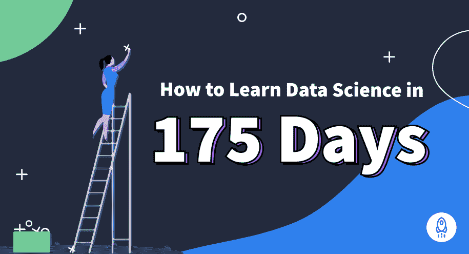
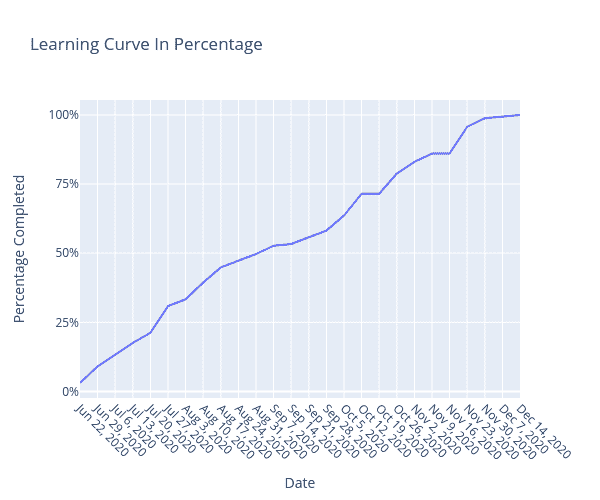
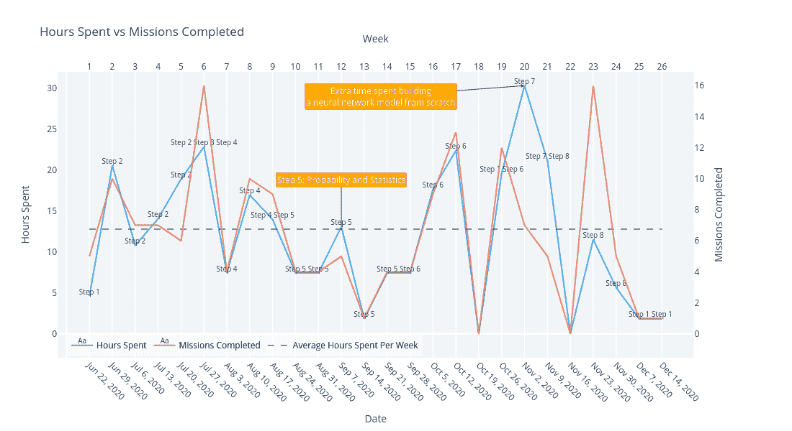
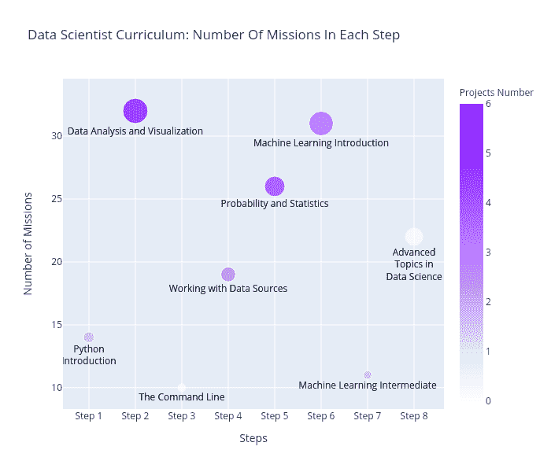
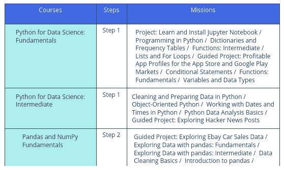

# 我如何在 6 个月内学会数据科学

> 原文：<https://www.dataquest.io/blog/how-i-learned-data-science-6-months/>

August 16, 2021

每个人成为数据科学家的旅程都是不同的，学习曲线会因许多因素而异，包括时间可用性、先验知识、您使用的工具等。一名学员分享了她如何在 Dataquest 的 6 个月内成为一名数据科学家的故事。她的旅程是这样开始的:

正如标题所示，这是我 Dataquest 旅程中的一个分析项目，它让我在不到 6 个月的时间里学会了数据科学。我真的很兴奋能在新年前完成这个项目。有什么比彻底的回顾更好的方式来送走这一年呢？

我看到来自世界各地的人们每天都在努力学习和进步。所以我做这个项目的动机不仅仅是重温我的旅程，而是通过给初学者一个窥视前方道路的机会来鼓励他们。但是请记住，完成这条道路的时间和努力与个人情况高度相关。我将在本文后面解释我的观点。

这个项目也是受这个社区的人启发，特别是@otavios.s 的惊人项目[希望这不是问题，但是我刮了社区](https://community.dataquest.io/t/i-hope-this-is-not-a-problem-but-i-scraped-the-community/439582)。由于他的项目，我被介绍给了 [Selenium](https://selenium-python.readthedocs.io/index.html) 和 [ChromeDriver](https://chromedriver.chromium.org/) 。是的，我还浏览了 DQ 网站以获取完整的数据科学家课程，希望没问题…

在详细讲述我如何在 6 个月内从零编码技能成为数据科学家之前，我想先分享一下我的发现。

## 在这个项目中得到答案的问题是:

1.  我花了多少天走完这条路？(时间跨度，包括我没有花在学习上的时间间隔)
    *   **175 天**。从 6 月 19 日到 12 月 11 日。
2.  我最好的学习成绩和一般的学习成绩是多少？
    *   我最好的学习成绩是 **20 天**，**平均 6.6875 天**。从我个人的经验来看，进入最佳状态并坚持下去很重要。10 月份休息了一周，又过了一周才恢复到和以前一样的学习效率。
3.  总共花了多少时间？
    *   跑完全程总共花费了 **306.4 小时**。这意味着如果我全天候学习，这条路可以在**大约 13 天**内走完。相反，我花了 **175 天**。我敢肯定机器人在嘲笑我们人类。
4.  在我学习的几周里，我平均花了多少小时？
    *   假设我平均每周学习 **5 天**，在我学习的 **24 周**，我将学习 **120 天**。这意味着我平均每天花 **3 个小时**学习 Dataquest。这听起来差不多，但请注意，这是一个粗略的估计。另外，我确实花了相当多的时间在社区和阅读课程材料，这些都不算在这个项目中。
5.  完成一节课的平均时间是多少？
    *   **111.43 分钟**，换句话说接近 **2 小时**。看起来要花很长时间才能完成一课。但这也包括花在指导项目上的时间，这比仅仅学习课程要耗费更多的时间。花几天时间在一个指导项目上并不罕见。我希望我有更多关于每节课所花时间的详细数据，这样我就可以看到项目和非项目任务所花的平均时间，但是我不知道这些数据是否存在。
6.  课程中有哪些减速带？
    *   第 2、4、5、6 步比其他步骤花了更多的时间来完成。其中， **Step 2 和 6** 的任务数量最多， **Step 2** 的引导项目数量也最多。这使得第 4 步和第 5 步成为最耗时的步骤。两者之间，**第四步比第五步**更耗时。这很好地反映了我的记忆。第 4 步，耗时的部分是 **SQL** ，第 5 步，是关于**概率**的课程。

**现在，简单介绍一下我个人的学习情况:**

*   6 月 19 日开始 Python 中的[数据科学家路径，12 月 11 日结束。虽然最后两周我花的时间不多，但是大部分都花在完成最后两个指导项目(算两节课)和课外项目上了。这可能就是为什么我在 11 月的最后一个月之后没有收到任何学习进度邮件的原因。](https://www.dataquest.io/path/data-scientist/)
*   我以前是数字营销客户经理，编码技能几乎为零。在我决定转向 Dataquest 之前，我从 Udemy 上的数据科学课程中学习了几个星期的 Python 基础知识。
*   在开始这条道路的几周前，我完成了吴恩达在 Coursera 上的机器学习课程。在那门课程中，我学习了基本八度音阶。
*   我目前失业，所以我有很多业余时间学习。

## 对项目的近距离观察

### a)数据收集(电子邮件解析和网页抓取)

我在这个项目中使用的数据是从两个来源收集的:

1.  这个项目的进展数据来自每周一我从 Dataquest 收到的每周成就邮件，如果我在上周取得了足够的进展。它包括:
    1.  日期:电子邮件的接收日期—通常是星期一
    2.  任务 _ 已完成:已完成的课程数量
    3.  missions_increase_pct:与上周相比，已完成课程数量的增加/减少百分比
    4.  minutes _ spent:花在学习上的分钟数
    5.  minutes_increase_pct:与上周相比，花费的分钟数增加/减少的百分比
    6.  learning_streak(days):连续学习的天数
    7.  最佳连胜:最佳学习连胜
2.  为了获得每周邮件，我首先在我的 Gmail 中创建了一个标签，将我想要的邮件分组，然后去[谷歌外卖](https://takeout.google.com/)下载它们。在这个过程中你可以选择文件格式——我下载的是一个. mbox 文件。Python 有一个用于解析这类文件的库，叫做[邮箱](https://docs.python.org/3/library/mailbox.html)。你会在文章末尾的 GitHub 链接中找到这个项目中使用的代码。
    *(下面是每周修养邮件截图)*

***   *本项目中的课程数据来自 Data quest dashboard for The Data Scientist path。它由 8 个步骤、32 门课程和 165 节课组成，包括 22 个按等级顺序排列的指导项目。正如帖子开头提到的，我第一次使用 Selenium 和 ChromeDriver。课程信息所在的仪表板页面包含步骤网格以及课程和任务的可折叠列表；有自动登录和大量的点击。稍后我可能会写另一篇关于抓取这一页的文章。***

**

### b)数据插补

这个项目中的每周电子邮件数据集非常小，只有 16 行包含 16 周的数据。但是我的学习时间实际上是 26 周。有几个星期我根本没有学习，但是，对于这样一个小数据集，我真的不能承受丢失 10 个星期的数据。

幸运的是，在[个人资料](https://app.dataquest.io/profile/veratsien)页面上，Dataquest 提供了整个路径的学习曲线。因此，我想出了一个插补策略:尽可能地填补空白，绘制现有数据，然后与 Dataquest 生成的学习曲线进行比较，并结合我的个人经历(例如，度假和休闲的照片和记忆)🙂)来估算缺失的已完成课程数数据。然后根据一节课的平均时间计算花费的时间。在项目中更详细。

虽然我认为插补相当成功(满足了该项目的需求)，但我希望我们能从 Dataquest 中获得更多关于我们[学习之旅的数据。](https://www.dataquest.io/)

### c)本项目中的可视化:

我使用 [Plotly](https://plotly.com/graphing-libraries/) 来绘制这个项目中所有的可视化。我很满意下面的花费时间与完成任务的对比图。它帮助我做了一些有趣的观察，并回答了本文开头的课程相关问题。同样，你可以在文章末尾的 GitHub 链接中阅读详细内容。

为了分享像这样的帖子中的情节，我还尝试了[图表工作室](https://chart-studio.plotly.com/)。下面的图来自 chart studio cloud，并使用 chart studio 生成的 html 嵌入。

*   我的学习曲线

*   每周花费的小时数和完成的相应课时数以及它们所属的步骤

*   每个学习步骤中的课程和指导项目的数量

*   Dataquest 上 Python path 中数据科学家的完整课程表

除了回答这个项目开始时的所有问题。我还想给这门课的初学者补充一点，我在这个项目中所做的是更多的数据收集、数据清理和插补，这些你将在前四个步骤中学到。这意味着，在数据科学家之路的中途，您将具备完成所有这些工作的能力！

附注:如果任何人对这个项目或 DQ 数据科学家之路有更多问题，请随时在评论中问我或通过 [【电子邮件保护】](/cdn-cgi/l/email-protection#e29487908396918b878ca2858f838b8ecc818d8f) 联系我。我会尽力回答你的问题。

[点击此处](https://github.com/VeeTsien/MyDataQuestLearningCurve/blob/main/My%20DataQuest%20Learning%20Curve.ipynb)查看完整项目。

## 你下一步应该做什么？

*   报名参加我们的[Python 职业道路中的数据科学家](https://www.dataquest.io/path/data-scientist/)，获得在数据领域找到工作所需的所有技能！

这篇文章是由钱薇拉写的。你可以在 Github 上找到她。**