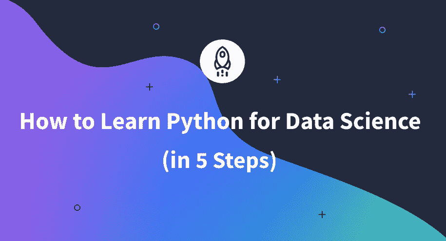

# 如何通过 5 个步骤学习数据科学 Python

> 原文：<https://www.dataquest.io/blog/how-to-learn-python-for-data-science-in-5-steps/>

July 12, 2022

## 为什么学 Python 是为了数据科学？

Python 是数据科学家选择的编程语言。虽然它不是第一种主要的编程语言，但它的受欢迎程度已经增长了很多年。

*   2016 年，它在数据科学竞赛的首要平台 Kaggle 上[超过了 R。](https://blog.kaggle.com/2017/01/05/your-year-on-kaggle-most-memorable-community-stats-from-2016/)
*   2017 年，在 KDNuggets 的数据科学家最常用工具年度调查中，它[超过了 R。](https://www.kdnuggets.com/2017/08/python-overtakes-r-leader-analytics-data-science.html)
*   2018 年，66%的数据科学家报告使用 Python daily 的[，使其成为分析专业人士的头号语言。](https://www.kdnuggets.com/2018/05/poll-tools-analytics-data-science-machine-learning-results.html)
*   2021 年，它在 TIOBE 指数上超过了 Java，现在是最受欢迎的编程语言。

此外，数据科学专家预计这一趋势将持续下去。

## 对于数据科学家来说，当前的劳动力市场是什么样的？

根据 Glassdoor 的数据，2022 年数据科学家的平均工资为 119，118 美元。

随着对数据科学家的需求增加，这一数字预计只会上升。2020 年，*数据科学家的空缺职位是前一年的三倍。*

数据科学和 Python 的未来似乎非常光明。幸运的是，学习 Python 现在比以往任何时候都容易。我们将用五个简单的步骤向您展示如何做到这一点。

## 数据科学如何学习 Python

### 步骤 1:学习 Python 基础知识

每个人都有起点。第一步是学习 Python 编程基础。(如果你还不熟悉数据科学，你还需要一个介绍。)

你可以通过在线课程(【Dataquest 提供的)、数据科学训练营、自学或大学课程来实现这一点。学习 Python 基础知识没有对错之分。关键是选择一条道路，并保持一致。

#### **寻找在线社区**

为了帮助保持动力，加入一个在线社区。大多数社区允许你通过你或其他人问小组的问题来学习。

您还可以联系其他社区成员，并与行业专业人士建立关系。这也增加了你的就业机会，因为员工推荐[占所有雇员的 30%](https://www.shrm.org/resourcesandtools/hr-topics/talent-acquisition/pages/employee-referrals-remains-top-source-hires.aspx) 。

许多学生也发现创建一个 [Kaggle](https://www.kaggle.com/) 账户并加入当地的 Meetup 群组很有帮助。

如果你是 Dataquest 的订阅者，你可以访问 [Dataquest 的学习者社区](https://community.dataquest.io/)，在那里你可以找到来自在校学生和校友的支持。

### 第二步:实践动手学习

加快你的教育的最好方法之一是通过实践学习。

#### Python 项目实践

当您构建小型 Python 项目时，您理解的速度之快可能会让您吃惊。幸运的是，几乎每门 Dataquest 课程都包含一个项目来增强你的学习。以下是其中的几个例子:

*   [越狱](https://www.dataquest.io/course/for-loops-and-conditional-statements-in-python/) —找点乐子，用 Python 和 Jupyter Notebook 分析一个直升机越狱的数据集。
*   [App Store 和 Google Play 市场的盈利应用简介](https://www.dataquest.io/course/python-functions-and-jupyter-notebook/) —在这个指导性项目中，你将在一家开发移动应用的公司担任数据分析师。您将使用 Python 通过实际的数据分析来提供价值。
*   [探索黑客新闻帖子](https://www.dataquest.io/course/python-for-data-science-intermediate/)——使用热门技术网站 Hacker News 的提交数据集。
*   [探索易贝汽车销售数据](https://www.dataquest.io/course/pandas-fundamentals/)——使用 Python 处理从德国易贝网站分类广告栏目易贝·克莱纳泽根收集的二手车数据集。

[本文](https://www.dataquest.io/blog/python-projects-for-beginners/)也为初学者提供了大量其他 Python 项目的想法:

*   构建一个[石头、布、剪刀游戏](https://thehelloworldprogram.com/python/python-game-rock-paper-scissors/)
*   建立一个[文本冒险游戏](https://coding-grace-guide.readthedocs.io/en/latest/guide/lessonplans/beginners-python-text-based-adventure.html)
*   建立一个[猜谜游戏](https://djangocentral.com/creating-a-guessing-game-in-python/)
*   建立互动的[疯狂的图书馆](https://www.mikedane.com/programming-languages/python/building-a-mad-libs-game/)

#### 实践和学习的替代方法

为了完善你的课程并找到你所遇到的 Python 编程问题的答案，阅读指南、[博客文章](https://www.dataquest.io/blog/data-science-books/)、 [Python 教程](https://www.dataquest.io/python-tutorials-for-data-science/)，或者其他人的开源代码来寻找新的想法。

如果您还想了解更多，请查看这篇关于学习 Python 数据科学的不同方法的文章。

### 步骤 3:学习 Python 数据科学库

四个最重要的 Python 库是 NumPy、Pandas、Matplotlib 和 Scikit-learn。

*   **NumPy** —一个让各种数学和统计操作变得更简单的库；这也是熊猫图书馆许多特色的基础。
*   **pandas** —一个专门为数据处理而创建的 Python 库。这是大量 Python 数据科学工作的基础。
*   Matplotlib —一个可视化库，可以快速轻松地从数据中生成图表。
*   **sci kit-learn**—Python 中最流行的机器学习工作库。

NumPy 和 Pandas 非常适合探索和处理数据。Matplotlib 是一个数据可视化库，可以像在 Excel 或 Google 工作表中一样制作图表。

下面是对数据科学最重要的 [15 个 Python 库的有用指南。](https://www.dataquest.io/blog/15-python-libraries-for-data-science/)

### 步骤 4:在学习 Python 的同时构建数据科学组合

对于有抱负的数据科学家来说，[投资组合是必需的](https://www.dataquest.io/blog/build-a-data-science-portfolio/) —这是招聘经理在合格候选人身上寻找的最重要的东西之一。

这些项目应该包括使用几个不同的数据集，每个项目都应该分享你发现的有趣的见解。以下是一些需要考虑的项目类型:

*   **数据清理项目** —任何涉及你清理和分析的肮脏或“非结构化”数据的项目都会给潜在雇主留下深刻印象，因为大多数真实世界的数据都需要清理。
*   数据可视化项目(Data Visualization Project)——制作有吸引力的、易读的可视化是一项编程和设计挑战，但如果你能做好，你的分析将会非常有用。在项目中拥有漂亮的图表会让你的投资组合脱颖而出。
*   **机器学习项目** —如果你渴望成为一名数据科学家，你肯定会需要一个展示你的 ML 技能的项目。你可能想要几个不同的机器学习项目，每个项目都专注于[一个不同的算法](https://www.dataquest.io/blog/top-10-machine-learning-algorithms-for-beginners/)。

#### 有效地展示你的作品集

你的分析应该清晰易读——最好是像 Jupyter 笔记本那样的格式，这样技术观众就可以阅读你的代码。(非技术读者可以跟随你的图表和书面解释。)

#### 你的作品集需要主题吗？

你的作品集不一定需要一个特定的主题。找到你感兴趣的数据集，然后开发一种连接它们的方法。如果你想在特定的公司或特定的行业工作，展示与该行业相关的项目是个好主意。

展示这样的项目向未来的雇主表明，你已经花时间学习 Python 和其他重要的编程技能。

### 步骤 5:应用先进的数据科学技术

最后，提高自己的技能。您的数据科学之旅将充满不断的学习，但您可以完成高级 Python 课程，以确保您已经覆盖了所有基础。

学会熟悉回归、分类和 k-means 聚类模型。你也可以通过学习自举模型和使用 Scikit-learn 创建神经网络来进入机器学习。

## **对初学者有帮助的 Python 学习技巧**

### **提问**

你不知道你不知道什么！

Python 有一个丰富的专家社区，他们愿意在您使用 Python 学习数据科学时为您提供帮助。像 Quora、Stack Overflow 和 [Dataquest 的学习者社区](https://community.dataquest.io/)这样的资源充满了乐于分享他们的知识并帮助你学习 Python 编程的人们。我们还为每节课提供了一个常见问题解答，帮助您解决在 Dataquest 编程课程中遇到的问题。

### 使用 Git 进行版本控制

Git 是一个流行的工具，可以帮助你跟踪代码的变化。这使得纠正错误、实验和与他人合作变得更加容易。

### 学习初级和中级统计

在学习 Python 数据科学的过程中，您会希望在统计学方面打下坚实的基础。理解统计数据会给你一种心态，你需要这种心态来有效地集中注意力，找到有价值的见解(和真正的解决方案)。

### 开始学习木星笔记本

Jupyter 笔记本是一个非常重要的工具，你应该马上开始学习。它预先打包了 Python 库，这很有帮助。

## Python 用于数据科学常见问题解答

### 学习 Python 需要多长时间？

虽然每个人都是不同的，但我们发现学习 Python 数据科学需要三个月到一年的持续实践。

我们看到人们在我们的课程中以闪电般的速度前进，我们也看到其他人以较慢的速度前进。这完全取决于你能花多少时间学习 Python 编程，以及你能多快获得新信息。

幸运的是，我们已经为您设计了 Dataquest 的课程，让您按照自己的速度学习。

每条道路都充满了课程、实践学习和提问机会，以便您能够掌握数据科学的基础知识。我们的实践学习方法使用真实的数据集，这不仅能帮助你更快地学习，还能帮助你了解如何应用你的知识。

免费开始。[跟随我们的数据科学家之路](https://www.dataquest.io/path/data-scientist)学习 Python，从今天开始掌握一项新技能！

### 哪里可以学习数据科学的 Python？

因为 Python 被用于各种其他编程学科，从游戏开发到移动应用，一般的“学习 Python”资源试图教授所有的东西，但这意味着你将学习与数据科学无关的东西。

当你的主要目标是学习 Python 进行数据分析，而不是努力学习一门教你构建游戏的课程时，很容易变得沮丧并想放弃。

有很多免费的 Python 数据科学教程。如果你不想付费学习 Python，这些可以是一个不错的选择。[这个链接](https://www.dataquest.io/python-tutorials-for-data-science/)提供了几十个按难度和关注领域分类的教程。

如果您想最大限度地提高学习效果，最好是找到一个平台，提供为数据科学教育开发的课程。Dataquest 就是这样一个平台。我们的课程可以带你从初学者到工作就绪，成为 Python 中的[数据分析师](https://www.dataquest.io/path/data-analyst/)、[数据科学家](https://www.dataquest.io/path/data-scientist/)或[数据工程师](https://www.dataquest.io/path/data-engineering/)。

### Python 在数据科学领域有必要吗？

使用 Python 或 r 都可以作为数据科学家工作。每种语言都有其优点和缺点。两者都在行业中广泛使用。Python 总体上更受欢迎，但 R 在某些行业占主导地位(特别是在学术界和研究领域)。

对于数据科学，你肯定需要学习这两种语言中的至少一种。(无论您选择哪种语言，您还必须学习一些 SQL。)

### Python 比 R 更适合数据科学吗？

这是数据科学中一个永恒的讨论话题，但真正的答案是，这取决于你在寻找什么和你喜欢什么。

r 是专门为统计和数学而构建的，但是有一些令人惊奇的包使得它非常容易用于数据科学。此外，它有一个非常支持的在线社区。

Python 是一种更好的全能编程语言。您的 Python 技能可以转移到许多其他学科。也稍微受欢迎一点。一些人会争辩说它更容易学，尽管很多 R 的人不同意。

与其阅读观点，不如看看这篇关于[Python 和 R 如何处理类似的数据科学任务](https://www.dataquest.io/blog/python-vs-r/)的文章，看看哪个看起来更吸引你。