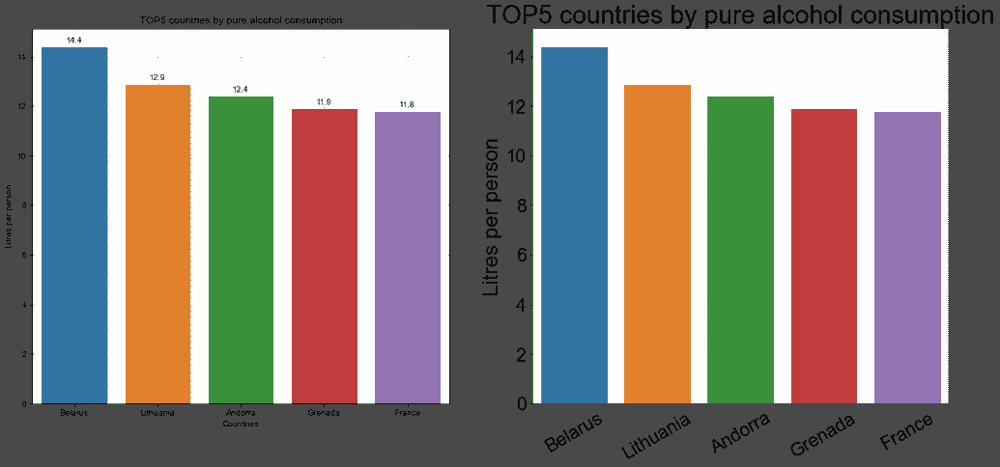
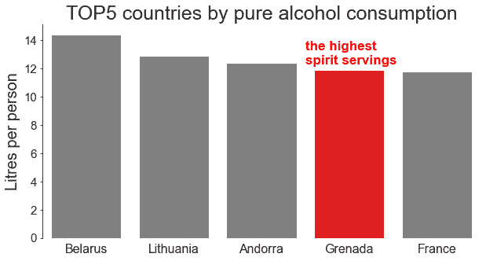
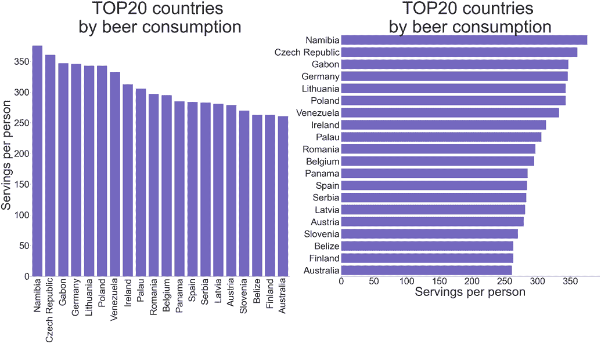
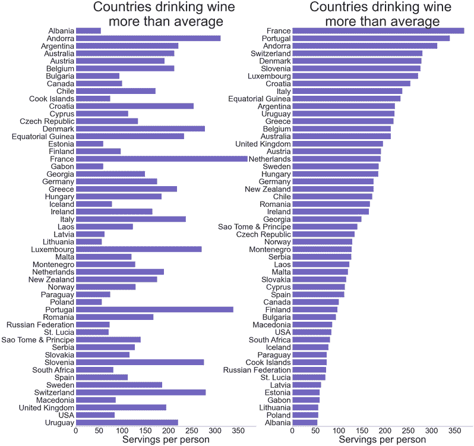
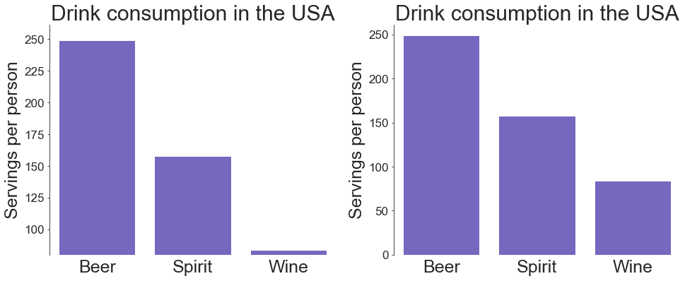
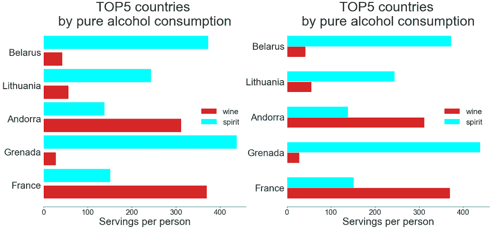

# 如何在 Matplotlib 中绘制条形图:简单的方法

> 原文：<https://www.dataquest.io/blog/how-to-plot-a-bar-graph-matplotlib/>

July 30, 2021


条形图是最常见的可视化类型之一，在 Matplotlib 中非常容易创建。我们需要做的就是编写一小段 Python 代码。

然而，如果我们想要创建一个信息丰富、易读的条形图，有效地揭示数据背后的故事，我们必须记住几个重要的事情。这就是我们要在本文中讨论的内容。

这些建议中的一些仅针对条形图；其他的适用于任何类型的数据可视化。

为了练习我们的条形图，我们将使用 Kaggle 的一个与酒吧密切相关的数据集— [世界各地的酒精消费量](https://www.kaggle.com/codebreaker619/alcohol-comsumption-around-the-world)
 。该表是 2010 年的，所以让我们回到过去。我们将使用 Matplotlib 和 Python 来进行数据探索和数据可视化。

```py
import pandas as pd
import numpy as np
import matplotlib
import matplotlib.pyplot as plt
import seaborn as sns

df = pd.read_csv('drinks.csv')
print('Number of all the countries:', len(df), '\n')

# Removing the countries with 0 alcohol consumption
df = df[df['total_litres_of_pure_alcohol'] > 0]\
       .reset_index(drop=True)
print(df.head(3), '\n')
print('Number of all the drinking countries:', len(df))
```

**输出:**

```py
Number of all the countries: 193

   country  beer_servings  spirit_servings  wine_servings  \
0  Albania             89              132             54
1  Algeria             25                0             14
2  Andorra            245              138            312

   total_litres_of_pure_alcohol
0                           4.9
1                           0.7
2                          12.4

Number of all the drinking countries: 180
```

## 去杂乱

一般来说，我们应该最大化图表的数据-墨水比率，因此，排除所有不能通过数据为我们讲述故事提供任何额外信息的东西。

### 移除冗余特征

首先，我们应该避免情节上任何可能转移读者注意力的特征:

*   不必要的刺和扁虱
*   网格，如果它是多余的
*   尽可能用十进制数，尤其是那些有很多小数点的数字
*   将精确的数字(十进制或非十进制)放在每个条的顶部:如果我们真的需要它们，我们可以用相应的表格来补充我们的图表。或者，我们可以只在条形顶部使用这些直接标签，并删除数字轴，以避免重复相同的信息。

### 标签和尺寸

创建条形图时，讲故事的一个看似明显但有时被忽视或误用的方面与标签和尺寸有关:

*   图形足够的宽度和高度
*   图表标题、轴标签、记号和注释(如果有)的易读字体大小
*   标题尽可能简洁，同时尽可能详尽地描述，不超过 2-3 行(如果很长的话)
*   清除坐标轴标签
*   旋转刻度标签(如有必要)
*   包含在轴标签中或直接包含在标题中的测量值的单位(%、分数或任何绝对值)
*   如果分类轴的值是不言自明的，我们可以省略这个轴标签

### 永远要避免的事情

创建条形图时，请始终避免以下功能:

*   3D 条形图:它们严重扭曲了现实，造成了一种视觉错觉，使识别每个条形的真实高度(长度)变得更加困难。此外，前面的条形可以完全覆盖后面的条形，使读者看不到它们。
*   交互性(极少数情况除外)。
*   装饰品或色彩效果。

让我们比较下面的两个条形图，它们在数据方面是相同的，但在风格上是不同的。此外，我们还将找出 2010 年哪些国家消费了最多的酒:

```py
top5_alcohol = df.sort_values('total_litres_of_pure_alcohol',
                  ascending=False)[:5]\\
     .reset_index(drop=True)

ss="token punctuation">, ax = plt.subplots(figsize=(16,7))
ss="token punctuation">.tight_layout(pad=2)

ss="token punctuation">.subplot(1,2,1)
ss="token punctuation">.set_style('whitegrid')
ss="token operator">= sns.barplot(x='country', y='total_litres_of_pure_alcohol',
     data=top5_alcohol)
"token keyword">for p in ax.patches:
class="token punctuation">.annotate(format(p.get_height(), '.1f'),
    (p.get_x() + p.get_width() / 2., p.get_height()),
    ha='center', va='center',
    xytext=(0, 7), textcoords='offset points')
ss="token punctuation">.title('TOP5 countries by pure alcohol consumption')
ss="token punctuation">.xlabel('Countries')
ss="token punctuation">.ylabel('Litres per person')
s="token punctuation">.grid(True)

ss="token punctuation">.subplot(1,2,2)
ss="token punctuation">.set_style('ticks')
ss="token operator">= sns.barplot(x='country', y='total_litres_of_pure_alcohol',
     data=top5_alcohol)
ss="token punctuation">.title('TOP5 countries by pure alcohol consumption', fontsize=30)
ss="token punctuation">.xlabel(None)
ss="token punctuation">.xticks(fontsize=22, rotation=30)
ss="token punctuation">.ylabel('Litres per person', fontsize=25)
ss="token punctuation">.yticks(fontsize=22)
ss="token punctuation">.despine(bottom=True)
s="token punctuation">.grid(False)
s="token punctuation">.tick_params(bottom=False, left=True)
"token keyword">for _,s in ax.spines.items():
lass="token punctuation">.set_color('black')
ss="token punctuation">.show()
```



第二个条形图，即使仍然不理想，也肯定比第一个干净得多，可读性更好。我们删除了不必要的脊线、分类轴上的刻度、网格、条形值指示、增加的字体大小、旋转的 x 刻度标签，并省略了分类轴标签。

是的，我们清楚地看到哪些国家在 2010 年喝了更多的酒。不过，最有可能的是，他们喝的是不同种类的饮料。我们很快会调查这个问题。

## 着色

我们已经提到，使用额外的颜色效果，如背景或字体颜色，不是一个好的做法。为条形图选择颜色时，还有一些其他的事情需要考虑。

### 突出显示一些条形

当应用不同的颜色不能传达任何关于数据的信息时，我们应该避免。默认情况下，seaborn 条形图中的每个条形都有不同的颜色，正如我们前面看到的那样。我们可以通过引入颜色参数并给所有的条分配相同的颜色来覆盖它。然而，我们仍然可以特别强调一些条形，并用灰色显示其他条形。例如，在我们上面的前 5 个国家中，让我们突出饮用特定烈酒的领导者。除了颜色强调，我们还将添加相应的注释:

```py
spirit_top = top5_alcohol['spirit_servings']
colors = ['grey' if (s < max(spirit_top)) else 'red' for s in spirit_top]

fig, ax = plt.subplots(figsize=(10,5))
sns.set_style('white')
ax=sns.barplot(x='country', y='total_litres_of_pure_alcohol',
               data=top5_alcohol, palette=colors)
plt.title('TOP5 countries by pure alcohol consumption', fontsize=25)
plt.xlabel(None)
plt.xticks(fontsize=16)
plt.ylabel('Litres per person', fontsize=20)
plt.yticks(fontsize=15)
ax.text(x=2.5, y=12.3, s='the highest \\nspirit servings',
        color='red', size=17, weight='bold')
sns.despine(bottom=True)
ax.grid(False)
ax.tick_params(bottom=False, left=True)
plt.show()
```



加勒比海的一个小岛国，格林纳达，在纯酒精消费中排名第四，在排名前五的国家中，它是烈酒消费量最高的国家。

### 使用色盲调色板

为了让我们的条形图获得更广泛的受众，我们应该考虑使用色盲友好的颜色。有各种在线工具(如[斯塔克](https://www.getstark.co/)或[科尔布林德](http://www.color-blindness.com/coblis-color-blindness-simulator/))可以测试不同类型色盲的图像。然而，它最常见的形式涉及区分红色和绿色，所以一个好的方法是避免调色板上有这两种颜色。另一种方法是使用[色盲 10](https://public.tableau.com/views/TableauColors/ColorPaletteswithRGBValues?%3Aembed=y&%3AshowVizHome=no&%3Adisplay_count=y&%3Adisplay_static_image=y) 调色盘的画面。缺点是它提供的颜色选择相当有限。

### 避免违反直觉的颜色

对于大多数人来说，一些颜色与某些类别的现象或品质有很强的联系。

例如，紫红色被广泛认为是女性的颜色。交通灯调色板通常用于区分危险区、中立区和安全区。而红蓝调色板与温度等有关。即使你是一个坚定的不墨守成规者，总是反对任何刻板印象，在创建分组条形图时遵循这些不成文的约定也是一个好主意，以避免误导读者。

如果我们的小组没有特定的惯例，一个好的做法是尝试提出(如果可能的话)一些上下文相关但易于理解的决策。比方说，我们将创建一个过去 10 年全球考拉和狐狸数量的分组条形图。在这种情况下，我们可以考虑用橙色代表狐狸，灰色代表考拉，而不是相反。

让我们回到纯酒精消费排名前五的国家，并检查每个国家饮用啤酒和葡萄酒的比例。当然，有些类型的啤酒是深红色的(例如樱桃色的)，有些葡萄酒是金黄色的(白葡萄酒或梅子酒)。尽管如此，这些饮料最直观的颜色联想是葡萄酒的深红色和啤酒的金黄色:

```py
fig, ax = plt.subplots(figsize=(10,5))
x = np.arrange(len(top5_alcohol))
width = 0.4
plt.bar(x-0.2, top5_alcohol['wine_servings'],
        width, color='tab:red', label='wine')
plt.bar(x+0.2, top5_alcohol['beer_servings'],
        width, color='gold', label='beer')
plt.title('TOP5 countries by pure alcohol consumption', fontsize=25)
plt.xlabel(None)
plt.xticks(top5_alcohol.index, top5_alcohol['country'], fontsize=17)
plt.ylabel('Servings per person', fontsize=20)
plt.yticks(fontsize=17)
sns.despine(bottom=True)
ax.grid(False)
ax.tick_params(bottom=False, left=True)
plt.legend(frameon=False, fontsize=15)
plt.show()
```


现在我们很容易发现，在法国，人们喝的葡萄酒比啤酒多得多，而在立陶宛和格林纳达，情况正好相反。在安道尔，这两种饮料都相当受欢迎，葡萄酒略占主导地位。

## 配置

### 垂直与水平条形图

尽管垂直条形图通常是默认的，但有时水平条形图更受欢迎:

*   用于标称变量绘图
*   当 x 刻度标签太长时，旋转它们有助于避免重叠，但会降低可读性
*   当我们有大量的类别(条)时

在最后一种情况下，水平条形图特别有利于在狭窄的手机屏幕上查看图形。

垂直条形图更适合绘制顺序变量或时间序列。例如，我们可以用它来按地质时期绘制地球上的总生物量，或按月份绘制 UFO 目击数量，等等。

由于 country 列代表一个名义变量，并且一些国家的名称相当长，所以让我们选择许多类别(人均啤酒消费量排名前 20 位的国家),并查看水平条形图:

```py
top20_beer = df.sort_values('beer_servings', ascending=False)[:20]

fig, ax = plt.subplots(figsize=(40,18))
fig.tight_layout(pad=5)

# Creating a case-specific function to avoid code repetition
def plot_hor_vs_vert(subplot, x, y, xlabel, ylabel, rotation,
                     tick_bottom, tick_left):
    ax=plt.subplot(1,2,subplot)
    sns.barplot(x, y, data=top20_beer, color='slateblue')
    plt.title('TOP20 countries \\nby beer consumption', fontsize=85)
    plt.xlabel(xlabel, fontsize=60)
    plt.xticks(fontsize=45, rotation=rotation)
    plt.ylabel(ylabel, fontsize=60)
    plt.yticks(fontsize=45)
    sns.despine(bottom=False, left=True)
    ax.grid(False)
    ax.tick_params(bottom=tick_bottom, left=tick_left)
    return None

plot_hor_vs_vert(1, x='country', y='beer_servings',
                 xlabel=None, ylabel='Servings per person',
                 rotation=90, tick_bottom=False, tick_left=True)
plot_hor_vs_vert(2, x='beer_servings', y='country',
                 xlabel='Servings per person', ylabel=None,
                 rotation=None, tick_bottom=True, tick_left=False)
plt.show()
```



水平翻转所有单词(包括测量值轴的标签)会使第二个图表更具可读性。

纳米比亚开放这个列表，随后是捷克共和国。除了立陶宛，我们再也看不到酒精消费量最高的国家了，立陶宛已经下降到第五位。似乎他们在之前评级中的高位置是用喝烈酒和葡萄酒而不是啤酒来解释的。

### 排序

如果我们提取人们饮酒超过平均水平的所有国家，然后将这些数据可视化为条形图，得到的条形图将按字母顺序按基本类别(国家)排序。不过，最有可能的是，在这种情况下，我们更感兴趣的是看到按人均葡萄酒数量排序的数据。让我们比较一下这两种方法:

```py
wine_more_than_mean = (df[df['wine_servings'] > df['wine_servings']\\
                         .mean()])
sort_wine_more_than_mean = wine_more_than_mean\\
                           .sort_values('wine_servings',
                                        ascending=False)

fig, ax = plt.subplots(figsize=(30,30))
fig.tight_layout(pad=5)

# Creating a case-specific function to avoid code repetition
def plot_hor_bar(subplot, data):
    plt.subplot(1,2,subplot)
    ax = sns.barplot(y='country', x='wine_servings', data=data,
                     color='slateblue')
    plt.title('Countries drinking wine \\nmore than average',
              fontsize=70)
    plt.xlabel('Servings per person', fontsize=50)
    plt.xticks(fontsize=40)
    plt.ylabel(None)
    plt.yticks(fontsize=40)
    sns.despine(left=True)
    ax.grid(False)
    ax.tick_params(bottom=True, left=False)
    return None

plot_hor_bar(1, wine_more_than_mean)
plot_hor_bar(2, sort_wine_more_than_mean)
plt.show()
```



在第一个情节中，我们可以通过人均葡萄酒饮用量(仅指人们饮酒量超过平均水平的国家)来区分排名第一和最后三个国家，然后事情变得过于复杂。在第二个情节中，我们可以很容易地追溯整个国家的评级。为了更真实的描述，我们应该考虑到每个国家的人口(当然，将俄罗斯联邦与库克群岛和圣卢西亚进行比较并不完全正确)，并且可能排除弃权者。然而，这里的要点是，如果我们想从可视化中获得最大限度的信息，我们应该始终考虑在绘制数据之前对数据进行排序。这不一定是按值排序:相反，我们可以决定按类别本身对数据进行排序(如果它们是有序的，如年龄范围)，或者如果必要的话，它背后可能有任何其他逻辑。

### 从 0 开始

虽然其他类型的图不必从零开始，但条形图总是从零开始。原因是条形图应该显示每个数据点的大小和所有数据点之间的比例，而不是像线形图那样只显示变量的变化。

如果我们从 0 以外的值开始截断 y 轴(或 x 轴，如果是水平条形图),我们还会截断每个条形的长度，因此我们的图表无法正确显示——无论是每个类别的单个值还是它们之间的比率:

```py
usa = df[df['country']=='USA'].transpose()[1:4].reset_index()
usa.columns = ['drinks', 'servings']

fig = plt.figure(figsize=(16,6))
fig.tight_layout(pad=5)

# Creating a case-specific function to avoid code repetition
def plot_vert_bar(subplot, y_min):
    plt.subplot(1,2,subplot)
    ax = sns.barplot(x='drinks', y='servings',
                     data=usa, color='slateblue')
    plt.title('Drink consumption in the USA', fontsize=30)
    plt.xlabel(None)
    plt.xticks(usa.index, ['Beer', 'Spirit', 'Wine'], fontsize=25)
    plt.ylabel('Servings per person', fontsize=25)
    plt.yticks(fontsize=17)
    plt.ylim(y_min, None)
    sns.despine(bottom=True)
    ax.grid(False)
    ax.tick_params(bottom=False, left=True)
    return None

plot_vert_bar(1, y_min=80)
plot_vert_bar(2, y_min=None)
plt.show()
```



左边的图给了我们一个误导的印象，即在美国，葡萄酒的消费量比烈酒的消费量低 15 倍左右，而烈酒的消费量还不到啤酒的一半。在右边的图上，我们看到完全不同的比例，这是正确的比例。

## 分组和堆叠

### 视觉明显的分组

创建成组条形图时，注意条形之间的距离很重要，当每个组内条形之间的间距小于(最大为 0)相邻组条形之间的间距时，我们认为分组正确。

回到纯酒精消费量排名前五的国家，现在让我们来看看每个国家饮用烈酒和葡萄酒的比例:

```py
top5_alcohol_rev = top5_alcohol\\
                       .sort_values('total_litres_of_pure_alcohol')\\
                       .reset_index(drop=True)

fig, ax = plt.subplots(figsize=(20,9))
fig.tight_layout(pad=5)

# Creating a case-specific function to avoid code repetition
def plot_grouped_bar(subplot, width, gap):
    plt.subplot(1,2,subplot)
    x = np.arange(len(top5_alcohol_rev['wine_servings']))
    plt.barh(x, top5_alcohol_rev['wine_servings'],
             width, color='tab:red', label='wine')
    plt.barh(x+width+gap, top5_alcohol_rev['spirit_servings'],
             width, color='aqua', label='spirit')
    plt.yticks(x+width/2, top5_alcohol_rev['country'], fontsize=28)
    plt.title('TOP5 countries \\nby pure alcohol consumption',
              fontsize=40)
    plt.xlabel('Servings per person', fontsize=30)
    plt.xticks(fontsize=22)
    sns.despine(left=True)
    plt.tick_params(bottom=True, left=False)
    ax.grid(False)
    plt.legend(loc='right', frameon=False, fontsize=23)
    return None

plot_grouped_bar(1, width=0.4, gap=0.1)
plot_grouped_bar(2, width=0.3, gap=0)
plt.show()
```



在左侧的图表中，很难立即区分相邻组之间的边界，因为每个组内部和组之间的条形之间的距离是相等的。然而，右边的图表清楚地显示了每个条形与哪个国家相关。我们现在看到，格林纳达、白俄罗斯和立陶宛的人更喜欢烈酒，而不是葡萄酒，而法国和安道尔的情况正好相反。

### 堆积条形图与分组条形图

在堆积条形图和分组条形图之间进行选择时，我们应该考虑可视化的主要信息:

*   如果我们最感兴趣的是几个类别的总体值，并且作为次要目标，我们希望估计哪个组件在最大或最小的总体值中贡献最大，那么最佳选择是堆积条形图。然而，这里的问题是，除了第一个元素(即，垂直堆积条形图中的最底部或水平条形图中的最左侧)，很难找出其单个元素的趋势。这在我们有很多小节的情况下尤其重要，有时，我们甚至会得到一个欺骗性的印象，并得出一个不正确的结论。
*   如果我们想跟踪各个类别中每个单独组件的趋势，我们最好使用分组条形图。显然，在这种情况下，我们不能说按类别的总价值。

让我们将堆积和分组条形图应用于波罗的海国家，以确定他们的饮酒偏好:

```py
baltics = df[(df['country']=='Latvia')|(df['country']=='Lithuania')\\
            |(df['country']=='Estonia')].iloc[:,:4]
baltics.columns = ['country', 'beer', 'spirit', 'wine']
baltics.reset_index(drop=True, inplace=True)

labels = baltics['country'].tolist()
beer = np.array(baltics['beer'])
spirit = np.array(baltics['spirit'])
wine = np.array(baltics['wine'])

fig, ax = plt.subplots(figsize=(16,7))
fig.tight_layout(pad=5)

# Creating a case-specific function to avoid code repetition
def plot_stacked_grouped(subplot, shift, width, bot1, bot2):
    x = np.arrange(len(baltics))
    plt.subplot(1,2,subplot)
    plt.bar(x-shift, beer, width,
            label='beer', color='gold')
    plt.bar(x, spirit, width, bottom=bot1,
            label='spirit', color='aqua')
    plt.bar(x+shift, wine, width, bottom=bot2,
            label='wine', color='tab:red')
    plt.title('Drink consumption \\nin Baltic countries',
              fontsize=35)
    plt.xlabel(None)
    plt.xticks(baltics.index, labels, fontsize=25)
    plt.ylabel('Servings per person', fontsize=27)
    plt.yticks(fontsize=20)
    sns.despine(bottom=True)
    plt.tick_params(bottom=False, left=True)
    plt.legend(frameon=False, fontsize=17)
    return None

plot_stacked_grouped(1, shift=0, width=0.35,
                     bot1=beer, bot2=beer+spirit)
plot_stacked_grouped(2, shift=0.2, width=0.2,
                     bot1=0, bot2=0)
plt.show()
```


在上面的堆叠图中，我们看到，在所有三个波罗的海国家中，立陶宛的酒精消费量最高，而爱沙尼亚的最低。两种情况下的主要贡献都来自啤酒。关于这些国家烈酒和葡萄酒的消费，从这个情节中我们说不出什么精确的东西。事实上，数量似乎相等。

分组图清楚地表明，立陶宛也领先于饮酒，而爱沙尼亚再次显示最低水平。不过，这种饮料的区别并不像啤酒那样明显。至于葡萄酒，差异就更不明显了，但似乎拉脱维亚的葡萄酒消费量最高，而立陶宛的消费量最低。然而，从这个图表中，猜测这些国家的总体酒精消费量已经变得更加困难。我们必须做一些心算，如果有三个以上的酒吧团体，这个任务就变得不切实际了。

结论

在创建有意义的可视化并从中获得正确的见解之前，我们必须考虑以下细节:

*   我们的目标
*   我们的目标受众
*   从我们的图表中获得的重要信息，以及如何在显示更多有用信息的同时强调这些信息
*   如何排除对我们讲故事没用的特征

感谢阅读，和 za zdorovie！ 

## 想了解更多关于改进条形图可视化的信息吗？

*   [在本课中学习如何使用 Python](https://app.dataquest.io/m/144) 创建条形图
*   [在这节课中，学习 Seaborn 如何让你的作品脱颖而出](https://app.dataquest.io/m/145)
*   [在本课中，了解可视化分组频率表](https://app.dataquest.io/m/287)