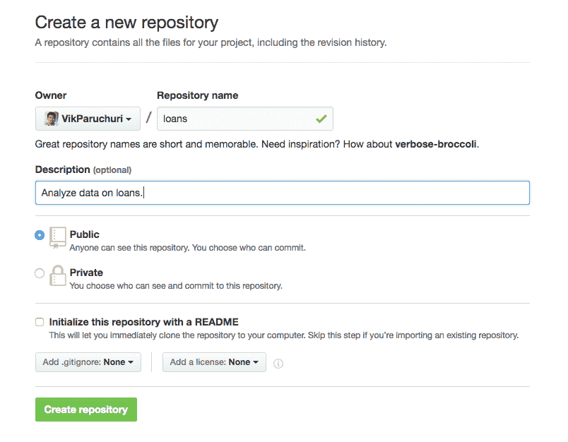
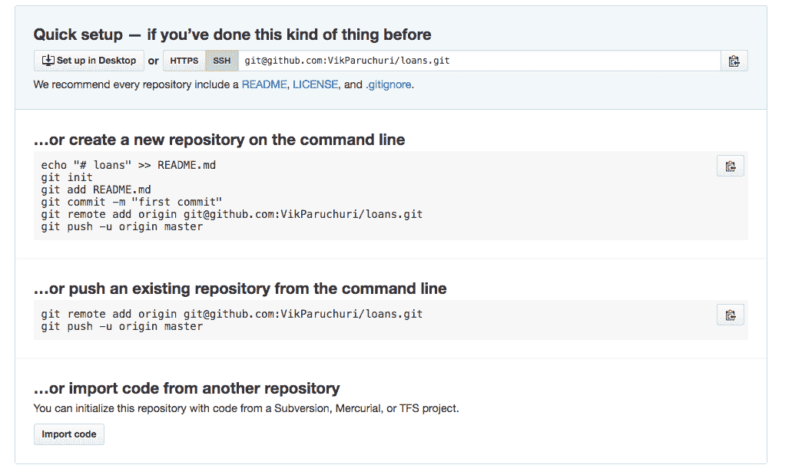
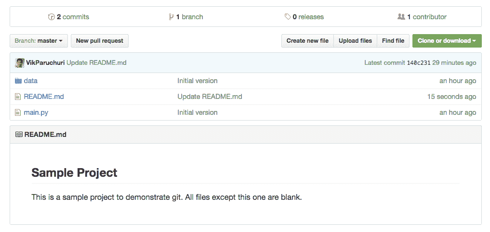

# 如何在 GitHub 上展示您的数据科学产品组合

> 原文：<https://www.dataquest.io/blog/how-to-share-data-science-portfolio/>

January 14, 2017*This is the fifth and final post in a series of posts on how to build a Data Science Portfolio.* In the previous posts in our portfolio series, we talked about [how to build a storytelling project](https://www.dataquest.io/blog/data-science-portfolio-project/), [how to create a data science blog](https://www.dataquest.io/blog/how-to-setup-a-data-science-blog/), [how to create a machine learning project](https://www.dataquest.io/blog/data-science-portfolio-machine-learning/), and [how to construct a portfolio](https://www.dataquest.io/blog/build-a-data-science-portfolio/). In this post, we’ll discuss how to present and share your portfolio. You’ll learn how to showcase your work on [GitHub](https://www.github.com), a popular site that hosts code repositories, data, and interactive explorations. In the first part of the post, we’ll cover how to upload your work to GitHub. In the second part of the post, we’ll cover how to present your work on GitHub, and how to impress hiring managers. Before diving into this post, you should have a couple of projects that you want to showcase. If you need some inspiration, you can consult our previous posts via the links above.

## 第一部分— git 和 GitHub 教程

GitHub 是围绕一项名为

[git](https://git-scm.com/) ，分布式版本控制系统。这听起来可能有点吓人，但它的意思是，它允许您在不同的时间点创建代码的检查点，然后在这些检查点之间随意切换。例如，假设我有以下 Python 脚本，摘自 [scikit-learn examples](https://scikit-learn.org/stable/auto_examples/model_selection/plot_cv_predict.html) :

```py
 lr = linear_model.LinearRegression()
boston = datasets.load_boston()
y = boston.target

predicted = cross_val_predict(lr, boston.data, y, cv=10) 
```

我现在使用 git 创建一个检查点，并在代码中添加一些行。在下面的代码中，我们:

*   更改数据集
*   更改 CV 折叠的数量
*   展示一个情节

```py
 lr = linear_model.LinearRegression()
diabetes = datasets.load_diabetes()
y = diabetes.target

predicted = cross_val_predict(lr, diabetes.data, y, cv=20)

fig, ax = plt.subplots()
ax.scatter(y, predicted)
ax.plot([y.min(), y.max()], [y.min(), y.max()], 'k--', lw=4)
plt.show() 
```

如果我们用 git 创建另一个检查点，我们将能够随时回到第一个检查点，并在两个检查点之间自由切换。检查点通常被称为提交，我们将继续使用这个术语。我们可以将提交上传到 GitHub，这样其他人就可以看到我们的代码。git 比提交系统强大得多，您应该这样做

如果您想了解更多，请尝试我们的 git 课程。然而，为了上传你的作品集，可以这样想。

## 设置 git 和 Github

为了用 git 创建一个 commit 并上传到 GitHub，首先需要安装和配置 git。完整的说明如下

[此处](https://help.github.com/articles/set-up-git/)，但我们将在此处总结步骤:

*   使用[这个链接](https://git-scm.com/downloads)安装 git
*   打开电脑上的终端应用程序
*   通过输入`git config --global user.email YOUR_EMAIL`设置你的 git 邮箱。用电子邮件帐户替换`YOUR_EMAIL`。
*   通过键入`git config --global user.name YOUR_NAME`设置您的 git 名称。用你的全名代替`YOUR_NAME`，比如`John Smith`。

一旦你完成了这些，git 就被设置和配置好了。接下来，我们需要在 GitHub 上创建一个帐户，然后配置 git 来使用 GitHub:

*   [创建](https://github.com/join)一个 GitHub 账户。理想情况下，您应该使用之前配置 git 时使用的电子邮件。
*   [创建一个 SSH 密钥](https://help.github.com/articles/generating-a-new-ssh-key-and-adding-it-to-the-ssh-agent/)
*   将密钥添加到您的 GitHub 帐户

上述设置将让您

*向 Github 推送*提交，*从 GitHub 拉取*提交。

## 创建存储库

git 中的提交发生在存储库内部。存储库类似于您的项目所在的文件夹。对于教程的这一部分，我们将使用具有如下文件结构的文件夹:

```py
 loans
│   README.md
│   main.py
│
└───data
    │   test.csv
    │   train.csv 
```

你可以自己下载文件夹的 zip 文件

[这里的](https://s3.amazonaws.com/dq-blog-files/loans.zip)在接下来的步骤中使用。你可以用任何解压文件的程序来解压它。上图中的 git 存储库是项目文件夹，或`loans`。为了创建提交，我们首先需要将文件夹初始化为 git 存储库。我们可以通过导航到该文件夹，然后键入`git init`来做到这一点:

```py
 $ cd loans
$ git init
Initialized empty Git repository in /loans/.git/ 
```

这将创建一个名为

`.git`在`loans`文件夹里面。您将得到输出，表明存储库已正确初始化。git 使用`.git`文件夹来存储关于提交的信息:

```py
 loans
│   README.md
│   main.py
└───.git
│
└───data
    │   test.csv
    │   train.csv 
```

的内容

在本教程中，没有必要探究文件夹，但是您可能希望浏览一下，看看是否能够弄清楚提交数据是如何存储的。初始化存储库之后，我们需要将文件添加到潜在的提交中。这会将文件添加到临时区域。当我们对暂存区中的文件满意时，我们可以生成一个提交。我们可以使用`git add`来做到这一点:

```py
 $ git add README.md
```

上面的命令将添加

`README.md`文件到暂存区。这不会改变磁盘上的文件，但是会告诉 git 我们想要将文件的当前状态添加到下一次提交中。我们可以通过`git status`检查中转区的状态:

```py
 $ git status
On branch master

Initial commit

Changes to be committed:
  (use "git rm --cached <file>..." to unstage)

    new file:   README.md

Untracked files:
  (use "git add <file>..." to include in what will be committed)

    data/
    main.py

```

您会看到我们已经添加了

文件到暂存区，但仍有一些未跟踪的文件没有添加。我们可以添加所有带`git add .`的文件。在我们将所有文件添加到暂存区域之后，我们可以使用`git commit`创建一个提交:

```py
 $ git commit -m "Initial version"
[master (root-commit) 907e793] Initial version 
4 files changed, 0 insertions(+), 0 deletions(-) 
create mode 100644 README.md 
create mode 100644 data/test.csv 
create mode 100644 data/train.csv 
create mode 100644 main.py 
```

这

`-m`选项指定提交消息。您可以稍后回顾提交消息，查看提交中包含哪些文件和更改。commit 从临时区域中获取所有文件，并将临时区域留空。

## 对存储库进行更改

当我们对存储库进行进一步的更改时，我们可以将更改后的文件添加到暂存区，并进行第二次提交。这允许我们随着时间的推移保持存储库的历史。我们可以像以前一样向提交添加更改。假设我们改变了

`README.md`文件。我们首先运行`git status`来看看发生了什么变化:

```py
 $ git status
On branch master
Changes not staged for commit:
  (use "git add <file>..." to update what will be committed)
  (use "git checkout -- <file>..." to discard changes in working directory)

    modified:   README.md

no changes added to commit (use "git add" and/or "git commit -a")

```

然后，我们可以确切地看到发生了什么变化

`git diff`。如果更改是我们所期望的，我们可以将这些更改添加到新的提交中:

```py
$ git add .
```

然后我们可以再次承诺:

```py
 $ git commit -m "Update README.md"
[master 5bec608] Update README.md
 1 file changed, 1 insertion(+)
```

你可能已经注意到这个世界

`master`在许多这些命令执行后出现。`master`是我们当前所在的分支的名称。分支允许多个人同时处理一个存储库，或者一个人同时处理多个特性。分支是极其强大的，但我们不会在这里深入研究它们。如果你有兴趣了解更多，我们的 Dataquest [交互式 git 教程](https://www.dataquest.io/course/git-and-vcs)详细介绍了如何使用多个分支。现在，知道存储库中的主要分支叫做`master`就足够了。到目前为止，我们已经对`master`分支做了所有的修改。我们将把`master`推送到 GitHub，这是其他人会看到的。

## 推送到 GitHub

一旦创建了 commit，就可以将存储库推送到 GitHub 了。为此，您首先需要

[在 GitHub 接口中创建一个公共存储库](https://help.github.com/articles/create-a-repo/)。您可以通过以下方式做到这一点:

*   点击 GitHub 界面右上角的“+”图标，然后点击“新建资源库”。


创建 GitHub 存储库。

*   输入存储库的名称，并根据需要输入描述。然后，决定是公开还是保密。如果是公开的，任何人都可以立即看到。您可以随时将存储库从公共存储库更改为私有存储库，反之亦然。建议在存储库准备好共享之前保持其私有性。请注意，创建私有存储库需要一个[付费计划](https://github.com/blog/2164-introducing-unlimited-private-repositories)。准备就绪后，单击“创建存储库”完成。



完成存储库创建。

创建回购后，您将看到如下屏幕:



使用存储库的选项。

查看“…或从命令行推送现有的存储库”部分，并将这两行复制到那里。然后在命令行中运行它们:

```py
 $ cd loans
$ git remote add origin [[email protected]](/cdn-cgi/l/email-protection):YOUR_GITHUB_USERNAME/YOUR_GIT_REPO_NAME.git
$ git push -u origin master
Counting objects: 7, done.
Delta compression using up to 4 threads.
Compressing objects: 100% (5/5), done.
Writing objects: 100% (7/7), 608 bytes | 0 bytes/s, done.
Total 7 (delta 0), reused 0 (delta 0)
To [[email protected]](/cdn-cgi/l/email-protection):YOUR_GITHUB_USERNAME/YOUR_GIT_REPO_NAME.git
 * [new branch]      master -> master
Branch master set up to track remote branch master from origin.
```

如果您在 GitHub 上重新加载与您的回购对应的页面(

，您现在应该可以看到您添加的文件。默认情况下，`README.md`将在资源库:中呈现

查看项目文件和自述文件。

恭喜你！现在，您已经将一个存储库推送到 GitHub。如果你想公开，你可以跟着

[这些指令](https://help.github.com/articles/making-a-private-repository-public/)。

## 第二部分——展示你的作品集

现在您已经知道了如何创建和上传一个存储库，我们将讨论如何展示它。在我们开始本节之前，看一些示例项目可能会有所帮助:

*   [公寓搜寻器 Slackbot](https://github.com/VikParuchuri/apartment-finder)
*   [贷款预测](https://github.com/dataquestio/loan-prediction)

### 要求

确保任何人都可以安装和运行您的作品是非常重要的。即使你的作品是 Jupyter 笔记本，也可能有其他人需要安装的包。您可以列出项目使用的所有包

如果你使用虚拟环境。您将得到如下输出:

```py
 $ pip freeze
Django==1.10.5
MechanicalSoup==0.6.0
Pillow==4.0.0 
```

输出是库名，然后是版本号。上面的输出告诉我们

例如`Django`版本`1.10.5`安装。您需要将这些需求复制到项目中名为`requirements.txt`的文件夹中。该文件应该如下所示:

```py
 Django==1.10.5
MechanicalSoup==0.6.0
Pillow==4.0.0 
```

现在，任何人都可以使用

`pip install -r requirements.txt`。这将安装我们机器上的库的精确版本。如果您想安装每个库的最新版本，您可以忽略`requirements.txt`中的版本号:

```py
 Django
MechanicalSoup
Pillow 
```

如果你想做一个

`requirements.txt`文件，但没有为您的项目使用 virtualenv，您将需要手动浏览您在项目中导入的库，并将它们添加到`requirements.txt`中，但不添加版本号，例如:

```py
 pandas
numpy
Pillow 
```

### 路径

当您在本地工作时，硬编码数据文件的绝对路径是很常见的，比如

`/Users/vik/Documents/data.csv`。其他想要运行您的项目的人在他们的计算机上不会有那些相同的路径，所以他们将不能运行您的项目。您可以很容易地用相对路径来替换它们，这允许与您的项目在同一个文件夹中拥有数据但没有相同绝对路径的人使用您的代码。假设我们有这样的代码:

```py
 with open("/Users/vik/Documents/data.csv") as f:
    data = f.read()
```

假设我们的项目代码在

`/Users/vik/Documents/Project.ipynb`。我们可以用相对路径替换代码，比如:

```py
 with open("data.csv") as f:
    data = f.read()
```

通常，最好将数据放在与项目相同的文件夹中，或者放在子文件夹中，以使相对路径和加载数据更容易。

### 附加文件

默认情况下，运行

`git add .`和`git commit -m "Message""`会将文件夹中的所有文件添加到 git 提交中。然而，有许多您不想添加的工件文件。下面是一个文件夹示例:

```py
 loans
│   __pycache__
│   main.py
│   main.pyc
│   temp.json
│
└───data
    │   test.csv
    │   train.csv 
```

注意文件，如

`__pycache__`、`main.pyc`和`temp.json`。项目主要代码在`main.py`，数据在`data/test.csv`，和`data/train.csv`。对于运行项目的人来说，这些是他们唯一需要的文件。像`__pycache__`和`main.pyc`这样的文件夹是在我们运行代码或者安装包的时候由 Python 自动生成的。这些使得 Python 脚本和包的安装更加快速和可靠。但是，这些文件不是您项目的一部分，因此不应该分发给其他人。我们可以用一个`.gitignore`文件忽略这样的文件。我们可以添加一个`.gitignore`文件到我们的文件夹:

```py
 loans
│   .gitignore
│   __pycache__
│   main.py
│   main.pyc
│   temp.json
│
└───data
    │   test.csv
    │   train.csv
```

的内容

`.gitignore` file 是要忽略的文件列表。我们可以创建一个`.gitignore`文件，然后添加`*.pyc`和`__pycache__`来忽略我们文件夹中生成的文件:

```py
 *.pyc
__pycache__ 
```

这仍然留下了

`temp.json`文件。我们可以添加另一行来忽略这个文件:

```py
 *.pyc
__pycache__
temp.json 
```

这将确保这些文件不会被 git 跟踪，并在您运行时添加到新的 git 提交中

`git add .`。然而，如果您之前已经将文件添加到 git 提交中，那么您需要首先使用`git rm temp.json --cached`删除它们。建议尽快创建一个`.gitignore`文件，并快速添加临时文件的条目。你可以在这里找到一个很好的入门 gitignore 文件。通常建议使用这个文件作为您的`.gitignore`文件，然后根据需要添加新条目。最好忽略任何动态的、生成的或临时的文件。您应该只提交您的源代码、文档和数据(取决于您的数据有多大——我们将在另一节中讨论这一点)。

### 密钥或文件

许多项目使用密钥来访问资源。api 键就是一个很好的例子，比如

`AWS_ACCESS_KEY="3434ffdsfd"`。您绝对不希望与他人共享您的密钥——这会让他们访问您的资源，并可能让您损失金钱。下面是一些使用密钥的示例代码:

```py
 import forecastio

forecast = forecastio.load_forecast("34343434fdfddf", 37.77493, -122.41942) 
```

在上面的代码中，

是一个密钥，我们将它传递到一个图书馆以获取天气预报。如果我们提交代码，任何浏览 Github 的人都可以看到我们的秘密数据。幸运的是，有一个简单的方法可以解决这个问题，并允许任何使用该项目的人提供他们自己的密钥，这样他们仍然可以运行代码。首先，我们创建一个名为`settings.py`的文件，包含以下几行:

```py
 API_KEY = ""

try:
from .private import *
except Exception:
pass 
```

上述代码定义了一个名为

`API_KEY`。它还会尝试从名为`private.py`的文件导入，如果该文件不存在，它就不会执行任何操作。我们接下来需要添加一个`private.py`，内容如下:

```py
API_KEY = "34343434fdfddf"
```

然后，我们需要添加

`private.py`到`.gitignore`这样它就不会被提交:

```py
private.py
```

然后，我们修改我们的原始代码:

```py
 import settings
forecast = forecastio.load_forecast(settings.API_KEY, 37.77493, -122.41942) 
```

我们在上面所做的所有更改会产生以下结果:

*   代码导入设置文件
*   设置文件导入`private.py`文件
    *   这会用私有文件中定义的`API_KEY`覆盖设置文件中的`API_KEY`变量
*   代码使用设置文件中的`API_KEY`，它等于`"34343434fdfddf"`

下次提交 git 时，

`private.py`将被忽略。然而，如果其他人查看您的存储库，他们会发现他们需要用自己的设置填写`settings.py`,以使事情正常工作。所以一切都会对你起作用，你不会和别人分享你的秘钥，事情也会对别人起作用。

#### 大型或受限数据文件

下载数据文件时，查看用户协议很重要。有些文件是不允许重新分发的。有些文件也太大，无法下载。其他文件更新很快，分发它们没有意义—您希望用户下载一个新的副本。在这种情况下，将数据文件添加到

`.gitignore`文件。这确保了数据文件不会包含在存储库中。不过，了解如何在`README.md`中下载数据是很重要的。我们将在下一节讨论这个问题。

### 自述文件

自述文件对您的项目非常重要。自述文件通常命名为

`README.md`，为[降价](https://daringfireball.net/projects/markdown/syntax)格式。GitHub 会自动解析 Markdown 格式并呈现出来。您的自述文件应描述:

*   项目的目标
*   您创建项目的思路和方法
*   如何安装您的项目
*   如何运行您的项目

您希望一个普通的技术熟练的陌生人能够阅读您的自述文件，然后自己运行项目。这确保了更多的技术招聘经理可以复制你的工作并检查你的代码。您可以找到很好的自述示例

[这里](https://github.com/VikParuchuri/apartment-finder/blob/master/README.md)和[这里](https://github.com/dataquestio/loan-prediction/blob/master/README.md)。在新文件夹或新电脑上亲自完成安装步骤很重要，以确保一切正常。README 也是第一个，也可能是唯一一个有人会看的东西，因为 GitHub 把它呈现在存储库文件视图下面。重要的是“推销”这个项目是什么，你为什么要做它，它有什么有趣的地方。这里有一个例子:

```py
 # Loan Price Prediction

In this project, I analyzed data on loans issued through the [LendingClub](https://www.lendingclub.com/) platform.  On the LendingClub platform, potential lenders see some information about potential borrowers, along with an interest rate they'll be paid.  The potential lenders then decide if the interest on the loan is worth the risk of a default (the loan not being repaid), and decide whether to lend to the borrower.  LendingClub publishes anonymous data about its loans and their repayment rates.

Using the data, I analyzed factors that correlated with loans being repaid on time, and did some exploratory visualization and analysis.  I then created a model that predicts the chance that a loan will be repaid given the data surfaced on the LendingClub site.  This model could be useful for potential lenders trying to decide if they should fund a loan.  You can see the exploratory data analysis in the `Exploration.ipynb` notebook above.  You can see the model code and explanations in the `algo` folder.
```

您的自述文件应该比上面的例子更广泛、更深入，但这是一个很好的起点。理想情况下，您还需要:

*   一些你在探索中发现的有趣观察的要点
*   你制作的任何有趣的图表
*   关于模型的信息，例如算法
*   误差率和关于预测的其他信息
*   关于该模型的实际应用有什么注意事项吗

这里的总结是，自述文件是推销您的项目的最佳方式，您不应该忽视它。不要花太多精力做一个好项目，然后让人们跳过看它，因为他们不觉得它有趣！

### 内嵌解释

如果您正在编写 Python 脚本文件，您会希望包含大量行内注释，以使您的逻辑更容易理解。你不会想分享这样的东西:

```py
 def count_performance_rows():
    counts = {}
    with open(os.path.join(settings.PROCESSED_DIR, "Performance.txt"), 'r') as f:
        for i, line in enumerate(f):
            if i == 0:
                continue
            loan_id, date = line.split("|")
            loan_id = int(loan_id)
            if loan_id not in counts:
                counts[loan_id] = {
                    "foreclosure_status": False,
                    "performance_count": 0
                }
            counts[loan_id]["performance_count"] += 1
            if len(date.strip()) > 0:
                counts[loan_id]["foreclosure_status"] = True
    return counts 
```

更好的选择是:

```py
 def count_performance_rows():
    """
    A function to count the number of rows that deal with performance for each loan.
    Each row in the source text file is a loan_id and date.
    If there's a date, it means the loan was foreclosed on.
    We'll return a dictionary that indicates if each loan was foreclosed on, along with the number of performance events per loan.
    """

    counts = {}

    # Read the data file.
    with open(os.path.join(settings.PROCESSED_DIR, "Performance.txt"), 'r') as f:
        for i, line in enumerate(f):
            if i == 0:
                # Skip the header row
                continue
            # Each row is a loan id and a date, separated by a |
            loan_id, date = line.split("|")
            # Convert to integer
            loan_id = int(loan_id)
            # Add the loan to the counts dictionary, so we can count the number of performance events.
            if loan_id not in counts:
                counts[loan_id] = {
                    "foreclosure_status": False,
                    "performance_count": 0
                }
            # Increment the counter.
            counts[loan_id]["performance_count"] += 1
            # If there's a date, it indicates that the loan was foreclosed on
            if len(date.strip()) > 0:
                counts[loan_id]["foreclosure_status"] = True
    return counts 
```

在上面的例子中，这个函数在做什么，以及为什么做，就清楚多了。尽可能减少遵循你的逻辑的脑力劳动是很重要的。阅读代码很费时间，并不是每个浏览你的项目的人都会投资。评论使事情更顺利，并确保更多的人阅读你的项目。

### 朱庇特笔记本

Jupyter 笔记本，

[像这个](https://github.com/dataquestio/solutions/blob/master/Lesson215Solutions.ipynb)，都是 GitHub 自动渲染的，所以人们可以在浏览器中查看。请务必验证您上传的每台笔记本的几项内容:

*   确保它在界面中呈现时看起来不错
*   确保经常解释，并且清楚每一步发生了什么
    *   一个好的比率是每个降价单元不超过 2 个码单元
*   确保笔记本中的所有解释清晰易懂。你可以在我们之前的博客文章中了解更多。
*   确保自述文件链接到笔记本，并简要说明您在笔记本中做了什么

第二步也是最后一步尤其重要。你希望人们能够很容易地发现你的分析在笔记本上，以及你做了什么分析。只有代码单元的笔记本很难理解，也不能展示你的数据科学技能。雇主在寻找会编程的人

*和*有效沟通。

### 公开你的作品

完成上述所有步骤后，您需要对您的项目进行最终评审，然后将其公开！您可以通过“存储库设置”按钮来完成此操作:


“存储库设置”按钮位于右侧。

## 接下来的步骤

您现在知道如何将项目放到 GitHub 上，并且希望有一些项目可以上传。下一步是将你的项目添加到你的简历和作品集页面。一些需要考虑的事项:

*   如果你有一个博客，把每个项目写成一篇独立的文章，深入讲述你是如何建立它的，以及你发现了什么
*   将您的项目添加到您的 LinkedIn 个人资料中
*   将您的项目添加到您的 [AngelList](https://www.angel.co) 个人资料中
*   在简历中列出你的项目
*   如果你有一个个人网站，制作一个作品集页面，列出你的项目

如果您有几十个项目，并且不想在简历中添加每个资源库的链接，一个策略是制作一个名为 portfolio 的 Github 资源库。在这个存储库的自述文件中，列出您的所有项目，以及每个项目的简短说明和链接。这将使您能够共享单个链接，但仍然让人们看到您的所有项目。一定要提供好的解释，这样人们才会愿意点击进入！你现在应该知道足够多，可以把你的作品集放到 Github 上，给招聘经理留下深刻印象。如果你对这篇文章有任何意见或反馈，我们很乐意

[收到您的来信](https://twitter.com/dataquestio)。

* * *

*如果你喜欢这篇文章，你可能会喜欢阅读我们“构建数据科学组合”系列中的其他文章:*

*   *[用数据讲故事](https://www.dataquest.io/blog/data-science-portfolio-project/)。*
*   *[如何建立数据科学博客](https://www.dataquest.io/blog/how-to-setup-a-data-science-blog/)。*
*   *[打造机器学习项目](https://www.dataquest.io/blog/data-science-portfolio-machine-learning/)。*
*   *[建立数据科学投资组合的关键是让你找到工作](https://www.dataquest.io/blog/build-a-data-science-portfolio/)。*
*   *[寻找数据科学项目数据集的 17 个地方](https://www.dataquest.io/blog/free-datasets-for-projects)*