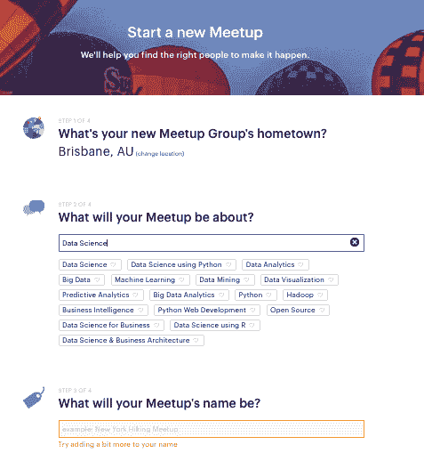

# 如何开始数据科学聚会

> 原文：<https://www.dataquest.io/blog/how-to-start-a-data-science-meetup/>

November 16, 2017

聚会是很好的工具，你可以结识业内人士，了解行业新闻，学习如何“侃侃而谈”在我开始参加聚会之前，我并不知道有多少东西我不知道，还需要学习，更不用说我在如何编写代码和进行分析方面缺少了什么。在我的职业生涯中，参加聚会对我的帮助超出了我的预期——无论是我学到了什么，还是提供了建立关系网的机会。

当我想了解更多关于数据科学的知识时，我寻找当地的聚会。在我的城市澳大利亚布里斯班没有。我环顾四周，发现有一些活动是为 R、Python、Tableau、机器学习和人工智能、统计学、商业智能等等组织的。数据科学的所有独立的原子元素，但与数据科学本身无关。然而，通过 meetup.com 表达了大量的兴趣(该网站显示了没有相应群体的搜索的流行程度)。因为没有其他人在做这件事，所以我决定自己动手做一个。

这是一项艰苦的工作，但也是一次极好的学习经历。我学到了很多关于数据科学的知识，我所在领域的工作人员，学到了比我个人学习更多的行业概念和想法。

在这篇文章中，我将回顾我是如何组织一次聚会的，我所面临的挑战，我所犯的错误，以及给任何想这样做的人的建议。

在继续之前，我们先来看一下 [Meetup 网站](https://www.meetup.com)。Meetup 允许人们按主题和名称搜索群组，并查看他们的同事可能参加了哪些群组。

对于组织者来说，它允许创建 meetup 组、发布活动细节、给成员发消息以及其他类似的功能。组织一次聚会大约需要 15 美元，但我建议你自己调查一下价格，因为价格可能会因地区而异。

## 如何组织一次聚会——泛泛而谈

我认为聚会至少需要三样东西:

1.  一次
2.  一个地方
3.  演示文稿

时间和地点是密不可分的，但我将分别讨论它们，因为它们有自己的考虑。它们也是最容易设置的部分。然而，安排一致的演示可能是一个持续的挑战。稍后会详细介绍。

### 为你的聚会选择一个时间

通过[meetup.com](https://www.meetup.com)，meetup 的初始设置是一个相当简单的过程。我在那里创建了我的群/页面，输入了我的信用卡信息，并选择了活动的重复日期。对于我的数据科学会议，我选择了每个月的第二个星期四，让与会者容易记住。布里斯班的大多数开发者聚会都使用这种规则，并且对他们很有效。

在 Meetup 网站上这样做是相当容易的，因为它允许你很容易地设置重复的事件。我建议您只需设置重复事件，并根据需要进行修改。您可能需要更改特定事件的日期或时间。在我的情况下，有几个第二个星期四是不可用的。最近，由于超额预定，我不得不提前一个多月更改日期。Meetup 的伟大之处在于，您可以向群组中的所有成员发送消息，提醒他们任何变化。您还可以在事件描述中发布更改。

时间安排好了，让我们看看在哪里举行聚会。

### 选择聚会的地点

找到一个固定的地点和安排一个固定的活动遵循相同的逻辑:人们知道时间和地点。

我去了以前参加聚会的各种场所。这包括当地的德勤和微软办公室，各种共享的工作场所，以及几家提供展示空间的当地咖啡馆。我通过他们公司的网站联系了大多数场馆，或者给他们的行政办公室发了电子邮件。我走进咖啡馆，问我是否可以和他们的经理或者任何适合活动询问的人谈谈。

第一个回答我的问题的是 Fishburners，一个本地的共享工作场所。他们非常希望使用他们的活动空间，并且很乐意让你免费使用，只要求你在活动信息中包含一个提供的段落。他们还非常友好地赞助了这次活动，为最初的几次聚会提供了啤酒和比萨饼。我们将在稍后的文章中更详细地介绍赞助。

取决于你住在哪里，可能有不同的选择来考虑场地。布里斯班有 200 多万居民，一个繁忙的中央商业区，以及各种其他卫星城镇/郊区。我们也看到了共享工作空间的出现，这使得我的搜索变得更加容易。

在试图寻找一个地点时，我会按以下顺序推荐:

*   共享工作区
*   分析公司的当地办事处
*   科技公司的本地办事处
*   有展示空间的咖啡馆(最好靠近城镇的商业区)
*   社区会堂和类似场所

我之所以把它们按照特定的顺序排列，是因为我个人对聚会的经验，以及聚会可能会有适合演讲的视听设备。例如，如果你在社区会堂举办活动，你可能需要自带投影仪和其他设备。不管你把它放在哪里，我都建议你带上一台安装了 PowerPoint 的笔记本电脑，这样任何演示都可以又好又快地开始运行。当你第一次参观这个空间的时候，你可以根据他们所提供的东西来解决这个问题。

在不同的地方询问，告诉他们你将举办活动的时间和频率，并随时更新你的活动页面。你可能不得不根据地点改变你的日期和/或时间，但是如果你一开始就这么做，人们会理解你还在做准备。一旦你开始了，试着保持日期和时间的一致。

如前所述，我在场地和预定日期/时间方面遇到了一些问题。最严重的一次是当他们的空间被超额预定，无法容纳更多的人和我的聚会。谢天谢地，这是一个多月前的警告，我把日期改到了同一周的星期二。我通过 meetup.com 给我所有的与会者发消息让他们知道，并在我的活动描述中提到了这一点。只要记得对你的主人慷慨大方，并确保你写的东西读起来是一个诚实的错误。

你如何减少计划失误的可能性？尽可能提前预订。我现在确保我总是在我的场地预定了未来 12 个月。你可能会也可能不会这样做，这取决于你的场地，但这是值得一问的事情。

现在您有了地点、日期和时间，但是您仍然需要会议内容。

### 为 meetup 查找演示文稿

这是事情变得棘手的地方，也是 meetup 最可能的持续努力来源:将会发生什么？我们要做什么？

我决定直接接触潜在的演讲者，让他们在会议上发言。几个月前，在一次分会会议上，我有幸看到了澳大利亚分析专家协会(IAPA)成员的精彩演讲。我还认识几个在数据科学或数据科学相关领域工作的人。

我建议你也这样做，并通过网络寻找主持人。你会惊讶地发现，有多少人乐于抽出一点时间来帮助社区。寻找演讲者的其他方法包括:

*   在你的活动描述中发出演讲者的号召
*   询问与会者是否愿意发言，并征求主题建议
*   参加其他会议
*   通过 LinkedIn 和其他社交网络联系

关于演讲，我想给你一个建议:找到一个贯穿所有或大部分活动的主题，让你的潜在演讲者知道。考虑一下你所在地区的其他活动和聚会可能遗漏了什么，并填补这个空白。这将使你的活动与众不同，一旦口碑传开，你就会脱颖而出。

当我在布里斯班看不同的数据科学相关会议时，我注意到真的没有人专注于实际交流数据科学。其他会议集中在使用的工具，算法和分析方法，以及一般如何做，但现在如何与其他人谈论。没有人关注你如何把你的发现呈现给决策者。没有关于如何讲故事，将你的结果，坚持在别人的脑海中，并帮助形成决定。所以我选择围绕交流的主题来组织我的聚会。

## 其他考虑

尝试在行业中找到一两个赞助商，他们有兴趣支付食物和饮料的费用，以换取在你的 Meetup 页面上出现他们的标志和公司描述，以及在活动开始时大声呼喊。对他们来说，好处是公司的形象可以廉价传播给他们感兴趣雇佣的人。为了你自己？你会接触到一些合适的人，制造一些噪音。更多人会知道你的 Meetup，你可以随时让他们在 LinkedIn 或类似网站上与你联系。这是一个双赢的局面。

寻找赞助商可能很棘手，但最终还是要接近他们并提出要求。IAPA 地方分会的组织者恰好是一家商业情报公司的首席执行官，该公司名为 [Catapult BI](https://www.catapultbi.com/) 。我通过 LinkedIn 问他是否有兴趣赞助这项活动。在我等待回复的时候，我给其他几家分析和数据科学公司打了电话，询问我需要与谁讨论此次活动的潜在赞助事宜。我接触了大约九家不同的公司，并向它们发出了询问。

最终，我得到了两个赞助商:[弹射器 BI](https://www.catapultbi.com/) 和 [AARNet](https://www.aarnet.edu.au/) 。他们每月轮流赞助，我通过电子邮件与他们联系，组织披萨和饮料。我在当地一家披萨店订了一份定期订单，在活动前一天确认订单，并提供在 Catapult BI 或 AARNet 组织付款的人的电子邮件地址。物流可能会有所不同，取决于你可能会找到的其他赞助商，但这已被证明是为我们工作至今。

请记住，赞助商将需要你的活动提前通知。不要以为告诉他们“在每个月的第二个星期四”，他们就会准备好在短时间内提供赞助。我犯了这个错误，参加了一个没有披萨的活动。事情没有我想象的那么糟糕，我的与会者都很理解，但现在我知道至少要提前两周联系赞助商，问他们是否愿意赞助下一次聚会。如果你幸运地找到了不止一个，确保你和他们都谈过，并安排合适的轮流赞助。

## 我的第一次聚会很顺利，接下来呢？

继续走。找到更多的演讲者，建立一个社区(建立一个 Slack 组或类似的)，继续参加相关的聚会(机器学习，统计学，python，R，可视化等)，并与其他组织者联系。努力工作的同时，这些步骤会让你建立关系网，学习，并让你的名字出现在那里。你甚至可以要求其他组织者赞助你的聚会(准备好回报)。

除了参加相关的聚会，我建议找一个更大的软件开发聚会(我个人参加。布里斯班网一)。作为一名数据科学家，能够与开发人员一起工作会让你在市场上占有优势。

## 进一步的考虑

重申以上几点，并补充一些新的，排名不分先后:

*   问一下你的与会者和演讲者，他们是否知道有谁有兴趣参加演讲。
*   去别的 meetups 看看场景是什么样的，一个里面还涉及到什么。
*   开始时，向组织者或其他聚会者寻求建议。他们可能会给你一些你所在地区的具体建议。
*   尽量提前预订演讲者/演示。不要只是一个月一个月的做。三个月的缓冲期应该是好的，大多数人会知道他们在下个季度做什么。
*   在 LinkedIn 上找找你所在地区可能有兴趣展示的 sata 古人类。
*   就会议事宜与任何赞助商或潜在赞助商保持联系。
*   保持事件页面与任何更改保持同步。
*   尽可能提前预定未来的活动场地，以避免使用你不喜欢的日期。
*   和你的与会者谈谈他们可能想从会议中得到什么。他们可能会有一些想法，可以在以后实施。
*   如果一开始没有太多人参加，也不用担心。像这样的事情需要一段时间来加速。

我想强调最后一点:有些人可能会成为常客，参加所有或大部分活动。有些人只会去他们感兴趣的地方。根据你所在的地方和人口情况，这也可能会影响到出勤率。

有关组织活动和使用 meetup 网站的指导，请访问[布里斯班数据科学 Meetup](https://www.meetup.com/en-AU/Brisbane-Data-Science-Meetup/) 查看我的 Meetup。

布里斯班的其他数据科学会议都失败了，这让我想知道我是不是很幸运，或者我做了什么让我的会议成功了。组织者告诉我，有两件事是持续成功的关键:

*   我还是要去。其他聚会/组织者很早就放弃了，不一定对举办活动表现出很高的热情。
*   我有一个我努力坚持的主题。

最终，您可能会考虑使用您的 meetup 来举办其他类型的活动:

*   讨论小组:选择一个主题，让一些专家参与进来，允许观众提问。
*   辅导会议:选择一种你的成员可能有兴趣了解更多或者可能吸引更多成员的技术或方法。

目前，我正在考虑建立一个数据科学黑客马拉松。这将是一个挑战，但是我通过我的关系网可以赞助这样的活动。我把这个想法告诉了我的 meetup 会员，并收到了很多积极的回应——从建议到有兴趣帮助组织它。把你的想法带给团队总是有帮助的。

## 最终想法

开始我的 meetup 让我学会了参与现场讨论所必需的数据科学术语。这才是举办聚会的真正魅力所在——随着聚会的发展，你也会随之成长。