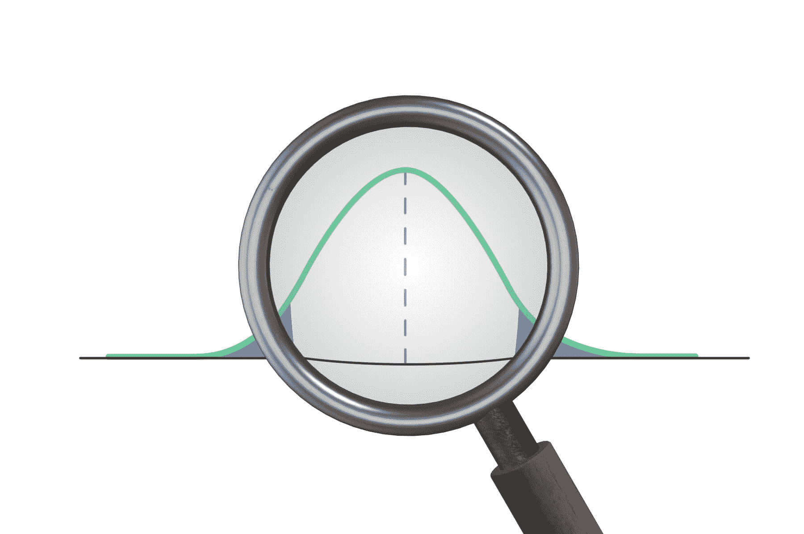

# 统计学新课程:R 中的假设检验

> 原文：<https://www.dataquest.io/blog/hypothesis-testing-in-r/>

November 5, 2019

能够确定统计显著性是数据科学中最重要的技能之一。例如，如果您观察到数据中的趋势，它在统计上有意义吗，或者只是数据中的一些随机噪声？能够构建一个有用的假设并通过假设检验对其进行评估是至关重要的。

这就是为什么我们很兴奋地宣布我们的 [R 数据分析师途径](https://www.dataquest.io/path/data-analyst-r/)的最新成员:R 中的**假设检验**

准备好开始学习了吗？单击下面的按钮深入研究 R 中的假设检验，或者向下滚动以了解关于这门新课程的更多信息。

[R 中的假设检验](https://www.dataquest.io/course/hypothesis-testing-r/)

## R 中的假设检验是什么？

本课程旨在帮助您对重要的统计学概念(如显著性检验)有一个实用的理解，并带您实践 A/B 检验、卡方检验等。

很像我们的 [Python 假设检验课程](https://www.dataquest.io/course/probability-statistics-intermediate/)，R 中的*假设检验要求你写代码，分析真实世界的数据(包括来自[游戏节目 *Jeopardy 的数据！*](https://en.wikipedia.org/wiki/Jeopardy!) )当你学会如何科学地检验假设。*

它从关注统计显著性开始，当您开始使用编码技能挖掘数据时，您将学习像 p 值和表示分布这样的重要概念。然后，课程进入[卡方检验](https://en.wikipedia.org/wiki/Chi-squared_test)，这使我们能够科学地量化观察到的和预期的分类值之间的差异。

您将了解多类别卡方测试，然后深入研究一个新的指导性项目，该项目将挑战您应用您所获得的编程技能和统计知识来提出一个获胜的 *Jeopardy！*策略。

您将分析长期电视智力竞赛节目中的问题来寻找模式。然后，您将应用假设检验技巧和卡方检验的新知识来确定哪些模式是有意义的。

本课程结束时，您将对假设检验有一个深刻的理解，并且将有在真实数据科学场景中应用显著性和卡方检验等检验的经验。

## 为什么学这个？

假设检验对于在分析数据时能够区分信号和噪声至关重要。确定一个结果是否具有统计显著性有助于您知道何时可以从您找到的模式中得出结论。

对于任何打算从事数据分析或数据科学工作的人来说，让您的分析具有这种程度的统计严谨性尤为重要。公司渴望成为数据驱动型企业，并将向他们的数据团队寻求指导。如果你*不*明白你的哪些结果是真正重要的，你可能最终会把你的公司引向错误的方向。

假设检验为数据分析提供了坚实的科学和统计基础。没有这个基础，你通常不可能评估你是否在数据中发现了一个有意义的模式。

立即开始学习 R 中的假设检验:

[*假设检验在 R*](https://www.dataquest.io/course/hypothesis-testing-r/)

 *[*Python 中的假设检验*](https://www.dataquest.io/course/probability-statistics-intermediate/)*