# 如何在 Windows 上安装 MySQL:简单指南(2022)

> 原文：<https://www.dataquest.io/blog/install-mysql-windows/>

June 30, 2022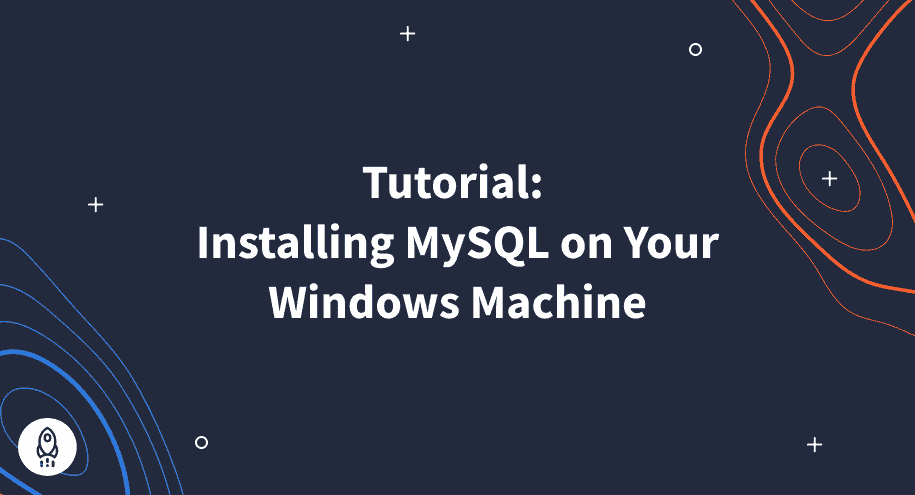

MySQL 是目前最流行的数据库管理系统(DBMS)之一。它是轻量级的、开源的、易于安装和使用，这使它成为那些开始学习和使用关系数据库的人的一个好选择。

尽管对于初学者来说这是一个很好的选择，但 MySQL 也足够健壮，可以支持更大的生产应用程序，支持多用户和多线程。

在本文中，我们将介绍在本地 Windows 机器上安装 MySQL 的过程，从下载到创建和使用第一个数据库。完成后，您将拥有一个功能完整的 MySQL 服务器，并且可以在本地使用。

## 安装过程

让我们开门见山吧。在 Windows 上安装 MySQL 是一个非常简单但漫长的过程。在本文中，我们将一步一步地介绍如何使用 MySQL 安装程序，这是数据库文档推荐的方法。

首先，你需要下载安装程序。点击[此处](https://dev.mysql.com/downloads/installer/)，选择与您的操作系统兼容的版本(32 位或 64 位)，点击 **`Download`** 。请注意，您也可以选择 web 安装程序或脱机安装程序。最后一个要重得多，而第一个下载起来会更快。

当您尝试开始下载时，网站会要求您登录或创建帐户，但您不必这样做。注意 **`No thanks, just start my download`** 按钮。

当您打开安装程序时，它将首先配置安装，然后询问用户是否允许继续:

当这一切结束时，我们将最终看到安装界面。如下图所示，该过程由四个步骤组成:

1.  选择安装类型
2.  下载文件
3.  安装软件
4.  完成安装

在第一步中有五种类型的安装可用，您可以检查侧边的框来查看每种类型将安装什么。但是，我们强烈建议您选择默认选项，尤其是如果您刚刚开始使用 SQL 的话。

此安装程序将安装的最重要的功能包括:

*   MySQL 服务器:数据库服务器本身
*   MySQL Workbench:管理服务器的应用程序
*   MySQL for Visual Studio:这个特性使用户能够从 Visual Studio 中使用 MySQL
*   文档和教程

也可以选择完全安装，因为这将安装所有可用的 MySQL 资源。

选择设置选项后，点击 **`Next`** 。

### 要求

此时，可能会要求您安装一些必需的软件，最常见的是可视代码。安装程序可以自动解决一些需求问题，但是，这里的情况并非如此:

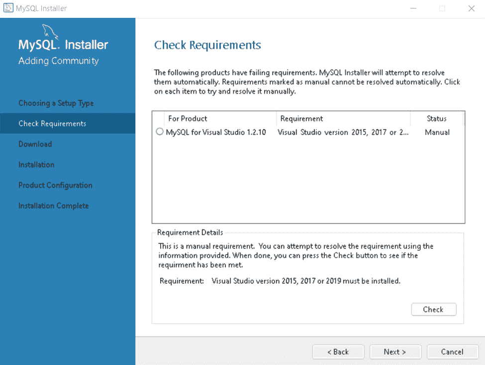
如果遇到这种情况，可以在这里找到所需版本的可视化代码[。不过，这个问题不会阻止安装的进行。](https://visualstudio.microsoft.com/pt-br/vs/older-downloads/)

### 下载和安装

您现在已经到达下载部分。该部分的名称是不言自明的:您将下载您选择的安装选项中的所有组件。

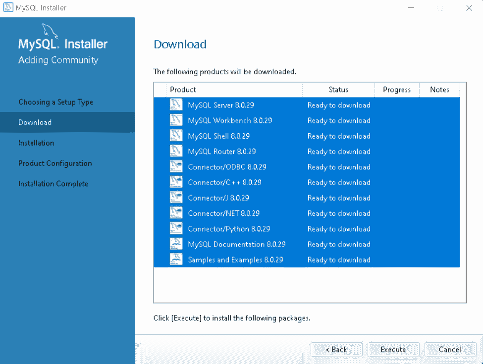
点击 **`Execute`** ，下载开始。这可能需要几分钟才能完成。

完成后，您应该会在每个项目上看到勾号。然后你可以继续。

您将看到的下一个屏幕与上一个几乎相同，但现在它将安装您刚刚下载的所有组件。这一步将比前一步花费更长的时间。

结束后，您会再次看到所有的刻度线:

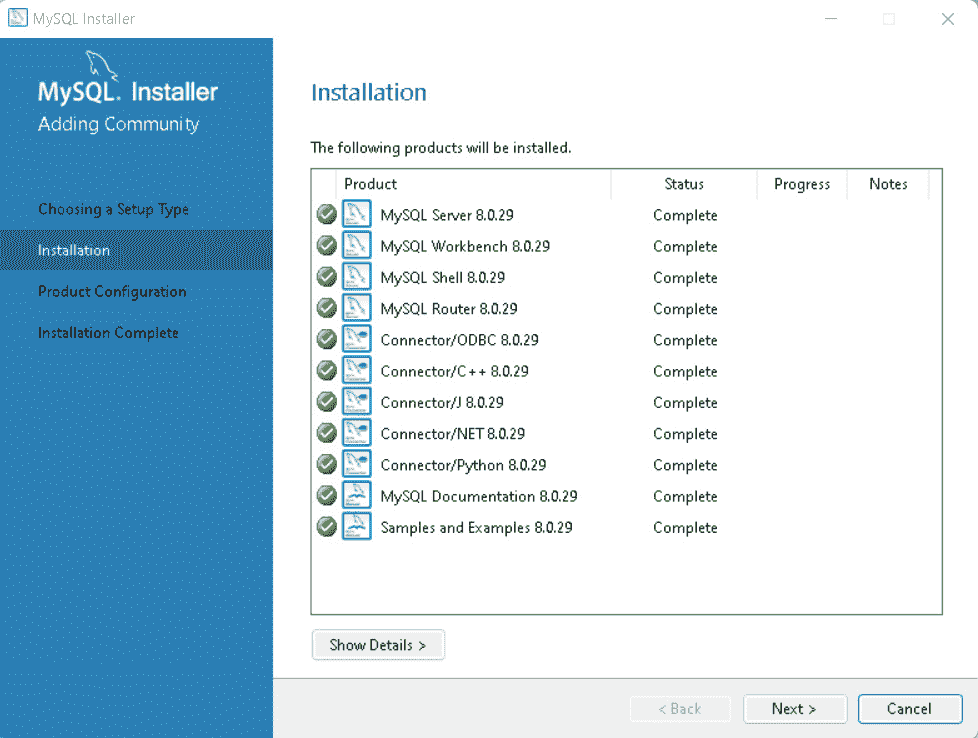

### 配置

下一步是配置服务器。您将看到以下屏幕。点击 **`Next`** 。

首先，安装程序会要求您配置网络:

在*配置类型*字段中保留*开发计算机*很重要，因为你可能会将它安装在你的个人计算机上，而不是专用机器上。您可以选择端口，但是默认端口也可以。点击 **`Next`** 。

对于身份验证方法，让我们坚持使用推荐的选项，并单击 **`Next`** :

现在该创建根账户了。您将被要求设置密码。记得用结实的。

在同一个屏幕上，您可以创建其他用户并设置他们的密码和权限。你只需点击 **`Add User`** 并填空即可。然后，点击 **`Next`** 。

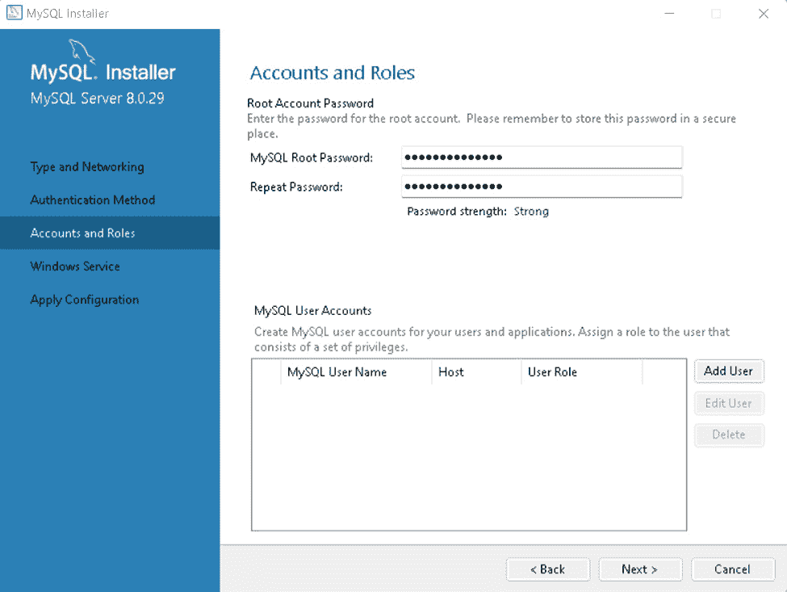
现在你可以选择 Windows 服务的详细信息，比如服务名、账号类型，以及开机时是否要启动 MySQL。同样，默认选项在大多数情况下都有效:

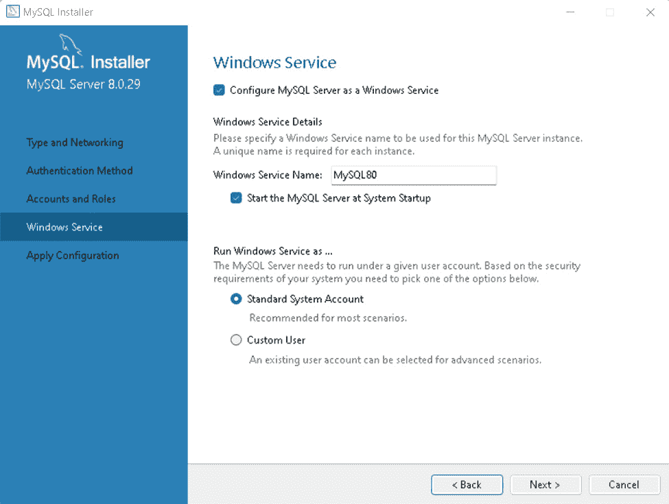
下一个屏幕应用配置。执行它。这一步也需要一段时间才能完成。

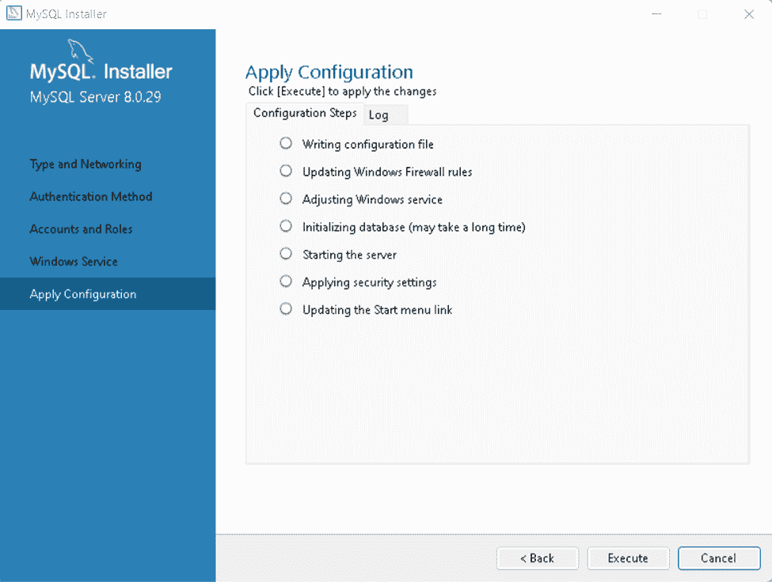
结束后，就完成这个过程。

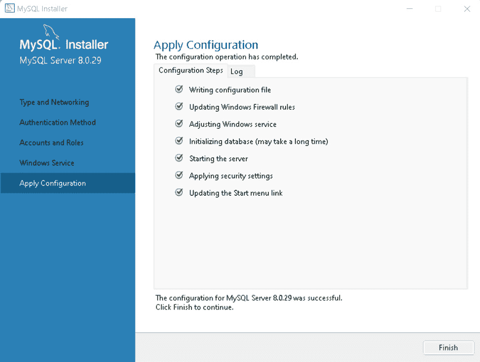

### 最后的步骤

我们快到了！下一步是连接到服务器。键入 root 帐户的密码，然后点击**检查**。您将看到*连接成功*状态:

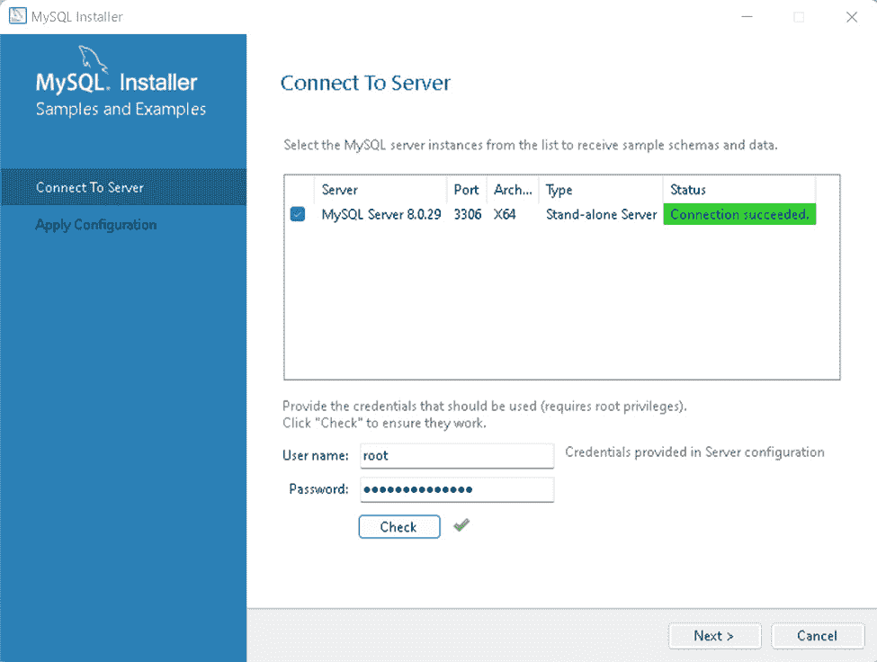
该屏幕之后是另一个要求应用配置的屏幕。执行后点击 **`Finish`** 即可。

我们终于到达了最后一个屏幕。

在这里，您可以选择是否启动工作台和 Shell，并查看文档或其他示例。

## 使用 MySQL Workbench 创建第一个数据库

如果您选择在完成安装后启动工作台，您将看到以下屏幕:

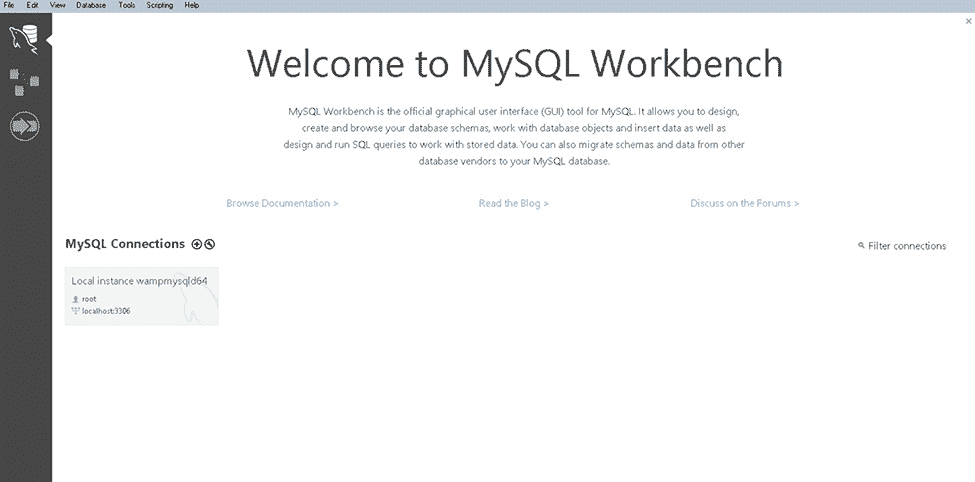
选择与您创建的服务器的连接并登录。

这是你的工作空间:

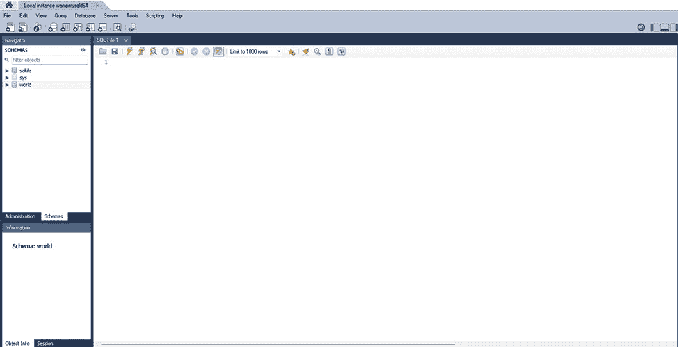
注意在 **`SCHEMAS`** 窗口中，您已经有了几个可以使用的样本数据库。在 **`Information`** 窗口中，可以看到您选择的数据库。当然，您拥有编写 SQL 代码的主窗口。

使用此窗口运行以下命令创建您的第一个数据库:

`CREATE DATABASE my_first_database`

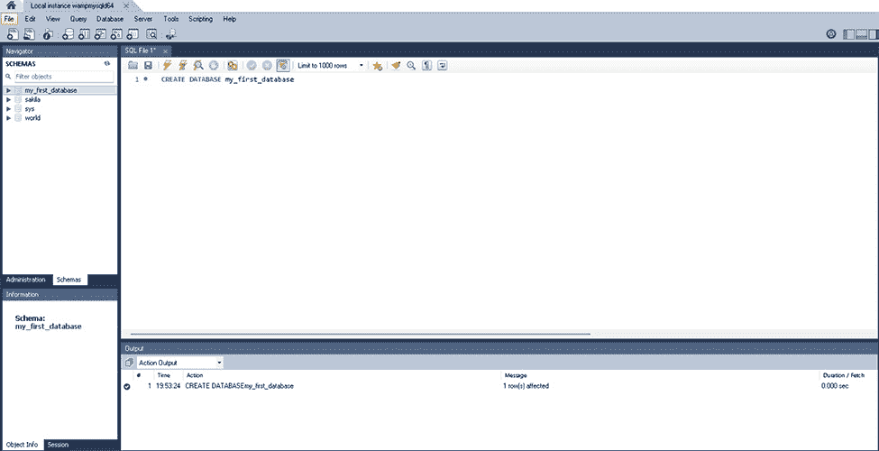
使用闪电图标运行命令，然后点击 **`SCHEMAS`** 窗口中的 **`Refresh`** 按钮。新的数据库应该在那里。

注意在 **`Output`** 窗口中有一条消息显示该命令被成功执行。

现在，您将拥有一个功能齐全的数据库。您可以开始创建表格、插入数据和构建自己的应用程序。

## 摘要

MySQL 不仅对于学习关系数据库和 SQL 的人来说是一个非常有用的工具，对于创建真实世界的生产级应用程序来说也是如此。

在本文中，我们讨论了以下主题。

*   下载 MySQL Windows 安装程序
*   安装和配置 MySQL 服务器和工具
*   使用 MySQL Workbench 创建第一个数据库