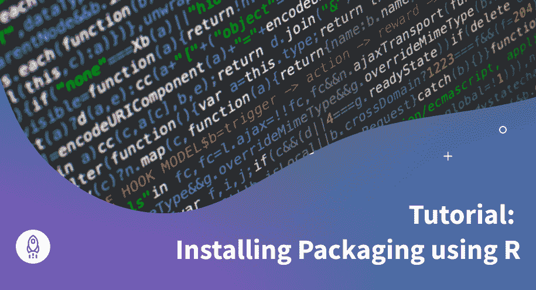

# 在 R 中安装软件包的简单方法(有 8 个代码示例)

> 原文：<https://www.dataquest.io/blog/install-package-r/>

April 13, 2022

## r 是一种强大的编程语言，有许多数据科学应用。但是在我们把它的软件包投入使用之前，我们需要安装它们。以下是方法。

r 是一种用于统计计算的编程语言，对于执行数据科学任务尤其有效。这种流行是因为 R 提供了令人印象深刻的面向数据科学的包的选择，这些包是实现 basic R 中没有的特定功能的方法的集合。

### 从 CRAN 库安装 R 包

全面的 R Archive Network ( [CRAN](https://cran.r-project.org/web/packages/available_packages_by_name.html) )存储库存储了数千个稳定的 R 包，这些包是为各种数据相关的任务而设计的。大多数情况下，您将使用这个库来安装各种 R 包。

要从 CRAN 安装 R 包，我们可以使用`install.packages()`功能:

```py
install.packages('readr')
```

这里，我们安装了用于从不同类型的文件中读取数据的 *readr* R 包:逗号分隔值(CSV)、制表符分隔值(TSV)、固定宽度文件等。确保包的名称在引号中。

我们可以用同一个函数一次安装几个 R 包。在这种情况下，我们需要首先应用`c()`函数来创建一个包含所有需要的包作为其项目的字符向量:

```py
install.packages(c('readr', 'ggplot2', 'tidyr'))
```

上面，我们已经安装了三个 R 包:已经熟悉的 *readr* 、 *ggplot2* (用于数据可视化)，以及 *tidyr* (用于数据清理)。

如果我们不确定某个数据科学任务使用哪个 R 模块，我们可以访问 [CRAN Task Views](https://cran.r-project.org/web/views/) 页面。在这里，我们找到了一个方便的任务类别(主题)列表和每个类别的简要描述。选择必要的主题，我们将打开与该类别相关的所有 R 包的页面，以及对每个包的用法的详尽描述。

在上面的两个例子中，我们只向`install.packages()`函数传递了一个参数，它实际上是`pkgs`参数的值。对于大多数情况来说，这通常就足够了。然而，这个函数有许多可选参数，在某些情况下可能有用(我们很快就会看到一些例子)。有关`install.packages()`功能用法的完整信息，包括其所有可能的参数及其详细描述，请查看 [R 文档](https://www.rdocumentation.org/packages/utils/versions/3.6.2/topics/install.packages)页面。

### 从 CRAN 库安装 R 包:替代方法

如果我们在 IDE 中使用 R，我们可以使用菜单而不是`install.packages()`函数从 CRAN 库中安装必要的模块。例如，在 R 最流行的 IDE R studio 中，我们需要完成以下步骤:

*   点击`Tools` → `Install Packages`
*   在`Install from:`槽中选择`Repository (CRAN)`
*   键入包名(或多个包名，用空格或逗号分隔)
*   默认勾选`Install dependencies`
*   点击`Install`

在使用 R 的其他 ide 中，按钮和命令的调用会有所不同，但是它们背后的逻辑是相同的，所有的步骤通常都很直观。

### 从其他来源安装 R 包

#### 从 GitHub 安装 R 包

有时，我们可能想要安装一个特定的包*而不是来自 CRAN 的*，而是来自另一个库。最常见的例子是当我们需要使用只在 GitHub 上可用的 R 模块时。在这种情况下，我们应该执行以下步骤:

*   如果 RTools 还没有安装，安装它(*否则，跳过这一步*

    *   打开[https://cran.r-project.org/](https://cran.r-project.org/)
    *   选择下载安装程序所需的操作系统(如`Download R for Windows`)
    *   选择`RTools`
    *   选择最新版本的 RTools
    *   等待下载完成
    *   默认使用所有选项运行安装程序(这里我们可能需要在第一个弹出窗口上单击`Run anyway`)
    *   对于 R (v4.0.0)的新版本，将`PATH='${RTOOLS40_HOME}\usr\bin;${PATH}'`添加到`.Renviron`文件中
*   从 CRAN 安装 *devtools* 包:

```py
install.packages('devtools')
```

运筹学

```py
install.packages('devtools', lib='~/R/lib')
```

*   Call the `install_github()` function from the *devtools* package (no need to download the whole package) using the following syntax:

    ```py
    devtools::install_github(username/repo_name[/subdir])
    ```

    例如:

```py
devtools::install_github('rstudio/shiny')
```

上述方法仅适用于**公共** GitHub 库。要从私有存储库中安装 R 包，我们需要用从[https://github.com/settings/tokens](https://github.com/settings/tokens)获得的令牌来设置`install_github()`函数的`auth_token`可选参数。有关`install_github()`功能用法的更多信息，请查阅 [R 文档](https://www.rdocumentation.org/packages/devtools/versions/1.13.6/topics/install_github)

#### 从其他外部存储库安装 R 包

如果我们需要安装一个既没有存储在 CRAN 上也没有存储在 GitHub 上，而是存储在另一个外部存储库中的包，我们必须再次使用`install.packages()`函数，这一次有两个可选参数:`repos`表示必要存储库的 URL，`dependencies`设置为`TRUE`或`FALSE`，这取决于我们是否也想安装它们。例如:

```py
install.packages('furrr', repos='http://cran.us.r-project.org', dependencies=TRUE)
```

**注意:**上面的代码使用了一个 CRAN 包作为例子，但是我们可以使用任何其他的 URL 来存储必要的模块。

当使用 Jupyter Notebook 中的 R 来安装 essentials 中没有的包时，也会用到`repos`和`dependencies`参数。

#### 从 Zip 文件安装 R 包

如果你有一个 R 包以. zip 或 tar.gz 文件的形式下载到你的本地机器上，你可以使用`install.packages()`函数来安装它，该函数传递 zip 文件的保存路径(这实际上是`pkgs`参数)，将`repos`设置为`NULL`，将`type`设置为`source`。例如:

```py
install.packages('C:/Users/User/Downloads/abc_2.1.zip', repos=NULL, type='source')
```

当 zip 文件不在我们的本地计算机上，而是直接在 CRAN 这样的存储库上时，这种方法也能很好地工作。在这种情况下，我们只需要提供相应的 URL，而不是本地路径。

或者，如果我们在 IDE 中使用 R，我们可以使用菜单而不是`install.packages()`函数从保存在本地机器上的. zip 或 tar.gz 文件中安装必要的包，就像我们之前从 CRAN 存储库中安装包一样。例如，在 RStudio 中，我们需要完成以下步骤:

*   点击`Tools` → `Install Packages`
*   在`Install from:`槽中选择`Package Archive File (.zip, .tar.gz)`
*   在本地机器上找到相应的文件，点击`Open`
*   点击`Install`

在其他使用 R 的 ide 中，过程是相似的。

### 正在加载 R 包

一旦在我们的计算机上安装了必要的包，下一步就是加载每个包来开始使用它们。虽然我们只需要安装每个包一次(例如，第一次在特定的计算机上使用 R ),但是我们必须为每个新的 R 会话加载每个包。为此，我们使用`library()`函数并传入包名，如下所示:

```py
library(readr)
```

注意，在这种情况下，我们不需要在引号中包含包名。

### 结论

在本教程中，我们讨论了在本地机器上安装各种来源的 R 包的方法，例如官方的 CRAN 资源库、公共或私有的 GitHub repos、任何其他外部资源库以及. zip 或 tar.gz 文件。此外，我们还讲述了如何为特定的数据科学问题选择必要的包，以及如何在安装后加载包以开始使用它。