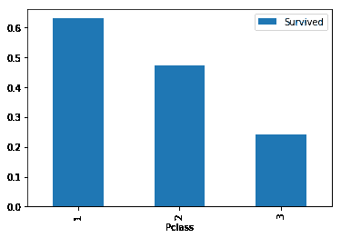
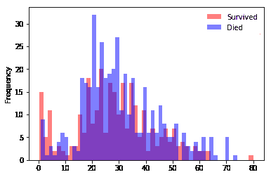
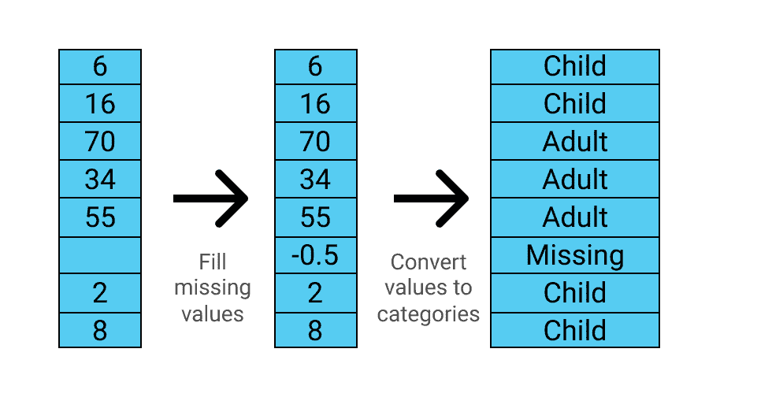
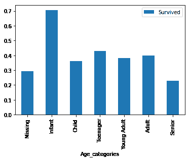

# 卡格尔基础:泰坦尼克号竞赛

> 原文：<https://www.dataquest.io/blog/kaggle-fundamentals/>

October 25, 2017

Kaggle 是一个人们创造算法并与世界各地的机器学习从业者竞争的网站。如果你的算法在一个特定的数据集上是最准确的，你就赢得了比赛。Kaggle 是一种练习机器学习技能的有趣方式。

本教程基于我们免费的四节课的一部分: [Kaggle 基础知识](https://www.dataquest.io/course/kaggle-fundamentals)。这个互动课程是有史以来对 Kaggle 的泰坦尼克号比赛最全面的介绍。这门课程包括结业证书。使用下面的按钮开始课程:

[开始免费的 Kaggle 基础课程](https://www.dataquest.io/course/kaggle-fundamentals)

在本教程中，我们将学习如何:

*   接近一场纸牌游戏比赛
*   探索比赛数据，了解比赛主题
*   为机器学习准备数据
*   训练模特
*   衡量你的模型的准确性
*   准备并制作您的第一个 Kaggle sublesson

本教程假设您对 Python 和 pandas 库有所了解。如果你需要了解这些，我们推荐我们的[熊猫教程](https://www.dataquest.io/blog/pandas-python-tutorial/)博文。

## 泰坦尼克号比赛

Kaggle 创建了许多为初学者设计的比赛。这些竞赛中最受欢迎的，也是我们将要关注的，是关于预测哪些乘客在泰坦尼克号沉没中幸存。

在这个比赛中，我们有一个关于泰坦尼克号上乘客的不同信息的数据集，我们看看是否可以用这些信息来预测那些人是否幸存。在我们开始看这个具体的比赛之前，让我们花一点时间来理解 Kaggle 比赛是如何工作的。

每场 Kaggle 比赛都有两个你将使用的关键数据文件——一个**训练**集和一个**测试**集。

训练集包含我们可以用来训练模型的数据。它有许多包含各种描述性数据的特性列，以及一列我们试图预测的目标值:在本例中是`Survival`。

测试集包含所有相同的功能列，但缺少目标值列。此外，测试集的观察值(行)通常比训练集少。


这很有用，因为我们需要尽可能多的数据来训练我们的模型。一旦我们在训练集上训练了我们的模型，我们将使用该模型对来自测试集的数据进行预测，并将这些预测提交给 Kaggle。

本次比赛中，两档分别命名为`test.csv`和`train.csv`。我们首先使用 [`pandas.read_csv()`](https://pandas.pydata.org/pandas-docs/stable/generated/pandas.read_csv.html) 库来读取这两个文件，然后检查它们的大小。

```py
 import pandas as pd
test = pd.read_csv("test.csv")
train = pd.read_csv("train.csv")
print("Dimensions of train: {}".format(train.shape))
print("Dimensions of test: {}".format(test.shape)) 
```

```py
 Dimensions of train: (891, 12)
Dimensions of test: (418, 11) 
```

## 探索数据

我们刚刚打开的文件可以在 Kaggle 上的[泰坦尼克号比赛的数据页面上找到。该页面还有一个**数据字典**，它解释了组成数据集的各个列。以下是该数据字典中包含的描述:](https://www.kaggle.com/c/titanic/data)

*   `PassengerID` —由 Kaggle 添加的列，用于标识每一行并使子分类更容易
*   `Survived` —乘客是否生还，以及我们预测的值*(0 =否，1 =是)*
*   `Pclass` —乘客购买的机票等级*(1 = 1 号，2 = 2 号，3 = 3 号)*
*   `Sex` —乘客的性别
*   `Age` —乘客的年龄，以年为单位
*   乘客在泰坦尼克号上的兄弟姐妹或配偶的数量
*   乘客在泰坦尼克号上的父母或孩子的数量
*   `Ticket` —乘客的机票号码
*   `Fare` —乘客支付的车费
*   `Cabin` —乘客的客舱号
*   `Embarked` —乘客上船的港口*(C =瑟堡，Q =皇后镇，S =南安普顿)*

Kaggle 上的数据页面有一些关于一些列的附加说明。为了对数据有一个全面的了解，详细地探究这一点总是值得的。

让我们看看`train`数据帧的前几行。

```py
train.head()
```

|  | 乘客 Id | 幸存 | Pclass | 名字 | 性 | 年龄 | SibSp | 烤 | 票 | 票价 | 小木屋 | 从事 |
| --- | --- | --- | --- | --- | --- | --- | --- | --- | --- | --- | --- | --- |
| Zero | one | Zero | three | 布劳恩，欧文·哈里斯先生 | 男性的 | Twenty-two | one | Zero | A/5 21171 | 7.2500 | 圆盘烤饼 | S |
| one | Two | one | one | 卡明斯，约翰·布莱德利夫人(佛罗伦萨布里格斯 Th… | 女性的 | Thirty-eight | one | Zero | PC 17599 | 71.2833 | C85 | C |
| Two | three | one | three | 很虚弱，小姐。借我用用 | 女性的 | Twenty-six | Zero | Zero | STON/氧气。3101282 | 7.9250 | 圆盘烤饼 | S |
| three | four | one | one | Futrelle，夫人雅克希思(莉莉可能皮) | 女性的 | Thirty-five | one | Zero | One hundred and thirteen thousand eight hundred and three | 53.1000 | C123 | S |
| four | five | Zero | three | 威廉·亨利先生，艾伦 | 男性的 | Thirty-five | Zero | Zero | Three hundred and seventy-three thousand four hundred and fifty | 8.0500 | 圆盘烤饼 | S |

我们将进行的机器学习类型被称为**分类**，因为当我们进行预测时，我们会将每个乘客分类为“幸存”与否。更具体地说，我们正在执行**二元分类**，这意味着我们正在分类的只有两种不同的状态。

在任何机器学习练习中，思考你所预测的主题是非常重要的。我们称这一步为获取领域知识，这是机器学习成功的最重要的决定因素之一。

在这种情况下，理解泰坦尼克号的灾难，特别是哪些变量可能会影响生存的结果是很重要的。任何看过电影《泰坦尼克号》的人都会记得妇女和儿童优先选择救生艇(就像他们在现实生活中一样)。你也会记得乘客的巨大阶级差异。

这表明`Age`、`Sex`和`PClass`可能是存活的良好预测因子。我们将从通过可视化数据来探索`Sex`和`Pclass`开始。

因为`Survived`列包含乘客是否幸存的`0`和乘客是否幸存的`1`，我们可以按性别对数据进行分段，并计算这一列的平均值。我们可以使用`DataFrame.pivot_table()`轻松做到这一点:

```py
 import matplotlib.pyplot as plt

sex_pivot = train.pivot_table(index="Sex",values="Survived")
sex_pivot.plot.bar()
plt.show() 
```


我们可以立即看到女性的存活率比男性高得多。让我们对`Pclass`列做同样的操作。

```py
 class_pivot = train.pivot_table(index="Pclass",values="Survived")
class_pivot.plot.bar()
plt.show() 
```



## 浏览和转换年龄列

`Sex`和`PClass`列是我们所说的**分类**特征。这意味着这些值代表几个独立的选项(例如，乘客是男是女)。

让我们用 [`Series.describe()`](https://pandas.pydata.org/pandas-docs/stable/generated/pandas.Series.describe.html) 来看看`Age`栏。

```py
train["Age"].describe()
```

```py
 count    714.000000
mean      29.699118
std       14.526497
min        0.420000
25%       20.125000
50%       28.000000
75%       38.000000
max       80.000000
Name: Age, dtype: float64
```

`Age`列包含从`0.42`到`80.0`的数字(如果你查看 Kaggle 的数据页面，它会通知我们，如果乘客少于 1，则`Age`是小数)。这里要注意的另一件事是，该列中有 714 个值，少于我们在本课前面发现的`train`数据集的 814 行，这表明我们有一些丢失的值。

所有这些都意味着需要稍微不同地对待`Age`列，因为这是一个连续的数字列。查看连续数值集中值的分布的一种方法是使用直方图。我们可以创建两个直方图来直观地比较不同年龄范围内的幸存者和死亡者:

```py
 survived = train[train["Survived"] == 1]
died = train[train["Survived"] == 0]
survived["Age"].plot.hist(alpha=0.5,color='red',bins=50)
died["Age"].plot.hist(alpha=0.5,color='blue',bins=50)
plt.legend(['Survived','Died'])
plt.show() 
```



这里的关系并不简单，但我们可以看到，在一些年龄范围内，有更多的乘客幸存下来——红柱高于蓝柱。

为了让这一点对我们的机器学习模型有用，我们可以通过将这一连续特征划分为多个范围，将其分离为一个分类特征。我们可以使用 [`pandas.cut()`函数](https://pandas.pydata.org/pandas-docs/stable/generated/pandas.cut.html)来帮助我们。

`pandas.cut()`函数有两个必需的参数——我们希望剪切的列，以及定义剪切边界的数字列表。我们还将使用可选参数`labels`，该参数为生成的 bin 获取一个标签列表。这将使我们更容易理解我们的结果。

在修改本专栏之前，我们必须了解两件事。首先，我们对`train`数据进行的任何更改，我们也需要对`test`数据进行更改，否则我们将无法使用我们的模型对我们的子契约进行预测。其次，我们需要记住处理我们上面观察到的缺失值。

我们将创建一个函数:

*   使用 [`pandas.fillna()`方法](https://pandas.pydata.org/pandas-docs/stable/generated/pandas.Series.fillna.html)用`-0.5`填充所有缺失的值
*   将`Age`列切割成六段:
    *   `Missing`，从`-1`到`0`
    *   `Infant`，从`0`到`5`
    *   `Child`，从`5`到`12`
    *   `Teenager`，从`12`到`18`
    *   `Young Adult`，从`18`到`35`
    *   `Adult`，从`35`到`60`
    *   `Senior`，从`60`到`100`

然后我们将在`train`和`test`数据帧上使用该函数。

下图显示了该函数如何转换数据:



注意，`cut_points`列表比`label_names`列表多了一个元素，因为它需要定义最后一段的上边界。

```py
 def process_age(df,cut_points,label_names):
    df["Age"] = df["Age"].fillna(-0.5)
    df["Age_categories"] = pd.cut(df["Age"],cut_points,labels=label_names)
    return df

cut_points = [-1,0,5,12,18,35,60,100]
label_names = ["Missing","Infant","Child","Teenager","Young Adult","Adult","Senior"]
train = process_age(train,cut_points,label_names)
test = process_age(test,cut_points,label_names)

pivot = train.pivot_table(index="Age_categories",values='Survived')
pivot.plot.bar()
plt.show() 
```



## 为机器学习准备数据

到目前为止，我们已经确定了可能对预测存活率有用的三列:

*   `Sex`
*   `Pclass`
*   `Age`，或者更确切地说是我们新创建的`Age_categories`

在我们建立模型之前，我们需要为机器学习准备这些列。大多数机器学习算法无法理解文本标签，所以我们必须将我们的值转换为数字。

此外，我们需要注意不要在没有数字关系的地方暗示任何数字关系。数据字典告诉我们，`Pclass`列中的值是`1`、`2`和`3`。我们可以用熊猫来证实这一点:

```py
train["Pclass"].value_counts()
```

```py
 3    491
1    216
2    184
Name: Pclass, dtype: int64 
```

虽然每个乘客的等级肯定具有某种有序关系，但是每个等级之间的关系与数字`1`、`2`和`3`之间的关系不同。例如，等级`2`的“价值”不是等级`1`的两倍，等级`3`的“价值”不是等级`1`的三倍。

为了消除这种关系，我们可以为`Pclass`中的每个唯一值创建虚拟列:


我们可以使用 [`pandas.get_dummies()`函数](https://pandas.pydata.org/pandas-docs/stable/generated/pandas.get_dummies.html)来生成如上图所示的列，而不是手工操作。

我们将创建一个函数来为`Pclass`列创建虚拟列，并将其添加回原始数据帧。然后，我们将对每个`Pclass`、`Sex`和`Age_categories`列的`train`和`test`数据帧应用该函数。

```py
 def create_dummies(df,column_name):
    dummies = pd.get_dummies(df[column_name],prefix=column_name)
    df = pd.concat([df,dummies],axis=1)
    return df

for column in ["Pclass","Sex","Age_categories"]:
    train = create_dummies(train,column)
    test = create_dummies(test,column)
```

## 创建我们的第一个机器学习模型

现在我们的数据已经准备好了，我们准备训练我们的第一个模型。我们将使用的第一个模型称为**逻辑回归**，这通常是您在执行分类时将训练的第一个模型。

我们将使用 [scikit-learn](https://scikit-learn.org/stable/index.html) 库，因为它有许多工具可以使机器学习变得更容易。scikit-learn 工作流程包括四个主要步骤:

*   实例化(或创建)您想要使用的特定机器学习模型
*   使模型符合训练数据
*   使用模型进行预测
*   评估预测的准确性

scikit-learn 中的每个模型都是作为一个单独的类实现的，第一步是确定我们想要创建其实例的类。在我们的例子中，我们想要使用 [LogisticRegression 类](https://scikit-learn.org/stable/modules/generated/sklearn.linear_model.LogisticRegression.html)。

我们将从前两步开始。首先，我们需要导入这个类:

```py
from sklearn.linear_model import LogisticRegression
```

接下来，我们创建一个`LogisticRegression`对象:

```py
lr = LogisticRegression()
```

最后，我们使用 [`LogisticRegression.fit()`方法](https://scikit-learn.org/stable/modules/generated/sklearn.linear_model.LogisticRegression.html#sklearn.linear_model.LogisticRegression.fit)来训练我们的模型。`.fit()`方法接受两个参数:`X`和`y`。`X`必须是我们希望训练模型的二维特征数组(如数据帧)，而`y`必须是我们目标的一维数组(如序列)，或我们希望预测的列。

```py
 columns = ['Pclass_2', 'Pclass_3', 'Sex_male']
lr.fit(train[columns], train['Survived'])
```

上面的代码适合(或训练)我们的`LogisticRegression`模型，使用三列:`Pclass_2`、`Pclass_3`和`Sex_male`。

让我们使用我们用`create_dummies()`函数创建的所有列来训练我们的模型。

```py
 from sklearn.linear_model import LogisticRegression

columns = ['Pclass_1', 'Pclass_2', 'Pclass_3', 'Sex_female', 'Sex_male',
       'Age_categories_Missing','Age_categories_Infant',
       'Age_categories_Child', 'Age_categories_Teenager',
       'Age_categories_Young Adult', 'Age_categories_Adult',
      'Age_categories_Senior']

lr = LogisticRegression()
lr.fit(train[columns], train["Survived"]) 
```

```py
LogisticRegression(C=1.0, class_weight=None, dual=False, fit_intercept=True,
          intercept_scaling=1, max_iter=100, multi_class='ovr', n_jobs=1,
          penalty='l2', random_state=None, solver='liblinear', tol=0.0001,
          verbose=0, warm_start=False)
```

## 分割我们的训练数据

恭喜你，你已经训练了你的第一个机器学习模型！我们的下一步是找出我们的模型有多精确，为了做到这一点，我们必须做一些预测。

如果你还记得之前的内容，我们确实有一个`test`数据框架，可以用来做预测。我们可以对该数据集进行预测，但是因为它没有`Survived`列，所以我们必须将它提交给 Kaggle 来确定我们的准确性。如果我们每次优化我们的模型时都必须提交来找出准确性，这将很快成为一种痛苦。

我们还可以在我们的`train`数据框架上拟合*和*预测，但是如果我们这样做，我们的模型很可能会**过度拟合**，这意味着它将表现良好，因为我们正在对我们已经训练过的相同数据进行测试，但是在新的、看不见的数据上表现差得多。

相反，我们可以将`train`数据帧一分为二:

*   一部分用来训练我们的模型(通常是 80%的观察值)
*   一部分用于预测和测试我们的模型(通常占观察值的 20%)

机器学习中的约定是把这两部分叫做`train`和`test`。这可能会变得令人困惑，因为我们已经有了我们的`test`数据框架，我们最终将使用它来进行预测并提交给 Kaggle。为了避免混淆，从现在开始，我们将把这种 Kaggle“测试”数据称为**保持**数据，这是对用于最终预测的这类数据的技术名称。

scikit-learn 库有一个方便的 [`model_selection.train_test_split()`函数](https://scikit-learn.org/stable/modules/generated/sklearn.model_selection.train_test_split.html)，我们可以用它来拆分我们的数据。`train_test_split()`接受两个参数，`X`和`y`，它们包含我们想要训练和测试的所有数据，并返回四个对象:`train_X`、`train_y`、`test_X`、`test_y`:


您会注意到我们使用了一些额外的参数:`test_size`，它让我们控制我们的数据被分割成什么比例，以及`random_state`。`train_test_split()`函数在划分观察值之前将它们随机化，设置一个[随机种子](https://en.wikipedia.org/wiki/Random_seed)意味着我们的结果将是可重复的，所以你可以跟着做，得到和我们一样的结果。

```py
 holdout = test # from now on we will refer to this
               # dataframe as the holdout data

from sklearn.model_selection import train_test_split

all_X = train[columns]
all_y = train['Survived']

train_X, test_X, train_y, test_y = train_test_split(
    all_X, all_y, test_size=0.20,random_state=0)
```

## 做出预测并测量其准确性

现在我们已经将数据分为训练集和测试集，我们可以在训练集上再次拟合我们的模型，然后使用该模型在测试集上进行预测。

一旦我们拟合了我们的模型，我们可以使用 [`LogisticRegression.predict()`方法](https://scikit-learn.org/stable/modules/generated/sklearn.linear_model.LogisticRegression.html#sklearn.linear_model.LogisticRegression.predict)进行预测。

`predict()`方法采用单个参数`X`，这是我们希望预测的观测值的二维特征数组。`X`必须具有与我们用来拟合模型的阵列完全相同的特征。该方法返回预测的一维数组。

```py
 lr = LogisticRegression()
lr.fit(train_X, train_y)
predictions = lr.predict(test_X)
```

有多种方法可以衡量机器学习模型的准确性，但当参加 Kaggle 比赛时，你需要确保使用 Kaggle 用于计算特定比赛准确性的相同方法。

在这种情况下，[ka ggle](https://www.kaggle.com/c/titanic#evaluation)上泰坦尼克号比赛的评估部分告诉我们，我们的分数计算为“正确预测的乘客百分比”。到目前为止，这是二进制分类最常见的精度形式。

作为一个例子，假设我们正在预测一个由五个观察值组成的小数据集。

| 我们模型的预测 | 实际价值 | 正确的 |
| --- | --- | --- |
| Zero | Zero | 是 |
| one | Zero | 不 |
| Zero | one | 不 |
| one | one | 是 |
| one | one | 是 |

在这种情况下，我们的模型正确预测了五个值中的三个，因此基于该预测集的准确性将为 60%。

同样，scikit-learn 有一个方便的函数，我们可以使用它来计算精度: [`metrics.accuracy_score()`](https://scikit-learn.org/stable/modules/generated/sklearn.metrics.accuracy_score.html) 。该函数接受两个参数，`y_true`和`y_pred`，它们分别是实际值和我们的预测值，并返回我们的准确度分数。

```py
 from sklearn.metrics import accuracy_score
accuracy = accuracy_score(test_y, predictions)
```

让我们把所有这些步骤放在一起，得到我们的第一个准确度分数。

```py
 from sklearn.metrics import accuracy_score
lr = LogisticRegression()
lr.fit(train_X, train_y)
predictions = lr.predict(test_X)
accuracy = accuracy_score(test_y, predictions)
print(accuracy) 
```

```py
0.810055865922
```

## 使用交叉验证进行更精确的误差测量

我们的模型在对 20%的测试集进行测试时，准确率为 81.0%。考虑到这个数据集非常小，我们的模型很有可能过度拟合，在完全看不到的数据上表现不佳。

为了让我们更好地了解我们模型的真实性能，我们可以使用一种称为**交叉验证**的技术，在我们数据的不同分割上训练和测试我们的模型，然后平均准确度分数。


交叉验证最常见的形式，也是我们将要使用的形式，叫做 **k 倍**交叉验证。“折叠”是指我们训练模型的每个不同的迭代，“k”只是指折叠的次数。在上图中，我们展示了 k 倍验证，其中 k 为 5。

我们将使用 scikit-learn 的 [`model_selection.cross_val_score()`函数](https://scikit-learn.org/stable/modules/generated/sklearn.model_selection.cross_val_score.html#sklearn.model_selection.cross_val_score)来自动化这个过程。`cross_val_score()`的基本语法是:

```py
cross_val_score(estimator, X, y, cv=None)
```

*   `estimator`是一个 scikit-learn 估计器对象，就像我们一直在创建的`LogisticRegression()`对象一样。
*   `X`是我们数据集中的所有特征。
*   `y`是目标变量。
*   `cv`指定折叠的次数。

该函数返回每个折叠的准确度分数的 numpy 数组。值得注意的是，`cross_val_score()`函数可以使用多种交叉验证技术和评分类型，但是它默认为我们的输入类型提供 k 倍验证和准确性评分。

在计算产生的
分数的平均值之前，我们将使用`model_selection.cross_val_score()`对我们的数据进行交叉验证:

```py
 from sklearn.model_selection import cross_val_score

lr = LogisticRegression()
scores = cross_val_score(lr, all_X, all_y, cv=10)
scores.sort()
accuracy = scores.mean()

print(scores)
print(accuracy) 
```

```py
 [ 0.76404494  0.76404494  0.7752809   0.78651685  0.8         0.80681818  0.80898876  0.81111111  0.83146067  0.87640449]
0.802467086596
```

## 根据看不见的数据做出预测

从我们的 k-fold 验证结果中，您可以看到准确性数字随着每个折叠而变化，范围在 76.4%和 87.6%之间。这说明了为什么交叉验证很重要。

碰巧的是，我们的平均准确率为 80.2%，这与我们从简单的训练/测试分割中获得的 81.0%相差不远；然而，情况并不总是这样，您应该总是使用交叉验证来确保您从模型中获得的误差度量是准确的。

我们现在准备使用我们建立的模型来训练我们的最终模型，然后根据我们看不见的坚持数据，或 Kaggle 所谓的“测试”数据集进行预测。

```py
 lr = LogisticRegression()
lr.fit(all_X,all_y)
holdout_predictions = lr.predict(holdout[columns]) 
```

## 创建子文件夹文件

我们需要做的最后一件事是创建一个 sublesson 文件。每个 Kaggle 竞赛对 sublesson 文件的要求可能略有不同。以下是[泰坦尼克号竞赛评估页面](https://www.kaggle.com/c/titanic#evaluation)上的具体内容:

> 您应该提交一个包含 418 个条目和一个标题行的 csv 文件。如果您有额外的列(超出 PassengerId 和 Survived)或行，您的子分类将显示错误。
> 
> 该文件应该正好有两列:
> 
> *   PassengerId(按任意顺序排序)
> *   存活(包含您的二元预测:1 表示存活，0 表示死亡)

下表以一种稍微容易理解的格式显示了这一点，因此我们可以想象我们的目标是什么。

| 乘客 Id | 幸存 |
| --- | --- |
| Eight hundred and ninety-two | Zero |
| Eight hundred and ninety-three | one |
| Eight hundred and ninety-four | Zero |

我们需要创建一个新的数据框架，它包含我们在前面的屏幕中创建的`holdout_predictions`和来自`holdout`数据框架的`PassengerId`列。我们不需要担心匹配数据的问题，因为这两个数据都保持原来的顺序。

为此，我们可以将字典传递给 [`pandas.DataFrame()`函数](https://pandas.pydata.org/pandas-docs/stable/generated/pandas.DataFrame.html):

```py
 holdout_ids = holdout["PassengerId"]
sublesson_df = {"PassengerId": holdout_ids,
                 "Survived": holdout_predictions}
sublesson = pd.DataFrame(sublesson_df)
```

最后，我们将使用 [`DataFrame.to_csv()`方法](https://pandas.pydata.org/pandas-docs/stable/generated/pandas.DataFrame.to_csv.html)将数据帧保存到一个 CSV 文件。我们需要确保将`index`参数设置为`False`，否则我们将在 CSV 中添加一个额外的列。

```py
sublesson.to_csv("sublesson.csv",index=False)
```

## 我们第一次转租给卡格尔

你可以从我们的[免费 Kaggle 基础课程](https://www.dataquest.io/course/kaggle-fundamentals)中下载上面创建的 sublesson 文件。在自己的电脑上工作时，它会和你的笔记本在同一个目录下。

现在我们已经有了我们的子订阅文件，我们可以通过点击[竞赛页面](https://www.kaggle.com/c/titanic)上的蓝色“提交预测”按钮开始我们的子订阅。


然后会提示您上传您的 CSV 文件，并添加您的分包商的简要说明。当你进行转租时，Kaggle 会处理你的预测，并给出你的拒绝数据和排名的准确性。处理完成后，您将看到我们的第一个 sublesson 获得了 0.75598 的准确度分数，即 75.6%。

与我们通过交叉验证获得的 80.2%的准确率相比，我们对维持数据的准确率为 75.6%，这一事实表明我们的模型对我们的训练数据略有过度拟合。

在撰写本文时，75.6%的准确率给出了 7，954 中的 6，663。在第一次转租后，很容易看到 Kaggle 排行榜并感到气馁，但请记住，这只是一个起点。

看到泰坦尼克排行榜第一的一小部分分数是 100%，认为自己任重道远，这也是很常见的。事实上，任何在这场比赛中得分 90%的人都有可能作弊(很容易在网上找到抵制者的名字，看看他们是否幸存)。

Kaggle 上有一个很好的分析，[我的分数如何](https://www.kaggle.com/pliptor/how-am-i-doing-with-my-score/notebook)，它使用了一些不同的策略，并建议这场比赛的最低分数为 62.7%(假设每个乘客都死了)，最高分数约为 82%。我们正处于最小值和最大值的中间，这是一个很好的起点。

## 继续了解 Kaggle

我们可以做很多事情来提高模型的准确性。以下是你将在剩下的 [Kaggle 基础课程](https://www.dataquest.io/course/kaggle-fundamentals)中学到的一些东西:

*   特征准备、选择和工程
    *   如何确定模型中哪些要素与您的预测最相关
    *   减少用于训练模型的特征数量并避免过度拟合的方法
    *   创建新要素以提高模型精度的技术
*   模型选择和调整
    *   k-最近邻和随机森林算法的工作原理
    *   关于超参数，以及如何选择给出最佳预测的超参数
    *   如何比较不同的算法来提高预测的准确性
*   创建 Kaggle 工作流
    *   如何使用木星笔记本，同时与 kaggle 竞争
    *   为什么工作流对于机器学习和创建 Kaggle 工作流很重要
    *   如何使用函数来自动化和简化重复性的机器学习任务

[开始免费的 Kaggle 基础课程](https://www.dataquest.io/course/kaggle-fundamentals)