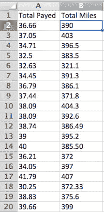
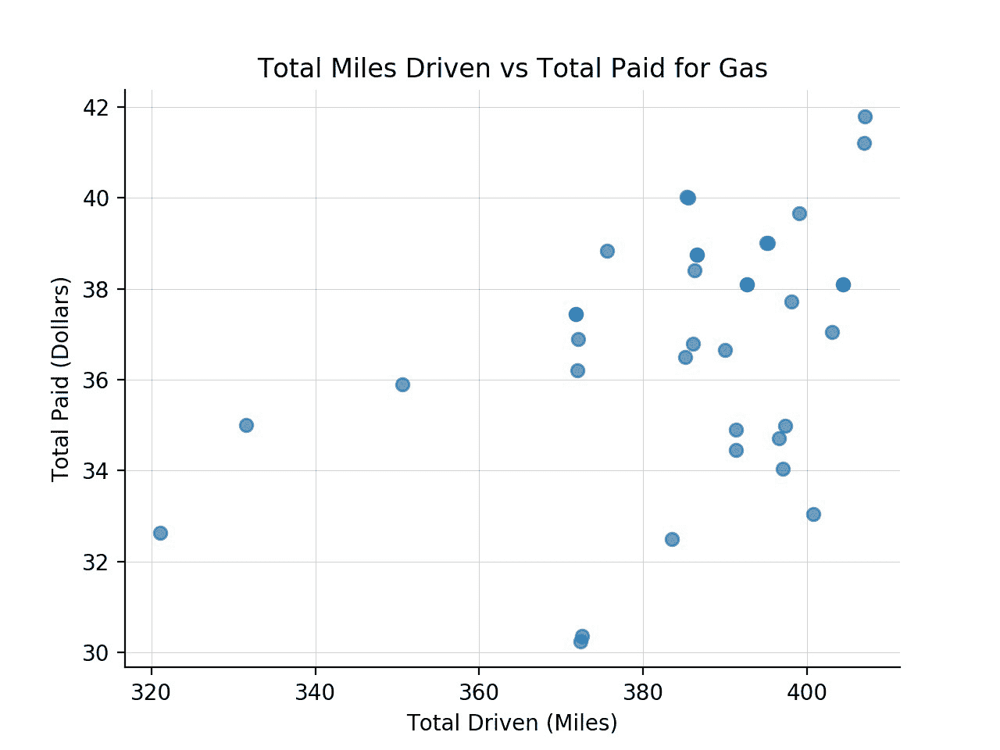
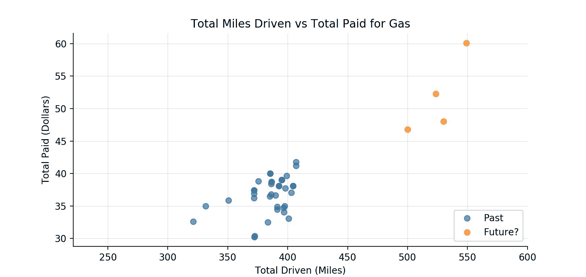
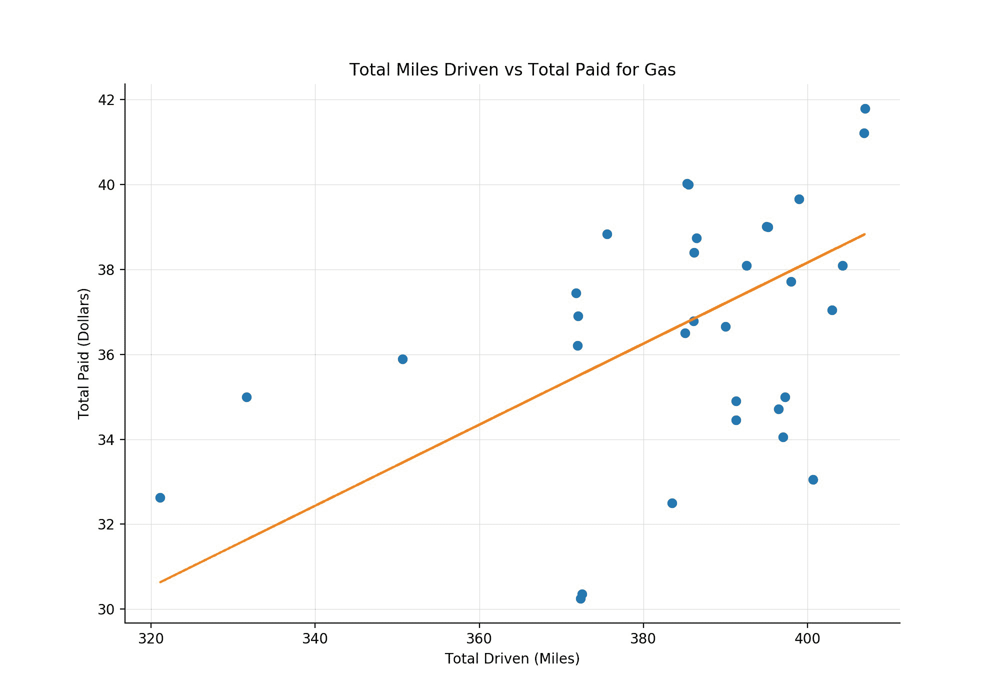
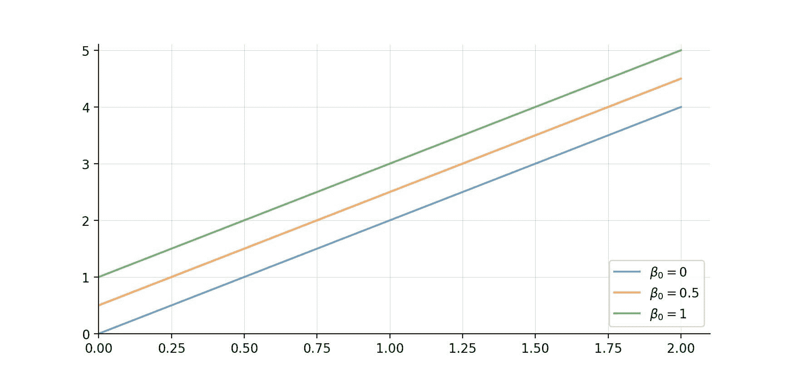
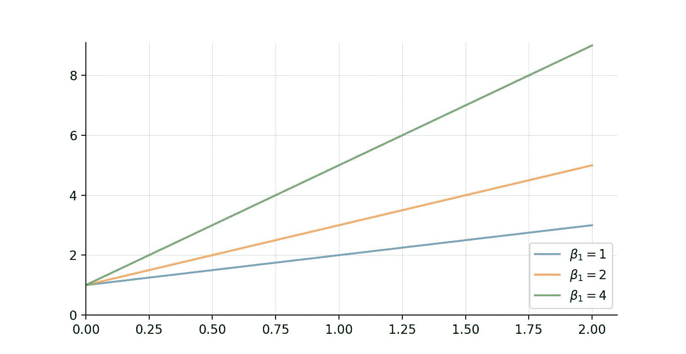
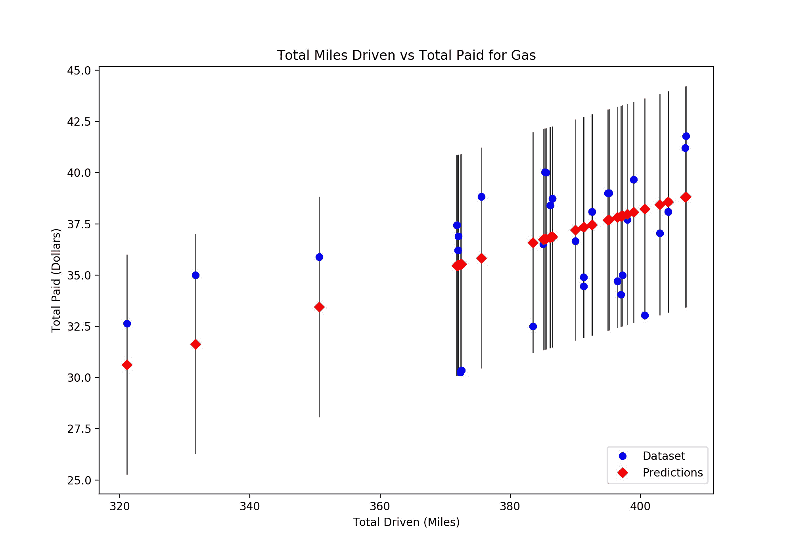

# 现实生活中的线性回归

> 原文：<https://www.dataquest.io/blog/linear-regression-in-real-life/>

November 5, 2018

*这篇文章是由[卡罗莱纳便当](https://twitter.com/carolinabento)写的。她领导数据分析团队，帮助公司做出数据驱动的决策，目前在 eero 管理产品分析团队。这篇文章最初发布在[媒体](https://towardsdatascience.com/linear-regression-in-real-life-4a78d7159f16)上，并被 perlesson 转载。*

我们在学校里学到了很多有趣和有用的概念，但有时我们并不清楚如何在现实生活中运用它们。

一个可能被广泛低估的概念/工具是**线性回归**。

*(你也可能对一个相关的话题感兴趣:[回归 vs 相关性](https://learn.g2.com/correlation-vs-regression))。*

假设你正计划和你的两个好朋友去拉斯维加斯旅行。你从旧金山出发，知道要开大约 9 个小时的车。你的朋友负责聚会的运作，而你负责所有相关的后勤工作。你必须计划好每一个细节:时间表，什么时候停下来，在哪里，确保你准时到达那里…

那么，你做的第一件事是什么？你悄悄地从地球上消失，不再回你朋友的电话，因为他们会在你当派对警察的时候玩得很开心？！不，你给自己一张白纸，开始计划吧！

你清单上的第一项是什么？**预算！**这是一次 9 小时(约 1200 英里)的有趣旅程，所以路上总共有 18 小时。后续问题:*我应该花多少钱买汽油？*

这是一个非常重要的问题。你不会想在高速公路中间停下来，可能只是因为没油而走了几英里！

## 你应该为汽油拨多少钱？

你带着以科学为导向的心态来处理这个问题，认为必须有一种方法根据你旅行的距离来估计所需的钱数。

首先，你看一些数据。

在过去的一年里，你一直在努力跟踪你的汽车的效率——因为谁没有呢！—所以在你电脑的某个地方有这个电子表格

在这一点上，这些只是数字。从这个电子表格中获取任何有价值的信息都不太容易。

然而，像这样绘图，很明显，在没有加满油箱的情况下，你能开多远之间有某种“联系”。不是说你以前不知道，但是现在有了数据，事情就变得很清楚了。

你真正想弄清楚的是:**如果我开 1200 英里，我要付多少油钱？**

为了回答这个问题，你将使用到目前为止你已经收集的数据，并用它来**预测**你将花费多少。这个想法是，你可以根据过去的数据——你辛辛苦苦记录的数据点——对未来——你的拉斯维加斯之旅——进行估计性的猜测。

你最终会得到一个数学模型**来描述行驶里程和加油费用之间的关系。**

一旦这个模型被定义，你可以向它提供新的信息——你从旧金山开车到拉斯维加斯有多少英里——这个模型将**预测**你需要多少钱。

该模型将使用来自过去的**数据来了解行驶的总里程和支付的汽油总金额之间的关系。**

当呈现给它一个新的数据点时——你从旧金山开车到拉斯维加斯有多少英里——该模型将利用它从所有过去的数据中获得的知识，并提供它的最佳猜测——一个预测，即你来自未来的**数据点。**

回头看看你的数据，你会发现，通常，你在汽油上花的越多，在汽油耗尽之前你能开的时间就越长——假设汽油价格保持不变。

如果您要最好地**描述**——或“解释”——上面图中的关系，它看起来会有点像这样:

很明显，行驶里程和汽油总费用之间有一个线性关系。因为这种关系是线性的，如果你花更少/更多的钱——例如，油箱加满一半——你就能开更少/更多的里程。

因为这种关系是线性的，而且你知道从三藩市到拉斯韦加斯的车程有多长，使用**线性模型**将帮助**预测**你在汽油上的预算。

## 线性回归模型

最能描述总行驶里程和总油费之间关系的模型类型是[线性回归模型](https://en.wikipedia.org/wiki/Linear_regression#Simple_and_multiple_linear_regression)。这里有“回归”的意思，因为你试图预测的是一个数值。

这里有几个概念需要解释:

*   因变量
*   独立变量
*   拦截
*   系数

你要为汽油预算的金额取决于你要开多少英里，在这种情况下，从旧金山到拉斯维加斯。因此，为天然气支付的总费用是模型中的**因变量**。

另一方面，拉斯维加斯不会去任何地方，所以从旧金山到拉斯维加斯你需要行驶多少英里与你在加油站支付的费用**无关**-行驶英里数是模型中的**独立变量**。让我们暂时假设油价保持不变。

由于我们只处理一个独立变量，该模型可以指定为:

这是[线性组合](https://en.wikipedia.org/wiki/Linear_combination)的简单版本，其中只有一个变量。如果你想在计算中更加严谨，你也可以在这个模型中加入每桶石油的价格作为独立变量，因为它会影响天然气的价格。

模型的所有必要部分都准备好了，剩下的唯一问题是:B0、B1 和 B2 呢？

B0，读作“Beta 0”，是模型的**截距**，意味着如果每个因变量都等于零，它就是自变量取的值。你可以把它想象成一条穿过轴的原点的直线。

 *线性模型的不同截距值:y =β0+2x*

“β1”和“β2”是被调用的**系数**。模型中的每个独立变量都有一个系数。它们决定了描述模型的回归线的斜率。

如果我们以上面的例子为例，一个由 **y= Beta0 + Beta1x** 指定的模型，并使用不同的 Beta 1 值，我们得到类似的线性模型的不同系数值:y = 1 + Beta1x

这些系数解释了因变量的变化率，即当每个自变量变化一个单位时，你要支付的汽油价格。

所以，在上面蓝线的情况下，自变量 x 每改变一个单位，因变量 **y 就改变 1 倍。**

对于绿线，这种影响是因变量 x 单位变化的 4 倍。

## [普通最小二乘法](https://en.wikipedia.org/wiki/Ordinary_least_squares)

至此，我们已经讨论了线性模型，甚至对截距和系数插入不同的值进行了实验。

然而，为了计算出你去拉斯维加斯旅行要付多少油钱，我们需要一种机制来估算这些价值。

有不同的技术来估计模型的参数。其中最流行的是**普通最小二乘法(OLS)** 。

普通最小二乘法的前提是最小化模型的**残差**的平方和。即数据集中预测值和实际值之间的差异，即距离。

通过这种方式，模型计算出最佳参数，因此回归线中的每个点都尽可能地接近数据集。

在预算练习的最后，有了模型参数，你就可以输入你期望驾驶的总里程，并估计你需要为汽油分配多少。

太好了，现在你知道你应该为汽油预算 114.5 美元！

(你会注意到我们的模型中没有参数β0。在我们的用例中，有一个截距——或者当因变量等于零时有一个常数值——没有多大意义。对于这个特定的模型，我们强迫它通过原点，因为如果你不开车，你就不会花任何油钱。)

下一次，当你发现自己需要根据一系列可以用直线描述的因素来估算一个数量时——你知道你可以使用**线性回归模型**。

*这篇文章是由[卡罗莱纳便当](https://twitter.com/carolinabento)写的。她领导数据分析团队，帮助公司做出数据驱动的决策，目前在 eero 管理产品分析团队。这篇文章最初发布在[媒体](https://towardsdatascience.com/linear-regression-in-real-life-4a78d7159f16)上，并被 perlesson 转载。*