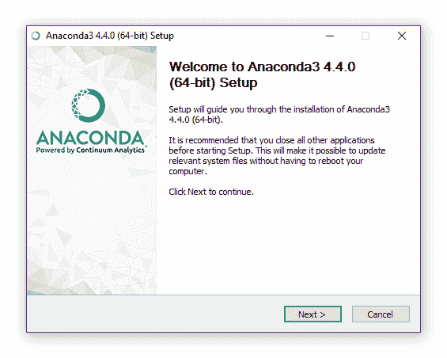
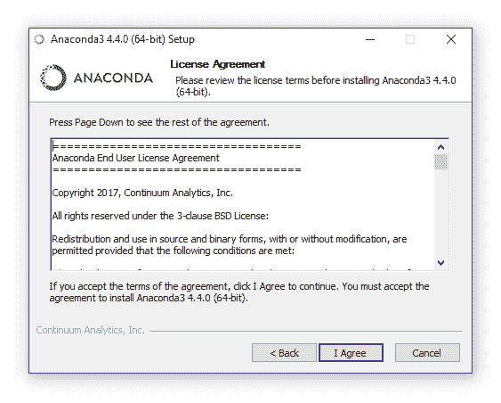
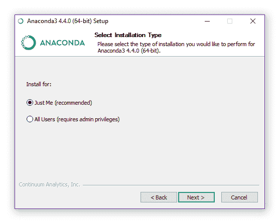
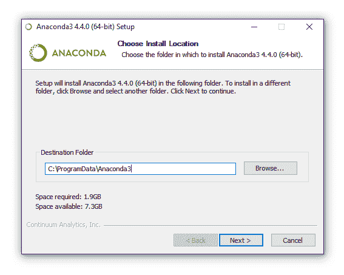
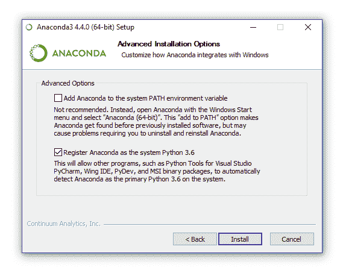
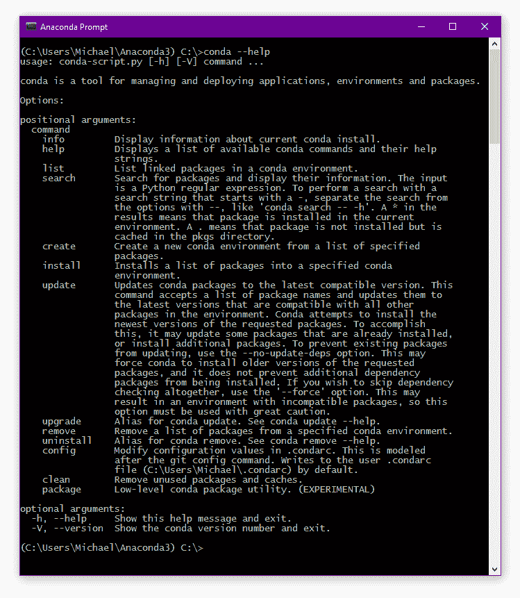

# 在 Windows 上设置 PyData 堆栈

> 原文：<https://www.dataquest.io/blog/pydata-windows/>

November 22, 2017The speed of modern electronic devices allows us to crunch large amounts of data at home. However, these devices require the right software in order to reach peak performance. Luckily, it’s now easier than ever to set up your own data science environment. One of the most popular stacks for data science is [PyData](https://www.pydata.org/), a collection of software packages within Python. Python is one of the most common languages in data science, largely thanks to its wide selection of user-made packages.  In this tutorial, we’ll show you how to set up a fully functional PyData stack on your local Windows machine. This will give you full control over your installed environment and give you a first taste of what you’ll need to know when setting up more advanced configurations in the cloud. To install the stack, we’ll be making use of [Anaconda](https://www.anaconda.com/distribution/), a popular Python distribution released by [Continuum Analytics](https://www.continuum.io/). It contains all the packages and tools to get started with data science, including Python packages and editors. 

默认情况下，Anaconda 包含 100 多个包，还有 600 多个包可以通过包含的包管理器获得。一些最著名的软件包如下:

*   NumPy:一个流行的线性代数包，极大地方便和加速了 Python 中的数值计算。
*   [SciPy](https://www.scipy.org/) :包含常用数学运算的函数，如积分、求导和数值优化，可用于 NumPy 对象。
*   [Pandas](https://pandas.pydata.org/) :构建于 NumPy 之上，可以灵活地处理带标签的数据，并提供对各种分析和可视化例程的轻松访问。
*   Scikit-learn :最流行的 Python 机器学习库，包括许多流行的模型来执行预测分析，以及数据的预处理和后处理。
*   [StatsModels](https://www.statsmodels.org/stable/index.html) :类似于 scikit-learn，旨在执行经典的描述性统计。
*   Matplotlib :一个流行的通用绘图库，包括线图、条形图和散点图。可以通过熊猫进入。
*   基于 matplotlib 的统计可视化库，包括分布图和热图的绘制。
*   [底图](https://matplotlib.org/basemap/):能够绘制地理数据(即在地图上绘制数据)的库；同样基于 matplotlib 构建。

可以在[这里](https://www.anaconda.com/products/individual)找到包含的软件包的完整列表。除了 Python 包，还包括各种桌面应用程序。其他的，比如 RStudio，只需点击一下就可以安装。当前预安装的程序有:

*   Jupyter Notebook :一个 web 服务器应用程序，允许您交互式地运行 Python，并在浏览器中可视化您的数据。
*   Jupyter Qt 控制台:类似于 jupyter notebook，允许您交互地运行 python 并可视化您的数据，但是是从命令行窗口。
*   Spyder :一个更高级的 Python 编辑器，包括交互式测试、调试和自省等特性。

## 用 Anaconda 安装 PyData 堆栈

用 Anaconda 设置 PyData 通常是一个轻松的过程。标准发行版包含最常用的软件包，几乎不需要定制配置。使用包管理器可以很容易地添加其他包。在接下来的几节中，我们将带您完成安装过程。

### 选择您的安装程序

首先，您必须从他们的[下载页面](https://www.anaconda.com/distribution/)下载适当版本的 Anaconda。安装程序适用于 Windows、macOS 和 Linux。虽然我们将重点关注 Windows 上的安装过程，但本文中的许多信息也适用于其他操作系统。不同的 Python 版本也有不同的安装程序。在本教程中，我们将使用推荐的 Python 最新版本:3.6。您还可以在 32 位和 64 位版本的发行版之间进行选择。通常建议使用 64 位，因为这将允许您使用超过 3.5 GB 的内存，这是处理大数据时通常会消耗的内存量。如果您运行的是不支持 64 位的旧计算机，您应该只下载 32 位软件包。

### 安装过程

1.  一旦安装程序被下载，只需双击运行它。安装程序将打开下图所示的窗口；点击*下一个*。



2.  将出现一个欢迎屏幕，显示 Anaconda 的许可协议。一旦你感到满意，点击*我同意*接受许可。



3.  下一个窗口将让您选择是为自己安装还是为所有用户安装。选择前者，除非您计划从同一台计算机上的其他用户帐户访问 Anaconda。做出选择后，点击*下一个*。



4.  现在您可以选择 Anaconda 的安装位置。在大多数情况下，默认路径就可以了。如果您居住在非英语国家，请确保路径不包含任何特殊字符。一旦选择了合适的路径，点击下一步的*。*



5.  下一页允许您自定义与 Windows 的集成选项。正常情况下，默认选项应该没问题。如果您有另一个 Python 版本想要保留为默认版本，那么可以取消勾选底部的复选框。第一个单选按钮修改您的全局路径；除非你知道你在做什么，否则一般不推荐选择它。最后点击*安装*，安装过程开始。



## 使用 Anaconda Navigator 探索 Anaconda

一旦安装完成，在你的开始菜单中会有一个 Anaconda 文件夹。在里面你会找到一个到 Anaconda Navigator 的快捷方式，它是一个包含在发行版中的各种软件包和功能的入口。它将允许您快速方便地管理您的包、项目和环境。更高级的配置可以通过 Anaconda 提示符来执行，这是一个命令行界面，我们将在下一节讨论。在左侧，您可以看到五个主要选项卡:主页、环境、项目、学习和社区。

### 主页

home 选项卡列出了当前通过 Anaconda 安装的应用程序。默认情况下，它们是 Jupyter Notebook、Qt Console 和 Spyder。Home 还可以让你安装可视化软件 GlueViz 数据挖掘框架 Orange 对于那些对 R 感兴趣的人，RStudio。通过每个应用程序框右上角的设置图标，可以安装、更新或删除所有应用程序。出于兼容性原因，您也可以将应用程序更改为特定版本。

### 环境

Anaconda 使您能够通过环境管理您的 Python 安装。每个环境运行一个特定的 Python 版本，包的数量有限。可以在安装过程中选择软件包的具体版本，并且可以随时将更多的软件包添加到环境中。使用环境可以减少包之间的冲突，从而让您以安全的方式运行 Python 代码。它们也可以在计算机之间传输。默认情况下，只有根环境，运行包含所有 Anaconda 包的最新 Python 版本。关于使用 Anaconda 提示符进行高级环境管理的更多细节将在本文中给出。

### 项目

您想与其他用户共享您的个人项目吗？使用 Anaconda 项目，您可以在云中共享它们，并自动化部署过程。这包括下载文件、安装软件包、设置环境变量以及在您选择的平台上运行附加文件。

### 学问

获取有用的信息是很有价值的。在此选项卡中，您可以找到各种学习资源，包括文档、视频、培训课程和网络研讨会的链接。最重要的条目是 PyData 主要软件包的参考手册。

### 社区

“社区”选项卡可帮助您拓展业务。它提供了会议等未来活动的概述，以及各种开发人员论坛和博客的链接，您可以从其他 PyData 用户那里获得帮助。最后，在右上角，您可以登录 Anaconda Cloud，用户可以在这里共享包、笔记本、项目和环境。

## 使用 Anaconda 提示符进行高级管理

虽然 Navigator 提供了良好的基本功能，但是高级包管理最好通过命令行来执行。Anaconda 提供了一个特殊的命令提示符， *Anaconda Prompt* ，它确保正确设置所有必要的环境变量。我们将关注使用`conda`命令管理环境和包。如果你想了解更多关于 Windows 命令提示符的知识，[网上有很多教程](https://www.bleepingcomputer.com/tutorials/windows-command-prompt-introduction/)。

### 康达

Python 附带了一个内置的包管理器`pip`，能够自动安装 Python 包。然而，许多科学包具有 Python 包之外的依赖性。Anaconda 自带通用的包管理器:`conda`，可以处理包含依赖项和与 Python 无关的命令的复杂安装例程。与`pip`不同，它还具有处理环境的能力，取代了传统的 virtualenv。在一个`conda`环境中，你将能够精确地定义你想要安装的包和版本。在遗留包的情况下，您甚至可以更改在环境中使用的 Python 版本。通过使用环境，您可以大大减少软件包之间发生冲突的机会，并且可以测试各种配置，而不会影响您的全局安装。您可以通过在 Anaconda 提示符下键入以下命令来了解`conda`的命令行选项:

```py
conda --help
```

这相当于:

```py
conda -h
```

这将为您提供以下输出:

如你所见，`conda`最重要的功能是管理环境和包。在接下来的几节中，我们将更详细地告诉您如何使用这些函数。注意，通过在末尾添加`-h`标志，您总是可以获得关于您想要执行的特定命令的更多信息。这将为您提供可用选项的完整概述，包括长格式和短格式。

### 康达环境

让我们首先创建一个没有任何特定包的名为 demo 的环境:

```py
conda create --name demo 
```

当要求确认时，键入`y`。
如果你想在环境中使用一个特定的 Python 版本你可以在命令中添加它:

```py
conda create --name demo python=2.7
```

这将使用 Python 2.7 创建一个环境。类似地，如果您已经想将一些包添加到环境中，您可以简单地将它们添加到行尾:

```py
conda create --name demo2 python=2.7 scikit-learn statsmodels
```

已安装的包可以在以后更改，我们将在本文的下一部分讨论。一旦创建了环境，它将出现在环境列表中。您可以使用以下任一方式访问该列表:

```py
conda info --envs
```

或者

```py
conda env list
```

这两个命令将给出相同的输出:环境的名称及其所在的路径。您当前活动的环境将标有星号。默认情况下，这将是“根”环境，对应于您的全局 Anaconda 安装。

如图所示，我们仍处于根环境中。使用 activate 命令可以切换到新的演示环境:

```py
activate demo
```

您的命令行窗口现在将在该行的开头显示环境的名称。

完成后，您可以通过输入 deactivate 离开环境。现在想象你已经完全建立了你的完美环境，但是你决定做出改变。最安全的方法是对您当前的环境进行精确克隆。让我们创建一个名为 demo2 的环境，它将是演示环境的精确克隆:

```py
conda create --name demo2 --clone demo
```

如果我们决定不再需要它，我们可以删除它:

```py
conda remove --name demo2 --all
```

您还可以备份您的环境，供自己使用或与他人共享。为此，我们需要回到环境中去。

```py
activate demo
```

然后，我们可以创建当前环境的环境文件:

```py
conda env export > demo.yml
```

可用于从文件创建一个相同的环境，如下所示:

```py
conda env create --file demo.yml
```

这在无法克隆环境的另一台计算机上尤其有用。当然，您必须确保 Anaconda 提示符位于包含您的环境文件的文件夹中。

### 管理包

现在我们已经学习了如何设置环境，让我们来看看如何在环境中管理包。我们已经看到，您可以在创建环境时提供要安装的软件包列表:

```py
conda create --name demo scikit-learn statsmodels
```

这不仅会安装软件包本身，还会安装所有的依赖项。创建环境后，您可以使用以下任一方式查看已安装的软件包:

```py
conda list
```

在环境中，或者在演示环境中:

```py
conda list --name demo
```

在 Anaconda 主提示符下。

如果你想安装一个新的软件包，你可以先搜索它。例如，如果我们想寻找巴别塔包:

```py
conda search babel
```

这将为您提供包含单词 babel 的软件包列表以及每个软件包的可用版本。

然后，您可以使用 install 命令在演示环境中安装该软件包:

```py
conda install --name demo babel
```

省略-n demo 会将它安装在当前活动的环境中。稍后，您可以使用 update 命令更新软件包:

```py
conda update --name demo babel
```

你甚至可以更新`conda`本身:

```py
conda update conda
```

如果您决定不再需要某个软件包，同样可以将其从您的环境中删除:

```py
conda remove --name demo babel
```

最后，如果您找不到您正在寻找的包(或包版本)，您会怎么做？第一个选项是检查由[Anaconda.org](https://www.anaconda.com/distribution/)提供的附加包频道。前往 Anaconda.org，使用搜索框查找您的包裹。举个例子，让我们安装 cartopy。 [Cartopy](https://scitools.org.uk/cartopy/) 是一个地理绘图包，用来替换 Anaconda 附带的不推荐使用的底图包。如果你在 Anaconda.org 上搜索，你会在康达-福吉频道找到它。可以通过运行以下命令进行安装，其中`-c`标志表示通道名称:

```py
conda install --name demo --channel conda-forge cartopy
```

然后，可以像管理任何其他包一样管理它。如果你找不到你的包裹怎么办？嗯，你可以试试其他的包管理器比如`pip`。后者实际上可以在`conda`环境中安装和使用:

```py
conda install --name demo pip
```

然后，您可以在您的环境中正常使用 pip。例如，安装谷歌深度学习库 [Tensorflow](https://www.tensorflow.org) 的 CPU 版本将需要在您的环境中运行以下`pip`命令:

```py
pip install --ignore-installed --upgrade tensorflow
```

如果`conda`和`pip`都不允许您添加所需的软件包，您将不得不查看附带的文档以获得手动安装说明。

## 下一步是什么？

现在您已经完成了本教程，您将能够使用 Anaconda 在您自己的 Windows 计算机上设置和使用 PyData 堆栈。您还可以使用图形化的 Anaconda Navigator 和从命令行使用`conda`包管理器来管理环境和包。现在您已经准备好开始编码了。寻找灵感？查看我们的[课程](https://www.dataquest.io/)和[博客](https://www.dataquest.io/blog/)中的代码样本。