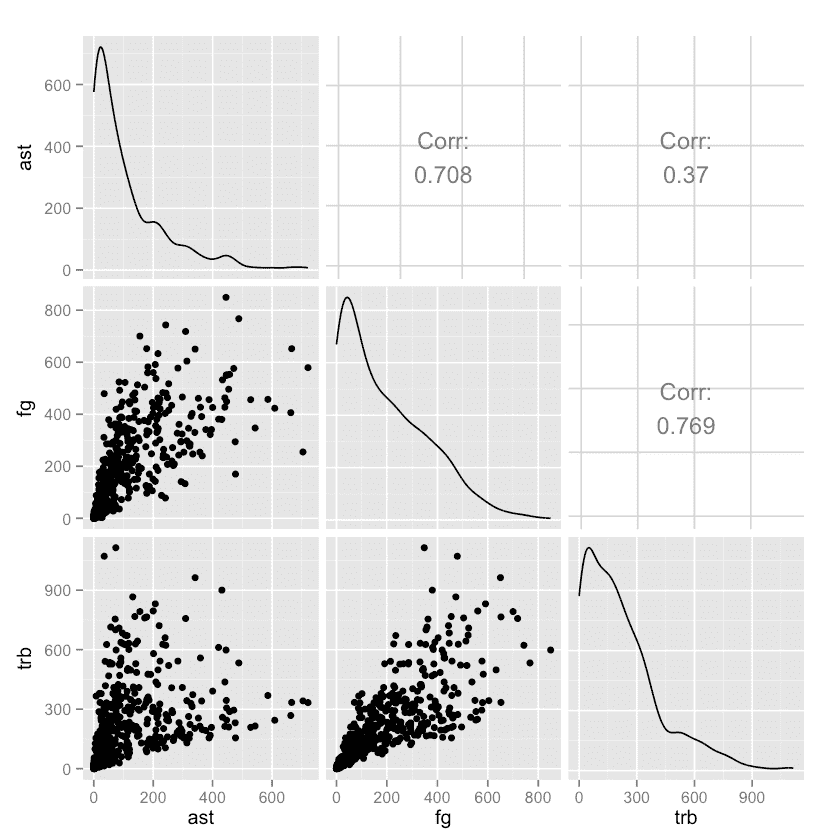
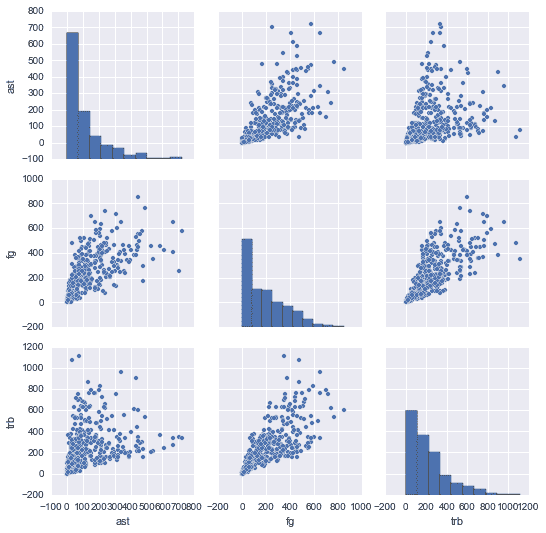
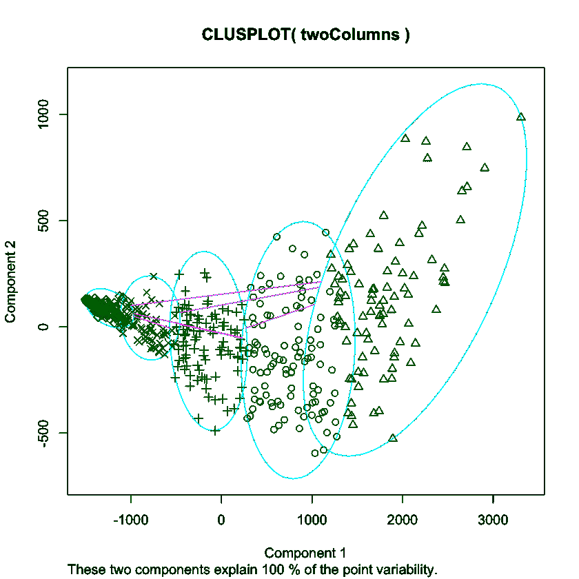
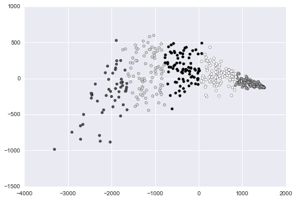

# 用于数据分析的 r 与 Python 客观的比较

> 原文：<https://www.dataquest.io/blog/python-vs-r/>

October 21, 2020


## r vs Python——观点 vs 事实

有几十篇文章从主观的、基于观点的角度比较了 R 和 Python。对于数据分析或数据科学领域的任何工作，Python 和 R 都是很好的选择。

但是如果你的目标是找出哪种语言适合你，阅读别人的意见可能没有帮助。一个人的“容易”是另一个人的“困难”，反之亦然。

在这篇文章中，我们将做一些不同的事情。我们将客观地看看这两种语言是如何处理日常数据科学任务的，这样你就可以并列地看它们，看看哪一种对你来说更好。

请记住，您不需要真正理解所有这些代码来做出判断！我们将为您提供每个任务的 R 和 Python 代码片段——只需浏览代码，并考虑哪一个对您来说更“可读”。阅读解释，看看一种语言是否比另一种更有吸引力。

好消息是什么？这里没有错误答案！如果你想学习一些处理数据的编程技巧，参加 [Python 课程](https://www.dataquest.io/course/python-for-data-science-fundamentals/)或 [R 课程](https://www.dataquest.io/path/data-analyst-r/)都是不错的选择。

## 为什么您应该信任我们

因为我们将在本文中并排展示代码，所以您真的不需要“信任”任何东西——您可以简单地查看代码并做出自己的判断。

不过，为了记录在案，在 R 与 Python 的争论中，我们不支持任何一方！这两种语言都非常适合处理数据，并且各有优缺点。我们两个都教，所以我们没有兴趣指导你选择哪一个。

## R vs Python:导入 CSV

让我们直接进入现实世界的比较，从 R 和 Python 如何处理导入 CSV 开始！

(当我们比较代码时，我们还将分析 NBA 球员的数据集以及他们在 2013-2014 赛季的表现。如果你想亲自尝试，你可以在这里下载文件。)

### 稀有

```py
library(readr)
ba <- read_csv("nba_2013.csv")
```

### 计算机编程语言

```py
import pandas
ba = pandas.read_csv("nba_2013.csv")
```

在这两种语言中，这段代码都会将包含 2013-2014 赛季 NBA 球员数据的 CSV 文件`nba_2013.csv`加载到变量`nba`中。

唯一真正的区别是，在 Python 中，我们需要导入[熊猫](https://pandas.pydata.org/)库来访问数据帧。在 R 中，虽然我们可以使用基本的 R 函数`read.csv()`导入数据，但是使用`readr`库函数`read_csv()`具有更快的速度和一致的数据类型解释的优势。

数据帧在 R 和 Python 中都可用——它们是二维数组(矩阵),其中每一列可以是不同的数据类型。你可以把它们想象成数据表或电子表格的编程版本。在这一步结束时，CSV 文件已经由两种语言加载到数据帧中。

## 查找行数

### 稀有

```py
dim(nba)
```

```py
[1] 481 31
/code>
```

### 计算机编程语言

```py
nba.shape
```

```py
(481, 31)
/code>
```

尽管语法和格式略有不同，但我们可以看到，在这两种语言中，我们可以非常容易地获得相同的信息。

上面的输出告诉我们这个数据集有 481 行和 31 列。

## 检查数据的第一行

### 稀有

```py
head(nba, 1)
```

```py
player pos age bref_team_id
 Quincy Acy SF 23 TOT[output truncated]
/code>
```

### 计算机编程语言

```py
nba.head(1)
```

```py
player pos age bref_team_id
 Quincy Acy SF 23 TOT[output truncated]
/code>
```

同样，我们可以看到，虽然有一些细微的语法差异，但这两种语言非常相似。

值得注意的是，Python 在这里更加面向对象——`head`是 dataframe 对象上的一个方法，而 R 有一个单独的`head`函数。

这是我们开始分析这些语言时会看到的一个常见主题。Python 更面向对象，R 更函数化。

如果您不理解其中的区别，请不要担心——这只是两种不同的编程方法，在处理数据的环境中，这两种方法都可以很好地工作！

## r 与 Python:寻找每个统计数据的平均值

现在让我们找出数据集中每个统计数据的平均值！

正如我们所见，这些列有类似于`fg`(射门得分)和`ast`(助攻)的名称。这些是整个赛季的统计数据，我们的数据集跟踪每一行(每一行代表一个单独的球员)。

如果你想更全面地了解这些数据，请看这里。让我们看看 R 和 Python 如何通过查找数据中每个 stat 的平均值来处理汇总统计数据:

### 稀有

```py
library(purrr)
ibrary(dplyr)
ba %>%
 select_if(is.numeric) %>%
 map_dbl(mean, na.rm = TRUE)
```

```py
player NA
os NA
ge 26.5093555093555
ref_team_id NA
output truncated]
```

### 计算机编程语言

```py
nba.mean()
```

```py
age 26.509356
 53.253638
s 25.571726
output truncated]
/code>
```

现在我们可以看到 R 和 Python 在方法上的一些主要区别。

在这两种情况下，我们都跨数据帧列应用了一个函数。在 Python 中，默认情况下，对数据帧使用 mean 方法将得到每列的平均值。

在 R 中，要复杂一点。我们可以使用两个流行包中的函数来选择我们想要平均的列，并对它们应用`mean`函数。称为“管道”的`%>%`操作符将一个函数的输出作为输入传递给下一个函数。
取字符串值的平均值(换句话说，不能被平均的文本数据)只会导致`NA` —不可用。我们可以通过使用`select_if`只取数字列的平均值。

然而，当我们取平均值时，我们确实需要忽略`NA`值(要求我们将`na.rm=TRUE`传递给`mean`函数)。如果我们不这样做，我们最终用`NA`来表示像`x3p.`这样的列的平均值。这一栏是百分之三点。有些球员没有投三分球，所以他们的命中率是缺失的。如果我们尝试 R 中的`mean`函数，我们会得到`NA`作为响应，除非我们指定`na.rm=TRUE`，这在取平均值时会忽略`NA`值。

相比之下，Python 中的`.mean()`方法已经默认忽略了这些值。

## 制作成对散点图

浏览数据集的一种常见方法是查看不同的列如何相互关联。让我们比较一下`ast`、`fg`和`trb`列。

### 稀有

```py
library(GGally)
ba %>%
elect(ast, fg, trb) %>%
gpairs()
```



### 计算机编程语言

```py
import seaborn as sns
span class="token keyword">import matplotlib.pyplot as plt
ns.pairplot(nba[["ast", "fg", "trb"]])
lt.show()
```



最后，两种语言产生了非常相似的情节。但在代码中，我们可以看到 R 数据科学生态系统有许多更小的包( [GGally](https://cran.r-project.org/web/packages/GGally/index.html) 是最常用的 R 绘图包 [ggplot2](https://ggplot2.tidyverse.org/) 的助手包)，以及更多的可视化包。

在 Python 中， [matplotlib](https://matplotlib.org/) 是主要的绘图包， [seaborn](https://seaborn.pydata.org) 是 matplotlib 上广泛使用的层。

使用 Python 中的[可视化，通常有一种主要的方法来做某事，而在 R 中，有许多包支持不同的做事方法(例如，至少有六个包可以做结对图)。](https://www.dataquest.io/path/data-analysis-and-visualization-with-python/)

同样，这两种方法都不是“更好”，但是 R 可能提供了更多的灵活性，能够挑选出最适合你的包。

## 将玩家聚集在一起

探索这类数据的另一个好方法是生成聚类图。这些将显示哪些球员最相似。

(现在，我们只是要制作集群；我们将在下一步中直观地绘制它们。)

### 稀有

```py
library(cluster)
et.seed(1)
sGoodCol <- function(col){
 sum(is.na(col)) == 0 && is.numeric(col)
span class="token punctuation">}
oodCols <- sapply(nba, isGoodCol)
lusters <- kmeans(nba[,goodCols], centers=5)
abels <- clusters$cluster
```

### 计算机编程语言

```py
from sklearn.cluster import KMeans
means_model = KMeans(n_clusters=5, random_state=1)
ood_columns = nba._get_numeric_data().dropna(axis=1)
means_model.fit(good_columns)
abels = kmeans_model.labels_
```

为了正确地进行集群，我们需要删除任何非数字列和缺少值的列(`NA`、`Nan`等)。

在 R 中，我们通过对每一列应用一个函数来做到这一点，如果该列有任何缺失值或者不是数字，就删除该列。然后，我们使用[集群](https://cran.r-project.org/web/packages/cluster/index.html)包来执行 [k 均值](https://en.wikipedia.org/wiki/K-means_clustering)，并在我们的数据中找到`5`集群。我们使用`set.seed`设置一个随机种子，以便能够重现我们的结果。

在 Python 中，我们使用主要的 Python 机器学习包 [scikit-learn](https://scikit-learn.org/) ，来拟合 k-means 聚类模型并获得我们的聚类标签。我们执行非常类似的方法来准备我们在 R 中使用的数据，除了我们使用`get_numeric_data`和`dropna`方法来删除非数字列和缺少值的列。

## 按集群绘制玩家

我们现在可以通过聚类划分玩家来发现模式。一种方法是先用 [PCA](https://en.wikipedia.org/wiki/Principal_component_analysis) 把我们的数据做成二维的，然后画出来，根据聚类关联给每个点加阴影。

### 稀有

```py
nba2d <- prcomp(nba[,goodCols], center=TRUE)
woColumns <- nba2d$x[,1:2]
lusplot(twoColumns, labels)
```



### 计算机编程语言

```py
from sklearn.decomposition import PCA
ca_2 = PCA(2)
lot_columns = pca_2.fit_transform(good_columns)
lt.scatter(x=plot_columns[:,0], y=plot_columns[:,1], c=labels)
lt.show()
```



上面，我们制作了一个数据散点图，并根据聚类对每个数据点的图标进行了着色或更改。

在 R 中，我们使用了`clusplot`函数，它是集群库的一部分。我们通过 r 中内置的`pccomp`函数执行 PCA。

对于 Python，我们使用了 scikit-learn 库中的 PCA 类。我们使用 matplotlib 来创建情节。

我们再次看到，虽然两种语言采用的方法略有不同，但最终结果和获得结果所需的代码量是非常相似的。

## 将数据分成训练集和测试集

如果我们想使用 R 或 Python 进行监督机器学习，将数据分成训练集和测试集是一个好主意，这样我们就不会[过拟合](https://en.wikipedia.org/wiki/Overfitting)。

让我们比较一下每种语言是如何处理这种常见的机器学习任务的:

### 稀有

```py
trainRowCount <- floor(0.8 * nrow(nba))
et.seed(1)
rainIndex <- sample(1:nrow(nba), trainRowCount)
rain <- nba[trainIndex,]
est <- nba[-trainIndex,]
```

### 计算机编程语言

```py
train = nba.sample(frac=0.8, random_state=1)
est = nba.loc[~nba.index.isin(train.index)]
```

对比 Python 和 R，我们可以看到 R 内置了更多的数据分析能力，像`floor`、`sample`和`set.seed`，而在 Python 中这些是通过包调用的(`math.floor`、`random.sample`、`random.seed`)。

在 Python 中，pandas 的最新版本带有一个`sample`方法，该方法返回从源数据帧中随机抽取的一定比例的行——这使得代码更加简洁。

在 R 中，有一些包可以使采样更简单，但是它们并不比使用内置的`sample`函数更简洁。在这两种情况下，我们设置了一个随机种子以使结果可重复。

## R vs Python:一元线性回归

继续常见的机器学习任务，假设我们想要从每个球员的投篮命中率预测每个球员的助攻数:

### 稀有

```py
fit <- lm(ast ~ fg, data=train)
redictions <- predict(fit, test)
```

### 计算机编程语言

```py
from sklearn.linear_model import LinearRegression
r = LinearRegression()
r.fit(train[["fg"]], train["ast"])
redictions = lr.predict(test[["fg"]])
```

Python 在我们之前的步骤中更简洁一点，但是现在 R 在这里更简洁了！

Python 的 Scikit-learn 包有一个线性回归模型，我们可以根据它进行拟合并生成预测。

r 依赖于内置的`lm`和`predict`函数。`predict`将根据传递给它的拟合模型的种类表现不同——它可以与各种拟合模型一起使用。

## 计算模型的汇总统计数据

另一个常见的机器学习任务:

### 稀有

```py
summary(fit)
```

```py
Call:
m(formula = ast ~ fg, data = train)
esiduals:Min 1Q Median 3Q Max
228.26 -35.38 -11.45 11.99 559.61
output truncated]
```

### 计算机编程语言

```py
import statsmodels.formula.api as sm
odel = sm.ols(formula='ast ~ fga', data=train)
itted = model.fit()
itted.summary()
```

```py
Dep. Variable: ast
-squared: 0.568
odel: OLS
dj. R-squared: 0.567
output truncated]
```

正如我们在上面看到的，如果我们想要得到关于拟合的统计数据，比如 [r 的平方值](https://en.wikipedia.org/wiki/Coefficient_of_determination)，我们需要在 Python 中做的比在 R 中多一点。

有了 R，我们可以使用内置的`summary`函数立即获得模型的信息。对于 Python，我们需要使用 [statsmodels](https://statsmodels.sourceforge.net/) 包，这使得许多统计方法可以在 Python 中使用。

我们得到了类似的结果，尽管一般来说用 Python 做统计分析有点困难，而且一些 R 中存在的统计方法在 Python 中并不存在。

## 符合随机森林模型

我们的线性回归在单变量的情况下工作得很好，但是假设我们怀疑数据中可能存在[非线性](https://en.wikipedia.org/wiki/Nonlinear_system)。因此，我们想拟合一个[随机森林](https://en.wikipedia.org/wiki/Random_forest)模型。

以下是我们在每种语言中的做法:

### 稀有

```py
library(randomForest)
redictorColumns <- c("age", "mp", "fg", "trb", "stl", "blk")
f <- randomForest(train[predictorColumns], train$ast, ntree=100)
redictions <- predict(rf, test[predictorColumns])
```

### 计算机编程语言

```py
from sklearn.ensemble import RandomForestRegressor
redictor_columns = ["age", "mp", "fg", "trb", "stl", "blk"]
f = RandomForestRegressor(n_estimators=100, min_samples_leaf=3)
f.fit(train[predictor_columns], train["ast"])
redictions = rf.predict(test[predictor_columns])
```

这里的主要区别是，我们需要使用 R 中的 randomForest 库来使用该算法，而这已经内置在 Python 中的 scikit-learn 中了。

Scikit-learn 有一个统一的接口，可以在 Python 中使用许多不同的机器学习算法。每个算法通常只有一个主要的实现。

在 R 中，有许多包含单个算法的更小的包，通常以不一致的方式访问它们。这导致了算法的更大多样性(许多有几个实现，有些是刚从研究实验室出来的)，但是可用性有点问题。

换句话说，Python 在这里可能更容易使用，但 R 可能更灵活。

## 计算误差

现在我们已经拟合了两个模型，让我们计算一下 R 和 Python 中的误差。我们将使用 [MSE](https://en.wikipedia.org/wiki/Mean_squared_error) 。

### 稀有

```py
mean((test["ast"] - predictions)^2)
```

```py
4573.86778567462
```

### 计算机编程语言

```py
from sklearn.metrics import mean_squared_error
an_squared_error(test["ast"], predictions)
```

```py
4166.9202475632374
```

在 Python 中，scikit-learn 库有各种我们可以使用的错误度量。在 R 中，可能有一些较小的库来计算 MSE，但是手动计算在任何一种语言中都很容易。

您可能会注意到这里的结果有一点小差异——这几乎肯定是由于参数调整造成的，没什么大不了的。

(如果您自己运行这个代码，您也可能得到稍微不同的数字，这取决于每个包的版本和您使用的语言)。

## R vs Python: Web 抓取，第 1 部分

我们有 2013-2014 年 NBA 球员的数据，但让我们通过网络搜集一些额外的数据来补充它。

为了节省时间，我们只看 NBA 总决赛的一个比分。

### 稀有

```py
library(RCurl)
rl <- "https://www.basketball-reference.com/boxscores/201506140GSW.html"
ata <- readLines(url)
```

### 计算机编程语言

```py
import requests
rl = "https://www.basketball-reference.com/boxscores/201506140GSW.html"
ata = requests.get(url).content
```

在 Python 中， [requests](https://2.python-requests.org/en/latest/) 包使得下载网页变得简单明了，所有请求类型都有一致的 API。

在 R 中， [RCurl](https://cran.r-project.org/web/packages/RCurl/index.html) 提供了一种类似的简单方法来发出请求。

两者都将网页下载到字符数据类型。

注意:这一步对于 R 中的下一步来说是不必要的，只是为了比较而显示出来。

## Web 抓取，第 2 部分

现在我们已经下载了包含 Python 和 R 的网页，我们需要解析它来提取玩家的分数。

### 稀有

```py
library(rvest)
age <- read_html(url)
able <- html_nodes(page, ".stats_table")[3]
ows <- html_nodes(table, "tr")
ells <- html_nodes(rows, "td a")
eams <- html_text(cells)
xtractRow <- function(rows, i){
 if(i == 1){
   return
 }
 row <- rows[i]
 tag <- "td"
 if(i == 2){
   tag <- "th"
 }
   items <- html_nodes(row, tag)
   html_text(items)
span class="token punctuation">}
crapeData <- function(team){
 teamData <- html_nodes(page, paste("#",team,"_basic", sep=""))
 rows <- html_nodes(teamData, "tr")
 lapply(seq_along(rows), extractRow, rows=rows)
span class="token punctuation">}
ata <- lapply(teams, scrapeData)
```

### 计算机编程语言

```py
from bs4 import BeautifulSoup
span class="token keyword">import re
oup = BeautifulSoup(data, 'html.parser')
ox_scores = []
span class="token keyword">for tag in soup.find_all(id=re.compile("[A-Z]{3,}_basic")):
   rows = []
   for i, row in enumerate(tag.find_all("tr")):
       if i == 0:
       continue
   elif i == 1:
       tag = "th"
   else:
       tag = "td"
   row_data = [item.get_text() for item in row.find_all(tag)]
   rows.append(row_data)
   box_scores.append(rows)
```

在这两种语言中，这段代码将创建一个包含两个列表的列表

1.  `CLE`的方块分数
2.  `GSW`的方块分数

两个列表都包含标题，以及每个玩家和他们在游戏中的状态。我们现在不会将它转化为更多的训练数据，但它可以很容易地转化为一种可以添加到我们的`nba`数据框架中的格式。

R 代码比 Python 代码更复杂，因为没有方便的方法使用正则表达式来选择项目，所以我们必须进行额外的解析来从 HTML 中获取球队名称。

r 也不鼓励使用`for`循环，而是支持沿着向量应用函数。我们使用`lapply`来做这件事，但是因为我们需要根据每一行是否是标题来区别对待，所以我们将我们想要的项目的索引和整个`rows`列表传递到函数中。

在 R 中，我们使用`rvest`，一个广泛使用的 R web 抓取包来提取我们需要的数据。注意，我们可以将一个 url 直接传递给 rvest，所以在 r 中实际上不需要前面的步骤。

在 Python 中，我们使用最常用的 web 抓取包 [BeautifulSoup](https://www.crummy.com/software/BeautifulSoup/bs4/doc/#) 。它使我们能够遍历标签并以一种简单的方式构造一个列表。

## R vs Python:哪个更好？看情况！

我们现在已经了解了如何使用 R 和 Python 来分析数据集。正如我们所看到的，尽管它们做事情的方式略有不同，但两种语言都倾向于需要大约相同数量的代码来实现相同的输出。

当然，有许多任务我们没有深入研究，比如持久化我们的分析结果，与他人共享结果，测试并使事情生产就绪，以及进行更多的可视化。

关于这个主题还有很多要讨论的，但是仅仅基于我们上面所做的，我们可以得出一些有意义的结论，关于这两者有什么不同。

(至于哪个其实更好，那是个人喜好问题。)

R 更函数化，Python 更面向对象。

正如我们从`lm`、`predict`等函数中看到的，R 让函数完成大部分工作。与 Python 中的`LinearRegression`类和 Dataframes 上的`sample`方法形成对比。

就数据分析和数据科学而言，这两种方法都可行。
**R 内置更多数据分析功能，Python 依赖包。**

当我们查看汇总统计数据时，我们可以使用 R 中的`summary`内置函数，但是必须导入 Python 中的`statsmodels`包。Dataframe 是 R 中的内置构造，但是必须通过 Python 中的`pandas`包导入。

Python 有用于数据分析任务的“主”包，R 有由小包组成的更大的生态系统。

有了 Python，我们可以用 scikit-learn 包做线性回归、随机森林等等。它提供了一致的 API，并且维护良好。

在 R 中，我们有更多不同的包，但也有更多的碎片和更少的一致性(线性回归是内置的，`lm`，`randomForest`是一个单独的包，等等)。

一般来说，R 有更多的统计支持。

r 是作为一种统计语言建立的，它显示了。Python 和其他包为统计方法提供了不错的覆盖面，但是 R 生态系统要大得多。

在 Python 中执行非统计任务通常更简单。

有了 BeautifulSoup 和 requests 这样维护良好的库，Python 中的 web 抓取比 r 中的更简单。

这也适用于我们没有仔细研究的其他任务，如保存到数据库、部署 web 服务器或运行复杂的工作流。

由于 Python 被广泛用于各种行业和编程领域，如果您将数据工作与其他类型的编程任务相结合，那么它可能是更好的选择。

另一方面，如果您专注于数据和统计，R 提供了一些优势，因为它是以统计为重点开发的。
**两者的数据分析工作流程有很多相似之处。**

R 和 Python 之间有明显的相似之处(熊猫数据帧的灵感来自于 R 数据帧， *rvest* 包的灵感来自于 *BeautifulSoup* )，而且两个生态系统都在不断发展壮大。

事实上，对于两种语言中的许多常见任务来说，语法和方法是如此的相似，这是非常值得注意的。

## R vs Python:应该学哪个？

在 [Dataquest](https://www.dataquest.io) ，我们最出名的是我们的 [Python 课程](https://www.dataquest.io/python-for-data-science-courses/)，但是我们**在 R path** 完全重新制作并重新推出了我们的[数据分析师，因为我们觉得 R 是另一种优秀的数据科学语言。](https://www.dataquest.io/path/data-analyst-r/)

我们认为这两种语言是互补的，每种语言都有它的长处和短处。正如本演练所证明的，这两种语言都可以用作唯一的数据分析工具。这两种语言在语法和方法上有很多相似之处，任何一种都不会错。

最终，您可能会想要学习 Python *和* R，这样您就可以利用这两种语言的优势，根据您的需要在每个项目的基础上选择一种或另一种。

当然，如果你想在数据科学领域谋得一个职位，了解这两方面也会让你成为一个更灵活的求职者。