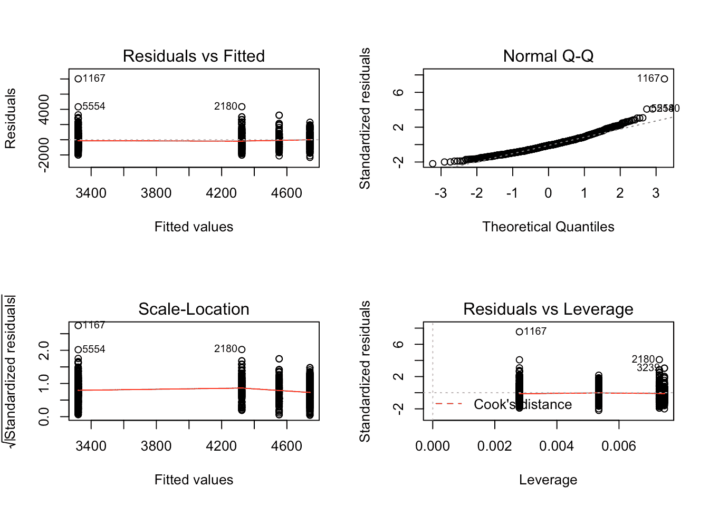
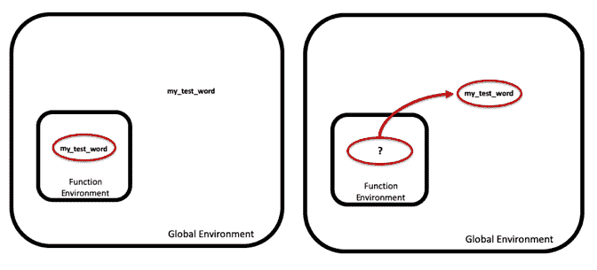

# r 函数教程:编写、作用域、向量化等等！

> 原文：<https://www.dataquest.io/blog/r-functions-tutorial/>

June 11, 2019

当我们用 R 编程时，我们经常想要一个数据集，或者数据集的一部分，然后*对它做一些事情*。如果我们在电子表格中工作，这种任务可能会非常耗时。但是在 R 中，我们可以使用函数非常快速地对大型数据集执行非常复杂的操作。

什么是 R 函数？在本教程中，我们将仔细研究 R 中的一些不同类型的函数，它们是如何工作的，以及它们为什么对数据科学和数据分析任务有用。

## r 函数:输入和输出

在编程中，函数描述了一些过程，这些过程接受一些**输入**，对其执行一些操作，并返回结果**输出**。

您可能会在数学课中想起这个概念，在数学课中，您可能学过平方函数，它接受一个输入数字，然后乘以该数字本身来产生输出答案。

在 R 中，函数做同样的事情:它们接受输入并运行一些 R 代码来产生并返回一个输出。如果你以前运行过任何 R 代码，你可能用过内置的 R 函数，比如`print()`或者`summary()`。这些函数接受一个输入，在编程中称为**参数**，并对其执行操作以产生一个输出。

我们将从加载一个来自 [Kaggle](https://www.kaggle.com/sl6149/data-scientist-job-market-in-the-us) 的很酷的数据集开始我们对函数的探索，这个数据集包含了将近 7000 个美国数据科学职位发布。想象一下，我们想要对这个数据集进行一些数据分析，以了解更多关于数据科学职位发布的信息。我们可能想做的第一件事是查看我们导入的数据，而`summary()`函数非常适合这一点。

这个函数和类似的`head()`函数在数据科学工作中非常有用，因为它们接受您导入的数据(您传递给函数的参数)并生成一个可视化表示，使您更容易看到您正在处理的内容(输出)。

在下面的代码片段中，我们将首先从 CSV 中导入数据作为数据帧。然后我们将调用`head()`函数，它接受我们的输入参数(我们刚刚创建的数据框)并返回前几行数据。

然后我们将运行`summary()`函数，将相同的数据帧作为参数传递给它，它将返回我们数据集中每个变量的摘要。例如，我们可以看到有 351 个职位的标题是“数据科学家”，56 个职位的标题是“机器学习工程师”。

注意，作为我们将传递给这些函数的参数的一部分，我们已经指定了我们希望看到的列。例如，`summary()`函数为我们提供了 position、company、reviews 和 location 列的摘要，因为这些是我们在参数中指定的列(我们传递给函数的输入，以便它执行操作)。

```py
df <- read.csv("alldata.csv") #read in csv file as data.frame
df$description <- as.character(df$description) #change factor to character

head(df[,c(1,2,4,5)])
```

```py
##                                                                      position
## 1                                                        Development Director
## 2 An Ostentatiously-Excitable Principal Research Assistant to Chief Scientist
## 3                                                              Data Scientist
## 4                                                                Data Analyst
## 5              Assistant Professor -TT - Signal Processing & Machine Learning
## 6                                                 Manager of Data Engineering
##              company reviews           location
## 1            ALS TDI      NA Atlanta, GA 30301 
## 2 The Hexagon Lavish      NA        Atlanta, GA
## 3     Xpert Staffing      NA        Atlanta, GA
## 4     Operation HOPE      44 Atlanta, GA 30303 
## 5   Emory University     550        Atlanta, GA
## 6 McKinsey & Company     385 Atlanta, GA 30318
```

```py
summary(df[,c(1,2,4,5)])
```

```py
##                       position   
##  Data Scientist           : 351  
##  Senior Data Scientist    :  96  
##  Research Analyst         :  64  
##  Data Engineer            :  60  
##  Machine Learning Engineer:  56  
##  Lead Data Scientist      :  31  
##  (Other)                  :6306  
##                                    company        reviews      
##  Amazon.com                            : 358   Min.   :     2  
##  Ball Aerospace                        : 187   1st Qu.:    27  
##  Microsoft                             : 137   Median :   230  
##  Google                                : 134   Mean   :  3179  
##  NYU Langone Health                    :  77   3rd Qu.:  1578  
##  Fred Hutchinson Cancer Research Center:  70   Max.   :148114  
##  (Other)                               :6001   NA's   :1638    
##               location   
##  Seattle, WA      : 563  
##  New York, NY     : 508  
##  Cambridge, MA    : 487  
##  Boston, MA       : 454  
##  San Francisco, CA: 425  
##  San Diego, CA    : 294  
##  (Other)          :4233
```

## 使用 R 矢量化节省时间

仅仅通过查看`summary()`函数生成的输出，我们就可以了解到一些有趣的东西，但是我们想知道更多！

虽然我们没有把它包括在我们上面的总结中，但是在这个数据集中有一个“描述”栏，包含了每个单独的工作描述。让我们通过使用`nchar()`函数来看看这些描述有多长，该函数接收一个字符串并返回字符数。在下面的代码中，我们将指定我们只想查看数据集第一行中的“description”列。

```py
nchar(df[1,"description"])
```

```py
## [1] 2208
```

我们可以看到数据集中的第一个职位描述有 2208 个字符长。

但是如果我们一个一个做差不多 7000 行的话，那就要花很长时间了！幸运的是，R 函数允许**矢量化**。矢量化指的是从一条指令中运行多个操作，它允许我们编写看起来更整洁、运行速度更快的代码。简单地说，它允许我们告诉 R 一次对大量数据(比如一个数据帧的整个列)执行相同的操作，而不是重复地告诉它对列中的每个条目执行该操作。


R 是为处理大型数据集而构建的，数据框中的每一列都是一个向量，这意味着我们可以很容易地告诉 R 对列中的每个值执行相同的操作。

许多处理单个值的 R 函数也被矢量化。我们可以给这些函数传递一个向量作为参数，这个函数将为向量中的每个值运行。

例如，我们可以使用矢量化来快速查看数据集中每个职位描述的*长度，使用的是我们用来查看上面第一个职位描述的相同的`nchar()`函数。*

为了存储我们的长度计数，我们将在`df`中创建一个名为`symcount`的新列，并将`nchar(df$description)`的输出分配给它。这告诉`nchar()`函数对整个描述列(向量)中的每个值进行操作。我们还将指定`nchar()`对每个值的输出应该存储在我们新的`symcount`列中。

```py
df$symcount <- nchar(df$description)
head(df$symcount)

# symcount <- rep(NA, dim(df)[1])
# for (i in 1:length(symcount)){
#   symcount[i] <- nchar(df[i,"description"])
# }
# all(symcount == df$symcount)
```

```py
## [1] 2208 4412 2778 2959 3639 3920
```

正如我们在上面看到的，矢量化帮助我们的代码*看起来*漂亮——查看注释的 for 循环，注意如果我们不使用矢量化，它需要更多的代码来生成相同的结果。它也经常*加速*我们的代码。其原因有些技术性，你不需要理解它们就能有效地使用矢量化，但是如果你好奇的话，[这篇文章](https://alyssafrazee.com/2014/01/29/vectorization.html)提供了进一步的解释。

也就是说，请记住，作为数据科学家，我们的目标通常是让**代码工作**，而不是完美优雅和优化的代码。在我们有了工作代码之后，我们总是可以回去优化的！

## R 中的一般函数

让我们更深入地挖掘我们的数据科学作业数据，探索 r 中的**通用函数**，通用函数是基于我们使用它的对象的*类*产生不同输出的函数。

`plot()`是内置通用函数的一个很好的例子，所以让我们用`plot()`来形象化我们刚刚测量的工作描述的长度。再次注意，我们可以将整个`symcount`列传递给`plot()`，它将绘制每个数据点。

```py
plot(df$symcount)
```


We can see from the plot that most job descriptions have less than 10,000 symbols, but there’s some long ones! Note the points at the top near 25,000!

让我们看看数据集中排名前 4 位的公司的 symcount。我们将首先创建一个仅包含前四名公司的新数据框(可以从我们的`summary()`结果中获得)，然后将该数据框传递给`plot()`，并将我们的 *x* 和 *y* 值(分别为 company 和 symcount)作为两个独立的参数。

```py
top4 <- names(summary(df$company)[1:4]) #get names of top 4 companies
justtop4 <- df[df$company %in% top4,] #create a data frame with only jobs from the top 4
justtop4$company <- factor(justtop4$company) # make sure there are only 4 levels in our new factor

plot(justtop4$company, justtop4$symcount)
```


It looks like Amazon has shorter job descriptions than the other companies, though it does have quite the outlier at over 10,000 characters!

我们还可以运行[方差分析(ANOVA)](https://en.wikipedia.org/wiki/Analysis_of_variance) 来查看 4 家公司的 symcount 之间是否存在统计上的显著差异。r 对此也有一个内置函数！

我们将使用`aov()`函数创建 ANOVA 模型，然后在该模型上调用`summary()`和`plot()`。这些是我们一直在使用的相同函数，即使我们还没有掌握 ANOVA 是什么，我们也可以看到输出与我们之前看到的不同。

`summary()`和`plot()`(如前所述)是 r 中**通用函数**的例子，通用函数为对象的不同*类*创建不同的输出。当我们单独绘制 symcount(一个数字向量)时，`plot()`给了我们一个散点图。当我们绘制评论(一个数字向量)和公司(一个分类向量)时，`plot()`创建了一个箱线图。当我们绘制一个 aov 对象(由`aov()`函数创建)时，它给我们一系列的图来帮助我们评估我们的模型。

```py
ANOVA <- aov(symcount ~ company, data = justtop4)
summary(ANOVA)
```

```py
##              Df    Sum Sq   Mean Sq F value Pr(>F)    
## company       3 322841803 107613934   95.02 <2e-16 ***
## Residuals   812 919674198   1132604                   
## ---
## Signif. codes:  0 '***' 0.001 '**' 0.01 '*' 0.05 '.' 0.1 ' ' 1
```

```py
par(mfrow = c(2,2)) #lets us see all 4 plots at once!
plot(ANOVA)
```



Similarly, when we called `summary()` on a dataframe, it provided a table of summary statistics for each column in the dataframe. When called on an aov object, `summary()` provides an ANOVA table.

像这样的通用函数非常有用，因为它们允许我们在 R 中对各种不同的对象使用具有相同语法的 **same** 函数，并根据对象类精确地定制输出。我们不必为不同的类记忆十几个略有不同的函数，我们可以依靠这些可靠的通用函数，它们适用于我们所有的类。

我们可以通过想象一个叫做`feed()`的函数来更好地理解泛型函数。由于通用函数基于作为参数输入的*类*提供不同的输出，我们可能期望`feed(cat)`产生猫粮，而`feed(dog)`产生狗粮。如果我们输入`feed(Chelsea)`，我希望这个虚构的函数能让我做华夫饼。

## 编写 R 函数

虽然 R 有一些非常酷和复杂的通用函数，但并不总是有一个内置函数来生成我们想要的输出。编写自定义函数是编程的重要部分，包括用 r 编程。

与矢量化一样，编写我们自己的函数可以简化和加速我们的代码！一般来说，如果我们发现自己一遍又一遍地做着相同(或相似)的事情，可能是时候写一个函数了。

#### 句法

要创建一个新的 R 函数，我们需要考虑 4 个主要因素:

*   函数的*名*
*   函数将采用的*参数(输入)*
*   该功能将运行*代码*
*   该函数的输出将*返回*给用户

为了看到这四件事在起作用，让我们编写自己的函数，看看我们的数据集中的工作描述是否提到了博士学位。

我们先给它一个明确的**名字** : `phdFinder()`。我们将创建一个名为`phdFinder`的变量来存储我们的函数。为了创建一个函数，我们使用`function(){}`。

```py
phdFinder <- function(){

}
```

上面的括号是空的，但是我们将在那里列出我们的函数需要运行的任何**参数**(输入)的名称。参数用于将 R 对象/变量从函数外部传递到函数中。

当选择我们的参数时，它有助于问:“每次运行这个函数时，哪些变量可能不同？”。如果一个变量可能会改变，那么它应该被指定为一个参数，而不是硬编码在函数将要运行的代码中。

在我们的函数中，唯一不同的是工作描述，所以我们将添加一个名为`description`的变量作为参数。

```py
phdFinder <- function(description){
}
```

接下来，我们需要考虑函数将运行的**代码**。这就是我们想要函数*对我们传递给它的一个或多个参数做*的事情。现在，我们假设我们只寻找字符串“PHD ”,任何其他大写字母如“PhD”都不算，所以我们希望函数内部的代码查看每个传递的`description`,看它是否找到了那个字符串。

是一个内置的 R 函数，它在一个更大的字符串中寻找一个更小的字符串(比如“PhD”)。如果描述中有“PhD ”,它将返回`TRUE`,如果没有，则返回`FALSE`。让我们将它添加到我们的函数代码中，并将它的评估结果赋给一个名为`mentioned`的变量。

```py
phdFinder <- function(description){
  mentioned <- grepl("PhD",description)
}
```

我们需要考虑的最后一件事是我们希望我们的函数**返回**。这里，我们希望它返回`mentioned`，这将告诉用户每个描述是否包含“PhD”(在这种情况下`mentioned`将是`TRUE`)或不包含(在这种情况下`mentioned`将是`FALSE`)。

默认情况下，R 将返回我们运行的最后一条语句的值。`phdFinder()`只有一条语句，所以默认情况下我们的函数将返回`mentioned`，不需要额外的工作！但是如果我们想明确地告诉 R 返回什么，我们可以使用`return()`函数。

但是，如果我们使用`return()`，我们需要小心。`return()`函数告诉 R 该函数已经运行完毕。所以一旦代码运行，函数就会停止。

为了演示这一点，让我们添加一个`return()`行，然后在它后面添加几个打印语句。

```py
phdFinder <- function(description){
  print("checking...")
  mentioned <-  grepl("PhD",description)
  return(mentioned)
  print("YOU SEARCHED FOR A PHD!")
}
```

注意，运行这段代码不会产生输出 print 语句永远不会运行，因为 R 在`return(mentioned)`停止执行函数。

## 使用 R 函数

现在我们已经编写了自定义函数，让我们来试试吧！我们写它不仅仅是为了好玩和开心。让我们来看看原始数据集中的第一份工作描述(存储为数据框`df`)，看看这份工作是否需要博士学位。

```py
phdFinder(df[1,"description"])
```

```py
## [1] "checking..."
## [1] FALSE
```

看起来那份工作描述里没有提到博士学位。如果我们想要一份不需要的工作，这是个好消息。

再次注意，只运行了第一个 print 语句，而不是第二个。如前所述，一旦调用了`return()`函数，下面的代码都不会运行。

我们也可以一次对整列描述使用我们的`phdFinder()`函数。是的，它是自动矢量化的！

让我们在`df`中创建一个名为`phd`的新列，并将在`df$description`上调用`phdFinder()`的结果存储在那里。

```py
df$phd <- phdFinder(df$description)
head(df$phd)

print(sum(df$phd)/length(df$phd))
```

```py
## [1] "checking..."
## [1] FALSE FALSE FALSE FALSE  TRUE FALSE
## [1] 0.2415279
```

在我们的数据框架中，24%的职位描述提到了博士，这是非常有用的信息。如果我们知道一份工作需要一个拥有博士学位的人，它会告诉我们一些如何营销自己的信息，即使我们没有博士学位。

在现实世界中，我们可能会想写一些额外的代码来解释像“phd”、“Ph.D”、“PHD”等不同的拼写。，在我们从这些数据中得出任何严肃的结论之前。

我们在这里编写的代码中跳过了这一步，以使我们的函数更容易理解，但如果您想更多地练习编写函数，那么用更复杂的代码重写我们的函数来解释这些变量将是一个很好的下一步！提示:您可能想从研究名为`tolower()`和`gsub()`的函数开始。

## 编写*好的* R 函数

现在我们知道了一点关于*如何*写 R 函数的知识，是时候让*谈谈*了。下面谈谈如何编写*好的* R 函数。

首先，我们应该编写 R 函数，就像其他人将要使用它们一样，因为他们经常会被使用！但是，即使没有其他人会使用我们的代码，我们可能希望以后重用它，所以编写可读的代码总是一个好主意。

#### 变量名和注释

编写可读代码意味着选择有意义的参数和变量名。不要只使用随机的字母(有时我可能会犯这种错误)，使用一些有意义的东西。

例如，上面我们选择了变量名`mentioned`，因为这个变量告诉我们是否提到了“PhD”。我们可以称之为`x`或`weljhf`，但是通过称之为`mentioned`，我们帮助自己和他人更好地理解那个变量中存储了什么。

类似地，给我们的函数起一个类似于`phdFinder()`的描述性名称可以帮助传达函数做了什么。如果我们把这个函数叫做更神秘的东西，比如`function_47()`或者`pf()`，其他阅读我们代码的人会很难一眼就看出它是干什么的。

#### 辖域


Another thing to think about is **scope**. We can think of our global R environment — our entire program — as a room that holds all the objects, variables, functions, etc. that we have used.

这包括我们在加载`library()`时加载的对象。当我们使用变量`x`时，R 将在我们所在的房间中寻找`x`的值(我们可以使用`ls()`检查我们的环境中有什么)。

当我们编写和运行一个函数时，R 为这个函数创建了一个新的临时环境。这有点像在我们的房间里有一个盒子。“盒子”保存了我们在函数中创建、更改和使用的所有对象。但是一旦函数运行完毕，这个框就消失了。

让我们看几个例子来更好地理解这是如何工作的。我们将运行一些不同的代码片段。在每种情况下，我们将创建一个对象(向量或数据框)并将其传递给我们的函数`square`，该函数返回我们传递给它的一个或多个数字的平方。

注意在下面的代码中，变量`x`的值是如何根据它是在函数之外(全局变量)还是在函数之内而变化的。`x`的值可以在函数内重新分配，但是由于函数环境是临时的，并且在函数运行后不再存在，所以`x`的*全局*值不变:

```py
x <- 10
print(paste("Outside the function, x is...", x))

square <- function(y){
  x <- y**2
  print(paste("Inside the function, x is...", x))
}

square(x)
print(paste("Outside the function, x is...", x))
```

```py
## [1] "Outside the function, x is... 10"
## [1] "Inside the function, x is... 100"
## [1] "Outside the function, x is... 10"
```

```py
x <- c(1,2,3)
print(paste("Outside the function, x is...", x[1],x[2],x[3]))

square <- function(y){
  x <- y**2
  print(paste("Inside the function, x is...",  x[1],x[2],x[3]))
}

square(x)
print(paste("Outside the function, x is...",  x[1],x[2],x[3]))
```

```py
## [1] "Outside the function, x is... 1 2 3"
## [1] "Inside the function, x is... 1 4 9"
## [1] "Outside the function, x is... 1 2 3"
```

```py
x <- data.frame(a = c(1,2,3))
print("Outside the function, x is...")
print(x)

square <- function(y){
  x$square <- x$a**2
  print("Inside the function, x is...")
  print(x)
}

square(x)
print("Outside the function, x is...")
print(x)
```

```py
## [1] "Outside the function, x is..."
##   a
## 1 1
## 2 2
## 3 3
## [1] "Inside the function, x is..."
##   a square
## 1 1      1
## 2 2      4
## 3 3      9
## [1] "Outside the function, x is..."
##   a
## 1 1
## 2 2
## 3 3
```

为了编写好的 R 函数，我们需要考虑我们正在处理的对象在哪里的 T2。如果在函数环境之外有什么*，我们想在*函数环境之内使用*，我们可以通过将它作为**参数**传递给我们的函数来引入它。*

如果我们不这样做，R 将在“盒子”之外寻找，并在全局环境(“房间”)中搜索变量。但是为了使我们的函数尽可能地一般化，并避免将两个变量命名为同一事物的任何问题，通过将它们作为参数传递来显式地给我们的 R 函数它需要运行的对象是一个好主意。

#### 在函数中获取内容

让我们来看看当我们在函数内部调用一个全局变量而没有显式地将其作为参数传递时会发生什么。为此，我们将创建一个名为`wordFinder()`的新函数，类似于我们的`phdFinder()`。

我们将编写这个函数，让它在每个工作描述中查找变量`my_test_word`。但是`my_test_word`不存在于函数环境中，因为它不是作为参数传入的，也不是在函数中创建的。那么会发生什么呢？

一旦 R 搜索了这个本地环境并且没有结果，它将在全局环境中搜索`my_test_word`。由于`my_test_word`存在于全局环境中，R 将在函数中使用它。

```py
my_test_word <- "python" #R uses "python" for my_test_word because it can't find my_test_word in the local function environment

wordFinder <- function(description){
  print(paste("checking for...", my_test_word))
  mentioned <-  grepl(my_test_word,description)
  return(mentioned)

}

wordFinder(df[1,"description"])
```

```py
## [1] "checking for... python"
```

```py
## [1] FALSE
```



What if we define `my_test_word` twice, both inside and outside the function? Let’s give it a shot!

在函数之外，在全局环境中，我们给`my_test_word`赋值`'python'`。在函数内部，我们将赋值给它`'data'`。

因为我们已经知道 R 在全局环境之前搜索函数环境，我们可能预测 R 将使用`'data'`作为`my_test_word`的值，因为这是在函数内部分配的值。事实上，事情就是这样:

```py
my_test_word <- "python" 

wordFinder <- function(description){
  my_test_word <- "data" #R uses "data" for my_test_word because it searches the local environment first
  print(paste("checking for...", my_test_word))
  mentioned <-  grepl(my_test_word,description)
  return(mentioned)

}

wordFinder(df[1,"description"])
```

```py
## [1] "checking for... data"
## [1] TRUE
```

当我们运行这个代码块时，我们可以看到 R 使用了`'data'`(函数内`my_test_word` *的值)而不是`'python'`。在`grepl()`中引用`my_test_word`时，R 首先搜索本地函数环境，找到了`my_test_word`。所以它根本不需要搜索全局环境。*

在编写函数时，记住这一点很重要:如果 R 在函数环境中找不到变量(作为参数或函数本身定义的变量)，它将只在全局环境中搜索该变量。

### 从函数中获取信息

R 通过在函数运行后移除局部函数环境为我们做了整理，这很好，但是如果我们想在函数运行后保留函数内部生成的值呢？

我们可以通过**返回**来保存函数中创建或更改的内容。当我们从函数中返回一个变量时，它允许我们将它存储在全局环境中(如果我们愿意的话)。

在`wordFinder()`中，我们返回`mentioned`。自从 R 去掉了局部函数环境，`mentioned`就不再存在了。当我们试图把它打印出来时，我们得到一个错误。

```py
my_test_word <- "python" 

wordFinder <- function(description){
  my_test_word <- "data" #R uses "data" for my_test_word because it searches the local environment first
  print(paste("checking for...", my_test_word))
  mentioned <-  grepl(my_test_word,description)
  return(mentioned)

}

wordFinder(df[1,"description"])
print(mentioned)
```

```py
## Error in print(mentioned): object 'mentioned' not found
```

```py
## [1] "checking for... data"
## [1] TRUE
```

然而，由于`wordFinder()`返回`mentioned`的值，我们可以通过将函数的输出赋给一个变量，将它存储在全局环境中。现在我们可以在函数之外使用这个值。

```py
my_test_word <- "python" 

wordFinder <- function(description){
  my_test_word <- "data" #R uses "data" for my_test_word because it searches the local environment first
  print(paste("checking for...", my_test_word))
  mentioned <-  grepl(my_test_word,description)
  return(mentioned)

}

mentioned2 <- wordFinder(df[1,"description"])
print(mentioned2)
```

```py
## [1] "checking for... data"
## [1] TRUE
```

现在我们得到了保存在函数外部的函数内部的值。

## 回顾:

R 中的函数有很多用途，所以让我们总结几个要点:

*   r 函数是几段代码，它们接受被称为**参数**的*输入*，并将它们转换成*输出*。
*   当我们定义函数和调用函数时，参数都放在函数的括号里。
*   输出是由函数返回的对象。
*   默认情况下，R 将*返回*函数中最后一条语句的值。一旦函数运行完毕，函数中可能已经更改或创建的所有其他内容都将消失，除非我们有意采取措施来保存它。
*   r 函数是用来反复使用的。这为我们节省了时间和空间，并使我们的代码看起来更好。
*   r 函数通常是*矢量化*，这意味着我们可以对向量中的每一项运行函数，就像数据框中的一列数据一样，一气呵成！这样往往会节省很多时间。
*   *通用* R 函数是基于作为参数传递给它的对象的*类*而不同运行的函数。
*   编写好的 R 函数意味着为他人(和未来的自己)着想，并使我们的函数易于理解。

既然您已经对 R 函数的基础有了坚实的理解，那么就通过 Dataquest 的免费交互式 R 课程来增加您的技能吧。我们的中级课程将带你更深入地了解函数的世界，同时让你直接在浏览器中编写代码。

## 获取免费的数据科学资源

免费注册获取我们的每周时事通讯，包括数据科学、 **Python** 、 **R** 和 **SQL** 资源链接。此外，您还可以访问我们免费的交互式[在线课程内容](/data-science-courses)！

[SIGN UP](https://app.dataquest.io/signup)