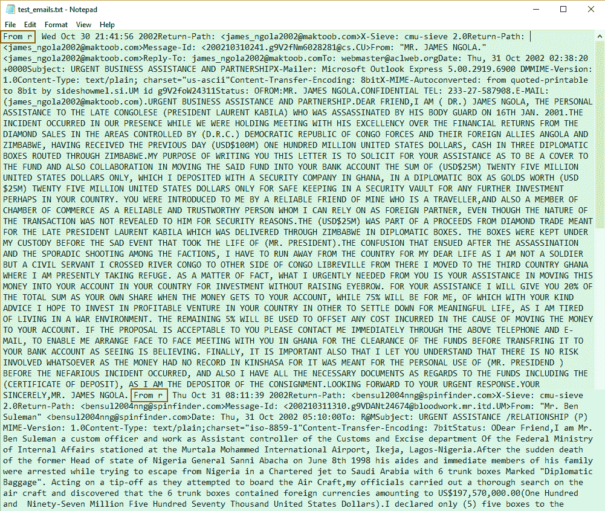

# 教程:面向数据科学家的 Python Regex(正则表达式)

> 原文：<https://www.dataquest.io/blog/regular-expressions-data-scientists/>

January 7, 2020

一头扎进数据集是任何从事数据科学工作的人都要上的一课。通常，这意味着数字运算，但是当我们的数据集主要是基于文本时，我们该怎么办呢？我们可以使用正则表达式。在本教程中，我们将仔细研究如何在 Python 中使用正则表达式(regex)。

正则表达式(regex)本质上是文本模式，可用于自动搜索和替换文本字符串中的元素。这使得清理和处理基于文本的数据集变得更加容易，省去了手动搜索大量文本的麻烦。

正则表达式可以在多种编程语言中使用，而且它们已经存在很长时间了！

不过，在本教程中，我们将学习 Python 中的正则表达式，因此基本熟悉一些关键的 Python 概念，如 if-else 语句、while 和 for 循环等。，是必需的。(如果您需要复习这些内容，[我们的 Python 入门课程](https://www.dataquest.io/path/data-scientist/)将在您的浏览器中以交互方式涵盖所有相关主题！)

本教程结束时，您将熟悉 Python regex 的工作方式，并能够使用 Python 的 regex 模块`re`中的基本模式和函数来分析文本字符串。您还将了解如何使用 regex 和 pandas 来处理大型文本语料库( *corpus* 表示文本数据集)。

(要完成本教程的熊猫部分，您需要安装熊猫库。最简单的方法是下载 Anaconda，并在 Jupyter 笔记本上完成本教程。对于其他选项，请查看[熊猫安装指南](https://pandas.pydata.org/pandas-docs/stable/install.html)。)


## 我们的任务:分析垃圾邮件

在本教程中，我们将使用来自 Kaggle 的欺诈性电子邮件语料库。它包含了 1998 年至 2007 年间发送的数千封钓鱼邮件。它们读起来很有趣。

你可以在这里找到完整的文集。但是我们将从使用几封电子邮件学习基本的 regex 命令开始。如果你愿意，你也可以使用我们的[测试文件](https://www.dataquest.io/wp-content/uploads/2020/01/test_emails.txt)，或者你可以使用完整的语料库来尝试。

## 介绍 Python 的 Regex 模块

首先，我们将准备数据集，方法是打开测试文件，将其设置为只读，然后读取它。我们还将它赋给一个变量`fh`(表示“文件句柄”)。

```py
fh = open(r"test_emails.txt", "r").read()
```

注意，我们在目录路径前面加了一个`r`。这种技术将字符串转换为原始字符串，这有助于避免由某些机器读取字符的方式引起的冲突，例如 Windows 上目录路径中的反斜杠。

现在，假设我们想找出邮件来自谁。我们可以单独尝试原始 Python:

```py
 for line in fh.split("n"):
    if "From:" in line:
        print(line)
```

```py
der.com>
Message-Id: <[[email protected]](/cdn-cgi/l/email-protection)>
From: "Mr. Be
[[email protected]](/cdn-cgi/l/email-protection)>
Message-Id: <[[email protected]](/cdn-cgi/l/email-protection)>
From: "PRINCE OBONG ELEME" <obo 
```

但这并没有给我们想要的。如果你看一下我们的测试文件，我们可以找出原因并修复它，但是，让我们使用 Python 的`re`模块并用正则表达式来做！

我们将从导入 Python 的`re`模块开始。然后，我们将使用一个名为`re.findall()`的函数，该函数返回我们在字符串中定义的模式的所有实例的列表。

它看起来是这样的:

```py
 import re

for line in re.findall("From:.*", fh):
    print(line) 
```

```py
From: "Mr. Ben Suleman" <[[email protected]](/cdn-cgi/l/email-protection)>
From: "PRINCE OBONG ELEME" <[[email protected]](/cdn-cgi/l/email-protection)> 
```

这基本上与我们的原始 Python 长度相同，但那是因为它是一个非常简单的例子。您尝试做的越多，Python regex 可能为您节省的精力就越多。

在我们继续之前，让我们仔细看看`re.findall()`。这个函数以`re.findall(pattern, string)`的形式接受两个参数。这里，`pattern`代表我们想要查找的子串，`string`代表我们想要在其中查找的主串。主字符串可以由多行组成。在这种情况下，我们让它搜索所有的`fh`，我们选择的电子邮件的文件。

`.*`是字符串模式的简写。正则表达式通过使用这些速记模式来查找文本中的特定模式，所以让我们看看其他一些常见的示例:

## 常见的 Python 正则表达式模式

我们在上面的`re.findall()`中使用的模式包含一个完整拼写的字符串`"From:"`。当我们精确地知道我们要找的是什么，精确到实际的字母以及它们是大写还是小写时，这是很有用的。如果我们不知道我们想要的字符串的确切格式，我们就会迷失方向。幸运的是，regex 有解决这种情况的基本模式。让我们看看我们在本教程中使用的:

*   `w`匹配字母数字字符，即 a-z、A-Z 和 0-9。它还匹配下划线、_ 和破折号-。
*   `d`匹配数字，表示 0-9。
*   `s`匹配空白字符，包括制表符、换行符、回车符和空格字符。
*   `S`匹配非空白字符。
*   `.`匹配除新行字符`n`之外的任何字符。

有了这些正则表达式模式，当我们继续解释它时，您将很快理解我们上面的代码。

## 使用正则表达式模式

我们现在可以解释上面的行`re.findall("From:.*", text)`中`.*`的用法。我们先来看`.`:

```py
 for line in re.findall("From:.", fh):
    print(line) 
```

```py
From:
From: 
```

通过在`From:`旁边添加一个`.`，我们在它旁边寻找一个额外的字符。因为`.`寻找除了`n`之外的任何字符，它捕捉空格字符，这是我们看不到的。我们可以尝试更多的点来验证这一点。

```py
 for line in re.findall("From:...........", fh):
    print(line) 
```

```py
From: "Mr. Ben S
From: "PRINCE OB 
```

看起来添加点确实为我们获得了线的其余部分。但是，这很乏味，我们不知道要添加多少点。这就是星号符号`*`出现的地方。

`*`匹配左侧模式的零个或多个实例。这意味着它寻找重复的模式。当我们寻找重复的模式时，我们说我们的搜索是“贪婪的”如果我们不寻找重复的模式，我们可以称我们的搜索为“非贪婪”或“懒惰”

让我们用`*`构造一个对`.`的贪婪搜索。

```py
 for line in re.findall("From:.*", fh):
    print(line) 
```

```py
From: "Mr. Ben Suleman" <[[email protected]](/cdn-cgi/l/email-protection)>
From: "PRINCE OBONG ELEME" <[[email protected]](/cdn-cgi/l/email-protection)> 
```

因为`*`匹配其左侧指示的模式的零个或多个实例，并且`.`在这里位于其左侧，所以我们能够获取`From:`字段中的所有字符，直到该行结束。这用非常简洁的代码打印出了完整的一行。

我们甚至可以更进一步，只分离出名字。像以前一样，让我们使用`re.findall()`返回包含模式`"From:.*"`的行列表。为了简洁起见，我们将它赋给变量`match`。接下来，我们将遍历列表。在每个循环中，我们将再次执行`re.findall`,匹配第一个引号以仅提取名称:

```py
 match = re.findall("From:.*", fh)

for line in match:
    print(re.findall('\".*\"', line))
```

```py
['"Mr. Ben Suleman"']
['"PRINCE OBONG ELEME"'] 
```

注意，我们在第一个引号旁边使用了反斜杠。反斜杠是用于转义其他特殊字符的特殊字符。例如，当我们想使用引号作为字符串文字而不是特殊字符时，我们用一个反斜杠来转义它，就像这样:`\"`。如果我们不使用反斜杠对上面的模式进行转义，它将变成`"".*""`，Python 解释器会将它解读为两个空字符串之间的句点和星号。它会产生一个错误并破坏脚本。因此，我们在这里用反斜杠来转义引号是至关重要的。

匹配第一个引号后，`.*`获取该行中的所有字符，直到下一个引号，也在模式中转义。这使我们得到的只是引号内的名称。名称也打印在方括号内，因为`re.findall`返回列表中的匹配项。

如果我们需要电子邮件地址呢？

```py
 match = re.findall("From:.*", fh)

for line in match:
    print(re.findall("\w\S*@*.\w", line))
```

```py
['[[email protected]](/cdn-cgi/l/email-protection)']
['[[email protected]](/cdn-cgi/l/email-protection)']
```

看起来很简单，不是吗？只是模式不同。让我们走一遍。

下面是我们如何匹配电子邮件地址的前部分:

```py
 for line in match:
    print(re.findall("\w\S*@", line))
```

```py
['[[email protected]](/cdn-cgi/l/email-protection)']
['[[email protected]](/cdn-cgi/l/email-protection)'] 
```

电子邮件总是包含一个@符号，所以我们从它开始。电子邮件中@符号之前的部分可能包含字母数字字符，这意味着`w`是必填项。然而，因为一些电子邮件包含句号或破折号，这是不够的。我们添加`S`来查找非空白字符。但是，`w\S`只会得到两个字。添加`*`寻找重复。图案的前部看起来是这样的:`\w\S*@`。

现在看看@符号背后的图案:

```py
 for line in match:
    print(re.findall("@.*", line))
```

```py
['@spinfinder.com>']
['@epatra.com>']
```

域名通常包含字母数字字符、句点，有时还包含破折号，因此使用`.`即可。为了使它变得贪婪，我们用一个`*`来扩展搜索。这允许我们匹配任何字符直到行尾。

如果我们仔细观察这一行，我们会看到每封电子邮件都被封装在尖括号内，< and >。我们的模式，`.*`，包括右括号，>。让我们补救一下:

```py
 for line in match:
    print(re.findall("@.*\w", line))
```

```py
['@spinfinder.com']
['@epatra.com']
```

电子邮件地址以字母数字字符结尾，所以我们用`w`作为模式的结尾。因此，在@符号后面有`.*\w`，这意味着我们想要的模式是一组以字母数字字符结尾的任意类型的字符。这不包括>。

因此，我们完整的电子邮件地址模式如下所示:`\w\S*@.*\w`。

唷！那是很难解决的。接下来，我们将运行一些常见的`re`函数，当我们开始重新组织我们的语料库时，这些函数会很有用。

## 常见 Python 正则表达式函数

`re.findall()`无疑是有用的，但它不是`re`中唯一可用的内置函数:

*   `re.search()`
*   `re.split()`
*   `re.sub()`

在使用它们给我们的数据集带来一些秩序之前，让我们一个接一个地看看它们。

### 重新搜索()

当`re.findall()`匹配一个字符串中一个模式的所有实例并在一个列表中返回它们时，`re.search()`匹配一个字符串中一个模式的第一个实例，并将其作为一个`re`匹配对象返回。

```py
 match = re.search("From:.*", fh)
print(type(match))
print(type(match.group()))
print(match)
print(match.group())
```

```py
<class 're.Match'>
<class 'str'>
<re.Match object; span=(3590, 3644), match='From: "Mr. Ben Suleman" <[[email protected]](/cdn-cgi/l/email-protection)>
From: "Mr. Ben Suleman" <[[email protected]](/cdn-cgi/l/email-protection)> 
```

和`re.findall()`一样，`re.search()`也是带两个自变量。第一个是要匹配的模式，第二个是要在其中查找的字符串。这里，为了整洁，我们将结果赋给了`match`变量。

因为`re.search()`返回的是一个`re`匹配对象，所以我们无法通过直接打印来显示姓名和邮箱地址。相反，我们必须先对它应用`group()`函数。我们已经在上面的代码中打印出了它们的类型。正如我们所看到的，`group()`将 match 对象转换成一个字符串。

我们还可以看到，打印`match`显示字符串本身以外的属性，而打印`match.group()`只显示字符串。

### 重新拆分()

假设我们需要一种快速的方法来获得电子邮件地址的域名。我们可以通过三个正则表达式操作来实现，如下所示:

```py
 address = re.findall("From:.*", fh)
for item in address:
    for line in re.findall("\w\S*@.*\w", item):
        username, domain_name = re.split("@", line)
        print("{}, {}".format(username, domain_name)) 
```

```py
bensul2004nng, spinfinder.com
obong_715, epatra.com
```

第一句台词很熟悉。我们返回一个字符串列表，每个字符串包含`From:`字段的内容，并将它赋给一个变量。接下来，我们遍历列表来查找电子邮件地址。同时，我们遍历电子邮件地址，并使用`re`模块的`split()`函数将每个地址剪成两半，用@符号作为分隔符。最后，我们打印它。

### re.sub()

另一个方便的`re`功能是`re.sub()`。正如函数名所示，它替换字符串的一部分。一个例子:

```py
sender = re.search("From:.*", fh)
address = sender.group()
email = re.sub("From", "Email", address)
print(address)
print(email)
```

```py
From: "Mr. Ben Suleman" <[[email protected]](/cdn-cgi/l/email-protection)>
Email: "Mr. Ben Suleman" <[[email protected]](/cdn-cgi/l/email-protection)>
</[[email protected]](/cdn-cgi/l/email-protection)></[[email protected]](/cdn-cgi/l/email-protection)>
```

我们之前已经看过第一行和第二行的任务了。在第三行，我们将`re.sub()`应用于`address`，这是电子邮件标题中完整的`From:`字段。

`re.sub()`需要三个参数。第一个是要替换的子字符串，第二个是我们想要替换的字符串，第三个是主字符串本身。

## 熊猫的正则表达式

现在我们已经掌握了 Python 正则表达式的基础知识。但是通常对于数据任务，我们实际上并没有使用原始的 Python，而是使用 pandas 库。现在，让我们通过将正则表达式技术引入到 pandas 工作流中，使它们更上一层楼。

如果你以前没用过熊猫，也不用担心。我们将一步一步地检查代码，因此您永远不会感到迷失。但是如果你想更详细地了解熊猫，可以看看我们的[熊猫教程](https://www.dataquest.io/blog/pandas-python-tutorial/)或者我们提供的关于熊猫和熊猫的[全互动课程。](https://www.dataquest.io/course/pandas-fundamentals/)

### 用 Python 正则表达式和熊猫排序邮件

我们的语料库是一个包含数千封电子邮件的文本文件(不过，对于本教程，我们使用的是一个只有两封电子邮件的小得多的文件，因为在整个语料库上打印 regex 工作的结果会使这篇文章太长)。

我们将使用 regex 和 pandas 将每封电子邮件的各个部分分类到适当的类别中，以便可以更容易地阅读或分析语料库。

我们将每封电子邮件分为以下几类:

*   `sender_name`
*   `sender_address`
*   `recipient_address`
*   `recipient_name`
*   `date_sent`
*   `subject`
*   `email_body`

这些类别中的每一个都将成为我们的熊猫数据框架(即我们的表格)中的一列。这将使我们更容易分别处理和分析每一列。

我们将继续使用我们的小样本，但是值得重申的是，正则表达式允许我们编写更简洁的代码。简洁的代码减少了我们的机器必须做的操作数量，这加快了我们的分析过程。使用我们的两封电子邮件的小文件，没有太大的区别，但是如果您尝试使用和不使用 regex 处理整个语料库，您将开始看到优势！

## 准备脚本

首先，让我们导入我们需要的库并再次打开我们的文件。

除了`re`和`pandas`，我们还将导入 Python 的`email`包，这将有助于电子邮件的正文。单独使用正则表达式处理电子邮件的正文相当复杂。它甚至可能需要足够的清理来保证自己的教程。所以，我们将使用开发良好的`email`包来节省一些时间，让我们专注于学习 regex。

```py
 import re
import pandas as pd
import email

emails = []

fh = open(r"test_emails.txt", "r").read()
```

我们还创建了一个空列表`emails`，它将存储字典。每本词典都将包含每封电子邮件的详细信息。

现在，让我们开始应用正则表达式！

```py
 contents = re.split(r"From r", fh)
contents.pop(0) 
```

```py
['  Thu Oct 31 08:11:39 2002\nReturn-Path: <[[email protected]](/cdn-cgi/l/email-protection)>\nX-Sieve: cmu-sieve 2.0\nReturn-Path: <[[email protected]](/cdn-cgi/l/email-protection)>\nMessage-Id: <[[email protected]](/cdn-cgi/l/email-protection)>\nFrom: "Mr. Ben Suleman" <[[email protected]](/cdn-cgi/l/email-protection)>\nDate: Thu, 31 Oct 2002 05:10:00\nTo: [[email protected]](/cdn-cgi/l/email-protection)\nSubject: URGENT ASSISTANCE /RELATIONSHIP (P)\nMIME-Version: 1.0\nContent-Type: text/plain;charset="iso-8859-1"\nContent-Transfer-Encoding: 7bit\nStatus: O\n\nDear Friend,\n\nI am Mr. Ben Suleman a custom officer and work as Assistant controller of the Customs and Excise department Of the Federal Ministry of Internal Affairs stationed at the Murtala Mohammed International Airport...
```

注意:为了简洁起见，我们截掉了上面的打印输出。如果你在自己的机器上打印，它将显示包含在`contents`中的所有内容，而不是像上面那样以`...`结尾。

我们使用`re`模块的 split 函数将`fh`中的整个文本块分割成一个单独的电子邮件列表，我们将它赋给变量`contents`。这很重要，因为我们想通过 for 循环遍历列表，一封接一封地处理邮件。但是，我们怎么知道要被字符串`"From r"`分割呢？

我们之所以知道这一点，是因为我们在写脚本之前查看了文件。我们不必细读那里成千上万的电子邮件。只是前几个，看看数据的结构是什么样子。只要有可能，在开始处理代码之前先看看实际的数据是有好处的，因为您经常会发现像这样有用的特性。

我们截取了原始文本文件的屏幕截图:



电子邮件以“From r”开头

绿色块是第一封邮件。蓝色块是第二封邮件。正如我们所见，这两封邮件都以`"From r"`开头，用红框突出显示。

我们在本教程中使用欺诈性电子邮件语料库的一个原因是为了表明，当数据杂乱无章、不熟悉且没有文档记录时，我们不能仅仅依靠代码来对其进行分类。这需要一双人类的眼睛。正如我们刚才所展示的，我们不得不研究语料库本身来研究它的结构。

像这样杂乱无章的数据可能需要大量清理工作。例如，即使我们使用我们将要为本教程构建的完整脚本计算出这一组中有 3，977 封电子邮件，实际上还有更多。一些电子邮件实际上没有以`"From r"`开头，因此没有单独计算。(然而，为了简洁起见，我们将假设该问题已经解决，所有电子邮件都由`"From r"`分隔开。)

还要注意，我们使用`contents.pop(0)`来删除列表中的第一个元素。这是因为第一封电子邮件前面有一个`"From r"`字符串。当该字符串被拆分时，它在索引 0 处产生一个空字符串。我们将要写的脚本是为电子邮件设计的。如果我们试图在一个空字符串上使用它，它可能会抛出错误。去掉空字符串可以防止这些错误破坏我们的脚本。

## 用 For 循环获取每个名字和地址

接下来，我们将处理`contents`列表中的电子邮件。

```py
 for item in contents:
    emails_dict = {}
```

在上面的代码中，我们使用了一个`for`循环来遍历`contents`，这样我们就可以依次处理每封邮件。我们创建了一个字典，`emails_dict`，它将保存每封电子邮件的所有细节，例如发件人的地址和姓名。事实上，这些是我们找到的第一批物品。

这是一个分三步走的过程。它从找到`From:`字段开始。

```py
 for item in contents:
# First two lines again so that Jupyter runs the code.
    emails_dict = {}

# Find sender's email address and name.

    # Step 1: find the whole line beginning with "From:".
    sender = re.search(r"From:.*", item) 
```

在步骤 1 中，我们使用`re.search()`函数找到整个`From:`字段。`.`表示除了`n`以外的任何字符，`*`将其延伸到行尾。然后我们将它赋给变量`sender`。

但是，数据并不总是简单明了的。它可以包含惊喜。例如，如果没有`From:`字段呢？脚本会抛出一个错误并中断。在步骤 2 中，我们先发制人地避免了这个场景中的错误。

```py
 # Step 2: find the email address and name.
    if sender is not None:
        s_email = re.search(r"\w\S*@.*\w", sender.group())
        s_name = re.search(r":.*<", sender.group())
    else:
        s_email = None
        s_name = None
```

为了避免由于缺少`From:`字段而导致的错误，我们使用一个`if`语句来检查`sender`不是`None`。如果是，我们给`s_email`和`s_name`分配`None`的值，这样脚本就可以继续运行，而不是意外中断。

如果您正在自己的文件中学习本教程，您可能已经意识到使用正则表达式会变得很麻烦。例如，这些 if-else 语句是在编写语料库时使用试错法的结果。编写代码是一个迭代的过程。值得注意的是，即使本教程看起来很简单，但实际操作需要更多的实验。

在第 2 步中，我们使用之前熟悉的正则表达式模式`\w\S*@.*\w`，它匹配电子邮件地址。

我们将对名称使用不同的策略。每个名字由左边的子字符串`"From:"`的冒号`:`和右边的电子邮件地址的左尖括号`<`限定。因此，我们使用`:.*<`来查找名称。我们马上从每个结果中去掉`:`和`<`。

现在，让我们打印出代码的结果，看看它们是什么样子。

```py
 print("sender type: " + str(type(sender)))
    print("sender.group() type: " + str(type(sender.group())))
    print("sender: " + str(sender))
    print("sender.group(): " + str(sender.group()))
    print("n")
```

```py
sender type: <class 're.match'="">
sender.group() type: <class 'str'="">
sender: <re.match object="" span="(180," match="From: &quot;PRINCE OBONG ELEME&quot; <obong_715@epatra.com>>
sender.group(): From: &quot;PRINCE OBONG ELEME&quot; <obong_715@epatra.com>
```


请注意，我们没有在`re.search()`的每个应用程序中使用`sender`作为要搜索的字符串。我们已经打印出了`sender`和`sender.group()`的类型，这样我们就可以看出它们的区别。看起来`sender`是一个`re.match`对象，我们无法使用`re.search()`进行搜索。然而，`sender.group()`是一个字符串，这正是`re.search()`的用途。

让我们看看`s_email`和`s_name`是什么样子的。

```py
print(s_email)
print(s_name)
```

```py
<re.Match object; span=(28, 48), match='[[email protected]](/cdn-cgi/l/email-protection)'>
<re.Match object; span=(4, 28), match=': "PRINCE OBONG ELEME" <'> 
```

同样，我们有匹配对象。每次我们将`re.search()`应用于字符串时，它都会产生匹配对象。我们必须把它们转换成字符串对象。

在我们这样做之前，回想一下，如果没有`From:`字段，`sender`将具有`None`的值，`s_email`和`s_name`也是如此。因此，我们必须再次检查这个场景，以便脚本不会意外中断。先来看看如何用`s_email`构造代码。

```py
 # Step 3A: assign email address as string to a variable.
    if s_email is not None:
        sender_email = s_email.group()
    else:
        sender_email = None
    # Add email address to dictionary.
    emails_dict["sender_email"] = sender_email
```

在步骤 3A 中，我们使用一个`if`语句来检查`s_email`不是`None`，否则它将抛出一个错误并中断脚本。

然后，我们简单地将`s_email`匹配对象转换成一个字符串，并将其赋给`sender_email`变量。我们把它添加到`emails_dict`字典中，这将使我们以后把细节变成熊猫的数据框架变得非常容易。

在 3B 步骤中，我们对`s_name`做了几乎完全相同的处理。

```py
 # Step 3B: remove unwanted substrings, assign to variable.
    if s_name is not None:
        sender_name = re.sub("s*<", "", re.sub(":s*", "", s_name.group()))
    else:
        sender_name = None

    # Add sender's name to dictionary.
    emails_dict["sender_name"] = sender_name
```

正如我们之前所做的，我们首先检查`s_name`不是 3B 步骤中的`None`。

然后，在将字符串赋给变量之前，我们使用了两次`re`模块的`re.sub()`函数。首先，我们删除冒号和名字之间的任何空白字符。我们通过用一个空字符串`""`替换`:s*`来做到这一点。然后，我们删除名称另一侧的空白字符和尖括号，再次用空字符串替换它。最后，在将字符串分配给`sender_name`之后，我们将它添加到字典中。

让我们看看我们的结果。

```py
 print(sender_email)
    print(sender_name)
```

```py
[[email protected]](/cdn-cgi/l/email-protection)
 "PRINCE OBONG ELEME" 
```

完美。我们分离出了电子邮件地址和发件人的名字。我们还将它们添加到了词典中，很快就会发挥作用。

现在我们已经找到了发件人的电子邮件地址和姓名，我们执行完全相同的步骤来为字典获取收件人的电子邮件地址和姓名。

首先，我们找到了`To:`字段。

```py
 recipient = re.search(r"To:.*", item)
```

接下来，我们先假设`recipient`是`None`的情况。

```py
 if recipient is not None:
        r_email = re.search(r"wS*@.*w", recipient.group())
        r_name = re.search(r":.*<", recipient.group())
    else:
        r_email = None
        r_name = None
```

如果`recipient`不是`None`，我们使用`re.search()`来查找包含电子邮件地址和收件人姓名的匹配对象。否则，我们将`None`的值传递给`r_email`和`r_name`。

然后，我们将匹配对象转换成字符串，并将它们添加到字典中。

```py
 if r_email is not None:
        recipient_email = r_email.group()
    else:
        recipient_email = None

    emails_dict["recipient_email"] = recipient_email

    if r_name is not None:
        recipient_name = re.sub("\s*<", "", re.sub(":\s*", "", r_name.group()))
    else:
        recipient_name = None

    emails_dict["recipient_name"] = recipient_name 
```

因为`From:`和`To:`字段的结构是相同的，所以我们可以对两者使用相同的代码。我们需要为其他字段定制稍微不同的代码。

## 获取电子邮件的日期

现在是邮件发出的日期。

```py
 for item in contents:
# First two lines again so that Jupyter runs the code.
    emails_dict = {}

    date_field = re.search(r"Date:.*", item) 
```

我们用与`From:`和`To:`字段相同的代码获取`Date:`字段。

就像我们对这两个字段所做的一样，我们检查分配给`date_field`变量的`Date:`字段不是`None`。

```py
 if date_field is not None:
        date = re.search(r"\d+\s\w+\s\d+", date_field.group())
    else:
        date = None

    print(date_field.group())
```

```py
Date: Thu, 31 Oct 2002 22:17:55 +0100
```

我们把`date_field.group()`打印出来，这样我们可以更清楚地看到字符串的结构。它包括星期、DD MMM YYYY 格式的日期和时间。我们只想要日期。日期的代码与姓名和电子邮件地址的代码基本相同，但更简单。也许这里唯一的困惑是正则表达式模式，`\d+\s\w+\s\d+`。

日期以数字开头。因此，我们使用`d`来说明它。但是，作为日期的 DD 部分，它可以是一位数或两位数。这就是`+`变得重要的地方。在 Python 正则表达式中，`+`匹配其左侧的一个或多个模式实例。`d+`将匹配日期的 DD 部分，无论它是一位数还是两位数。

在那之后，有一个空间。这是由`s`解决的，它寻找空白字符。月份由三个字母组成，因此称为`w+`。然后它击中另一个空间，`s`。年份是由数字组成的，所以我们再次使用`d+`。

完整的模式`\d+\s\w+\s\d+`之所以有效，是因为它是一个精确的模式，两边都有空白字符。

接下来，我们像以前一样对值`None`进行同样的检查。

```py
 if date is not None:
        date_sent = date.group()
        date_star = date_star_test.group()
    else:
        date_sent = None

    emails_dict["date_sent"] = date_sent
```

如果`date`不是`None`，我们就把它从一个匹配对象变成一个字符串，赋给变量`date_sent`。然后我们将它插入字典。

在我们继续之前，我们应该注意关键的一点。`+`和`*`看似相似，但它们可以产生非常不同的结果。让我们以这里的日期字符串为例。

```py
 date = re.search(r"\d+\s\w+\s\d+", date_field.group())

    # What happens when we use * instead?
    date_star_test = re.search(r"\d*\s\w*\s\d*", date_field.group())

    date_sent = date.group()
    date_star = date_star_test.group()

    print(date_sent)
    print(date_star)
```

```py
31 Oct 2002
 31 
```

如果我们使用`*`，我们将匹配零个或多个事件。`+`匹配一个或多个事件。我们已经打印了两种场景的结果。差别很大。如您所见，`+`获得完整的日期，而`*`获得空格和数字`31`。

接下来，邮件的主题行。

## 获取电子邮件主题

和以前一样，我们使用相同的代码和代码结构来获取我们需要的信息。

```py
 for item in contents:
# First two lines again so that Jupyter runs the code.
    emails_dict = {}

    subject_field = re.search(r"Subject: .*", item)

    if subject_field is not None:
        subject = re.sub(r"Subject: ", "", subject_field.group())
    else:
        subject = None

    emails_dict["subject"] = subject
```

我们现在越来越熟悉 Python 正则表达式的使用了，不是吗？除了我们用一个空字符串替换`"Subject: "`以仅获得主题本身之外，它与之前的代码基本相同。

## 获取电子邮件正文

最后一个插入字典的条目是电子邮件的正文。

```py
 full_email = email.message_from_string(item)
    body = full_email.get_payload()
    emails_dict["email_body"] = body
```

从电子邮件正文中分离出标题是一项非常复杂的任务，尤其是当许多标题在某种程度上不同的时候。在未经整理的原始数据中很少发现一致性。幸运的是，工作已经完成了。Python 的`email`包非常擅长这项任务。

请记住，我们之前已经导入了这个包。现在，我们将它的`message_from_string()`函数应用于`item`，将完整的电子邮件转换成一个`email`消息对象。消息对象由标题和有效载荷组成，它们对应于电子邮件的标题和正文。

接下来，我们在消息对象上应用它的`get_payload()`函数。该功能隔离电子邮件的正文。我们将它赋给变量`body`，然后将它插入到我们的`emails_dict`字典中的键`"email_body"`下。

#### 为什么是邮件包而不是正文的正则表达式

你可能会问，为什么要用`email` Python 包而不是 regex？这是因为目前还没有用 Python regex 做这件事的好方法，它不需要大量的清理。这将意味着另一页代码可能值得自己的教程。

值得看看我们是如何做出这样的决定的。然而，在这样做之前，我们需要理解方括号`[ ]`在 regex 中是什么意思。

匹配其中的任何字符。例如，如果我们想在一个字符串中找到`"a"`、`"b"`或`"c"`，我们可以使用`[abc]`作为模式。我们上面讨论的模式也适用。`[\w\s]`会查找字母数字或空白字符。例外是`.`，它变成了方括号内的文字句点。

现在，我们可以更好地理解我们是如何决定使用电子邮件包的。

对数据集的一瞥揭示了电子邮件标题在字符串`"Status: 0"`或`"Status: R0"`处停止，并在下一封电子邮件的字符串`"From r"`之前结束。因此，我们可以使用`Status:\s*\w*\n*[\s\S]*From\sr*`只获取邮件正文。`[\s\S]*`适用于大块文本、数字和标点符号，因为它搜索空白或非空白字符。

不幸的是，一些电子邮件有不止一个`"Status:"`字符串，而另一些不包含`"From r"`，这意味着我们会将电子邮件分成多于或少于电子邮件列表中的字典数量。它们与我们现有的其他类别不匹配。这在和熊猫一起工作时会产生问题。因此，我们决定利用`email`方案。

## 创建词典列表

最后，将字典`emails_dict`添加到`emails`列表中:

```py
 emails.append(emails_dict)
```

我们可能希望在此时打印出`emails`列表，看看它看起来怎么样。如果您刚刚使用了我们的小样本文件，这将是非常反高潮的，但是通过整个语料库，您将看到正则表达式的威力！

我们还可以运行`print(len(emails_dict))`来查看列表中有多少字典，以及电子邮件。正如我们之前提到的，完整的语料库包含 3977 个。

下面是完整的代码:

```py
 import re
import pandas as pd
import email

emails = []

fh = open(r"test_emails.txt", "r").read()

contents = re.split(r"From r",fh)
contents.pop(0)

for item in contents:
    emails_dict = {}

    sender = re.search(r"From:.*", item)

    if sender is not None:
        s_email = re.search(r"\w\S*@.*\w", sender.group())
        s_name = re.search(r":.*<", sender.group())
    else:
        s_email = None
        s_name = None

    if s_email is not None:
        sender_email = s_email.group()
    else:
        sender_email = None

    emails_dict["sender_email"] = sender_email

    if s_name is not None:
        sender_name = re.sub("\s*<", "", re.sub(":\s*", "", s_name.group()))
    else:
        sender_name = None

    emails_dict["sender_name"] = sender_name

    recipient = re.search(r"To:.*", item)

    if recipient is not None:
        r_email = re.search(r"\w\S*@.*\w", recipient.group())
        r_name = re.search(r":.*<", recipient.group())
    else:
        r_email = None
        r_name = None

    if r_email is not None:
        recipient_email = r_email.group()
    else:
        recipient_email = None
    emails_dict["recipient_email"] = recipient_email

    if r_name is not None:
        recipient_name = re.sub("s*<", "", re.sub(":s*", "", r_name.group()))
    else:
        recipient_name = None

    emails_dict["recipient_name"] = recipient_name

    date_field = re.search(r"Date:.*", item)

    if date_field is not None:
        date = re.search(r"\d+\s\w+\s\d+", date_field.group())
    else:
        date = None

    if date is not None:
        date_sent = date.group()
    else:
        date_sent = None

    emails_dict["date_sent"] = date_sent

    subject_field = re.search(r"Subject: .*", item)

    if subject_field is not None:
        subject = re.sub(r"Subject: ", "", subject_field.group())
    else:
        subject = None

    emails_dict["subject"] = subject

    # "item" substituted with "email content here" so full email not
# displayed.

    full_email = email.message_from_string(item)
    body = full_email.get_payload()
    emails_dict["email_body"] = "email body here"

    emails.append(emails_dict)
# Print number of dictionaries, and hence, emails, in the list.
print("Number of emails: " + str(len(emails_dict)))

print("n")

# Print first item in the emails list to see how it looks.
for key, value in emails[0].items():
    print(str(key) + ": " + str(emails[0][key]))
```

如果您使用我们的示例文本文件运行它，您会得到以下结果:

```py
Number of emails: 7
n
sender_email: [[email protected]](/cdn-cgi/l/email-protection)
sender_name: "Mr. Ben Suleman"
recipient_email: [[email protected]](/cdn-cgi/l/email-protection)
recipient_name: None
date_sent: 31 Oct 2002
subject: URGENT ASSISTANCE /RELATIONSHIP (P)
email_body: email body here 
```

我们已经打印出了`emails`列表中的第一项，这显然是一个包含键和值对的字典。因为我们使用了一个`for`循环，所以每个字典都有相同的键但是不同的值。

我们用`"email content here"`代替了`item`,这样我们就不会打印出整封邮件，堵塞我们的屏幕。如果你在家里用实际的数据集打印，你会看到整封邮件。

## 用熊猫操纵数据

有了字典列表，我们让熊猫图书馆的工作变得无比简单。每个键将成为一个列标题，每个值成为该列中的一行。

我们要做的就是应用下面的代码:

```py
 import pandas as pd
# Module imported above, imported again as reminder.
emails_df = pd.DataFrame(emails)
```

通过这一行代码，我们使用 pandas `DataFrame()`函数将字典列表`emails`转换成数据帧。我们也把它赋给一个变量。

就是这样。我们现在有一个复杂的熊猫数据框架。这基本上是一个整洁干净的表格，包含了我们从电子邮件中提取的所有信息。

让我们看看前几行。

```py
 pd.DataFrame.head(emails_df, n=3) 
```

`dataframe.head()`函数只显示前几行，而不是整个数据集。这需要一个论证。一个可选参数允许我们指定想要显示多少行。这里，`n=3`让我们查看三行。

我们也能准确地找到我们想要的东西。例如，我们可以找到从一个特定域名发送的所有电子邮件。但是，让我们学习一个新的正则表达式模式，以提高查找所需项目的精确度。

竖线符号`|`在它自身的两边寻找字符。例如，`a|b`寻找`a`或者`b`。

`|`可能看起来和`[ ]`做的一样，但它们确实是不同的。假设我们想要匹配`"crab"`、`"lobster"`或`"isopod"`。使用`crab|lobster|isopod`会比`[crablobsterisopod]`更有意义，不是吗？前者会查找整个单词，而后者会查找每个字母。

现在，让我们使用`|`来查找从一个或另一个域名发送的所有电子邮件。

```py
emails_df[emails_df["sender_email"].str.contains("epatra|spinfinder")]
```

我们在这里使用了相当长的一行代码。让我们从里到外开始。

`emails_df['sender_email']`选择标签为`sender_email`的列。接下来，如果在该列中找到子字符串`"epatra"`或`"spinfinder"`，则`str.contains(epatra|spinfinder)`返回`True`。最后，外部的`emails_df[]`返回行的视图，其中`sender_email`列包含目标子字符串。俏皮！

我们也可以查看单个手机的电子邮件。为此，我们要经历四个步骤。在步骤 1 中，我们找到了行的索引，在该行中，`"sender_email"`列包含字符串`"@spinfinder"`。请注意我们是如何使用 regex 做到这一点的。

```py
 # Step 1: find the index where the "sender_email" column contains "@spinfinder.com".
index = emails_df[emails_df["sender_email"].str.contains(r"\w\S*@spinfinder.com")].index.values
```

在第 2 步中，我们使用索引来查找电子邮件地址，`loc[]`方法将该地址作为具有几个不同属性的 Series 对象返回。我们把它打印出来，看看它是什么样子。

```py
 # Step 2: use the index to find the value of the cell i the "sender_email" column.
# The result is returned as pandas Series object
address_Series = emails_df.loc[index]["sender_email"]
print(address_Series)
print(type(address_Series)) 
```

```py
0    [[email protected]](/cdn-cgi/l/email-protection)
Name: sender_email, dtype: object
<class 'pandas.core.series.series'>
```

在第 3 步中，我们从 Series 对象中提取电子邮件地址，就像从列表中提取项目一样。你可以看到它的类型现在是 class。

```py
 # Step 3: extract the email address, which is at index 0 in the Series object.
address_string = address_Series[0]
print(address_string)
print(type(address_string))
```

```py
[[email protected]](/cdn-cgi/l/email-protection)
<class 'str'> 
```

第 4 步是我们提取电子邮件正文。

```py
 # Step 4: find the value of the "email_body" column where the "sender email" column is address_string.
print(emails_df[emails_df["sender_email"] == address_string]["email_body"].values)
```

```py
['email body here'] 
```

在第 4 步中，`emails_df['sender_email'] == "[[email protected]](/cdn-cgi/l/email-protection)"`找到了`sender_email`列包含值`"[[email protected]](/cdn-cgi/l/email-protection)"`的行。接下来，`['email_body'].values`在同一行中查找`email_body`列的值。最后，我们打印出这个值。

正如你所看到的，我们可以在很多方面使用 regex，它也可以很好地处理熊猫。如果您的正则表达式工作包含大量的试错，不要气馁，尤其是在您刚刚开始的时候！

## 其他资源

自从多年前从生物学跳到工程学以来，Regex 已经有了巨大的发展。今天，正则表达式被用于不同的编程语言，除了它的基本模式之外还有一些变化。我们已经学习了很多 Python 正则表达式，如果你想更上一层楼，我们的 **[Python 数据清理高级](https://www.dataquest.io/course/python-data-cleaning-advanced/)课程**可能是个不错的选择。

你也可以在官方参考资料中找到一些帮助，比如 Python 的[文档](https://docs.python.org/3/library/re.html)中的`re`模块。谷歌有一个[更快的参考](https://developers.google.com/edu/python/regular-expressions)。

如果你愿意，你也可以开始探索 Python regex 和其他形式的 regex [堆栈溢出](https://stackoverflow.com/questions/4644847/list-of-all-regex-implementations) post 之间的区别。维基百科有一个[表](https://en.m.wikipedia.org/wiki/Comparison_of_regular_expression_engines#Part_1)比较不同的正则表达式引擎。

如果你需要数据集来做实验，那么 [Kaggle](https://www.kaggle.com/) 和 [StatsModels](https://www.statsmodels.org/devel/datasets/index.html#available-datasets) 会很有用。

最后，这里有一个我们制作的 [Regex cheatsheet](https://www.dataquest.io/blog/regex-cheatsheet/) 也非常有用。

## 这个教程有帮助吗？

选择你的道路，不断学习有价值的数据技能。

[Python Tutorials](/python-tutorials-for-data-science/)

在我们的免费教程中练习 Python 编程技能。

[Data science courses](/data-science-courses/)

通过我们的交互式浏览器数据科学课程，投入到 Python、R、SQL 等语言的学习中。