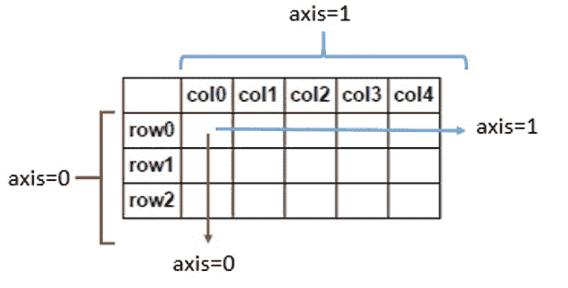
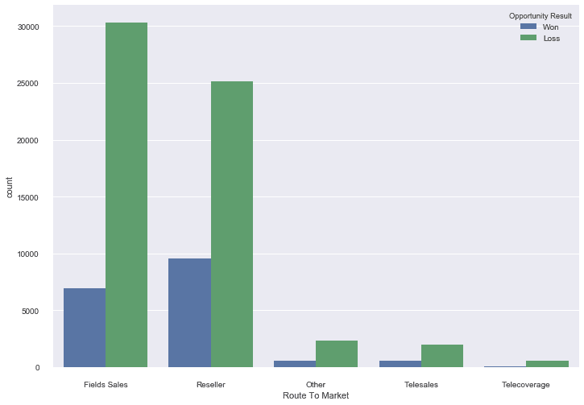
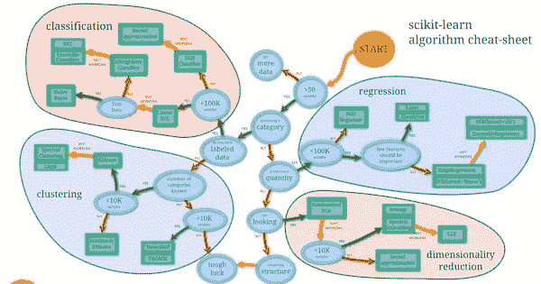
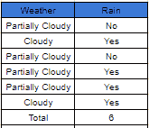
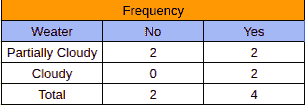
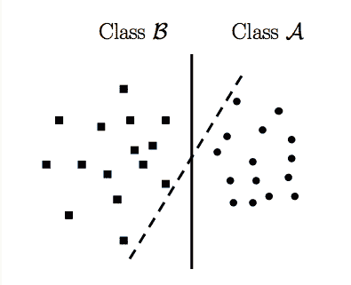
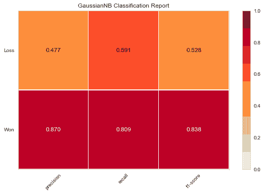
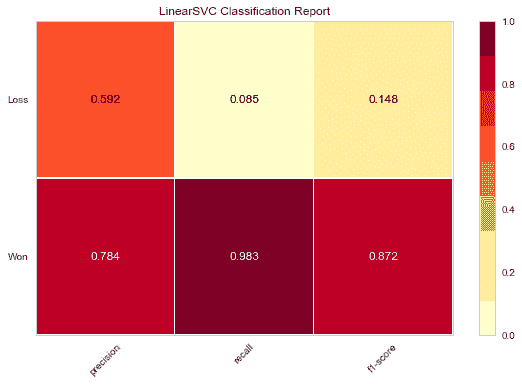
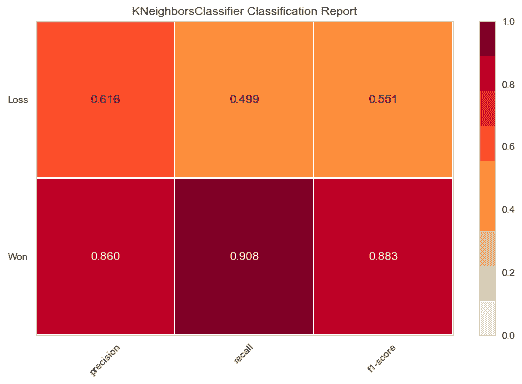

# Scikit-learn 教程:Python 中的机器学习

> 原文：<https://www.dataquest.io/blog/sci-kit-learn-tutorial/>

November 15, 2018

Scikit-learn 是一个免费的 Python 机器学习库。它具有各种算法，如支持向量机、随机森林和 k 邻居，它还支持 Python 数值和科学库，如`NumPy`和`SciPy`。

在本教程中，我们将学习在 scikit-learn 库的帮助下编写 python 代码并应用机器学习，scikit-learn 库的创建是为了使在 Python 中进行机器学习变得更容易和更健壮。

为此，我们将使用来自 IBM Watson 存储库的 [Sales_Win_Loss 数据](https://www.ibm.com/communities/analytics/watson-analytics-blog/sales-win-loss-sample-dataset/)。我们将使用 pandas 导入数据集，使用 pandas 方法如`head()`、`tail()`、`dtypes()`探索数据，然后尝试使用`Seaborn`中的绘图技术来可视化我们的数据。

然后我们将深入 scikit-learn 并使用 scikit-learn 中的`preprocessing.LabelEncoder()`来处理数据，并使用`train_test_split()`将数据集分成测试和训练样本。我们还将使用一个备忘单来帮助我们决定对数据集使用哪些算法。最后，我们将使用三种不同的算法(朴素贝叶斯、LinearSVC、K-Neighbors 分类器)进行预测，并使用 scikit-learn 库提供的`accuracy_score()`等方法比较它们的性能。我们还将使用 scikit-learn 和 Yellowbrick visualization 来可视化不同模型的性能得分。

为了从这篇文章中获得最大的收获，你可能已经熟悉了:

*   熊猫基础知识
*   Seaborn 和 matplotlib 基础知识

如果你需要温习这些话题，看看这些[熊猫](https://www.dataquest.io/blog/pandas-python-tutorial/)和[数据可视化](https://www.dataquest.io/blog/python-data-visualization-libraries/)的博客帖子。

## 数据集

在本教程中，我们将使用 IBM Watson 网站上提供的[销售盈亏数据集](https://community.watsonanalytics.com/wp-content/uploads/2015/04/WA_Fn-UseC_-Sales-Win-Loss.csv)。该数据集包含一家汽车零件批发供应商的销售活动数据。

我们将使用 scikit-learn 构建一个预测模型，告诉我们哪个销售活动会导致亏损，哪个会导致盈利。

让我们从导入数据集开始。

## 导入数据集

首先，我们将导入 pandas 模块，并使用一个变量`url`来存储要从中下载数据集的 url。

```py
#import necessary modules
import pandas as pd
#store the url in a variable
url = "https://community.watsonanalytics.com/wp-content/uploads/2015/04/WA_Fn-UseC_-Sales-Win-Loss.csv"
```

接下来，我们将使用 pandas 模块提供的`read_csv()`方法来读取包含逗号分隔值的`csv`文件，并将其转换为 pandas 数据帧。

```py
# Read in the data with `read_csv()`
sales_data = pd.read_csv(url)
```

上面的代码片段返回了一个变量`sales_data`，数据帧现在就存储在这个变量中。

对于不熟悉 pandas 的人来说，上面代码中的`pd.read_csv()`方法创建了一个称为`Dataframe`的表格数据结构，其中第一列包含唯一标记每行数据的索引，第一行包含每列的标签/名称，这是从数据集中保留的原始列名。上述代码片段中的`sales_data`变量的结构类似于下图。



来源:[堆栈溢出](https://stackoverflow.com/questions/25773245/ambiguity-in-pandas-dataframe-numpy-array-axis-definition)

在上图中，row0、row1、row2 是数据集中每个记录的索引，col0、col1、col2 等是数据集中每个列(特征)的列名。

现在，我们已经从数据源下载了数据集，并将其转换为 pandas 数据帧，让我们显示这个数据帧中的一些记录。为此，我们将使用`head()`方法。

```py
# Using .head() method to view the first few records of the data set
sales_data.head()
```

|  | 机会编号 | 供应分组 | 供应组 | 地区 | 通往市场的路线 | 销售阶段经过的天数 | 机会结果 | 销售阶段更改计数 | 通过结算确定的总天数 | 通过合格鉴定的总天数 | 机会金额美元 | 按收入划分的客户规模 | 按员工数量划分的客户规模 | 过去两年来自客户的收入 | 竞争对手类型 | 确定天数与总天数的比率 | 验证天数与总天数的比率 | 合格天数与总天数的比率 | 交易规模类别 |
| --- | --- | --- | --- | --- | --- | --- | --- | --- | --- | --- | --- | --- | --- | --- | --- | --- | --- | --- | --- |
| Zero | One million six hundred and forty-one thousand nine hundred and eighty-four | 外部配件 | 汽车配件 | 西北 | 现场销售 | Seventy-six | 获胜 | Thirteen | One hundred and four | One hundred and one | Zero | five | five | Zero | 未知的 | 0.69636 | 0.113985 | 0.154215 | one |
| one | One million six hundred and fifty-eight thousand and ten | 外部配件 | 汽车配件 | 太平洋 | 中间商 | Sixty-three | 失败 | Two | One hundred and sixty-three | One hundred and sixty-three | Zero | three | five | Zero | 未知的 | 0.00000 | 1.000000 | 0.000000 | one |
| Two | One million six hundred and seventy-four thousand seven hundred and thirty-seven | 摩托车零件 | 性能和非汽车 | 太平洋 | 中间商 | Twenty-four | 获胜 | seven | Eighty-two | Eighty-two | Seven thousand seven hundred and fifty | one | one | Zero | 未知的 | 1.00000 | 0.000000 | 0.000000 | one |
| three | One million six hundred and seventy-five thousand two hundred and twenty-four | 避难所和房车 | 性能和非汽车 | 中西部 | 中间商 | Sixteen | 失败 | five | One hundred and twenty-four | One hundred and twenty-four | Zero | one | one | Zero | 已知的 | 1.00000 | 0.000000 | 0.000000 | one |
| four | One million six hundred and eighty-nine thousand seven hundred and eighty-five | 外部配件 | 汽车配件 | 太平洋 | 中间商 | sixty-nine | 失败 | Eleven | Ninety-one | Thirteen | Sixty-nine thousand seven hundred and fifty-six | one | one | Zero | 未知的 | 0.00000 | 0.141125 | 0.000000 | four |

从上面的显示可以看出，`head()`方法向我们展示了数据集中的前几条记录。`head()`方法是 pandas 提供的一个非常漂亮的工具，可以帮助我们了解数据集的内容。我们将在下一节详细讨论`head()`方法。

## 数据探索

既然我们已经下载了数据集并将其转换成了熊猫数据框架，那么让我们快速浏览一下这些数据，看看这些数据能告诉我们什么，这样我们就可以计划我们的行动了。

数据探索是任何数据科学或机器学习项目中非常重要的一步。即使是对数据集的快速浏览也能给我们提供重要的信息，否则我们可能会错过这些信息，这些信息可以提示我们可以通过我们的项目尝试回答的重要问题。

为了探索数据集，我们将使用一些第三方 Python 库来帮助我们处理数据，以便它可以有效地用于 scikit-learn 的强大算法。但是我们可以从我们在上一节中使用的相同的`head()`方法开始查看导入的数据集的前几条记录，因为`head()`实际上能够做的远不止这些！我们可以定制`head()`方法，以便只显示特定数量的记录:

```py
# Using head() method with an argument which helps us to restrict the number of initial records that should be displayed
sales_data.head(n=2)
```

|  | 机会编号 | 供应分组 | 供应组 | 地区 | 通往市场的路线 | 销售阶段经过的天数 | 机会结果 | 销售阶段更改计数 | 通过结算确定的总天数 | 通过合格鉴定的总天数 | 机会金额美元 | 按收入划分的客户规模 | 按员工数量划分的客户规模 | 过去两年来自客户的收入 | 竞争对手类型 | 确定天数与总天数的比率 | 验证天数与总天数的比率 | 合格天数与总天数的比率 | 交易规模类别 |
| --- | --- | --- | --- | --- | --- | --- | --- | --- | --- | --- | --- | --- | --- | --- | --- | --- | --- | --- | --- |
| Zero | One million six hundred and forty-one thousand nine hundred and eighty-four | 外部配件 | 汽车配件 | 西北 | 现场销售 | Seventy-six | 获胜 | Thirteen | One hundred and four | One hundred and one | Zero | five | five | Zero | 未知的 | 0.69636 | 0.113985 | 0.154215 | one |
| one | One million six hundred and fifty-eight thousand and ten | 外部配件 | 汽车配件 | 太平洋 | 中间商 | Sixty-three | 失败 | Two | One hundred and sixty-three | One hundred and sixty-three | Zero | three | five | Zero | 未知的 | 0.00000 | 1.000000 | 0.000000 | one |

在上面的代码片段中，我们在`head()`方法中使用了一个参数，只显示数据集中的前两条记录。自变量`n=2`中的整数‘2’实际上表示数据帧`Sales_data`的第二个`index`。使用它，我们可以快速查看我们必须处理的数据类型。例如，我们可以看到“供应商组”和“区域”等列包含字符串数据，而“机会结果”、“机会编号”等列包含字符串数据。包含整数。此外，我们可以看到“Opportunity Number”列包含每条记录的唯一标识符。

现在我们已经查看了数据帧的初始记录，让我们尝试查看数据集中的最后几条记录。这可以使用`tail()`方法来完成，该方法与`head()`方法的语法相似。让我们看看`tail()`方法能做什么:

```py
# Using .tail() method to view the last few records from the dataframe
sales_data.tail()
```

|  | 机会编号 | 供应分组 | 供应组 | 地区 | 通往市场的路线 | 销售阶段经过的天数 | 机会结果 | 销售阶段更改计数 | 通过结算确定的总天数 | 通过合格鉴定的总天数 | 机会金额美元 | 按收入划分的客户规模 | 按员工数量划分的客户规模 | 过去两年来自客户的收入 | 竞争对手类型 | 确定天数与总天数的比率 | 验证天数与总天数的比率 | 合格天数与总天数的比率 | 交易规模类别 |
| --- | --- | --- | --- | --- | --- | --- | --- | --- | --- | --- | --- | --- | --- | --- | --- | --- | --- | --- | --- |
| Seventy-eight thousand and twenty | Ten million eighty-nine thousand nine hundred and thirty-two | 电池和配件 | 汽车配件 | 东南 | 中间商 | Zero | 失败 | Two | Zero | Zero | Two hundred and fifty thousand | one | one | three | 未知的 | Zero | Zero | Zero | six |
| Seventy-eight thousand and twenty-one | Ten million eighty-nine thousand nine hundred and sixty-one | 避难所和房车 | 性能和非汽车 | 东北 | 中间商 | Zero | 获胜 | one | Zero | Zero | One hundred and eighty thousand | one | one | Zero | 未知的 | Zero | Zero | Zero | five |
| Seventy-eight thousand and twenty-two | Ten million ninety thousand one hundred and forty-five | 外部配件 | 汽车配件 | 东南 | 中间商 | Zero | 失败 | Two | Zero | Zero | Ninety thousand | one | one | Zero | 未知的 | Zero | Zero | Zero | four |
| Seventy-eight thousand and twenty-three | Ten million ninety thousand four hundred and thirty | 外部配件 | 汽车配件 | 东南 | 现场销售 | Zero | 失败 | Two | Zero | Zero | One hundred and twenty thousand | one | one | Zero | 未知的 | One | Zero | Zero | five |
| Seventy-eight thousand and twenty-four | Ten million ninety-four thousand two hundred and fifty-five | 内部配件 | 汽车配件 | 大西洋中部 | 中间商 | Zero | 失败 | one | Zero | Zero | Ninety thousand | one | one | Zero | 未知的 | Zero | Zero | Zero | four |

上面代码片段中的`tail()`方法返回数据帧`sales_data`中的最后几条记录。我们也可以向`tail()`方法传递一个参数，只查看数据帧中有限数量的记录:

```py
# Using .tail() method with an argument which helps us to restrict the number of initial records that should be displayed
sales_data.tail(n=2)
```

| 机会编号 | 供应分组 | 供应组 | 地区 | 通往市场的路线 | 销售阶段经过的天数 | 机会结果 | 销售阶段更改计数 | 通过结算确定的总天数 | 通过合格鉴定的总天数 | 机会金额美元 | 按收入划分的客户规模 | 按员工数量划分的客户规模 | 过去两年来自客户的收入 | 竞争对手类型 | 确定天数与总天数的比率 | 验证天数与总天数的比率 | 合格天数与总天数的比率 | 交易规模类别 |
| Seventy-eight thousand and twenty-three | Ten million ninety thousand four hundred and thirty | 外部配件 | 汽车配件 | 东南 | 现场销售 | Zero | 失败 | Two | Zero | Zero | One hundred and twenty thousand | one | one | Zero | 未知的 | One | Zero | Zero | five |
| Seventy-eight thousand and twenty-four | Ten million ninety-four thousand two hundred and fifty-five | 内部配件 | 汽车配件 | 大西洋中部 | 中间商 | Zero | 失败 | one | Zero | Zero | Ninety thousand | one | one | Zero | 未知的 | Zero | Zero | Zero | four |

我们现在只能查看 dataframe 中的最后两条记录，如`tail()`方法中的参数`n=2`所示。与`head()`方法类似，`tail()`方法中参数`n=2`中的整数‘2’指向数据集`sales_data`中最后两条记录的第二个索引。

这最后两张唱片告诉了我们什么故事？查看数据框中拖车记录的“Opportunity Number”栏，我们清楚地看到总共有 78，024 条记录可用。从用`tail()`方法显示的记录的“索引”号可以明显看出这一点。

现在，如果我们能看到这个数据集中可用的不同数据类型，那就太好了；如果我们以后需要做一些转换，这些信息会很方便。我们可以在熊猫身上用`dtypes()`方法做到这一点:

```py
# using the dtypes() method to display the different datatypes available
sales_data.dtypes
```

```py
Opportunity Number int64
Supplies Subgroup object
Supplies Group object
Region object
Route To Market object
Elapsed Days In Sales Stage int64
Opportunity Result object
Sales Stage Change Count int64
Total Days Identified Through Closing int64
Total Days Identified Through Qualified int64
Opportunity Amount USD int64
Client Size By Revenue int64
Client Size By Employee Count int64
Revenue From Client Past Two Years int64
Competitor Type object
Ratio Days Identified To Total Days float64
Ratio Days Validated To Total Days float64
Ratio Days Qualified To Total Days float64
Deal Size Category int64
dtype: object
```

正如我们在上面的代码片段中看到的，使用`dtypes`方法，我们可以列出 Dataframe 中可用的不同列以及它们各自的数据类型。例如，我们可以看到 Supplies 子组列是一个`object`数据类型，而“按收入划分的客户规模”列是一个`integer`数据类型。所以，现在我们知道哪些列中有整数，哪些列中有字符串数据。

## 数据可视化

现在，我们已经完成了一些基本的数据探索，让我们尝试创建一些漂亮的图表来直观地表示数据，并揭示隐藏在数据集中的更多故事。

有许多 python 库提供了进行数据可视化的功能；一个这样的库是`Seaborn`。要使用 Seaborn plots，我们应该确保下载并安装了这个 python 模块。

让我们设置代码来使用`Seaborn`模块:

```py
# import the seaborn module
import seaborn as sns
# import the matplotlib module
import matplotlib.pyplot as plt
# set the background colour of the plot to white
sns.set(style="whitegrid", color_codes=True)
# setting the plot size for all plots
sns.set(rc={'figure.figsize':(11.7,8.27)})
# create a countplot
sns.countplot('Route To Market',data=sales_data,hue = 'Opportunity Result')
# Remove the top and down margin
sns.despine(offset=10, trim=True)
# display the plotplt.show()
```



现在我们已经设置好了 Seaborn，让我们更深入地看看我们刚刚做了什么。

首先我们导入了 Seaborn 模块和 matplotlib 模块。下一行中的`set()`方法有助于为我们的绘图设置不同的属性，如“样式”、“颜色”等。使用`sns.set(style="whitegrid", color_codes=True)`代码片段，我们将绘图的背景设置为浅色。然后我们用`sns.set(rc={'figure.figsize':(11.7,8.27)})`代码片段设置绘图大小，它将绘图图形大小定义为 11.7px 和 8.27px

接下来，我们使用`sns.countplot('Route To Market',data=sales_data,hue = 'Opportunity Result')`创建情节。`countplot()`方法帮助我们创建一个计数图，它公开了几个参数来根据我们的需要定制计数图。在这里，在`countplot()`方法的第一个参数中，我们将 X 轴定义为数据集中的‘走向市场’列。第二个参数是数据源，在本例中是我们在本教程的第一部分中创建的 dataframe `sales_data`。第三个参数是条形图的颜色，我们从`sales_data`数据框架的“机会结果”列中为“赢得”标签分配了“蓝色”，为“失去”标签分配了“绿色”。

更多关于 Seaborn countplots 的细节可以在这里找到。

那么，关于这些数据，计数图告诉了我们什么呢？第一件事是，数据集中‘loss’类型的记录比‘won’类型的记录多，我们可以从条形的大小看出这一点。查看 x 轴和 x 轴上每个标签的相应条，我们可以看到数据集的大部分数据都集中在图的左侧:朝向“现场销售”和“经销商”类别。另一件需要注意的事情是,“现场销售”类别比“经销商”类别损失更多。

我们为我们的图选择了走向市场列，因为在我们对`head()`和`tail()`方法的输出进行初步研究后，它似乎会提供有用的信息。但其他字段，如“区域”、“供应组”等。也可以用于以同样的方式制作地块。

现在，我们已经对我们的整体数据有了一个很好的可视化，让我们看看在其他 Seaborn 图的帮助下，我们可以挖掘出更多的信息。另一个流行的选项是`violinplots`，所以让我们创建一个小提琴情节，看看这种风格的情节能告诉我们什么。

我们将使用 Seaborn 模块提供的`violinplot()`方法来创建小提琴情节。让我们首先导入`seaborn`模块，并使用`set()`方法定制我们的绘图大小。我们将看到图形的大小为 16.7 像素乘以 13.27 像素:

```py
# import the seaborn module
import seaborn as sns
# import the matplotlib module
import matplotlib.pyplot as plt
# setting the plot size for all plots
sns.set(rc={'figure.figsize':(16.7,13.27)})
```

接下来，我们将使用`violinplot()`方法创建 violinplot，然后使用`show()`方法显示 plot

```py
# plotting the violinplot
sns.violinplot(x="Opportunity Result",y="Client Size By Revenue", hue="Opportunity Result", data=sales_data);
plt.show()
```

现在，我们的情节已经创建，让我们看看它告诉我们什么。最简单的形式是，小提琴图显示数据在标签间的分布。在上图中，我们在 x 轴上标注了“赢得”和“损失”，在 y 轴上标注了“按收入划分的客户规模”的值。violin 图向我们展示了最大的数据分布在客户端大小“1”中，其余客户端大小标签具有较少的数据。

这个 violin plot 为我们提供了非常有价值的见解，让我们了解数据是如何分布的，以及哪些要素和标注具有最大的数据集中度，但在 violin plot 的情况下，不仅仅是看起来那么简单。你可以通过[模块`Seaborn`的官方文档](https://seaborn.pydata.org/generated/seaborn.violinplot.html)更深入地挖掘小提琴情节的额外用途

## 预处理数据

现在，我们已经很好地了解了我们的数据是什么样子的，我们可以使用 scikit-learn 来准备它以构建预测模型。

我们在最初的探索中看到，数据集中的大多数列都是字符串，但是 scikit-learn 中的算法只理解数字数据。幸运的是，scikit-learn 库为我们提供了许多将字符串数据转换成数字数据的方法。一种这样的方法是`LabelEncoder()`方法。我们将使用这种方法将数据集中的分类标签(如‘won’和‘loss ’)转换成数字标签。为了形象化我们试图用`LabelEncoder()`方法实现的目标，让我们看看下面的图片。

下图显示了一个数据帧，它有一个名为“颜色”的列和三条记录“红色”、“绿色”和“蓝色”。


由于 scikit-learn 中的机器学习算法只理解数字输入，我们希望将“红色”、“绿色”和“蓝色”等分类标签转换为数字标签。当我们转换完原始数据帧中的分类标签后，我们会得到如下结果:


现在，让我们开始实际的转换过程。我们将使用由`LabelEncoder()`提供的`fit_transform()`方法对分类列中的标签进行编码，例如`sales_data`数据帧中的‘市场路线’,并将它们转换成类似于我们在上面的图表中所看到的数字标签。`fit_transform()`函数将用户定义的标签作为输入，然后返回编码标签。让我们通过一个简单的例子来理解编码是如何完成的。在下面的代码示例中，我们有一个城市列表，即`["paris", "paris", "tokyo", "amsterdam"]`，我们将尝试将这些字符串标签编码成类似于下面的内容—`[2, 2, 1,3]`。

```py
#import the necessary module
from sklearn import preprocessing
# create the Labelencoder object
le = preprocessing.LabelEncoder()
#convert the categorical columns into numeric
encoded_value = le.fit_transform(["paris", "paris", "tokyo", "amsterdam"])
print(encoded_value)
```

```py
[1 1 2 0]
```

瞧啊。我们已经成功地将字符串标签转换为数字标签。我们是怎么做到的？首先，我们导入了提供了`LabelEncoder()`方法的`preprocessing`模块。然后我们创建了一个代表`LabelEncoder()`类型的对象。接下来，我们使用这个对象的`fit_transform()`函数来区分列表`["paris", "paris", "tokyo", "amsterdam"]`的不同唯一类，然后返回一个具有各自编码值的列表，即`[1 1 2 0]`。

请注意`LabelEncoder()`方法是如何按照原始列表中类的第一个字母的顺序将数值分配给类的:“(a)msterdam”获得编码“0”，“p)aris 获得编码“1”，“t)okyo”获得编码“2”。

在各种编码需求下,`LabelEncoder()`提供了更多方便的功能。我们在这里不需要它们，但是要了解更多，一个很好的起点是[sci kit-learn](https://scikit-learn.org/stable/modules/generated/sklearn.preprocessing.LabelEncoder.html)的官方页面，这里详细描述了`LabelEncoder()`及其相关功能。

既然我们现在对`LabelEncoder()`的工作原理有了一个很好的了解，我们可以继续使用这个方法对来自`sales_data`数据帧的分类标签进行编码，并将它们转换成数字标签。在前面的部分中，在数据集的初始探索过程中，我们看到以下列包含字符串值:“供应品子组”、“区域”、“市场路线”、“机会结果”、“竞争对手类型”和“供应品组”。在我们开始编码这些字符串标签之前，让我们快速地看一下这些列包含的不同标签:-

```py
print("Supplies Subgroup' : ",sales_data['Supplies Subgroup'].unique())
print("Region : ",sales_data['Region'].unique())
print("Route To Market : ",sales_data['Route To Market'].unique())
print("Opportunity Result : ",sales_data['Opportunity Result'].unique())
print("Competitor Type : ",sales_data['Competitor Type'].unique())
print("'Supplies Group : ",sales_data['Supplies Group'].unique())
```

```py
Supplies Subgroup' : ['Exterior Accessories' 'Motorcycle Parts' 'Shelters & RV'
'Garage & Car Care' 'Batteries & Accessories' 'Performance Parts'
'Towing & Hitches' 'Replacement Parts' 'Tires & Wheels'
'Interior Accessories' 'Car Electronics']
Region : ['Northwest' 'Pacific' 'Midwest' 'Southwest' 'Mid-Atlantic' 'Northeast'
'Southeast']
Route To Market : ['Fields Sales' 'Reseller' 'Other' 'Telesales' 'Telecoverage']
Opportunity Result : ['Won' 'Loss']
Competitor Type : ['Unknown' 'Known' 'None']
'Supplies Group : ['Car Accessories' 'Performance & Non-auto' 'Tires & Wheels'
'Car Electronics']
```

我们现在已经布置了来自`sales_data`数据框架的不同分类列以及这些列下的唯一类。现在，是时候将这些字符串编码成数字标签了。为此，我们将运行下面的代码，然后深入了解它的工作原理:

```py
#import the necessary module
from sklearn import preprocessing
# create the Labelencoder object
le = preprocessing.LabelEncoder()
#convert the categorical columns into numeric
sales_data['Supplies Subgroup'] = le.fit_transform(sales_data['Supplies Subgroup'])
sales_data['Region'] = le.fit_transform(sales_data['Region'])
sales_data['Route To Market'] = le.fit_transform(sales_data['Route To Market'])
sales_data['Opportunity Result'] = le.fit_transform(sales_data['Opportunity Result'])
sales_data['Competitor Type'] = le.fit_transform(sales_data['Competitor Type'])
sales_data['Supplies Group'] = le.fit_transform(sales_data['Supplies Group'])
#display the initial records
sales_data.head()
```

|  | 机会编号 | 供应分组 | 供应组 | 地区 | 通往市场的路线 | 销售阶段经过的天数 | 机会结果 | 销售阶段更改计数 | 通过结算确定的总天数 | 通过合格鉴定的总天数 | 机会金额美元 | 按收入划分的客户规模 | 按员工数量划分的客户规模 | 过去两年来自客户的收入 | 竞争对手类型 | 确定天数与总天数的比率 | 验证天数与总天数的比率 | 合格天数与总天数的比率 | 交易规模类别 |
| --- | --- | --- | --- | --- | --- | --- | --- | --- | --- | --- | --- | --- | --- | --- | --- | --- | --- | --- | --- |
| Zero | One million six hundred and forty-one thousand nine hundred and eighty-four | Two | Zero | three | Zero | Seventy-six | one | Thirteen | One hundred and four | One hundred and one | Zero | five | five | Zero | Two | 0.69636 | 0.113985 | 0.154215 | one |
| one | One million six hundred and fifty-eight thousand and ten | Two | Zero | four | Two | Sixty-three | Zero | Two | One hundred and sixty-three | One hundred and sixty-three | Zero | three | five | Zero | Two | 0.00000 | 1.000000 | 0.000000 | one |
| Two | One million six hundred and seventy-four thousand seven hundred and thirty-seven | five | Two | four | Two | Twenty-four | one | seven | Eighty-two | Eighty-two | Seven thousand seven hundred and fifty | one | one | Zero | Two | 1.00000 | 0.000000 | 0.000000 | one |
| three | One million six hundred and seventy-five thousand two hundred and twenty-four | eight | Two | one | Two | Sixteen | Zero | five | One hundred and twenty-four | One hundred and twenty-four | Zero | one | one | Zero | Zero | 1.00000 | 0.000000 | 0.000000 | one |
| four | One million six hundred and eighty-nine thousand seven hundred and eighty-five | Two | Zero | four | Two | sixty-nine | Zero | Eleven | Ninety-one | Thirteen | Sixty-nine thousand seven hundred and fifty-six | one | one | Zero | Two | 0.00000 | 0.141125 | 0.000000 | four |

我们刚才做了什么？首先，我们导入了提供了`LabelEncoder()`方法的`preprocessing`模块。然后我们创建了一个类型为`labelEncoder()`的对象`le`。在接下来的几行中，我们使用了由`LabelEncoder()`提供的`fit_transform()`函数，并将不同列的分类标签(如“供应子组”、“区域”、“市场路线”)转换为数字标签。在此过程中，我们成功地将所有分类(字符串)列转换为数值。

既然我们已经准备好了数据并进行转换，那么*几乎*可以用于构建我们的预测模型了。但是我们仍然需要做一件重要的事情:

## 训练集和测试集

机器学习算法需要在一组数据上进行训练，以学习不同特征之间的关系以及这些特征如何影响目标变量。为此，我们需要将整个数据集分成两组。一个是训练集，我们将在其上训练我们的算法来建立一个模型。另一个是测试集，我们将在上面测试我们的模型，看看它的预测有多准确。

但是在进行所有这些拆分之前，让我们首先分离我们的特性和目标变量。与本教程之前一样，我们将首先运行下面的代码，然后仔细看看它做了什么:

```py
# select columns other than 'Opportunity Number','Opportunity Result'cols = [col for col in sales_data.columns if col not in ['Opportunity Number','Opportunity Result']]
# dropping the 'Opportunity Number'and 'Opportunity Result' columns
data = sales_data[cols]
#assigning the Oppurtunity Result column as target
target = sales_data['Opportunity Result']
data.head(n=2)
```

|  | 供应分组 | 供应组 | 地区 | 通往市场的路线 | 销售阶段经过的天数 | 销售阶段更改计数 | 通过结算确定的总天数 | 通过合格鉴定的总天数 | 机会金额美元 | 按收入划分的客户规模 | 按员工数量划分的客户规模 | 过去两年来自客户的收入 | 竞争对手类型 | 确定天数与总天数的比率 | 验证天数与总天数的比率 | 合格天数与总天数的比率 | 交易规模类别 |
| --- | --- | --- | --- | --- | --- | --- | --- | --- | --- | --- | --- | --- | --- | --- | --- | --- | --- |
| Zero | Two | Zero | three | Zero | Seventy-six | Thirteen | One hundred and four | One hundred and one | Zero | five | five | Zero | Two | 0.69636 | 0.113985 | 0.154215 | one |
| one | Two | Zero | four | Two | Sixty-three | Two | One hundred and sixty-three | One hundred and sixty-three | Zero | three | five | Zero | Two | 0.00000 | 1.000000 | 0.000000 | one |

好吧，那我们刚才做了什么？首先，我们不需要“Opportunity Number”列，因为它只是每个记录的唯一标识符。此外，我们希望预测“机会结果”，因此它应该是我们的“目标”而不是“数据”的一部分。因此，在上面代码的第一行，我们只选择了与“Opportunity Number”和“Opportunity Result”不匹配的列，并将它们分配给一个变量`cols`。接下来，我们用列表`cols`中的列创建了一个新的数据框架`data`。这将作为我们的功能集。然后，我们从数据框架`sales_data`中取出“机会结果”列，并创建了一个新的数据框架`target`。

就是这样！我们已经准备好将我们的功能和目标定义到两个独立的数据框架中。接下来，我们将把数据帧`data`和`target`分成训练集和测试集。分割数据集时，我们将保留 30%的数据作为测试数据，剩余的 70%作为训练数据。但是请记住，这些数字是任意的，最佳分割将取决于您正在处理的特定数据。如果您不确定如何分割数据，80/20 原则是一个不错的默认方法，即您将 80%的数据作为训练数据，将剩余的 20%作为测试数据。然而，对于本教程，我们将坚持我们先前的决定，保留 30%的数据作为测试数据。scikit-learn 中的`train_test_split()`方法可用于拆分数据:

```py
#import the necessary module
from sklearn.model_selection import train_test_split
#split data set into train and test setsdata_train, data_test, target_train, target_test = train_test_split(data,target, test_size = 0.30, random_state = 10)
```

这样，我们现在已经成功地准备了一个测试集和一个训练集。在上面的代码中，我们首先导入了 train_test_split 模块。接下来我们使用`train_test_split()`方法将数据分为训练集(data_train，target_train)和测试集(data_test，data_train)。`train_test_split()`方法的第一个参数是我们在上一节中分离出来的特性，第二个参数是目标(“机会结果”)。第三个参数“test_size”是我们希望分离出来作为训练数据的数据的百分比。在我们的例子中是 30%，尽管这可以是任何数字。第四个参数“random_state”只是确保我们每次都能获得可重复的结果。

现在，我们已经准备好了一切，接下来是本教程最重要和最有趣的部分:使用 scikit-learn 提供的庞大算法库构建预测模型。

## 构建模型

在 scikit learn 的网站上有一个`machine_learning_map`可用[，我们可以在选择算法时使用它作为快速参考。它看起来像这样:](https://scikit-learn.org/stable/tutorial/machine_learning_map/)



我们可以使用该图作为备忘单，列出可以用来构建预测模型的算法。使用清单，让我们看看我们属于哪一类:

*   超过 50 个样本–检查
*   我们是在预测一个类别吗——检查
*   我们已经标记了数据？(*商机金额等名称明确的数据。*)–检查
*   少于 10 万个样本–检查

基于我们上面准备的清单，按照`machine_learning_map`我们可以尝试下面提到的算法。

*   朴素贝叶斯
*   线性 SVC
*   k-邻居分类器

scikit-learn 库的真正魅力在于它为不同的算法公开了高级 API，使我们更容易尝试不同的算法，并比较模型的准确性，以了解什么最适合我们的数据集。

让我们开始一个接一个地尝试不同的算法。

### 朴素贝叶斯

Scikit-learn 提供了一组分类算法，这些算法“天真地”假设数据集中的每一对特征都是独立的。这个假设就是[贝叶斯定理](https://en.wikipedia.org/wiki/Bayes%27_theorem)的底层原理。基于这一原理的算法被称为朴素贝叶斯算法。

在很高的层次上，朴素贝叶斯算法计算特征与目标变量的关联概率，然后选择概率最高的特征。让我们试着用一个非常简单的问题陈述来理解这一点:今天会下雨吗？假设我们有一组天气数据，这将是我们的特征集，而“下雨”的概率将是我们的目标。基于这个特性集，我们可以创建一个表来显示特定特性/目标对出现的次数。它看起来会像这样:



在上表中，特征(列)“天气”包含标签(“部分多云”和“多云”)，列“雨”包含与特征“天气”一致的雨的出现(是/否)。每当一个特征与雨有关时，它被记录为“是”,而当该特征不导致雨时，它被记录为“否”。现在，我们可以使用事件表中的数据创建另一个称为“频率表”的表，在该表中，我们可以记录与每个功能相关的“是”和“否”答案的数量:



最后，我们将“发生表”和“频率表”中的数据结合起来，创建一个“可能性表”。该表列出了每个特征的“是”和“否”的数量，然后使用该数据计算每个特征对降雨发生的贡献概率:


请注意上表中的“个人概率”一栏。从“发生率表”和“可能性表”中，我们发现特征“部分多云”和“多云”出现了 6 次。很明显，特征“部分多云”出现了 4 次(2 次表示“否”，2 次表示“是”)。当我们用“出现表”中的“总数”除以特定特征的“否”和“是”的出现次数时，我们得到了该特定特征的概率。在我们的例子中，如果我们需要找出哪一个特征最有可能导致降雨的发生，那么我们将每个特征的“否”的总数加上“频率表”中它们各自的“是”数，然后将总和除以“发生率表”中的“总数”。这给了我们这些特征中的每一个与降雨相一致的概率。

我们将为销售数据使用的算法是`Gaussian Naive Bayes`，它基于一个类似于我们刚刚在上面探索的天气示例的概念，尽管在数学上要复杂得多。对‘朴素贝叶斯’算法的更详细的解释可以在这里找到给那些希望更深入研究的人。

现在让我们实现来自 scikit 的高斯朴素贝叶斯或`GaussianNB`算法——学习创建我们的预测模型:

```py
# import the necessary module
from sklearn.naive_bayes import GaussianNB
from sklearn.metrics import accuracy_score
#create an object of the type GaussianNB
gnb = GaussianNB()
#train the algorithm on training data and predict using the testing data
pred = gnb.fit(data_train, target_train).predict(data_test)
#print(pred.tolist())
#print the accuracy score of the model
print("Naive-Bayes accuracy : ",accuracy_score(target_test, pred, normalize = True))
```

```py
Naive-Bayes accuracy : 0.759056732741
```

现在让我们仔细看看我们刚刚做了什么。首先，我们导入了`GaussianNB`方法和`accuracy_score`方法。然后我们创建了一个类型为`GaussianNB`的对象`gnb`。之后，我们使用`fit()`方法对测试数据(data_train)和测试目标(target_train)进行算法训练，然后使用`predict()`方法对测试数据中的目标进行预测。最后，我们使用`accuracy_score()`方法打印了分数，并成功应用了`Naive-Bayes`算法来构建预测模型。

现在让我们看看列表中的其他算法与朴素贝叶斯算法相比表现如何。

### 线性调频

LinearSVC 或线性支持向量分类是`SVM`(支持向量机)类的一个子类。我们不会深入这类算法所涉及的复杂数学，但在一个非常基本的层面上，LinearSVC 试图将数据划分到不同的平面，以便它可以找到不同类别的最佳可能分组。为了清楚地理解这个概念，让我们想象一个由“点”和“方块”组成的数据集，沿着两个轴分成两个二维空间，如下图所示:


来源: [StackOverflow](https://stats.stackexchange.com/questions/23391/how-does-a-support-vector-machine-svm-work)

在上图中，`LinearSVC`实现试图以这样一种方式划分二维空间，即两类数据即`dots`和`squares`被清晰地划分。这里的两行直观地表示了`LinearSVC`试图实现的不同划分，以区分两个可用的类。

对于那些想要更多细节的人来说，可以在这里找到一篇解释`Support Vector Machine(SVM)`的非常好的文章，但是现在，让我们开始动手做吧:

```py
#import the necessary modules
from sklearn.svm import LinearSVC
from sklearn.metrics import accuracy_score
#create an object of type LinearSVC
svc_model = LinearSVC(random_state=0)
#train the algorithm on training data and predict using the testing data
pred = svc_model.fit(data_train, target_train).predict(data_test)
#print the accuracy score of the model
print("LinearSVC accuracy : ",accuracy_score(target_test, pred, normalize = True))
```

```py
LinearSVC accuracy : 0.777811004785
```

类似于我们在 GaussianNB 实现期间所做的，我们在前两行中导入了所需的模块。然后我们创建了一个 LinearSVC 类型的对象【with random _ state 为‘0’。坚持住！什么是“随机状态”？简单地说，`random_state`是一个给内置随机数发生器的指令，以特定的顺序打乱数据。

接下来，我们根据训练数据训练 LinearSVC，然后使用测试数据预测目标。最后，我们使用`accuracy_score()`方法检查了准确性分数。

既然我们已经尝试了`GaussianNB`和`LinearSVC`算法，我们将尝试列表中的最后一个算法，那就是`K-nearest neighbours classifier`

### k 近邻分类器

与我们之前使用的两个算法相比，这个分类器稍微复杂一些。出于本教程的目的，我们最好使用 scikit-learn 提供的`KNeighborsClassifier`类，不用太担心算法是如何工作的。(但是如果你感兴趣，可以在[这里](https://en.wikipedia.org/wiki/K-nearest_neighbors_algorithm)找到关于这类算法的详细解释)

现在，让我们实现 K-Neighbors 分类器，看看它的得分情况:

```py
#import necessary modules
from sklearn.neighbors import KNeighborsClassifier
from sklearn.metrics import accuracy_score
#create object of the lassifier
neigh = KNeighborsClassifier(n_neighbors=3)
#Train the algorithm
neigh.fit(data_train, target_train)
# predict the response
pred = neigh.predict(data_test)
# evaluate accuracy
print ("KNeighbors accuracy score : ",accuracy_score(target_test, pred))
```

```py
KNeighbors accuracy score : 0.814550580998
```

上面的代码可以像前面的实现一样进行解释。首先我们导入了必要的模块，然后我们创建了 KNeighborsClassifier 类型的对象`neigh`，邻居的数量是`n_neighbors=3`。然后我们使用`fit()`方法在训练集上训练我们的算法，然后我们在测试数据上测试模型。最后，我们打印出准确度分数。

现在我们已经实现了列表中的所有算法，我们可以简单地比较所有模型的得分，以选择得分最高的模型。但是，如果我们有办法直观地比较不同型号的性能，那不是很好吗？我们可以使用 scikit-learn 中的 [`yellowbrick`](https://www.scikit-yb.org/en/latest/tutorial.html#visual-model-evaluation) 库，它提供了可视化表示不同评分方法的方法。

## 性能比较

在前面的章节中，我们使用了`accuracy_score()`方法来衡量不同算法的准确性。现在，我们将使用由`Yellowbrick`库提供的`ClassificationReport`类来给我们一个我们的模型如何执行的可视化报告。

### 高斯安 b

让我们从`GaussianNB`模型开始:

```py
from yellowbrick.classifier import ClassificationReport
# Instantiate the classification model and visualizer
visualizer = ClassificationReport(gnb, classes=['Won','Loss'])
visualizer.fit(data_train, target_train) # Fit the training data to the visualizer
visualizer.score(data_test, target_test) # Evaluate the model on the test data
g = visualizer.poof() # Draw/show/poof the data
```



在上面的代码中，首先我们导入由`yellowbrick.classifier`模块提供的`ClassificationReport`类。接下来，创建一个类型为`ClassificationReport`的对象`visualizer`。这里的第一个参数是在‘朴素贝叶斯’部分实现`Naive-Bayes`算法时创建的`GaussianNB`对象`gnb`。第二个参数包含来自`sales_data`数据框架的“Opportunity Result”列的标签“Won”和“Loss”。

接下来，我们使用`fit()`方法来训练`visualizer`对象。接下来是`score()`方法，使用`gnb`对象按照`GaussianNB`算法进行预测，然后计算该算法所做预测的准确度分数。最后，我们使用`poof()`方法为`GaussianNB`算法绘制不同分数的图表。注意不同的分数是如何排列在“赢”和“输”的标签上的；这使我们能够可视化不同目标类别的分数。

### 线性调频

与我们在上一节中所做的类似，我们也可以绘制出`LinearSVC`算法的准确度分数:

```py
from yellowbrick.classifier import ClassificationReport
# Instantiate the classification model and visualizer
visualizer = ClassificationReport(svc_model, classes=['Won','Loss'])
visualizer.fit(data_train, target_train) # Fit the training data to the visualizer
visualizer.score(data_test, target_test) # Evaluate the model on the test data
g = visualizer.poof() # Draw/show/poof the data
```



在上面的代码中，首先我们导入了由`yellowbrick.classifier`模块提供的`ClassificationReport`类。接下来，创建了一个类型为`ClassificationReport`的对象`visualizer`。这里第一个参数是`LinearSVC`对象`svc_model`，它是在实现“LinearSVC”部分的`LinearSVC`算法时创建的。第二个参数包含来自`sales_data`数据框架的“Opportunity Result”列的标签“Won”和“Loss”。

接下来，我们使用`fit()`方法来训练‘SVC _ model’对象。接下来是`score()`方法，该方法使用`svc_model`对象根据`LinearSVC`算法进行预测，然后计算该算法所做预测的准确度分数。最后，我们使用`poof()`方法画出了`LinearSVC`算法的不同分数。

### 近邻分类器

现在，让我们对 K 近邻分类器分数做同样的事情。

```py
from yellowbrick.classifier import ClassificationReport
# Instantiate the classification model and visualizer
visualizer = ClassificationReport(neigh, classes=['Won','Loss'])
visualizer.fit(data_train, target_train) # Fit the training data to the visualizer
visualizer.score(data_test, target_test) # Evaluate the model on the test data
g = visualizer.poof() # Draw/show/poof the data
```



同样，我们首先导入由`yellowbrick.classifier`模块提供的`ClassificationReport`类。接下来，创建一个类型为`ClassificationReport`的对象`visualizer`。这里第一个参数是`KNeighborsClassifier`对象`neigh`，它是在实现‘KNeighborsClassifier’部分的`KNeighborsClassifier`算法时创建的。第二个参数包含来自`sales_data`数据框架的“Opportunity Result”列的标签“Won”和“Loss”。

接下来，我们使用`fit()`方法来训练“邻居”对象。接下来是`score()`方法，该方法使用`neigh`对象根据`KNeighborsClassifier`算法进行预测，然后计算该算法所做预测的准确度分数。最后，我们使用`poof()`方法画出`KNeighborsClassifier`算法的不同分数的曲线图。

现在我们已经可视化了结果，比较分数和选择最适合我们需求的算法就容易多了。

## 结论

scikit-learn 库提供了许多不同的算法，这些算法可以导入到代码中，然后用来构建模型，就像我们导入任何其他 Python 库一样。这使得快速构建不同的模型并比较这些模型以选择得分最高的模型变得更加容易。

在本教程中，我们仅仅触及了 scikit-learn 库的皮毛。为了最大限度地使用这个机器学习库，scikit-learn 的[官方页面上有许多资源，其中包含详细的文档，您可以深入研究。scikit-learn 的快速入门指南可以在](https://scikit-learn.org)[这里](https://scikit-learn.org/stable/tutorial/basic/tutorial.html)找到，对于刚刚开始探索机器学习世界的初学者来说，这是一个很好的切入点。

但是，要真正体会 scikit-learn 库的真正威力，您真正需要做的是开始在不同的开放数据集上使用它，并使用这些数据集构建预测模型。开放数据集的来源包括 [Kaggle](https://www.kaggle.com/) 和 [Data.world](https://data.world/open-data-community) 。两者都包含许多有趣的数据集，在这些数据集上，人们可以通过使用 scikit-learn 库提供的算法来练习构建预测模型。

## 这个教程有帮助吗？

选择你的道路，不断学习有价值的数据技能。

[Python Tutorials](/python-tutorials-for-data-science/)

在我们的免费教程中练习 Python 编程技能。

[Data science courses](/data-science-courses/)

通过我们的交互式浏览器数据科学课程，投入到 Python、R、SQL 等语言的学习中。