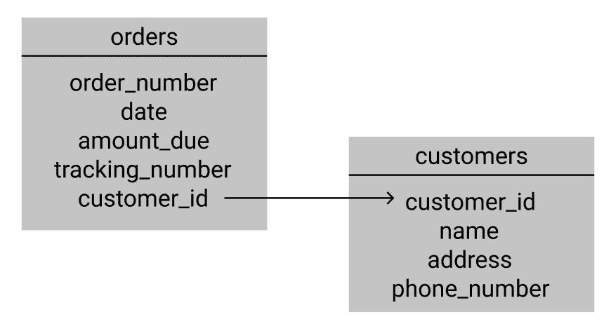

# SQL 基础知识——分析自行车共享的实用初级 SQL 教程

> 原文：<https://www.dataquest.io/blog/sql-basics/>

February 1, 2021

在本教程中，我们将使用来自自行车共享服务 [Hubway](https://www.thehubway.com) 的数据集，其中包括使用该服务进行的超过 150 万次旅行的数据。


在开始用 SQL 编写我们自己的查询之前，我们将从了解数据库、它们是什么以及我们为什么使用它们开始。

如果你想继续下去，你可以在这里下载`hubway.db`文件[(130 MB)。](https://www.dataquest.io/blog/large_files/hubway.db)

## SQL 基础:关系数据库

关系数据库是一种跨多个表存储相关信息的数据库，允许您同时查询多个表中的信息。

通过思考一个例子，更容易理解这是如何工作的。假设你是一家企业，你想跟踪你的销售信息。您可以在 Excel 中设置一个电子表格，将所有要跟踪的信息作为单独的列:订单号、日期、到期金额、发货跟踪号、客户姓名、客户地址和客户电话号码。


这种设置可以很好地跟踪您需要的信息，但是当您开始从同一个客户那里获得重复订单时，您会发现他们的姓名、地址和电话号码存储在您的电子表格的多行中。

随着您的业务增长和您跟踪的订单数量增加，这些冗余数据将占用不必要的空间，通常会降低您的销售跟踪系统的效率。您可能还会遇到数据完整性的问题。例如，不能保证每个字段都填充了正确的数据类型，也不能保证每次都以完全相同的方式输入姓名和地址。



使用关系数据库，如上图所示，可以避免所有这些问题。您可以设置两个表，一个用于订单，一个用于客户。“客户”表将包括每个客户的唯一 ID 号，以及我们已经在跟踪的姓名、地址和电话号码。“订单”表将包括您的订单号、日期、到期金额、跟踪号，并且它将有一列用于客户 ID，而不是为每一项客户数据提供单独的字段。

这使我们能够调出任何给定订单的所有客户信息，但我们只需在数据库中存储一次，而不是为每一个订单列出一次。

## 我们的数据集

让我们先来看看我们的数据库。数据库有两个表，`trips`和`stations`。首先，我们只看一下`trips`表。它包含以下列:

*   `id` —作为每次行程参考的唯一整数
*   `duration` —行程的持续时间，以秒为单位
*   `start_date` —旅行开始的日期和时间
*   `start_station` —一个整数，对应于行程开始站的`stations`表中的`id`列
*   `end_date` —旅行结束的日期和时间
*   `end_station` —旅程结束的车站的“id”
*   `bike_number` — Hubway 在旅途中使用的自行车的唯一标识符
*   `sub_type` —用户的订阅类型。`"Registered"`为会员用户，`"Casual"`为非会员用户
*   `zip_code` —用户的邮政编码(仅适用于注册会员)
*   `birth_date` —用户的出生年份(仅适用于注册会员)
*   `gender` —用户的性别(仅适用于注册会员)

## 我们的分析

有了这些信息和我们很快会学到的 SQL 命令，下面是我们在这篇文章中试图回答的一些问题:

*   最长的一次旅行持续了多长时间？
*   “注册”用户进行了多少次旅行？
*   平均旅行持续时间是多长？
*   注册用户或临时用户需要更长的行程吗？
*   哪辆自行车被用于最多的旅行？
*   30 岁以上用户的平均旅行时长是多少？

我们将使用以下 SQL 命令来回答这些问题:

*   `SELECT`
*   `WHERE`
*   `LIMIT`
*   `ORDER BY`
*   `GROUP BY`
*   `AND`
*   `OR`
*   `MIN`
*   `MAX`
*   `AVG`
*   `SUM`
*   `COUNT`

## 安装和设置

出于本教程的目的，我们将使用名为 [SQLite3](https://www.sqlite.org) 的数据库系统。从 2.5 版本开始，SQLite 就是 Python 的一部分，所以如果你安装了 Python，你几乎肯定也会安装 SQLite。如果你还没有 Python 和 SQLite3 库，可以很容易地用 [Anaconda](https://www.continuum.io/downloads) 安装和设置它们。

使用 Python 来运行我们的 SQL 代码允许我们将结果导入到 Pandas 数据框架中，从而更容易以易读的格式显示我们的结果。这也意味着我们可以对从数据库中提取的数据进行进一步的分析和可视化，尽管这超出了本教程的范围。

或者，如果我们不想使用或安装 Python，我们可以从命令行运行 SQLite3。只需从 [SQLite3 网页](https://sqlite.org/download.html)下载“预编译二进制文件”并使用以下代码打开数据库:

```py
~$ sqlite hubway.db SQLite version 3.14.0 2016-07-26 15:17:14Enter ".help" for usage hints.sqlite>
```

在这里，我们只需输入想要运行的查询，我们将在终端窗口中看到返回的数据。

使用终端的另一种方法是通过 Python 连接到 SQLite 数据库。这将允许我们使用 Jupyter 笔记本，这样我们就可以在一个整洁的表格中看到我们的查询结果。

为此，我们将定义一个函数，该函数将我们的查询(存储为字符串)作为输入，并将结果显示为格式化的数据帧:

```py
import sqlite3
span class="token keyword">import pandas as pd
b = sqlite3.connect('hubway.db')
span class="token keyword">def run_query(query):
   return pd.read_sql_query(query,db)
```

当然，我们不一定要用 Python 搭配 SQL。如果你已经是一名 R 程序员，我们的[面向 R 用户的 SQL 基础课程](https://www.dataquest.io/course/sql-fundamentals-r/)将是一个很好的起点。

## 挑选

我们将使用的第一个命令是`SELECT`。`SELECT`将是我们编写的几乎每个查询的基础——它告诉数据库我们想要看到哪些列。我们可以通过名称(用逗号分隔)来指定列，或者使用通配符`*`来返回表中的每一列。

除了我们想要检索的列之外，我们还必须告诉数据库从哪个表中获取它们。为此，我们使用关键字`FROM`后跟表名。例如，如果我们希望在`trips`表中看到每次旅行的`start_date`和`bike_number`，我们可以使用以下查询:

```py
SELECT start_date, bike_number FROM trips;
```

在这个例子中，我们从`SELECT`命令开始，这样数据库就知道我们希望它为我们找到一些数据。然后我们告诉数据库我们对`start_date`和`bike_number`列感兴趣。最后，我们使用`FROM`让数据库知道我们想要查看的列是`trips`表的一部分。

编写 SQL 查询时需要注意的一件重要事情是，我们希望用分号(`;`)结束每个查询。实际上并不是每个 SQL 数据库都需要这样，但有些确实需要，所以最好养成这个习惯。

## 限制

在开始对 Hubway 数据库运行查询之前，我们需要知道的下一个命令是`LIMIT`。`LIMIT`简单地告诉数据库您希望它返回多少行。

我们在上一节中看到的`SELECT`查询将为`trips`表中的每一行返回所请求的信息，但有时这可能意味着大量数据。我们可能不需要全部。相反，如果我们希望在数据库中看到前五次旅行的`start_date`和`bike_number`，我们可以将`LIMIT`添加到我们的查询中，如下所示:

```py
SELECT start_date, bike_number FROM trips LIMIT 5;
```

我们简单地添加了`LIMIT`命令，然后添加了一个表示我们希望返回的行数的数字。在这种情况下，我们使用 5，但是您可以用任何数字来替换它，以便为您正在处理的项目获取适当的数据量。

在本教程中，我们将在对 Hubway 数据库的查询中大量使用`LIMIT`—`trips`表包含超过 150 万行数据，我们当然不需要显示所有这些数据！

让我们在 Hubway 数据库上运行第一个查询。首先，我们将查询存储为一个字符串，然后使用我们之前定义的函数在数据库上运行它。看一下下面的例子:

```py
query = 'SELECT * FROM trips LIMIT 5;'
un_query(query)
```

|  | 身份证明（identification） | 期间 | 开始日期 | 起点站 | 结束日期 | 终点站 | 自行车 _ 号码 | 子类型 | 邮政编码 | 出生日期 | 性别 |
| --- | --- | --- | --- | --- | --- | --- | --- | --- | --- | --- | --- |
| Zero | one | nine | 2011-07-28 10:12:00 | Twenty-three | 2011-07-28 10:12:00 | Twenty-three | B00468 | 注册的 | ‘97217 | One thousand nine hundred and seventy-six | 男性的 |
| one | Two | Two hundred and twenty | 2011-07-28 10:21:00 | Twenty-three | 2011-07-28 10:25:00 | Twenty-three | B00554 | 注册的 | ‘02215 | One thousand nine hundred and sixty-six | 男性的 |
| Two | three | fifty-six | 2011-07-28 10:33:00 | Twenty-three | 2011-07-28 10:34:00 | Twenty-three | B00456 | 注册的 | ‘02108 | One thousand nine hundred and forty-three | 男性的 |
| three | four | Sixty-four | 2011-07-28 10:35:00 | Twenty-three | 2011-07-28 10:36:00 | Twenty-three | B00554 | 注册的 | ‘02116 | One thousand nine hundred and eighty-one | 女性的 |
| four | five | Twelve | 2011-07-28 10:37:00 | Twenty-three | 2011-07-28 10:37:00 | Twenty-three | B00554 | 注册的 | ‘97214 | One thousand nine hundred and eighty-three | 女性的 |

该查询使用`*`作为通配符，而不是指定要返回的列。这意味着`SELECT`命令已经给了我们`trips`表中的每一列。我们还使用了`LIMIT`函数将输出限制在表的前五行。

您会经常看到人们在查询中使用大写的 commmand 关键字(这是我们将在本教程中遵循的惯例)，但这主要是个人偏好的问题。这种大写使代码更容易阅读，但它实际上不会以任何方式影响代码的功能。如果您更喜欢用小写命令编写查询，查询仍然会正确执行。

我们之前的例子返回了`trips`表中的每一列。如果我们只对`duration`和`start_date`列感兴趣，我们可以用列名替换通配符，如下所示:

```py
query = 'SELECT duration, start_date FROM trips LIMIT 5'
un_query(query)
```

|  | 期间 | 开始日期 |
| --- | --- | --- |
| Zero | nine | 2011-07-28 10:12:00 |
| one | Two hundred and twenty | 2011-07-28 10:21:00 |
| Two | fifty-six | 2011-07-28 10:33:00 |
| three | Sixty-four | 2011-07-28 10:35:00 |
| four | Twelve | 2011-07-28 10:37:00 |

## 以...排序

在回答第一个问题之前，我们需要知道的最后一个命令是`ORDER BY`。这个命令允许我们根据给定的列对数据库进行排序。

要使用它，我们只需指定要排序的列的名称。默认情况下，`ORDER BY`按升序排序。如果我们想要指定数据库应该排序的顺序，我们可以添加关键字`ASC`进行升序排序，或者添加关键字`DESC`进行降序排序。

例如，如果我们想将`trips`表从最短的`duration`到最长的进行排序，我们可以在查询中添加下面一行:

```py
ORDER BY duration ASC
```

有了我们的指令清单中的`SELECT`、`LIMIT`和`ORDER BY`命令，我们现在可以尝试回答我们的第一个问题:**最长的旅行持续了多长时间？**

要回答这个问题，将它分成几个部分并确定我们需要哪些命令来处理每个部分是很有帮助的。

首先，我们需要从`trips`表的`duration`列中提取信息。然后，为了找出哪一次旅行最长，我们可以按降序对`duration`列进行排序。下面是我们如何解决这个问题，提出一个查询来获取我们正在寻找的信息:

*   使用`SELECT`检索`duration`列`FROM`和`trips`表
*   使用`ORDER BY`对`duration`列进行排序，并使用`DESC`关键字指定您想要按降序排序
*   使用`LIMIT`将输出限制为 1 行

以这种方式使用这些命令将返回持续时间最长的一行，这将为我们提供问题的答案。

还有一点需要注意——随着您的查询添加更多命令并变得更加复杂，您可能会发现如果您将它们分成多行，会更容易阅读。这和大写一样，是个人喜好问题。它不影响代码如何运行(系统只是从头开始读取代码，直到它到达分号)，但它可以使您的查询更清晰，更容易理解。在 Python 中，我们可以使用三重引号将一个字符串分隔成多行。

让我们继续运行这个查询，找出最长的旅行持续了多长时间。

```py
query = '''
ELECT duration FROM trips
RDER BY duration DESC
IMIT 1;
''
un_query(query)
```

|  | 期间 |
| --- | --- |
| Zero | nine thousand nine hundred ninety nine |

现在我们知道最长的一次旅行持续了 9999 秒，也就是 166 分钟多一点。然而，最大值为 9999，我们不知道这是否真的是最长旅程的长度，或者数据库是否只允许四位数。

如果特别长的旅行真的被数据库缩短了，那么我们可能会看到很多旅行在 9999 秒达到极限。让我们尝试运行与之前相同的查询，但是调整`LIMIT`以返回 10 个最高的持续时间，看看情况是否如此:

```py
query = '''
ELECT durationFROM trips
RDER BY duration DESC
IMIT 10
''
un_query(query)
```

|  | 期间 |
| --- | --- |
| Zero | nine thousand nine hundred ninety nine |
| one | Nine thousand nine hundred and ninety-eight |
| Two | Nine thousand nine hundred and ninety-eight |
| three | Nine thousand nine hundred and ninety-seven |
| four | Nine thousand nine hundred and ninety-six |
| five | Nine thousand nine hundred and ninety-six |
| six | Nine thousand nine hundred and ninety-five |
| seven | Nine thousand nine hundred and ninety-five |
| eight | Nine thousand nine hundred and ninety-four |
| nine | Nine thousand nine hundred and ninety-four |

我们在这里看到的是，在 9999 没有一大堆旅行，所以看起来我们并没有切断我们的持续时间的顶端，但仍然很难判断这是旅行的真实长度还是只是最大允许值。

Hubway 对超过 30 分钟的骑行收取额外费用(有人骑自行车 9999 秒将不得不支付额外的 25 美元费用)，所以他们决定 4 位数足以跟踪大多数骑行似乎是合理的。

## 在哪里

前面的命令对于提取特定列的排序信息非常有用，但是如果我们想要查看特定的数据子集呢？这就是`WHERE`的用武之地。`WHERE`命令允许我们使用逻辑运算符来指定应该返回哪些行。例如，您可以使用以下命令返回骑自行车`B00400`的每一次旅行:

```py
WHERE bike_number = "B00400"
```

您还会注意到我们在这个查询中使用了引号。这是因为`bike_number`是以字符串的形式存储的。如果该列包含数字数据类型，则不需要引号。

让我们编写一个查询，使用`WHERE`返回`trips`表中的每一列，每一行的`duration`超过 9990 秒:

```py
query = '''
ELECT * FROM trips
HERE duration > 9990;
''
un_query(query)
```

|  | 身份证明（identification） | 期间 | 开始日期 | 起点站 | 结束日期 | 终点站 | 自行车 _ 号码 | 子类型 | 邮政编码 | 出生日期 | 性别 |
| --- | --- | --- | --- | --- | --- | --- | --- | --- | --- | --- | --- |
| Zero | Four thousand seven hundred and sixty-eight | Nine thousand nine hundred and ninety-four | 2011-08-03 17:16:00 | Twenty-two | 2011-08-03 20:03:00 | Twenty-four | B00002 | 非正式的 |  |  |  |
| one | Eight thousand four hundred and forty-eight | Nine thousand nine hundred and ninety-one | 2011-08-06 13:02:00 | fifty-two | 2011-08-06 15:48:00 | Twenty-four | B00174 | 非正式的 |  |  |  |
| Two | Eleven thousand three hundred and forty-one | Nine thousand nine hundred and ninety-eight | 2011-08-09 10:42:00 | Forty | 2011-08-09 13:29:00 | forty-two | B00513 | 非正式的 |  |  |  |
| three | Twenty-four thousand four hundred and fifty-five | Nine thousand nine hundred and ninety-five | 2011-08-20 12:20:00 | fifty-two | 2011-08-20 15:07:00 | Seventeen | B00552 | 非正式的 |  |  |  |
| four | Fifty-five thousand seven hundred and seventy-one | Nine thousand nine hundred and ninety-four | 2011-09-14 15:44:00 | Forty | 2011-09-14 18:30:00 | Forty | B00139 | 非正式的 |  |  |  |
| five | Eighty-one thousand one hundred and ninety-one | Nine thousand nine hundred and ninety-three | 2011-10-03 11:30:00 | Twenty-two | 2011-10-03 14:16:00 | Thirty-six | B00474 | 非正式的 |  |  |  |
| six | Eighty-nine thousand three hundred and thirty-five | Nine thousand nine hundred and ninety-seven | 2011-10-09 02:30:00 | Sixty | 2011-10-09 05:17:00 | Forty-five | B00047 | 非正式的 |  |  |  |
| seven | One hundred and twenty-four thousand five hundred | Nine thousand nine hundred and ninety-two | 2011-11-09 09:08:00 | Twenty-two | 2011-11-09 11:55:00 | Forty | B00387 | 非正式的 |  |  |  |
| eight | One hundred and thirty-three thousand nine hundred and sixty-seven | Nine thousand nine hundred and ninety-six | 2011-11-19 13:48:00 | four | 2011-11-19 16:35:00 | Fifty-eight | B00238 | 非正式的 |  |  |  |
| nine | One hundred and forty-seven thousand four hundred and fifty-one | Nine thousand nine hundred and ninety-six | 2012-03-23 14:48:00 | Thirty-five | 2012-03-23 17:35:00 | Thirty-three | B00550 | 非正式的 |  |  |  |
| Ten | Three hundred and fifteen thousand seven hundred and thirty-seven | Nine thousand nine hundred and ninety-five | 2012-07-03 18:28:00 | Twelve | 2012-07-03 21:15:00 | Twelve | B00250 | 注册的 | ‘02120 | One thousand nine hundred and sixty-four | 男性的 |
| Eleven | Three hundred and nineteen thousand five hundred and ninety-seven | Nine thousand nine hundred and ninety-four | 2012-07-05 11:49:00 | fifty-two | 2012-07-05 14:35:00 | Fifty-five | B00237 | 非正式的 |  |  |  |
| Twelve | Four hundred and sixteen thousand five hundred and twenty-three | Nine thousand nine hundred and ninety-eight | 2012-08-15 12:11:00 | Fifty-four | 2012-08-15 14:58:00 | Eighty | B00188 | 非正式的 |  |  |  |
| Thirteen | Five hundred and forty-one thousand two hundred and forty-seven | nine thousand nine hundred ninety nine | 2012-09-26 18:34:00 | Fifty-four | 2012-09-26 21:21:00 | Fifty-four | T01078 | 非正式的 |  |  |  |

正如我们所看到的，这个查询返回了 14 次不同的旅行，每次旅行持续时间为 9990 秒或更长。这个查询突出的一点是，除了一个结果之外，所有结果的`sub_type`都是`"Casual"`。也许这表明`"Registered"`的用户更清楚长途旅行的额外费用。也许 Hubway 可以更好地向临时用户传达他们的定价结构，帮助他们避免超额收费。

我们已经可以看到，即使是初级的 SQL 命令也可以帮助我们回答业务问题，并在我们的数据中找到洞察力。

回到`WHERE`，我们还可以使用`AND`或`OR`在`WHERE`子句中组合多个逻辑测试。例如，如果在我们之前的查询中，我们只想返回超过 9990 秒的`duration`行程，并且还注册了`sub_type`，我们可以使用`AND`来指定这两个条件。

这是另一个个人偏好建议:使用括号来分隔每个逻辑测试，如下面的代码块所示。这并不是代码运行的严格要求，但是随着复杂性的增加，括号会使查询更容易理解。

让我们现在运行该查询。我们已经知道它应该只返回一个结果，所以应该很容易检查我们是否得到了正确的结果:

```py
query = '''
ELECT * FROM trips
HERE (duration >= 9990) AND (sub_type = "Registered")
RDER BY duration DESC;
''
un_query(query)
```

|  | 身份证明（identification） | 期间 | 开始日期 | 起点站 | 结束日期 | 终点站 | 自行车 _ 号码 | 子类型 | 邮政编码 | 出生日期 | 性别 |
| --- | --- | --- | --- | --- | --- | --- | --- | --- | --- | --- | --- |
| Zero | Three hundred and fifteen thousand seven hundred and thirty-seven | Nine thousand nine hundred and ninety-five | 2012-07-03 18:28:00 | Twelve | 2012-07-03 21:15:00 | Twelve | B00250 | 注册的 | ‘02120 | One thousand nine hundred and sixty-four | 男性的 |

我们在帖子开头提出的下一个问题是**“注册用户进行了多少次旅行？”**要回答这个问题，我们可以运行与上面相同的查询，并修改`WHERE`表达式以返回所有`sub_type`等于`'Registered'`的行，然后对它们进行计数。

然而，SQL 实际上有一个内置的命令来为我们进行计算，`COUNT`。

允许我们将计算转移到数据库，省去了我们编写额外脚本来统计结果的麻烦。要使用它，我们只需包含`COUNT(column_name)`而不是(或除此之外)您想要`SELECT`的列，就像这样:

```py
SELECT COUNT(id)
span class="token keyword">FROM trips
```

在这种情况下，我们选择计算哪一列并不重要，因为在我们的查询中，每一列都应该有每一行的数据。但是有时查询可能会丢失某些行的值(或“null”)。如果我们不确定一个列是否包含空值，我们可以在`id`列上运行我们的`COUNT`—`id`列从不为空，所以我们可以确定我们的计数不会遗漏任何东西。

我们还可以使用`COUNT(1)`或`COUNT(*)`对查询中的每一行进行计数。值得注意的是，有时我们实际上可能想要对一个包含空值的列运行`COUNT`。例如，我们可能想知道数据库中有多少行的某一列缺少值。

让我们看一个查询来回答我们的问题。我们可以使用`SELECT COUNT(*)`来计算返回的总行数，使用`WHERE sub_type = "Registered"`来确保我们只计算注册用户的旅行次数。

```py
query = '''
ELECT COUNT(*)FROM trips
HERE sub_type = "Registered";
''
un_query(query)
```

|  | 计数(*) |
| --- | --- |
| Zero | One million one hundred and five thousand one hundred and ninety-two |

这个查询成功了，并返回了我们问题的答案。但是列标题不是特别有描述性。如果其他人看到这张桌子，他们将无法理解它的含义。
如果我们想让我们的结果更易读，我们可以使用`AS`给我们的输出一个别名(或昵称)。让我们重新运行前面的查询，但是给我们的列标题一个别名`Total Trips by Registered Users`:

```py
query = '''
ELECT COUNT(*) AS "Total Trips by Registered Users"
ROM trips
HERE sub_type = "Registered";
''
un_query(query)
```

|  | 注册用户的总行程 |
| --- | --- |
| Zero | One million one hundred and five thousand one hundred and ninety-two |

## 聚合函数

这并不是 SQL 自有的唯一数学技巧。我们还可以使用`SUM`、`AVG`、`MIN`和`MAX`分别返回一列的总和、平均值、最小值和最大值。这些和`COUNT`一起被称为集合函数。

为了回答我们的第三个问题，**“平均旅行持续时间是多少？”**，我们可以在`duration`列上使用`AVG`函数(再一次，使用`AS`给我们的输出列一个更具描述性的名称):

```py
query = '''
ELECT AVG(duration) AS "Average Duration"
ROM trips;
''
un_query(query)
```

|  | 平均持续时间 |
| --- | --- |
| Zero | 912.409682 |

结果发现，平均行程时长为 912 秒，约为 15 分钟。这有点道理，因为我们知道 Hubway 对超过 30 分钟的行程收取额外费用。这项服务是为短途单程旅行的乘客设计的。

那么我们的下一个问题呢，**注册用户还是临时用户会进行更长的旅行？**我们已经知道了一种回答这个问题的方法——我们可以运行两个带有`WHERE`子句的`SELECT AVG(duration) FROM trips`查询，其中一个限制为`"Registered"`用户，另一个限制为`"Casual"`用户。

不过，我们换个方式吧。SQL 还包括一种在单个查询中回答这个问题的方法，使用`GROUP BY`命令。

## 分组依据

`GROUP BY`根据特定列的内容将行分成组，并允许我们对每个组执行聚合功能。

为了更好地理解这是如何工作的，让我们看一下`gender`栏。在`gender`列中，每行可以有三个可能的值之一:`"Male"`、`"Female"`或`Null`(缺少；我们没有针对临时用户的`gender`数据)。

当我们使用`GROUP BY`时，数据库会根据`gender`列中的值将每一行分成不同的组，就像我们将一副牌分成不同的花色一样。我们可以想象做两堆，一堆雄性，一堆雌性。

一旦我们有了两个独立的堆，数据库将依次对它们中的每一个执行任何聚合函数。例如，如果我们使用`COUNT`，查询将计算每一堆中的行数，并分别返回每一行的值。

让我们详细了解一下如何编写一个查询来回答我们的问题，即注册用户还是临时用户需要更长的旅程。

*   与我们到目前为止的每个查询一样，我们将从`SELECT`开始，告诉数据库我们想要查看哪些信息。在这种情况下，我们需要`sub_type`和`AVG(duration)`。
*   我们还将包含`GROUP BY sub_type`来按照订阅类型分离我们的数据，并分别计算注册用户和临时用户的平均值。

下面是我们将所有代码放在一起时的样子:

```py
query = '''
ELECT sub_type, AVG(duration) AS "Average Duration"
ROM trips
ROUP BY sub_type;
''
un_query(query)
```

|  | 子类型 | 平均持续时间 |
| --- | --- | --- |
| Zero | 非正式的 | 1519.643897 |
| one | 注册的 | 657.026067 |

那是相当不同的！平均而言，注册用户的出行时间约为 11 分钟，而临时用户的每次出行时间约为 25 分钟。注册用户可能会进行更短、更频繁的旅行，这可能是他们上班通勤的一部分。另一方面，临时用户每次出行花费的时间是普通用户的两倍。

有可能临时用户倾向于来自更倾向于长途旅行的人群(例如游客)，以确保他们到处走走，看看所有的景点。一旦我们发现了数据中的这种差异，公司可能会有许多方法来调查它，以更好地了解是什么导致了这种差异。

然而，出于本教程的目的，让我们继续。我们的下一个问题是**哪辆自行车被用于最多的旅行？**。我们可以用一个非常相似的查询来回答这个问题。看一下下面的例子，看看你是否能弄清楚每一行在做什么——我们以后会一步一步地检查，这样你就能检查你是否做对了:

```py
query = '''
ELECT bike_number as "Bike Number", COUNT(*) AS "Number of Trips"
ROM trips
ROUP BY bike_number
RDER BY COUNT(*) DESC
IMIT 1;
''
un_query(query)
```

|  | 自行车号码 | 旅行次数 |
| --- | --- | --- |
| Zero | B00490 | Two thousand one hundred and twenty |

从输出中可以看到，自行车`B00490`行驶了最多的路程。让我们回顾一下我们是如何到达那里的:

*   第一行是一个`SELECT`子句，告诉数据库我们希望看到`bike_number`列和每一行的计数。它还使用`AS`告诉数据库用一个更有用的名称显示每一列。
*   第二行使用`FROM`指定我们正在寻找的数据在`trips`表中。
*   第三行是事情开始变得有点棘手的地方。我们使用`GROUP BY`来告诉第 1 行的`COUNT`函数分别计算`bike_number`的每个值。
*   在第四行，我们有一个`ORDER BY`子句以降序对表格进行排序，并确保我们最常用的自行车位于顶部。
*   最后，我们使用`LIMIT`将输出限制在第一行，因为我们对第四行的数据进行了排序，所以我们知道这将是使用次数最多的自行车。

## 算术运算符

我们的最后一个问题比其他问题稍微复杂一点。我们想知道 30 岁以上的注册会员旅行的平均持续时间。

我们可以在脑子里算出 30 岁的人出生的年份，然后输入，但是更好的解决方案是直接在查询中使用算术运算。SQL 允许我们使用`+`、`-`、`*`和`/`一次对整个列执行算术运算。

```py
query = '''
ELECT AVG(duration) FROM trips
HERE (2017 - birth_date) > 30;
''
un_query(query)
```

|  | AVG(期限) |
| --- | --- |
| Zero | 923.014685 |

## 加入

到目前为止，我们一直在研究只从`trips`表中提取数据的查询。然而，SQL 如此强大的原因之一是它允许我们在同一个查询中从多个表中提取数据。

我们的自行车共享数据库包含第二个表`stations`。`stations`表包含关于 Hubway 网络中每个站点的信息，并包含一个被`trips`表引用的`id`列。

不过，在我们开始研究这个数据库中的一些真实例子之前，让我们先回顾一下前面的假设订单跟踪数据库。在那个数据库中，我们有两个表，`orders`和`customers`，它们通过`customer_id`列连接起来。

假设我们想要编写一个查询，为数据库中的每个订单返回`order_number`和`name`。如果它们都存储在同一个表中，我们可以使用以下查询:

```py
SELECT order_number, name
span class="token keyword">FROM orders;
```

不幸的是，`order_number`列和`name`列存储在两个不同的表中，所以我们必须增加一些额外的步骤。让我们花点时间考虑一下数据库在返回我们想要的信息之前需要知道的其他事情:

*   `order_number`列在哪个表中？
*   `name`列在哪个表中？
*   `orders`表中的信息是如何连接到`customers`表中的信息的？

为了回答前两个问题，我们可以在我们的`SELECT`命令中包含每一列的表名。我们这样做的方法是简单地写出由一个`.`分隔的表名和列名。例如，我们可以写`SELECT orders.order_number, customers.name`，而不是`SELECT order_number, name`。在这里添加表名有助于数据库找到我们正在寻找的列，方法是告诉它在哪个表中查找每一列。

为了告诉数据库`orders`和`customers`表是如何连接的，我们使用了`JOIN`和`ON`。`JOIN`指定应该连接哪些表，而`ON`指定每个表中的哪些列是相关的。

我们将使用一个内部连接，这意味着只有在`ON`中指定的列匹配时，才会返回行。在这个例子中，我们将希望在任何没有包含在`FROM`命令中的表上使用`JOIN`。所以我们可以使用`FROM orders INNER JOIN customers`或者`FROM customers INNER JOIN orders`。

正如我们前面所讨论的，这些表在每个表的`customer_id`列上是相连的。因此，我们将使用`ON`告诉数据库这两列指的是同一个东西，如下所示:

```py
ON orders.customer_ID = customers.customer_id
```

我们再次使用`.`来确保数据库知道这些列在哪个表中。因此，当我们将所有这些放在一起时，我们会得到如下所示的查询:

```py
SELECT orders.order_number, customers.name
span class="token keyword">FROM orders
span class="token keyword">INNER JOIN customers
span class="token keyword">ON orders.customer_id = customers.customer_id
```

该查询将返回数据库中每个订单的订单号以及与每个订单相关联的客户名称。

回到我们的 Hubway 数据库，我们现在可以编写一些查询来查看`JOIN`的运行情况。

在开始之前，我们应该看一下`stations`表中的其余列。下面是一个显示前 5 行的查询，这样我们就可以看到`stations`表的样子:

```py
query = '''
ELECT * FROM stations
IMIT 5;
''
un_query(query)
```

|  | 身份证明（identification） | 车站 | 自治市 | 拉脱维亚的货币单位 | 液化天然气 |
| --- | --- | --- | --- | --- | --- |
| Zero | three | 芬威学院 | 波士顿 | 42.340021 | -71.100812 |
| one | four | 特里蒙特街在伯克利街。 | 波士顿 | 42.345392 | -71.069616 |
| Two | five | 东北大学/北停车场 | 波士顿 | 42.341814 | -71.090179 |
| three | six | 欢乐街的剑桥街。 | 波士顿 | 42.361284999999995 | -71.06514 |
| four | seven | 扇形码头 | 波士顿 | 42.353412 | -71.044624 |

*   `id` —每个站的唯一标识符(对应于`trips`表中的`start_station`和`end_station`列)
*   `station` —车站名称
*   车站所在的城市(波士顿、布鲁克林、剑桥或萨默维尔)
*   `lat` —测站的纬度
*   `lng` —站点的经度
*   哪些站是往返最常用的？
*   多少次旅行在不同的城市开始和结束？

和之前一样，我们试着回答一些数据中的问题，从**哪个站是最频繁的起点开始？**让我们一步一步地解决这个问题:

*   首先我们想使用`SELECT`从`stations`表中返回`station`列和行数的`COUNT`。
*   接下来我们指定我们想要的表`JOIN`，并告诉数据库将它们连接起来`ON``trips`表中的`start_station`列和`stations`表中的`id`列。
*   然后我们进入查询的实质——我们将`stations`表中的`station`列设为`GROUP BY`,这样我们的`COUNT`将分别计算每个车站的旅行次数
*   最后我们可以`ORDER BY`我们的`COUNT`和`LIMIT`输出可管理数量的结果

```py
query = '''
ELECT stations.station AS "Station", COUNT(*) AS "Count"
ROM trips INNER JOIN stations
N trips.start_station = stations.idGROUP BY stations.stationORDER BY COUNT(*) DESC
IMIT 5;
''
un_query(query)
```

|  | 车站 | 数数 |
| --- | --- | --- |
| Zero | 南站-大西洋大道 700 号。 | Fifty-six thousand one hundred and twenty-three |
| one | 波士顿公共图书馆-博伊尔斯顿街 700 号。 | Forty-one thousand nine hundred and ninety-four |
| Two | 查尔斯环–剑桥街的查尔斯街。 | Thirty-five thousand nine hundred and eighty-four |
| three | 灯塔街/马斯大街 | Thirty-five thousand two hundred and seventy-five |
| four | 麻省理工学院位于马萨诸塞州大街/阿姆赫斯特街 | Thirty-three thousand six hundred and forty-four |

如果你熟悉波士顿，你就会明白为什么这些是最受欢迎的电台。南站是该市主要的通勤铁路站之一，查尔斯街沿河延伸，靠近一些美丽的风景线，博伊尔斯顿和灯塔街就在市中心，靠近一些办公楼。

我们接下来要看的问题是**哪些车站是往返最常用的？我们可以使用和以前差不多的查询。我们将以同样的方式`SELECT`相同的输出列和`JOIN`表格，但是这一次我们将添加一个`WHERE`子句，以将我们的`COUNT`限制为`start_station`与`end_station`相同的旅行。**

```py
query = '''SELECT stations.station AS "Station", COUNT(*) AS "Count"
ROM trips INNER JOIN stations
N trips.start_station = stations.id
HERE trips.start_station = trips.end_station
ROUP BY stations.station
RDER BY COUNT(*) DESC
IMIT 5;
''
un_query(query)
```

|  | 车站 | 数数 |
| --- | --- | --- |
| Zero | 阿灵顿街的灯塔街。 | Three thousand and sixty-four |
| one | 查尔斯环–剑桥街的查尔斯街。 | Two thousand seven hundred and thirty-nine |
| Two | 波士顿公共图书馆-博伊尔斯顿街 700 号。 | Two thousand five hundred and forty-eight |
| three | 阿灵顿街的博伊尔斯顿街。 | Two thousand one hundred and sixty-three |
| four | 灯塔街/马斯大街 | Two thousand one hundred and forty-four |

正如我们所看到的，这些站点的数量与前一个问题相同，但数量要少得多。最繁忙的车站仍然是最繁忙的车站，但较低的整体数字表明，人们通常使用 Hubway 自行车从 A 点到达 B 点，而不是在返回起点之前骑自行车。

这里有一个显著的区别——从我们的第一个查询来看，Esplande 并不是最繁忙的站点之一，但它似乎是最繁忙的往返站点。为什么？一张图片胜过千言万语。这看起来的确是一个骑自行车的好地方:


继续下一个问题:**有多少趟车在不同的城市开始和结束？这个问题更进了一步。我们想知道有多少次旅行在不同的`municipality`开始和结束。为了实现这一点，我们需要将`trips`表`JOIN`到`stations`表两次。一旦`ON`到`start_station`列，然后`ON`到`end_station`列。**

为此，我们必须为`stations`表创建一个别名，以便我们能够区分与`start_station`相关的数据和与`end_station`相关的数据。我们可以使用`AS`为各个列创建别名，使它们以更直观的名称显示。

例如，我们可以使用下面的代码，通过别名“start”将`stations`表转换为`trips`表。然后，我们可以使用`.`将“start”与我们的列名结合起来，以引用来自这个特定的`JOIN`的数据(而不是第二个`JOIN`，我们将使用`ON`的`end_station`列):

```py
INNER JOIN stations AS start ON trips.start_station = start.id
```

下面是我们运行最终查询时的样子。注意，我们使用了`<>`来表示“不等于”，但是`!=`也可以。

```py
query =
span class="token triple-quoted-string string">'''
ELECT COUNT(trips.id) AS "Count"
ROM trips INNER JOIN stations AS start
N trips.start_station = start.id
NNER JOIN stations AS end
N trips.end_station = end.id
HERE start.municipality <> end.municipality;
''
un_query(query)
```

|  | 数数 |
| --- | --- |
| Zero | Three hundred and nine thousand seven hundred and forty-eight |

这表明，在 150 万次旅行中，约有 30 万次(或 20%)在不同的城市结束，而不是开始-这进一步证明，人们大多在相对较短的旅程中使用 Hubway 自行车，而不是在城镇之间进行较长的旅行。

如果你已经走到这一步，恭喜你！您已经开始掌握 SQL 的基础知识。我们已经介绍了许多重要的命令，`SELECT`、`LIMIT`、`WHERE`、`ORDER BY`、`GROUP BY`和`JOIN`，以及聚合和算术函数。这些将为您继续 SQL 之旅打下坚实的基础。

## 您已经掌握了 SQL 基础知识。现在怎么办？

学完这篇初级 SQL 教程后，您应该能够选择一个感兴趣的数据库，并编写查询来提取信息。好的第一步可能是继续使用 Hubway 数据库，看看还能找到什么。以下是你可能想尝试回答的一些其他问题:

*   有多少次旅行产生了额外费用(持续时间超过 30 分钟)？
*   哪辆自行车总使用时间最长？
*   注册用户或临时用户往返次数多吗？
*   哪个城市的平均持续时间最长？

如果您想更进一步，请查看[我们的交互式 SQL 课程](https://www.dataquest.io/path/sql-skills/)，它涵盖了您需要了解的一切，从初级到数据分析师和数据科学家工作的高级 SQL。

你可能也想阅读我们关于[将你的 SQL 查询数据导出到 Pandas](https://www.dataquest.io/blog/python-pandas-databases/) 的帖子，或者看看我们的 [SQL 备忘单](https://www.dataquest.io/blog/sql-cheat-sheet/)和我们关于 [SQL 认证的文章。](https://www.dataquest.io/blog/sql-certification/)

### 用正确的方法学习 SQL！

*   编写真正的查询
*   使用真实数据
*   就在你的浏览器里！

当你可以 ***边做边学*** 的时候，为什么要被动的看视频讲座？

[Sign up & start learning!](https://app.dataquest.io/signup)