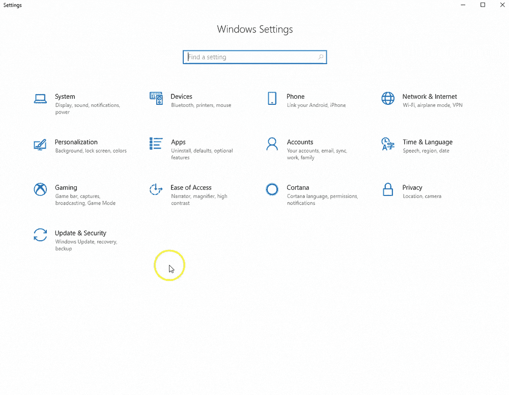
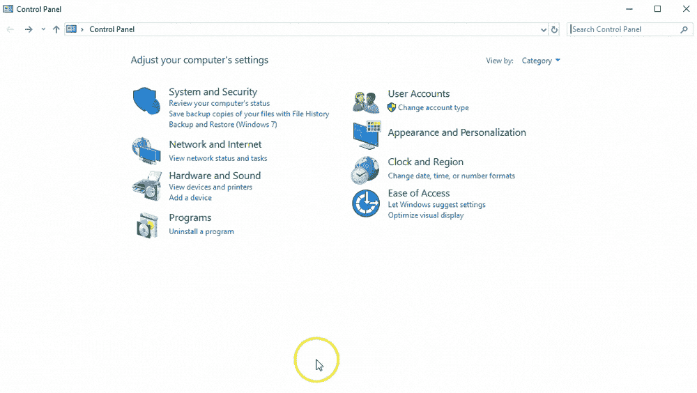
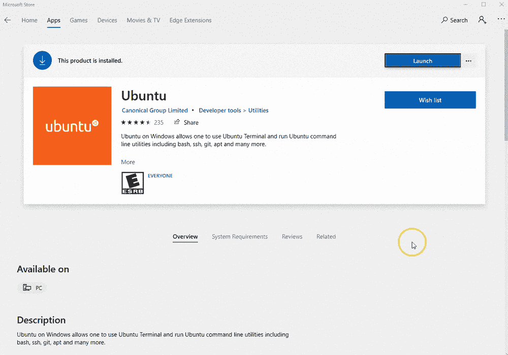
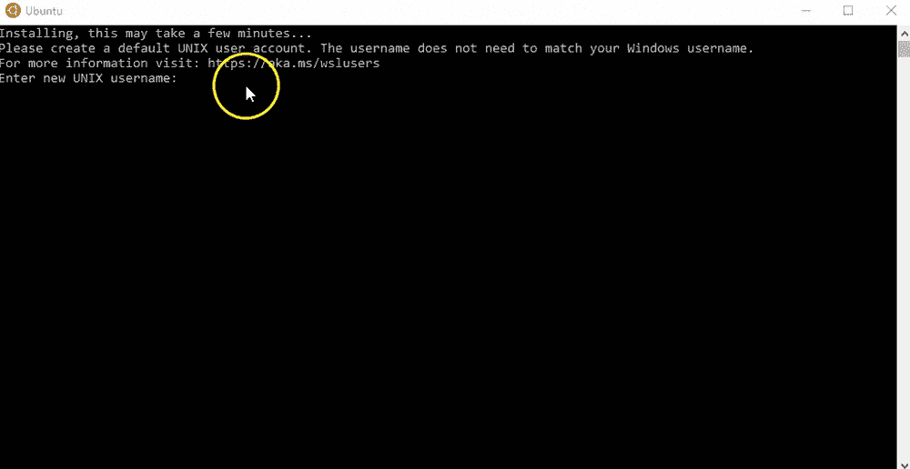
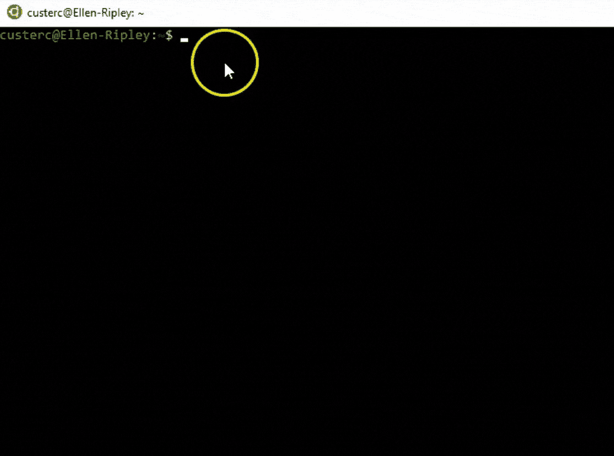

# 教程:使用 Linux 的 Windows 子系统在 Windows 上安装 Linux

> 原文：<https://www.dataquest.io/blog/tutorial-install-linux-on-windows-wsl/>

August 1, 2019

对于所有类型的程序员和数据科学家来说，学习 UNIX 命令行是一项重要的技能，但是如果你是 Windows 用户，在你的机器上使用你的命令行技能意味着你需要在 Windows 上安装 Linux。在本教程中，我们将带您在 Windows 机器上安装 Linux 的 Windows 子系统，以便您可以充分利用您的 UNIX 命令行技能。

(在 Dataquest，我们发布了一个关于使用命令行的[互动课程，以及一个关于](https://www.dataquest.io/course/command-line-elements)[使用命令行](https://www.dataquest.io/course/text-processing-cli/)处理文本的互动课程。任何系统的用户都可以在我们的交互式网络平台上练习。但是，如果您想在自己的机器上练习这些命令行技能，并且您使用的是 Windows，那么您需要在访问 Unix 命令行之前做一些设置，因为 Windows 不是基于 UNIX 的。)

在本教程中，我们将安装 Windows Subsystem for Linux (WSL)和一个使用 WSL 的 Linux 发行版，这将使您能够使用 UNIX 命令行界面。

安装 WSL 相当简单，但是不可能在每个版本的 Windows 上安装，所以第一步是确保你的机器是兼容的。

## 步骤 1:确保兼容性

要安装 WSL，您的计算机必须安装 64 位版本的 Windows 10(或更高版本)。如果你不知道你有哪个版本，你可以去`Settings > System > About`找**版本**和**系统类型**字段。

如果您有 64 位 Windows 10，但您的版本低于 1607，您必须在继续安装之前更新 Windows。要更新 Windows，请遵循这些[说明](https://support.microsoft.com/en-us/help/4027667/windows-update-windows-10)。

如果您没有 64 位体系结构，或者如果您有早期版本的 Windows，您将无法运行 WSL。但是不用担心！通过安装 Cygwin，您仍然可以在您的机器上使用 UNIX 命令行。你可以在这里找到安装 Cygwin [的说明。如果您的机器支持它，那么最好安装 WSL，所以让我们进入下一步！](https://cygwin.com/install.html)

## 步骤 2:启用 WSL 可选组件

用于 Linux 的 Windows 子系统是 Windows 10 的内置功能，但必须手动启用。因为默认情况下它是禁用的，所以我们需要做的第一件事就是启用它。

方法是导航到`Control Panel > Programs > Turn Windows Features On or Off`，然后在弹出窗口中向下滚动，直到我们看到 Linux 的 Windows 子系统。我们将勾选旁边的框，然后单击“确定”启用该功能。然后，当 Windows 搜索文件并应用更改时，在短暂的进度条等待后，我们将被提示重新启动计算机，以便更改生效。

作为一种捷径，我们也可以在 Windows 10 搜索栏中搜索“turn w”。点击此搜索的顶部结果将直接将我们带到`Control Panel > Programs > Turn Windows Features On or Off`，之后我们可以按照上述相同的步骤来启用 Linux 的 Windows 子系统。

请记住，在进行下一步之前，我们必须重新启动机器以使更改生效。

## 步骤 3:在 Windows 上安装 Linux

一旦机器重新启动，我们的下一步将是安装 Linux 发行版。我们将打开 Microsoft Store —在 Windows 搜索栏中搜索“Microsoft Store”或在“开始”菜单中导航到它。在商店应用中，搜索“Linux”，然后点击“获取应用”以查看可用的 Linux 发行版(或者直接点击您的首选发行版，如果您在下面看到它)。点击[这里](https://en.wikipedia.org/wiki/Comparison_of_Linux_distributions)了解更多关于每个 Linux 发行版的信息，但是如果你不确定你需要什么，Ubuntu 是一个常见的选择。

出于本教程的目的，我们将选择 Ubuntu，但是安装任何其他 Linux 发行版的过程都是一样的。在 Ubuntu 页面，点击“获取”，然后在弹出的消息中选择“不，谢谢”。Ubuntu 会自动开始下载，完成后会出现启动按钮。

## 第 4 步:启动并创建您的帐户

Ubuntu app 下载完成后，点击`Launch`等待安装。它将打开一个新窗口，当提示我们创建一个用户帐户时，我们将知道它已完成安装。

准备就绪后，输入您的首选用户名和密码。这可以是你喜欢的任何东西；它不需要与您的 Windows 用户名或密码相同。请注意，系统会提示您输入密码两次，并且在您键入密码时，密码不会显示在屏幕上。

一旦你创建了你的账户，你可以使用`pwd`命令显示当前的工作目录来测试一切是否正常。您会注意到，默认目录可能不便于处理 Windows 文件系统中的文件，因此可选的快速第五步是更改默认目录，这样我们就不必在每次启动命令行时导航到不同的目录。

## 步骤 5(可选):更改您的默认工作目录

要改变默认的工作目录，我们可以编辑`.bashrc`。`.bashrc`是一个包含所有设置和别名的文件，当我们启动 shell 时，shell 会关注这些设置和别名。我们要做的是在这个文件中插入一个命令，该命令将在每次启动 shell 时运行，以将工作目录更改为我们首选的默认目录，这样我们就不必手动执行此操作。

出于本教程的目的，我们将设置默认目录为 Windows 文件路径`C:/Users/Charlie/Desktop`，但是您可以用任何指向您想要设置为默认目录的文件路径来替换它。

首先，在命令行中输入`edit ~/.bashrc`。该命令将打开`.bashrc`。

当它打开时，一直滚动到底部并按下`i`进入插入模式。插入模式将允许我们“插入”对`.bashrc`的更改。

在插入模式下，键入`cd`,后跟您想要更改的目录。注意，在 Ubuntu 中，你的 Windows `C:`驱动器位于`/mnt/`文件夹中，所以你应该输入`cd /mnt/c/your_file_path`。在上面的文件路径示例中，我们希望将`cd /mnt/c/Users/Charlie/Desktop`输入到我们的`.bashrc`中。

给`.bashrc`添加一条注释，用一条简短的消息解释我们的新命令正在做什么，这也是一个好主意。我们将使用`#`添加一个注释来解释这个命令改变了默认目录。

完成后，按`Esc`退出插入模式，然后键入`:wq`保存更改并退出命令行。从命令行，我们可以输入`cat ~/.bashrc`来查看编辑过的`bashrc`文件，并确认我们的更改已保存。然后，我们可以输入`source ~/.bashrc`来重启命令行，它会以我们新的默认目录作为工作目录重启。我们只需要做这一次——从现在开始，每次我们打开命令行时，我们刚刚添加的默认目录将是我们的工作目录。

它看起来是这样的:

恭喜你！现在，您已经在您的机器上安装了 Linux，您已经准备好在您的本地 Windows 机器上展示您的 UNIX 命令行技能了。此外，您知道如何在 Windows 机器上安装 Linux，这对各种任务都很有用，比如帮助同事为数据科学工作做好准备。

## 获取免费的数据科学资源

免费注册获取我们的每周时事通讯，包括数据科学、 **Python** 、 **R** 和 **SQL** 资源链接。此外，您还可以访问我们免费的交互式[在线课程内容](/data-science-courses)！

[SIGN UP](https://app.dataquest.io/signup)