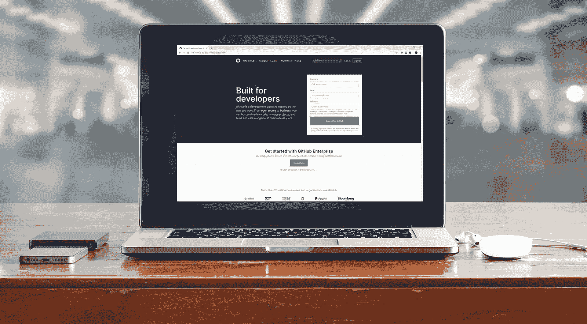
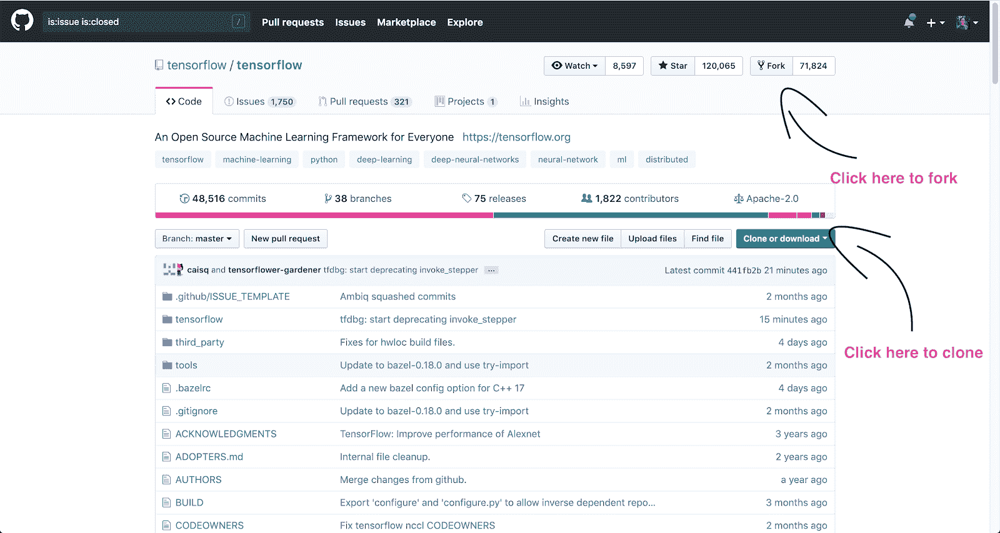
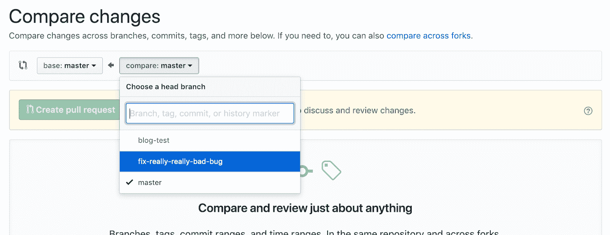

# 教程:Git 和 Github 简介

> 原文：<https://www.dataquest.io/blog/tutorial-introduction-learn-git-github/>

March 21, 2019

如果你对数据科学或软件开发感兴趣，版本控制的工作知识是绝对必要的。但是什么是版本控制，它如何帮助我们完成日常的数据科学任务？

版本控制是集成和记录来自多个合作者的代码和其他文件的更改的过程。出于以下几个原因，您对版本控制感到满意是很重要的:

*   资格:雇主正在寻找理解版本控制并有使用它进行协作的经验的候选人。当你进行专业编程时，你不太可能独自处理代码。
*   经验:通过获得基本的版本控制技能，你使自己有能力为数百万开源项目中的任何一个做出贡献。这是获得编程经验的一种极好的方式。
*   社区:TensorFlow、scikit-learn、Hadoop、Spark 等流行的数据科学工具都是开源的。如果你会使用 Git 和 GitHub，你就可以成为开源数据科学社区的积极参与者。

在本文中，我们将介绍最流行的版本控制解决方案 Git 和 GitHub 的基础知识。

Git 是一个版本控制工具，它提供了所有的基本功能。

[**GitHub**](https://github.com) 是一个构建在 Git 之上的平台，为团队提供了另一个层次的项目组织，包括问题跟踪、代码审查等等。

## 工作流程

版本控制可能看起来像时髦的命令行魔术，但它实际上只是一种将变更集成到项目中的方法。记住这个简单的目标，你就不会有任何麻烦。在我们深入研究具体细节之前，我们应该抽象地讨论一下协作工作流。让我们假设我们是加入一个已建立的项目的开发人员。

#### 问题

通常，开发工作流始于项目的问题跟踪器。问题跟踪器是项目中需要完成的所有工作的列表。问题可以是需要修复的 bug，需要实现的特性，或者需要进行的任何其他种类的更改。作为一个项目的贡献者，你可能会选择一个问题或被分配到一个问题。当您开始处理一个问题时，您将创建一个与该问题相关联的新分支。你所有的工作都将在这个分支上进行。

#### 分支

分支是项目的平行版本。通过将开发任务划分为分支，我们可以使项目更有组织性。通常，有一个特殊的分支叫做“master ”,它保存着项目的“live”版本。分支允许开发人员在将他们的变更与主分支结合或“合并”之前，独立地测试他们的变更。

如果我们想在其他修复完成之前看到它们发生了什么，我们可以“检查”不同的分支来观察不同任务的进度。

#### 承诺

提交只是一个“原子”变更的记录——也就是说，一个不包含多个较小变更的变更。提交在分支上进行，它们打破了与该分支相关的变更的时间线。

例如，假设我们正在实现一个相当复杂的特性。提交背后的想法是记录构成特性实现的单个变更。每一次我们做出改变，我们就做了一次承诺。这样，当有人审查我们的代码时，他可以看到一系列的提交，这些提交详细描述了我们实现该特性的过程。​

#### 拉取请求

拉请求是开发工作流的一个重要部分。拉请求是将我们的分支机构与主分支机构合并的请求。换句话说，这是一个让我们的工作成为活项目的一部分的请求，我们的工作到目前为止一直发生在它的孤立的分支上。

当我们提交拉取请求时，我们应该详细描述我们所做的更改以及做出这些更改的原因。如果我们的更改正在修复问题跟踪器上的一个问题，我们也会希望包括该信息。对于每个 pull 请求，GitHub 都会提供一个窗口，突出显示我们的分支和主分支之间的所有差异。通常，项目的另一个成员会审查我们所有的变更。几乎总是会有我们必须采取行动的反馈。在一两个审阅者看来一切都很好之后，我们的更改将被合并。

## 操作

我们了解工作流程，现在是工作的时候了。从[安装 Git](https://git-scm.com/downloads) 开始。

让我们假设我们正在研究[张量流](https://github.com/tensorflow/tensorflow)。我们要做的第一件事是将代码库下载到我们的机器上，这样我们就可以使用它了。

在 GitHub 上的资源库页面中，点击右上角的 Fork。派生存储库反映了我们帐户上的存储库——因此它位于 tensorflow/tensorflow，也位于我们的用户名/tensorflow。

但是我们仍然没有下载任何东西，所以让我们回到那个。单击克隆或下载，然后单击剪贴板图标，将 URL 复制到剪贴板。现在，打开命令提示符，用 cd filepath 导航到项目的目录。然后键入 git clone 并粘贴 URL，并按 enter 键。这将下载存储库，并使其在当前目录的子文件夹中可用。

接下来要做的是告诉 Git 项目来自哪里。返回 tensorflow/tensorflow 存储库，单击克隆或下载，然后单击剪贴板。然后，在命令提示符下，键入 git remote add upstream，粘贴 URL，并按 enter 键。这告诉 Git 这个目录是一个项目，它需要与我们刚刚给它的 URL 所指定的存储库进行对话。

一般来说，在开始工作之前，我们应该使用 git pull 从上游检索最新的更改。然而，由于我们几分钟前刚刚克隆了存储库，所以现在没有必要这样做。

在这一点上，我们准备开始做出改变。让我们假设我们被分配到问题#0001:非常非常糟糕的错误。我们应该从创建一个新的分支开始发展。键入 git check out-b fix-really-really-bad-bug。checkout 命令实际上是切换到不同分支的命令，但是通过使用标志-b，我们告诉 Git 我们要切换到的分支需要被创建。​

(如果我们想单独创建一个新分支或切换到一个现有分支，我们可以使用 git branch {new-branch-name}创建一个新分支，或者使用 git checkout {branch-name}切换到一个现有分支。)

既然我们已经建立了自己的分支，我们就可以开始编码了。

当我们工作时，我们应该在每次执行一个基本的改变时提交。如果问题相对较小，我们可能只需要一次提交。对于这个非常非常糟糕的 Bug，我们可能需要提交一些。我们分解提交的方式主要取决于开发人员。一种方法是每次我们要测试我们的变更时提交一次。

所有提交都包含一条提交消息，描述与该提交相关联的更改。要进行提交，我们必须首先存放我们想要提交的更改。如果我们只修改了一个文件，我们只需在命令提示符下输入 git add {filepath}。这一步是必要的，因为有时我们会修改几个文件，但我们只想提交一个或两个文件中的更改。接下来，输入 git commit -m“提交消息”。提交消息应该是描述与该提交相关的更改的几个词。请注意，引号是必需的。或者，如果没有我们不想提交的已修改文件，我们可以跳过暂存步骤，只使用 git commit -a -m "{commit message} "来暂存和提交所有文件。

当我们修复了一个非常非常糟糕的 Bug，对它进行了彻底的测试，并做出了最后的提交，我们就可以提交我们的修改了。我们可以在命令提示符下键入 git push origin master fix-really-really-bad-bug，然后按 enter 键。这个命令告诉 git 将本地分支上的更改发送到原始存储库主分支。

如果我们在这样做之后去 GitHub 上的仓库，我们应该会看到一个黄色的通知，这意味着仓库收到了我们的推送。点击“比较和提取请求”。如果您看不到此通知，只需点击“新建拉动请求”，然后在拉动请求屏幕上选择开发分支。在这里，我们可以填写我们的拉取请求描述，并提交以供审查。

我们还应该单击“文件已更改”选项卡，以验证我们更改的所有内容都是有意的。

我们并不完美，所以评审员几乎肯定会要求对我们的实现进行一些修改。没问题——只需做出改变，再次提交，再次推送。新的提交将在同一个拉请求中自动可见。

   

## 结论

我们找到了。这是最基本的。我们应该拥有开始为一些开源项目做贡献或加入开发团队所需的一切。

不过，版本控制不仅仅是基础，还有很多东西，所以一定要查看 [Dataquest 课程](https://www.dataquest.io/course/git-and-vcs)以获得更深入的实际操作版本控制课程。