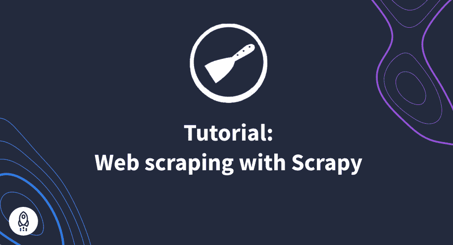
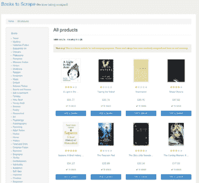
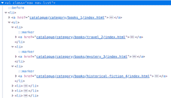

# Python 教程:使用 Scrapy 进行 Web 抓取(8 个代码示例)

> 原文：<https://www.dataquest.io/blog/web-scraping-with-scrapy/>

May 24, 2022

## 在本 Python 教程中，我们将使用 Scrapy 浏览 web 抓取，并完成一个示例电子商务网站抓取项目。

互联网上有超过 40 兆字节的数据。不幸的是，其中很大一部分是非结构化的，不可机读。这意味着你可以通过网站访问数据，从技术上讲，是以 HTML 页面的形式。有没有一种更简单的方法，不仅可以访问这些网络数据，还可以以结构化的格式下载这些数据，使其变得机器可读，并随时可以获得见解？

这就是网页抓取和 [Scrapy](https://scrapy.org/) 可以帮助你的地方！Web 抓取是从网站中提取结构化数据的过程。Scrapy 是最流行的 web 抓取框架之一，如果你想学习如何从 web 上抓取数据，它是一个很好的选择。在本教程中，您将学习如何开始使用 Scrapy，还将实现一个示例项目来抓取一个电子商务网站。

我们开始吧！

### 先决条件

要完成本教程，您需要在您的系统上安装 Python，并且建议您具备 Python 编码的基础知识。

### 安装刮刀

为了使用 Scrapy，你需要安装它。幸运的是，通过 pip 有一个非常简单的方法。可以用`pip install scrapy`安装 Scrapy。你也可以在[垃圾文件](https://docs.scrapy.org/en/latest/intro/install.html)中找到其他安装选项。建议在 Python 虚拟环境中安装 Scrapy。

```py
virtualenv env
source env/bin/activate
pip install scrapy
```

这个代码片段创建一个新的 Python 虚拟环境，激活它，并安装 Scrapy。

### 杂乱的项目结构

每当你创建一个新的 Scrapy 项目，你需要使用一个特定的文件结构，以确保 Scrapy 知道在哪里寻找它的每个模块。幸运的是，Scrapy 有一个方便的命令，可以帮助你用 Scrapy 的所有模块创建一个空的 Scrapy 项目:

```py
scrapy startproject bookscraper
```

如果您运行此命令，将创建一个新的基于模板的 Scrapy 项目，如下所示:

```
📦bookscraper
 ┣ 📂bookscraper
 ┃ ┣ 📂spiders
 ┃ ┃ ┗ 📜bookscraper.py
 ┃ ┣ 📜items.py
 ┃ ┣ 📜middlewares.py
 ┃ ┣ 📜pipelines.py
 ┃ ┗ 📜settings.py
 ┗ 📜scrapy.cfg
```py

这是一个典型的 Scrapy 项目文件结构。让我们快速检查一下这些文件和文件夹，以便您理解每个元素的作用:

*   文件夹:这个文件夹包含了我们未来所有的用于提取数据的 Scrapy spider 文件。
*   这个文件包含了条目对象，行为类似于 Python 字典，并提供了一个抽象层来存储 Scrapy 框架中的数据。
*   (高级):如果你想修改 Scrapy 运行和向服务器发出请求的方式(例如，绕过 antibot 解决方案)，Scrapy 中间件是有用的。对于简单的抓取项目，不需要修改中间件。
*   `pipelines` : Scrapy pipelines 是在你提取数据之后，你想要实现的额外的数据处理步骤。您可以清理、组织甚至丢弃这些管道中的数据。
*   `settings`:Scrapy 如何运行的一般设置，例如，请求之间的延迟、缓存、文件下载设置等。

在本教程中，我们集中在两个 Scrapy 模块:蜘蛛和项目。有了这两个模块，您可以实现简单有效的 web 抓取器，它可以从任何网站提取数据。

在您成功安装了 Scrapy 并创建了一个新的 Scrapy 项目之后，让我们来学习如何编写一个 Scrapy spider(也称为 scraper ),从电子商务商店中提取产品数据。

### 抓取逻辑

作为一个例子，本教程使用了一个专门为练习网页抓取而创建的网站:[书籍来抓取](http://books.toscrape.com)。在编写蜘蛛程序之前，看一下网站并分析蜘蛛访问和抓取数据的路径是很重要的。



我们将利用这个网站收集所有可用的书籍。正如你在网站上看到的，每个类别页面都有多个类别的书籍和多个项目。这意味着我们的 scraper 需要去每个类别页面，打开每本书的页面。

下面我们来分解一下刮刀在网站上需要做的事情:

1.  打开网站([http://books.toscrape.com/](http://books.toscrape.com/))。
2.  找到所有的分类网址(比如[这个](http://books.toscrape.com/catalogue/category/books/travel_2/index.html))。
3.  找到分类页面上所有书籍的网址(比如[这个](http://books.toscrape.com/catalogue/its-only-the-himalayas_981/index.html))。
4.  逐个打开每个 URL，提取图书数据。

在 Scrapy 中，我们必须将抓取的数据存储在`Item`类中。在我们的例子中，一个条目会有像标题、链接和发布时间这样的字段。让我们实施该项目！

### 零碎物品

创建一个新的 Scrapy 项目来存储抓取的数据。让我们称这个项目为`BookItem`并添加代表每本书的数据字段:

*   标题
*   价格
*   通用产品代码
*   图像 _url
*   全球资源定位器(Uniform Resource Locator)

在代码中，这是如何在 Scrapy 中创建新的项目类:

```
from scrapy import Item, Field
class BookItem(Item):
    title = Field()
    price = Field()
    upc = Field()
    image_url = Field()
    url = Field()
```py

在代码片段中可以看到，您需要导入两个 Scrapy 对象:`Item`和`Field`。

`Item`被用作`BookItem`的父类，所以 Scrapy 知道这个对象将在整个项目中用来存储和引用抓取的数据字段。

`Field`是作为项目类的一部分存储的对象，用于指示项目中的数据字段。

一旦你创建了`BookItem`类，你就可以继续在 Scrapy spider 上工作，处理抓取逻辑和提取。

### 刺痒蜘蛛

在名为`bookscraper.py`的`spiders`文件夹中创建一个新的 Python 文件

```
touch bookscraper.py
```py

这个蜘蛛文件包含蜘蛛逻辑和抓取代码。为了确定该文件中需要包含哪些内容，让我们检查一下网站！

### 网站检查

网站检查是网页抓取过程中一个繁琐但重要的步骤。没有适当的检查，你就不知道如何有效地定位和提取网站上的数据。检查通常是使用浏览器的“inspect”工具或一些第三方浏览器插件来完成的，这些插件可以让您“深入查看”并分析网站的源代码。建议你在分析网站的时候关闭浏览器中的 JS 执行功能——这样你就可以像你的刺痒蜘蛛看到网站一样看到网站。

让我们回顾一下我们需要在网站的源代码中找到哪些 URL 和数据字段:

*   类别 URL
*   图书 URL
*   最后，预订数据字段

检查源代码以定位 HTML 中的类别 URL:



通过检查网站，您可以注意到类别 URL 存储在一个带有类`nav nav-list`的`ul` HTML 元素中。这是至关重要的信息，因为您可以使用这个 CSS 和周围的 HTML 元素来定位页面上的所有类别 URLs 这正是我们所需要的！

让我们记住这一点，并深入挖掘，找到其他潜在的 CSS 选择器，我们可以在我们的蜘蛛。检查 HTML 以查找图书页面 URL:


单个图书页面的 URL 位于带有 CSS 类`product pod`的`article` HTML 元素下。我们可以使用这个 CSS 规则，通过 scraper 找到图书页面的 URL。

最后，检查网站，找到图书页面上的单个数据字段:


这一次稍微有点棘手，因为我们在页面上寻找多个数据字段，而不仅仅是一个。所以我们需要多个 CSS 选择器来找到页面上的每个字段。正如您在上面的截图中看到的，一些数据字段(如 UPC 和 price)可以在 HTML 表格中找到，但其他字段(如 title)在页面顶部的另一种 HTML 元素中。

在检查并找到我们需要的所有数据字段和 URL 定位器之后，您可以实现蜘蛛:

```
from scrapy.spiders import CrawlSpider, Rule
from scrapy.linkextractors import LinkExtractor
from bookscraper.items import BookItem

class BookScraper(CrawlSpider):
    name = "bookscraper"
    start_urls = ["http://books.toscrape.com/"]

    rules = (
        Rule(LinkExtractor(restrict_css=".nav-list > li > ul > li > a"), follow=True),
        Rule(LinkExtractor(restrict_css=".product_pod > h3 > a"), callback="parse_book")
    )

    def parse_book(self, response):
        book_item = BookItem()

        book_item["image_url"] = response.urljoin(response.css(".item.active > img::attr(src)").get())
        book_item["title"] = response.css(".col-sm-6.product_main > h1::text").get()
        book_item["price"] = response.css(".price_color::text").get()
        book_item["upc"] = response.css(".table.table-striped > tr:nth-child(1) > td::text").get()
        book_item["url"] = response.url
        return book_item
```py

让我们来分析一下这段代码中发生了什么:

1.  刺儿头会打开网站[http://books.toscrape.com/](http://books.toscrape.com/)。
2.  它将开始遍历由`.nav-list > li > ul > li > a` CSS 选择器定义的类别页面。
3.  它将使用这个 CSS 选择器:`.product_pod > h3 > a`开始遍历所有类别页面上的所有图书页面。
4.  最后，一旦打开一本书的页面，Scrapy 从页面中提取出`image_url`、`title`、`price`、`upc`和`url`数据字段，并返回`BookItem`对象。

### 运行蜘蛛

最后，我们需要测试我们的蜘蛛实际工作并抓取我们需要的所有数据。您可以使用`scrapy crawl`命令运行蜘蛛，并引用蜘蛛的名称(如蜘蛛代码中所定义的，而不是文件的名称！):

```
scrapy crawl bookscraper
```py

运行这个命令后，你会看到 Scrapy 的实时输出，因为它正在抓取整个网站:

```
{'image_url': 'http://books.toscrape.com/media/cache/0f/76/0f76b00ea914ced1822d8ac3480c485f.jpg',
 'price': '£12.61',
 'title': 'The Third Wave: An Entrepreneur’s Vision of the Future',
 'upc': '3bebf34ee9330cbd',
 'url': 'http://books.toscrape.com/catalogue/the-third-wave-an-entrepreneurs-vision-of-the-future_862/index.html'}
2022-05-01 18:46:18 [scrapy.core.scraper] DEBUG: Scraped from <200 http://books.toscrape.com/catalogue/shoe-dog-a-memoir-by-the-creator-of-nike_831/index.html>
{'image_url': 'http://books.toscrape.com/media/cache/fc/21/fc21d144c7289e5b1cb133e01a925126.jpg',
 'price': '£23.99',
 'title': 'Shoe Dog: A Memoir by the Creator of NIKE',
 'upc': '0e0dcc3339602b28',
 'url': 'http://books.toscrape.com/catalogue/shoe-dog-a-memoir-by-the-creator-of-nike_831/index.html'}
2022-05-01 18:46:18 [scrapy.core.scraper] DEBUG: Scraped from <200 http://books.toscrape.com/catalogue/the-10-entrepreneur-live-your-startup-dream-without-quitting-your-day-job_836/index.html>
{'image_url': 'http://books.toscrape.com/media/cache/50/4b/504b1891508614ff9393563f69d66c95.jpg',
 'price': '£27.55',
 'title': 'The 10% Entrepreneur: Live Your Startup Dream Without Quitting Your '
          'Day Job',
 'upc': '56e4f9eab2e8e674',
 'url': 'http://books.toscrape.com/catalogue/the-10-entrepreneur-live-your-startup-dream-without-quitting-your-day-job_836/index.html'}
2022-05-01 18:46:18 [scrapy.core.scraper] DEBUG: Scraped from <200 http://books.toscrape.com/catalogue/far-from-true-promise-falls-trilogy-2_320/index.html>
{'image_url': 'http://books.toscrape.com/media/cache/9c/aa/9caacda3ff43984447ee22712e7e9ca9.jpg',
 'price': '£34.93',
 'title': 'Far From True (Promise Falls Trilogy #2)',
 'upc': 'ad15a9a139919918',
 'url': 'http://books.toscrape.com/catalogue/far-from-true-promise-falls-trilogy-2_320/index.html'}
2022-05-01 18:46:18 [scrapy.core.scraper] DEBUG: Scraped from <200 http://books.toscrape.com/catalogue/the-travelers_285/index.html>
{'image_url': 'http://books.toscrape.com/media/cache/42/a3/42a345bdcb3e13d5922ff79cd1c07d0e.jpg',
 'price': '£15.77',
 'title': 'The Travelers',
 'upc': '2b685187f55c5d31',
 'url': 'http://books.toscrape.com/catalogue/the-travelers_285/index.html'}
2022-05-01 18:46:18 [scrapy.core.scraper] DEBUG: Scraped from <200 http://books.toscrape.com/catalogue/the-bone-hunters-lexy-vaughan-steven-macaulay-2_343/index.html>
{'image_url': 'http://books.toscrape.com/media/cache/8d/1f/8d1f11673fbe46f47f27b9a4c8efbf8a.jpg',
 'price': '£59.71',
 'title': 'The Bone Hunters (Lexy Vaughan & Steven Macaulay #2)',
 'upc': '9c4d061c1e2fe6bf',
 'url': 'http://books.toscrape.com/catalogue/the-bone-hunters-lexy-vaughan-steven-macaulay-2_343/index.html'}
```

### 结论

我希望这个快速的 Scrapy 教程可以帮助你开始 Scrapy 和网络抓取。网络抓取是一项非常有趣的学习技能，但是能够从网上下载大量数据来构建有趣的东西也是非常有价值的。Scrapy 有一个很棒的[社区](https://scrapy.org/community/)，所以你可以确定，无论何时你在 scrapy 中遇到困难，你都可以在那里找到问题的答案，或者在 [Stack Overflow](https://stackoverflow.com/search?q=scrapy) 、 [Reddit](https://www.reddit.com/search/?q=scrapy) 或其他地方。刮的开心！