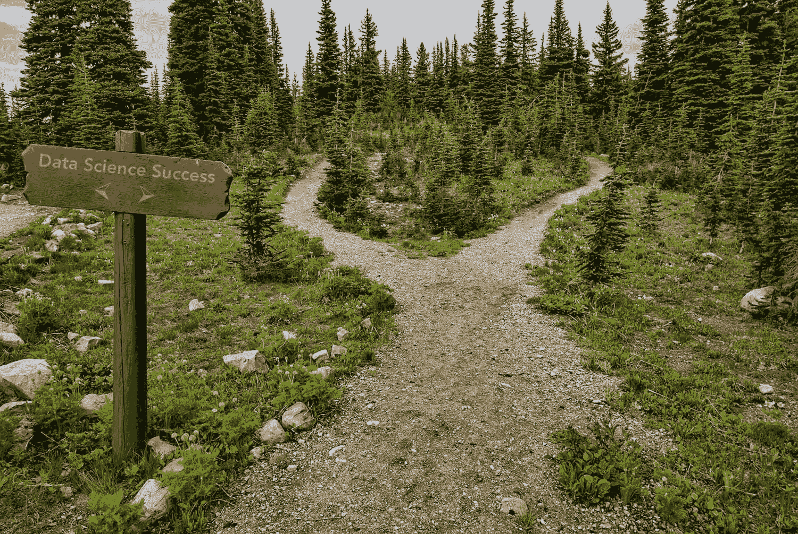
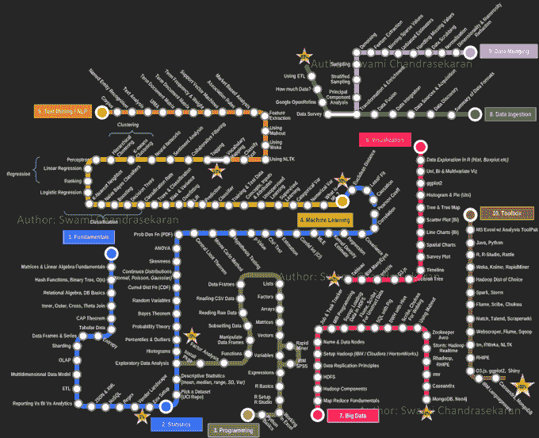
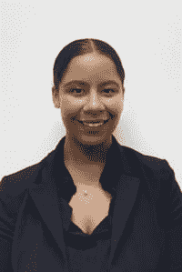

# 数据科学到底需要学什么？看情况。

> 原文：<https://www.dataquest.io/blog/what-need-learn-data-science/>

February 6, 2020

如果你正在考虑数据科学领域的新职业，选项可能会同时感到有限和难以承受。

一方面，似乎整个行业可以归结为“数据分析师”、“数据工程师”和“数据科学家”，而你必须适应这三个角色中的一个。

另一方面，这可能会让人不知所措，因为你被告知要学的东西太多了。例如，请看这张关于学习数据科学的流行信息图:

这看起来很酷……但是也非常吓人和令人困惑！

酷炫的设计？绝对的。但这种形象可能会让有抱负的数据科学家心脏病发作，他们认为自己实际上必须知道所有这些才能在行业中找到工作。

这就是为什么 Insight 数据科学项目总监 Alise Otilia R .最近在 Twitter 上发了一条关于数据科学领域各种专业和角色的帖子，感觉像是一股新鲜空气。因此，我们采访了 Alise，以了解她对数据科学领域机会的更多看法。

## 你一定要什么都是专家吗？

“我的灵感(对于该主题)肯定是因为一些过渡到数据科学领域的人可能会被成为数据科学家必须学习的所有东西所淹没，”Alise 说，她在转到 Insight Data Science 之前是 Spirit Airlines 的数据科学家。

图书馆与资讯学教育协会

“肯定有很多事情，”她说。这是一个非常跨学科的领域，所以计算机科学、编程、统计学、实验、商业、SQL——有太多的东西你必须在某种程度上了解。"

“但根据我作为数据科学家的面试经验，每一次面试都是完全不同的。有些是非常商业的，SQL 繁重的。其他的只是机器学习的案例研究。其他人则在现场，严格执行 CS 算法。”

“我开始意识到**这就是挫折的来源**，”她说。

“你觉得你必须成为所有这些不同领域的专家，老实说，这是不可能的。”

爱丽丝说，问题的一部分在于，公司对“数据科学家”到底是什么没有达成一致。对于那些刚刚进入这个领域的人来说，这些差异真的是势不可挡的，他们觉得自己必须在每份招聘广告上的每项技能上打勾，才能胜任其中任何一项。

## 向下钻，找到你的激情

在她的 Twitter 帖子中，Alise 列举了七个更具体的角色，这些角色都可以归入“数据科学家”的大类:

*   产品分析数据科学家
*   多面手
*   专科(NLP，计算机视觉等。)
*   机器学习工程师
*   数据操作工程师
*   数据科学产品经理
*   数据可视化器

爱丽丝说:“对我来说，**你真的必须找到你在**中的位置，每一个都有优势。“他们都有基本的核心技能，但我认为在确定最适合你的数据科学职业时，你必须倾向于你的优势。这有助于减轻你不得不学习所有东西的痛苦。”

例如，Alise 说，“我认为自己更像是一个基于产品分析的数据科学家。我只是喜欢商业方面。我喜欢能够影响企业的发展方向，与团队中的非技术人员交流。SQL 绝对是我的强项之一。实验对我来说一直很有趣，只是为了看看一个小小的改变如何影响用户的行为。”

她说，找到自己的激情很重要。这可以帮助你深入了解并专注于最适合你想要的特定角色的技能。她说，SQL 和沟通技能对于专注于产品分析的数据科学家来说至关重要，但对于机器学习工程师来说可能不那么重要。

“如果你能坐下来连续写八个小时的代码，那对你来说是很棒的一天，我会说类似这样的话(机器学习工程师)更适合你。”如果这是你的目标，那么你应该更加关注编程基础和软件工程实践。

同样的原则也适用于 Alise 列出的其他角色。例如，如果您热衷于数据可视化，您可能不需要掌握每种 ML 算法的复杂性，但是您需要熟悉您选择的语言中所有流行的可视化库，并且还需要一些设计和交流技能。

爱丽丝说，如果你的热情是维护生产机器学习模型的稳定性，那么你可能很适合 DataOps。为此，您不需要设计技能或深入的可视化库专业知识，但您可能希望学习 Docker 和 Apache Airflow 之类的工具。

换句话说:**虽然在数据科学中有很多东西要学，但你真的不需要为了成功而学习*所有的***。你不必被那张地铁图吓到。你只需要学习基础知识，然后学习与你实际想做的数据工作相关的核心技能。

如果你的激情符合多个类别呢？不要担心！“肯定有混血儿，”她说，“所以不要觉得你已经完全适应了这些(工作角色)中的任何一个。毫无疑问，角色可以是这些桶的任意组合。”

找到你的激情将帮助你走向职业道路。

## 在数据科学求职中保持战略眼光

“绝对不要被现有的所有证书和课程弄得不知所措，”爱丽丝说。取而代之的是，“问自己一系列问题，比如你最初为什么对数据科学感兴趣？这个领域真正吸引你的是什么？”

“我认为首先抓住你对数据科学感兴趣的东西非常重要，”她说。"**一定要关注基本面**；你不必事事都是专家。知道自己的优势是什么。”

然后，她说，到了找工作的时候，要仔细阅读，要有策略。“不要只申请所有写着‘数据科学家’的职位，因为大多数角色不会明确地说这是机器学习或者这是纯粹的产品分析。”

“如果你知道你对哪种(数据角色)最感兴趣或更有激情，我真的会分析这份工作描述，”她说。即使职位名称是“数据科学家”，你也经常可以从职位描述的所需技能和其他元素中得到暗示，即他们是在寻找机器学习专家，数据 viz 向导，产品分析大师，还是在上述所有方面都有一点经验的多面手。

爱丽丝说:“找出那些被强调的关键词和短语。“它说你将有效地沟通吗？它是否说您将创建报告或指标？这类事情会帮助你确定这个角色真正适合哪个角色。”

爱丽丝说，如果你参加了面试，你可以通过问一些关于该职位日常职责的问题来深入了解这一点。“问问你会花多少时间编程，会花多少时间开会，会花多少时间做报告，会花多少时间做特别分析，会花多少时间学习机器。我认为这是一种很好的方式，可以了解你在这个职位上的时间会如何分配。”

"她说，如果你被答案所吸引，那么这份工作可能非常适合你. "但如果他们说你 80%的时间都在编程，但你真的不认为编程是你的主要优势之一，或者你真的对它不感兴趣，也许那就不是你的数据科学角色。"

“真正了解自己的定位是最重要的，然后你就可以更好地为这些角色和面试做准备。”

## 不确定从哪里开始？从小处着手

爱丽丝说，另一个需要考虑的事情是公司的规模。如果你不确定自己喜欢什么，从一家小公司开始可能会有好处。

“我认为公司的规模在很大程度上也是你将要做什么的一个指标。甚至对初创公司和中型公司来说，我想说的是，大多数情况下，你都是所有这些角色的混合体。”

你是在创业公司工作好，还是加入一个比较老牌的数据团队好？

“我知道我在 Spirit 的时候，只有两个数据科学家，包括我自己，”她说，“所以我们基本上是创建管道的数据工程师。我们是业务分析师和产品分析数据科学家，以及机器学习工程师。我们几乎是无所不包。”

她说，这种角色“肯定会导致精疲力竭，这在数据科学中是一件大事，而且肯定会很快发生”。“但如果你不知道自己到底适合哪里，也许这样的角色会很有趣。**你可以快速了解自己喜欢什么**和不喜欢什么。”

例如，她说，“我很快就知道机器学习工程师不适合我，但即使是数据工程和产品分析，我也喜欢这一部分。”

另一方面，如果你*确实*知道你想做什么，拥有更大数据团队的更大公司可能是最安全的赌注。“在拥有数百名数据科学家团队的大公司里，”她说，“你很可能只参与一个项目或一个模型的一小部分，所以你的总体角色会更具体一些。”

她说，你在找工作时也应该考虑行业。像科技这样已经充满数据科学家的行业可能是寻找特定角色的好地方，因为公司更有可能确切知道他们需要什么以及他们希望如何获得它。你还可能在拥有成熟数据科学团队的公司找到更好的指导机会。

另一方面，刚刚开始涉足数据科学的行业可能会提供更多的开放式角色，有更多的实验自由。“我有点喜欢进入一个没有太多数据科学家的领域或行业，”Alise 谈到她在航空业的起步时说，“只是因为我可以着陆并尝试很多东西，只是看看我在哪里更适合一点，而不是被限制在某个项目或某个应用程序或某项责任中。

"我喜欢独立自主，喜欢摆弄东西，喜欢自学."

数据科学有很多东西要学！你不必什么都学，但你必须保持开放的心态，定期学习新事物和提高技能。

## 终身学习的重要性

Alise 说，有抱负的数据科学家需要知道的另一件重要事情是，学习数据技能并没有真正的终点。

她说:“在数据科学领域，你永远也不会站在一切事物的顶端。“这有点像电子邮件，就像当你试图减少到零，然后五分钟后，你刷新，又有 10 个。这就是我对数据科学的看法。这是一个你必须不断学习、阅读的领域。”

Alise 说:“我已经在这个领域工作了几年，每天都在学习新的东西。

然而，她补充道，“不要因为关注所有新出现的工具和技术而不知所措。专注于基本原则，因为这些原则永远不会改变，而这最终将是你在面试中受到的考验。”

想从爱丽丝那里得到更多的智慧吗？你可以在推特和 T2【LinkedIn】上找到她。她也乐于成为人们的导师，尤其是对数据科学感兴趣的女性。你可以在这里和她预约一个免费的约会，聊聊那个[。](https://calendly.com/aliseramirez)

想开始学习 Alise 所说的那些基础知识吗？