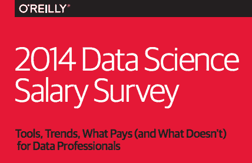

# 2014 年数据科学薪酬调查

> 原文：<https://www.dominodatalab.com/blog/2014-data-science-salary-survey>

*Contributed by John King and Roger Magoulas*

如果有一件事是数据社区的人擅长的，那就是利用他们的分析技能找到高薪工作。我们的数据科学调查显示平均工资为 98，000 美元。

在过去的三年里，O'Reilly Media 一直在与 Strata + Hadoopworld 大会合作进行一项匿名数据科学薪酬调查，以了解哪些因素对数据分析师和数据工程师的薪酬影响最大。该调查对公众开放，来自 53 个国家和美国 41 个州的 800 多名在数据领域工作的人做出了回应。欲了解更多详情，您可以免费下载完整的 [2014 年数据科学薪酬调查](http://www.oreilly.com/data/free/files/2014-data-science-salary-survey.pdf)报告。而且，你可以自己参加[调查](http://www.oreilly.com/data/salarysurvey2015.csp)。

O'Reilly 通过许多公共渠道和活动宣传这项调查。因此，调查人群更多地反映了奥赖利受众，而不是数据工作者的一般人群。与普通人群相比，调查受访者可能会使用更多的开源工具和新技术，并拥有更多的技术领导和管理职位。

那些回答者在各种行业工作，来自各种背景——不全是严格的技术人员。虽然几乎所有的受访者都有一些技术职责和背景，但不到一半的人以个人贡献者的身份工作。受访者的主要角色/职责包括分析师(谁编码)、统计师、软件开发人员、技术领导和经理。

调查中的 40 个问题涵盖了人口统计、工具使用和薪酬主题。看看什么工具与最高工资最相关有助于确定技能需求大于劳动力供应的市场条件(地理在供求中起作用，我们看到技术密集型的加利福尼亚、得克萨斯、西北和东北(马萨诸塞州至弗吉尼亚州)的工资最高)。总体的工具选择，以及下面详述的工具使用分类，显示了我们调查中的数据工作者是如何完成工作的。

一个关键的发现是，你学得越多，你挣得越多——使用最广泛工具的受访者往往挣得更多。一个原因可能是许多工具表征了合并的 Hadoop 生态系统，其中新工具满足了新的利基需求，如实时/流数据、日志处理和内存数据管理。这并没有降低使用 RDBMS 等传统工具的价值，同时了解 Hadoop 和 RDBMS 的人比单独使用其中任何一种的人获得了更高的工资。此外，SQL 仍然是所有受访者最常用的工具。

> 一个关键的发现是，你学得越多，你挣得越多

在分析方面，最常用的工具包括 SQL，其次是 Excel 和 R (tied)，然后是 Python 和 Tableau。对于数据管理，最常用的有 SQL、MySQL MS SQL Server、Oracle、Hadoop 和 Hive。

我们想进一步了解工具的使用与我们的调查队列之间的关系。使用聚类算法，我们发现了五个聚类。很少有回答者只使用单一组中的工具，大多数回答者使用五个组中的四个组中的工具。这些集群确实表明，在一个集群中使用一个工具会增加在该集群中使用另一个工具的可能性，许多受访者倾向于使用一个或两个集群，而很少使用其他集群中的工具。

## 工具使用集群

**集群 1** -
专有分析
SQL、Excel、MS SQL Server、Oracle、Oracle BI、SAS、SPSS、Microstrategy、Business Objects、C#、PowerPIvot

**集群 2** -
Hadoop 生态系统
Hadoop(所有发行版)、Spark、Java、Scala、Pig、HBase、Hive、Cassandra、MongoDB、Storm、AWS/Elastic Map Reduce、Redis、Pentaho、Splunk、Mahout

**集群 3** -
数据科学
Python，R，Matlab，自然语言处理，网络/社交图，Continuum (Numpy，SciPy)，Weka，libsvm

**集群 4** -
表示层
Mac、Javascript、D3、MySQL、Postgres、Google Chart Tools、SQLite、Ruby

**集群 5** -
数据管理
Unix、C/C++、Perl

我们有一个异常值工具 Tableau，它的使用率相对较高，但不太适合单个集群。Tableau 确实与第一组和第二组相关。

集群 2 (Hadoop 生态系统)包含大量工具，这反映了集群的两个特征:集群中的受访者使用最多的工具(18-19 个，几乎是集群 1 中一些工具的两倍)；此外，群集中的许多工具是互补的且用途单一，反映了 Hadoop 生态系统不断发展和融合的本质。

当查看集群以及它们如何适应我们根据数据构建的回归模型时，我们看到集群 1(专有分析)中的受访者工资略低，而集群 2 (Hadoop 生态系统)和集群 3(数据科学)中的受访者工资相对于平均值略高。

查看薪资调查的结果可以为最受欢迎的工具提供一些指导，这些信息可以帮助你设定学习路径和职业选择。然而，在动态数据空间中，您可以预期变化。我们从 Strata 会议提交的提案中了解到，越来越多的数据专业人士希望分享他们对实时/流媒体和弹性搜索等主题的了解。将于秋季进行的下一次数据科学薪资调查将提供更多指导。