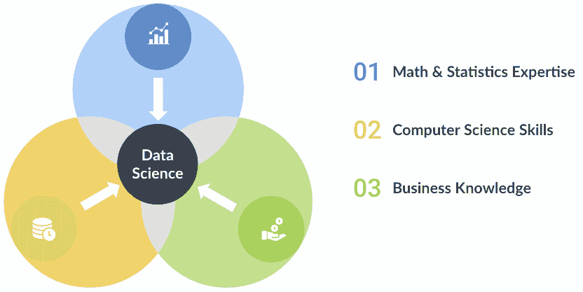

# 数据科学跨学科领域的 3 个关键组成部分

> 原文：<https://www.dominodatalab.com/blog/3-key-components-of-the-interdisciplinary-field-of-data-science>

数据科学是一个令人兴奋的跨学科领域，它正在彻底改变公司处理业务各个方面的方式。通过将传统统计学与快节奏、代码优先的计算机科学原则和商业敏锐度相结合，数据科学团队可以比以往任何时候都更准确、更精确地解决问题，尤其是在与创造力和沟通方面的软技能相结合时。

在本文中，我们将概述数据科学的三个重叠部分、沟通和协作的重要性，以及[Domino Data Lab Enterprise MLOps platform](/product/domino-enterprise-mlops-platform)如何帮助提高团队的速度和效率。

## 数据科学——技能的维恩图

数据科学囊括了新旧、传统和前沿。[许多数据科学工具](https://www.dominodatalab.com/blog/data-science-tools)和技术已经存在了几十年，其中的想法和概念不仅仅来自一个领域，而是来自许多领域。这导致了快速发展，因为该领域的跨学科性质以新的和新颖的方式结合了数学、统计学、计算机科学和商业知识。

### 数学和统计专业知识

数据科学是一个使用数学和统计学作为科学过程的一部分来开发可以从数据中提取洞察力的算法的领域。有许多软件包允许任何人构建预测模型，但如果没有数学和统计方面的专业知识，从业者就有创建有缺陷、不道德甚至可能非法的数据科学应用程序的风险。

并非所有的模型都是相同的。根据你要完成的目标，你需要一个预测的或推理的、有监督的或无监督的、参数的或非参数的模型。一般来说，从线性回归到决策树到支持向量机，模型都有统计学和概率的基础。此外，用正则化和 k-fold 交叉折叠验证来调整这些模型需要对数学方程进行微小的改变。

这就是数学和统计学专业知识的重要性。模型之间的差异往往是细微的，但会极大地改变准确度和精确度(另一种选择是偏差和噪声)。视问题而定，以牺牲精度为代价降低偏置或以牺牲精度为代价降低噪声可能更重要。这些变化通常表现为平方根、λ或逆矩阵。数据科学家的工作是处理这些细微的差异，选择与问题陈述最相符的模型，优化和监控性能，并将结果转化为业务上下文。

数学和统计专业知识是数据科学的一个基本组成部分，它允许从业者在数据中找到有意义的模式，从而产生可操作的见解。

### 计算机科学技能

计算机科学技能是成功的数据科学的第二个组成部分。数据科学家必须处理不同类型的数据，与不同类型的计算机系统交互，用不同的语言编程，在不同的开发环境中工作，并在整个数据科学生命周期内将他们的所有工作整合在一起。

在进行任何突破性的数据分析之前，必须首先获取*数据*。这通常是通过购买、下载、查询或网络搜集数据。网站通常要么为其数据提供 API，要么直接提供数据供下载(通常以 CSV、文本或 JSON 的形式)。

一旦获得数据，就可以将其集成到[数据科学生命周期](https://www.dominodatalab.com/blog/data-science-problem-solving-for-novices)中。大多数数据一开始都是杂乱的，必须经过改造才能变得可用。这通常不是一项简单的任务；研究表明[数据科学家 50-80%的工作都是数据争论](https://www.nytimes.com/2014/08/18/technology/for-big-data-scientists-hurdle-to-insights-is-janitor-work.html)。这可以简单到将*字符串*重铸为*浮点 32* 或将小数转换为百分号；然而，在所有情况下，确保您没有将数据更改为完全不同的含义是至关重要的。

清理之后，数据现在可以进行处理了。在这个阶段，数据科学家开始为计算和建模编写代码。为了对任何高度技术性和计算性的东西进行建模——仅举几个例子，机器学习、[深度学习](https://www.dominodatalab.com/blog/deep-learning-introduction)、大数据分析和[自然语言处理](https://www.dominodatalab.com/blog/natural-language-in-python-using-spacy)——基于代码的工具(如 R 和 Python)通常是首选。这是有很多原因的；拖放程序通常不与终端交互，不允许用户修改正在使用的内核/线程的数量，也不容易获得过多的开源库。或者，基于代码的工具更灵活，并且有更大的在线社区，这在通过堆栈溢出进行搜索以调试几行代码或为当前瓶颈找到更好的实现时至关重要。

最后，来自这些工具的结果准备在组织内的系统和过程的所有阶段实施。在彻底的审查、修订、可能的单元测试、代码审查和任何相关利益相关者的批准之后。

计算机科学技能使从业者能够将他们的数学和科学专业知识运用到生活中，并解决复杂的商业问题。

### 商业知识

数据科学最重要的组成部分是业务知识或领域专业知识。业务环境的重要性延伸到数据科学生命周期的所有方面，从构建问题到估算缺失数据，再到将模型纳入业务流程。

一个简单的例子是缺少值的情况。从业者应该删除缺少值的行，用零填充值，使用相邻行的平均值，还是什么都不做？关键是，没有对业务场景的适当了解，就不可能知道最佳的方法。在科学过程中需要做出许多决策，如果没有适当的业务环境，很容易创建一个结果不准确的模型。

对业务的深刻理解将有助于数据科学家确定业务问题的最佳算法类型，如何最好地准备数据，如何评估和调整模型性能，以及最终如何将模型性能传达给业务涉众。

## 沟通与协作

数据科学的三个组成部分对于创建强大的数据科学产品至关重要，但用户采用和利益相关方的认可需要团队之间强有力的沟通和协作。

在实施数据科学产品时，受影响的业务流程所涉及的组织和员工必须相信模型正在按预期执行。在整个开发过程中，业务涉众必须理解所做的假设，为什么模型以这种方式工作，并且能够理解任何决策输出的关键驱动因素。在测试和验证结果中包括利益相关者，在进行预测时传达最重要的特性将有助于利益相关者理解和信任模型。

数据科学家可能遇到的最危险的陷阱之一是交付“黑盒”解决方案，并要求利益相关者信任他们的工作。这几乎总是导致缺乏采用，并且还会使组织面临风险。建立在沟通和协作基础上的开发过程有益于业务，并可以帮助数据科学揭示他们最初没有掌握的业务环境，从而提高解决方案的准确性。

## 摘要

数据科学在过去十年里一直稳步发展，没有停止的迹象；Dice 最近的一份报告发现，尽管有疫情，医疗保健、电信、娱乐、银行和保险行业对高级数据科学家的需求在 2020 年增长了 32%。原因可能包括希望使用机器学习等预测分析来规划经济衰退，使用聚类算法更好地确定消费者需求，或通过数据可视化来改善营销策略。

Domino 数据实验室的企业 MLOps 平台致力于[加速研究](https://www.dominodatalab.com/)，集中基础设施，加快模型部署，并增加代码优先数据科学团队的协作。观看一个[免费演示](https://www.dominodatalab.com/demo/)，看看我们的平台是如何工作的，或者[亲自试用](https://www.dominodatalab.com/trial/)。

