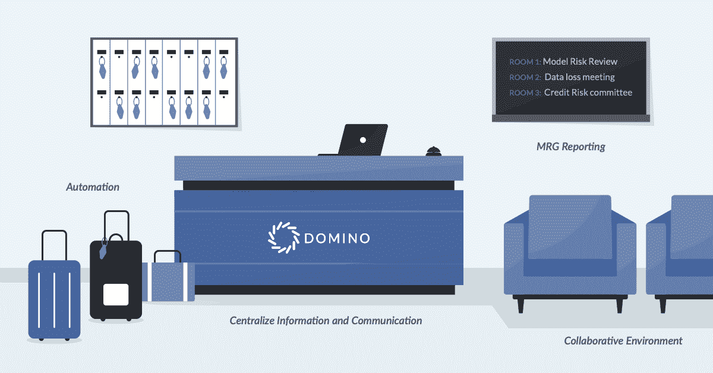
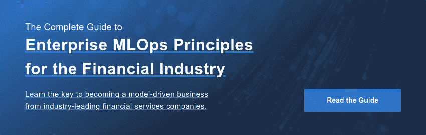

# 4 种更好地管理和治理金融服务和保险模式的方法

> 原文：<https://www.dominodatalab.com/blog/4-ways-to-better-manage-and-govern-financial-services-and-insurance-models>

金融服务行业开始意识到这样一个事实的重要性，就像洗碗和园艺这样的家务一样，ML 模特永远不会真正完成。更确切地说，人工智能和人工智能模型需要被监控有效性，并且通常还需要为监管者重新解释和重新记录。因此，焦点集中在模型风险管理(MRM)和治理(MRG)上，这是金融服务和保险公司的两个相关的关键流程，这两个学科的重要性只有 [预计会增长](https://www.mckinsey.com/~/media/mckinsey/business%20functions/risk/our%20insights/a%20strategic%20vision%20for%20model%20risk%20management/a-strategic-vision-for-model-risk-management.pdf?shouldIndex=false) 。

“你不能再仅仅依赖那些备受尊敬的模特了。穆迪分析公司 [的董事总经理雅各布·格罗塔说:“你需要了解一个模型为什么适合你，它与其他模型的相关性，它是如何建立的，以及它的利弊。”。](https://tdwi.org/articles/2022/01/27/domino-data-lab.aspx)

透明度 在建模过程中至关重要，他解释道。

因此，MRG 和 MRM 都是 FSI 公司的大问题。MRG 涉及一套描述模型如何被创建、使用和废弃的规则和过程，而 MRM 通常是实现 MRG 规则和过程的实践。MRG 通常被认为是一个更宽泛的术语，所以在下文中，我用它来包含 MRM 作为它的一个子学科。

正确理解 MRG 和 MRM 是困难的。会出现许多陷阱和问题，降低效率和生产力。这些问题包括缺乏自动化、高效流程、协作和沟通。

## MLOps 帮助 MRG 和 MRM

一个全功能的企业 MLOps 平台可以解决其中的许多问题，使端到端流程对每个参与者来说都更加简单高效。将适当的企业 MLOps 平台视为礼宾员，将信息与您作为数据科学家、分析师、数据质量经理、风险或合规经理、IT 经理、高管甚至监管者的角色相匹配。就像一个优秀的酒店礼宾员一样，它为您提供有关 MRG、审计、合规和 it 流程中的步骤、模型、数据以及已识别和减轻的风险的最新、最相关的信息，从而消除您在完成工作时的猜测。从这个角度来看，我们将讨论 MRG，以及企业 MLOps 平台如何帮助相关人员更轻松地完成工作。

MRG 通过风险评估识别与特定模型相关的风险。一旦确定了这些风险，就可以使用各种工具和技术对其进行管理和监控。强大的 MLOps 平台的以下解决方案提高了您的 MRG 集团的功效、效率和效益，并增强了业务能力。

#### 规则#1:在任何地方都实现自动化，以提高 MRG 效率和业务速度

最近的 [麦肯锡模型风险管理调查](https://www.mckinsey.com/~/media/mckinsey/business%20functions/risk/our%20insights/a%20strategic%20vision%20for%20model%20risk%20management/a-strategic-vision-for-model-risk-management.pdf?shouldIndex=false) 发现，54%的银行认为自动化将是提高 MRG 效率的首选解决方案。这就是企业 MLOps 平台的用武之地。MRG 流程的自动化，例如检查数据质量、线上和线下测试、模型或数据漂移报告，不仅可以简化团队之间的工作流程，还可以提高模型开发和部署流程中的文档标准和一致性。通过集成的同行评审和分析，以及将当前结果与先前结果进行比较的能力，团队可以获得更可验证和更准确的模型结果。该平台还可以提供关于与模型相关的风险的有价值的见解和信息，这有助于企业就如何管理风险做出更好的决策。

例如， [一家领先的财富 500 强保险公司](https://www.dominodatalab.com/customers/fortune-500-insurer) 利用 Domino Enterprise MLOps 平台增强了其 MRG 流程，充分利用了实验、数据集、工具和环境的自动跟踪和完全可再现性。现在，该公司有一个确切的审计跟踪记录，记录了完成了哪些工作，谁访问了哪些数据。这消除了在部署之前将模型代码和数据传递给风险经理的问题。在 Domino Enterprise MLOps 之前，这是在很少文档的情况下完成的，这增加了治理和遵从过程的时间和复杂性。

#### 规则 2:协作&为所有利益相关者创造一个共享的环境

企业 MLOps 平台还可以改善公司内不同部门之间的协作，尤其是在风险管理和治理模式方面。MRG 和 MRS 涉及许多不同的部门，如数据科学家、分析师、风险经理和审计部门。他们将获得 相同的一致的、正确的相关信息版本，并且他们还可以建立在同行的工作之上。

例如， [好事达](https://www.dominodatalab.com/customers/allstate) 在其数据科学团队中使用 Domino 的企业 MLOps 平台。对他们来说，一个关键的好处是能够在任何时间点回顾分析，这使得向高级管理层或监管者展示一个数字是如何获得的成为可能。这确实提高了审计能力。另一个优势是，企业 MLOps 使数据科学成为一个可重复的过程。

四大信用评级机构[【DBRS】](https://www.dominodatalab.com/customers/dbrs)也利用 Domino 促进团队间的协作，而不需要任何团队成员复制环境或使用不熟悉的工具。

该公司的定量分析师迈克尔·辛克莱(Michael Sinclair)说:“这是一种时间节约。“你没有遵循一个严格的文档程序通常会遇到的困难；你可以做你的工作，Domino 会跟踪你。如果你需要的话，你可以回去改变一些东西，你可以四处移动东西，或者如果你需要帮助，你可以标记某人。这是一个集中的枢纽。

#### 规则#3:改进智能&仪表化报告，以帮助模型评审过程

风险报告也受益于企业 MLOps 平台。对来自模型的信息的实验和尽职调查可以被适当地监控，甚至可以为将来的模型评审自动化。此外，这些组件可以被存储、标记和共享，以供未来在分析和人工智能库中重用，使企业更容易生成准确和最新的模型风险报告。

丹麦第二大保险公司 [【托普丹马克](https://www.dominodatalab.com/blog/scaling-mlops-at-one-of-denmarks-leading-insurers) 】竭力监控生产中的车型，对自动化决策的质量充满信心。例如，两位数据科学家花了三个月的时间来挖掘数据源，以确定一个算法的数据集格式不正确，导致模型漂移。现在，他们使用 Domino 来自动监控模型，发送模型漂移警报，并确定应该从哪里了解这个问题。

“我认为，如果您要展示您正在交付预期的价值并快速解决任何问题，企业 MLOps 平台内的实时模型监控功能至关重要。”Topdanmark 数据科学卓越中心的负责人 Stig Pedersen 说，

#### 规则#4:使用一个平台来集中信息和通信以降低风险

企业 MLOps 平台可以帮助金融服务和保险公司改善向内部和外部利益相关者传达模型风险信息的方式。每个人都可以从中央存储库中轻松访问模型风险信息。这有助于确保每个人都意识到与模型相关的风险，并且可以有效地管理它们。

DBRS 也使用 Domino 来提供对其信用评分方法的可见性。至关重要的是，DBRS 的评级决策、模型和方法开发具有严格的治理和可审计性。找到自动演示治理的方法将研究人员从编译文档中解放出来，从而加快模型的上市时间。如今，他们可以轻松地显示和交流所有进入分析的数据和代码，因为 Domino 会自动保存完整的实验记录 — 谁参与了，尝试并放弃了哪些方法，何时将其推广到生产中等等。

DBRS 产品管理全球主管 Thomas Little 说:“Domino 不必完全依赖人类进行交流，只需在代码库中捕获所有的交流，从而有助于降低风险。

