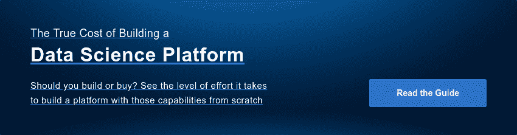

# 不应该购买多米诺的 5 个理由

> 原文：<https://www.dominodatalab.com/blog/5-reasons-you-should-not-buy-domino>

作为一名数据科学从业者，你敏锐地意识到机器学习模型如何推动商业成功。

模特可以帮助你的公司战胜竞争对手。

模型有助于引导领导者通过艰苦的变革来实现增长。

模型可以推翻忽视这一资源的强大竞争对手。

多米诺就是把机器学习模型作为一种商业武器。我们相信，通过企业 MLOps 平台将模型置于其业务核心的组织将击败竞争对手，推动前所未有的增长，并颠覆行业巨头。这些将是“模型驱动”的业务，它们将会胜出。

如果您的组织对是否应该投资企业 MLOps 平台犹豫不决，我们提供了一个简短的指南，列出了您不应该购买 Domino 企业 MLOps 解决方案的五个原因。虽然该指南是讽刺性的，但问题是严肃的:企业 MLOps 平台适合您吗？'

## 你认为无限的工具和计算被高估了

也许你的数据科学家只需要一台基本的笔记本电脑，你无法理解为什么有人需要分布式计算、GPU 或其他现代基础设施。

你的 IT 团队是不是就等着你去寻求帮助，愿意分分钟跳到你的请求上？

在您的世界中，您的数据科学家只是微笑着使用他们被告知使用的任何工具吗？

*然而……*

如果你像我们采访的大多数数据科学领导者一样，那么访问[数据科学工具](https://blog.dominodatalab.com/data-science-tools)和基础设施是一个很大的痛点。

无论任务需要什么，Domino 都可以轻松使用。

Domino Enterprise MLOps 平台是通向权力的门户。几乎任何企业级的数据科学工具和基础架构。易于调配。即刻可用。

没有锁定或等待繁忙的 IT 员工来调配资源。Forrester Consulting 最近的一项研究发现，Domino 平均节省了 70 个小时来加速项目的资源！Domino 让您能够利用最好的工具来解决业务问题。

## 你喜欢电影《土拨鼠日》

如果你怀疑别人创建的模型是否可信，你会创建一个新的吗？

也许数据科学家永远不会离开你的组织。如果是这样的话，恭喜你！知道你的整个团队从一开始就完好无损，知道所有的东西都在哪里，并且知道曾经完成的每个项目，这是很方便的。

或者，也许你认为在入职期间淘汰坏数据科学家的最好方法是重复性项目？

*可能不会…*

我们从数据科学领导者那里听到的事实是，他们的团队总是在“重新发明轮子”复制过去团队成员的工作是困难的，并导致关键人员的风险。

Domino 可以让你复制任何研究。

使用 Domino，您将享受到一个可搜索的记录系统，该系统可以跟踪任何实验级别项目的所有相关工件。您可以复制和重用，以专注于更有价值的见解。

## 你确信筒仓让数据科学家专注

也许你的公司故意孤立数据科学家。

你的数据科学家最喜欢孤立地孵化想法吗？

数据科学家更喜欢作为发现下一个突破的独立天才的荣耀吗？

*说真的……*

我们遇到的大多数数据科学领导者都在寻找打破孤岛、加速协作的方法。

Domino 促成了一种协作文化。

通过单一平台，Domino 平台允许数据科学家独立于工具进行协作，因此团队可以专注于解决更复杂的问题。将您的团队放在 Domino 上进行持续的学习循环，从而推动不断增长的商业价值流。

## 你认为影子是一项团队运动

也许你很幸运，为一个没有 IT 政策限制数据科学家下载和使用他们想要的任何工具的组织工作？“占有”是游戏的名字吗？

当您的数据科学家可以自由地在公司边界之外工作时，他们会拥抱企业家精神吗？

也许你桌子下面的服务器可以让你将模型投入生产，而不需要官僚的验证步骤。它能在冬天保持双脚温暖。

*现实来袭……*

有效扩展数据科学的组织是那些知道如何在不牺牲数据科学生产力的情况下满足企业对安全性、风险和合规性的要求的组织。

Domino 可以轻松地支持企业级的一切。

再也没有影子了！为您的数据科学团队提供 Domino，以便他们可以使用自己喜欢的工具、包和基础设施。它可以削减支持成本，同时提高安全性、治理、合规性、协作和可再现性。

## 你不能提高博士的生产率

在您的世界中，您是否按每个模型向数据科学家支付报酬？你通过限制生产率来控制成本吗？

您是否发现您的数据科学家喜欢执行手动任务？我知道，自动化是一个东西。但这就像手工制作瑞士表。自动化和质量不一致，对吗？

你的组织不赞成速度吗？慢而稳是你的数据科学保龄球队的名字吗？

*等一下……*

我们经常看到数据科学团队花在研究上的时间太少，因为他们需要执行各种相关任务才能取得进展。

Domino 支持模型的高速创建和部署。

有了 Domino，模型摩擦就没有了。我们的企业 MLOps 平台提供了一种通用的工作方式，其工作流可加速每个步骤的生命周期和关键过渡。无论使用什么工具，Domino 都让数据科学家加速实现价值——我们称之为“模型速度”但是不要相信我的话。查看我提到的最近的 Forrester Consulting 研究，*[Domino Enterprise ml ops 平台的总体经济影响](https://f.hubspotusercontent40.net/hubfs/6816846/TEI%20of%20Domino%20Data%20Lab.pdf?utm_campaign=TEI%202021&utm_medium=email&_hsmi=115955358&_hsenc=p2ANqtz-9ABo5qnQkRu2JKPdD3Bbfu_XzJO7Ln-sS6UOcNy0NQnhuFMb0GbSvHCpRa7ZULBqpqEe56gLTxU8bcHKYUx0_rlJgy2EyNhqgNgYsgCiAivmTe2JQ&utm_content=115955358&utm_source=hs_automation)* 。Forrester 发现 Domino 提供了更快的模型验证，每个模型平均 20 小时。三年总投资回报率高达 542 %!

有时候荒谬的想法会引发常识。如果足够好对你来说还不够好，我邀请你今天就去看看多米诺。我有预感，多米诺是你们公司想要购买的东西！

 

[Twitter](/#twitter) [Facebook](/#facebook) [Gmail](/#google_gmail) [Share](https://www.addtoany.com/share#url=https%3A%2F%2Fwww.dominodatalab.com%2Fblog%2F5-reasons-you-should-not-buy-domino%2F&title=5%20Reasons%20Why%20You%20Should%20NOT%20Buy%20Domino)