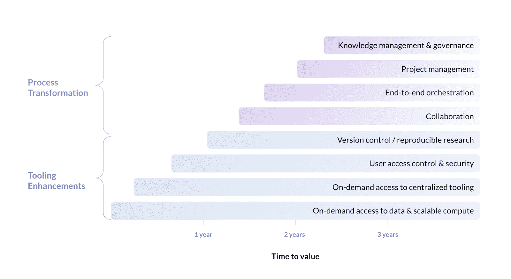

# 构建数据科学平台之前要问的 7 个关键问题

> 原文：<https://www.dominodatalab.com/blog/7-key-questions-to-ask-before-building-a-data-science-platform>

## 建还是不建。这是个问题。

我们看到许多组织都在纠结是否要建立一个数据科学平台。但这是一个过于狭隘的问题。对于大多数组织来说，真正重要的是扩展数据科学。事实上，[埃森哲](https://www.accenture.com/us-en/insights/artificial-intelligence/ai-investments)的一项研究发现，75%的企业高管认为，如果他们不扩展数据科学，他们将在五年内破产。

因此，他们应该回答的问题是:什么平台将帮助我们加快扩展数据科学的能力？

原因如下。

组织很快意识到，他们必须消除基础架构摩擦，消除孤立的工作，并加快模型投入生产的速度，以便在整个组织内扩展数据科学。这是因为当团队成员使用不同的工具，努力设置环境，在不同的地方存储数据科学工件，以及在数据科学生命周期中手动管理项目时，生产力会急剧下降。同样，当 IT 部门必须支持定制的数据科学硬件和工具，并为每个模型重新创建部署流程时，他们的支持负担和成本也会增加。

这时，有人必然会说，“停止疯狂吧！我们需要一个数据科学平台！”。

的确，他们确实需要一个平台来扩展数据科学。但要正确地做到这一点，他们需要一个能够协调端到端[数据科学生命周期](https://blog.dominodatalab.com/how-enterprise-mlops-works-throughout-the-data-science-lifecycle)的平台，提供灵活性并大幅提高生产率。如下图所示，该平台需要提供基本要求，如按需访问数据、可扩展计算和工具。它还需要提供过程转换需求，例如项目管理、可再现性、知识管理和治理。

不幸的是，我们经常看到的情况是，组织在其平台范围内仅包括自助服务数据、计算和工具。这似乎很容易实现，早期的进展令人兴奋，并显示出希望。但是这仅仅解决了规模问题的一部分——而且只是在很短的时间内。通常，这个有限的平台会运行一段时间，然后因为缺少太多功能而被放弃。其他时候，将尝试额外的需求，但是像安全性、版本控制、协作、编排、知识管理和治理这样的功能很难快速交付，特别是如果它们最初没有在项目中确定范围的话。该平台成为一个永无止境的开发项目，需要数年才能实现价值。

构建一个交付所有需求的平台需要大量的资源来确定范围、构建和管理，尤其是高价值的流程转换需求。这也需要大量的时间——我们已经看到客户花费数年时间来满足高价值的需求。组织还需要计划工具生态系统和部署选项的不断发展。这需要持续的支持和专门的开发团队。

没有时间可以浪费，因为对于数据科学来说，时间就是金钱。延迟向企业交付模型会带来巨大的机会成本。

**因此，如果“我们需要一个数据科学平台？”就是“让我们建造它吧！会更快/更容易/更便宜/更好！”停下来好好想想。您的组织能否真正提供一个强大的数据科学平台来满足您组织的所有需求？你能长期支持它吗？你能在几个月而不是几年内交货吗？**

即使您对所有这些问题的回答都是肯定的，所需的努力和投资会为您的组织带来竞争优势吗？或者，真正的竞争优势是扩展数据科学吗？这是我们的客户得出的结论。

> *“我们的领导指示是，如果它不是一种差异化能力，我们就不应该构建它；我们应该考虑买下它。以我的经验来看，最初人们会对开发内部工具感到兴奋，两年内它们都很棒，但到了第三年，就没人再关心维护它们了。”*
> 
> 软件服务决策科学高级总监
> 
> 来源:[Forrester Domino 数据实验室企业 MLOps 平台的总体经济影响](https://www.dominodatalab.com/blog/forrester-tei-study-domino-delivers-542-roi-and-payback-within-6-months/)

## 构建数据科学平台之前要问的 7 个关键问题

为了帮助您决定构建还是购买是适合您组织的正确方法，您需要回答以下七个问题:

1.  扩展数据科学需要哪些能力？
2.  如果我们构建一个平台，需要多长时间才能完全交付这些功能？
3.  与市场上的商业平台相比，我们的需求真的是独一无二的吗？
4.  我们能否提供长期开发、支持和扩充平台所需的关注度、承诺、技能和资金？
5.  我们能否让我们的平台经得起未来的考验，这样我们就不必随着需求的变化而重新开始或做大量的工作？
6.  搭建平台和购买平台的机会成本有什么区别？
7.  数据科学平台是我们组织应该支持的核心竞争力吗？

有关更多信息，请查看我们的新白皮书[构建数据科学平台的真实成本](https://www.dominodatalab.com/resources/cost-of-building-data-science-platform/)。本白皮书提供了有关构建数据科学平台的功能、成本和注意事项的信息，包括:

*   这是一个从一个执行人员那里学到的案例研究，这个执行人员走上了构建的道路，并且再也不想犯同样的错误。
*   关于您组织中每个人需要从数据科学平台获得的能力的详细信息。
*   八项功能的详细功能清单。

 

[Twitter](/#twitter) [Facebook](/#facebook) [Gmail](/#google_gmail) [Share](https://www.addtoany.com/share#url=https%3A%2F%2Fwww.dominodatalab.com%2Fblog%2F7-key-questions-to-ask-before-building-a-data-science-platform%2F&title=7%20key%20questions%20to%20ask%20before%20building%20a%20data%20science%20platform)