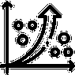
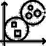
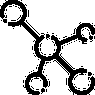

# 7 重要的机器学习技术和算法

> 原文：<https://www.dominodatalab.com/blog/7-machine-learning-algorithms>

每一个[机器学习模型](https://www.dominodatalab.com/blog/an-introduction-to-model-based-machine-learning)的核心都是驱动它们的算法，消耗数据并为你提供你需要的答案。在今天的机器学习(ML)中，有无数的算法正在被使用，每一种算法都被设计来寻找不同问题的解决方案。在你决定用哪种或哪几种算法来完成这项工作之前，了解你有哪些选择是很重要的。

## 什么是机器学习算法？

一般来说，算法是作为一组指令或程序来解决问题或执行任务的公式。一旦用一组数据训练了模型，它就能够为一组给定的输入提供一个结果或结果。

这类似于大脑的工作。一旦你训练孩子自己系鞋带，他们就可以利用这种训练自己系鞋带，还有靴子、溜冰鞋，甚至在包裹上用丝带打蝴蝶结。然而，打领带是一种不同的模式，需要不同的指导和全新的培训课程。ML 模型使用不同的算法，这取决于模型需要做什么以及您可以获得的数据。

## 7 种机器学习算法

机器学习算法可以根据它们的学习方式、它们适合的数据类型以及它们用这些数据做什么来分类。这就是为什么用于预测天气的 ML 模型与过滤垃圾邮件的模型完全不同，但实际上可能与告诉你何时买卖股票的模型非常相似。

许多算法在训练时使用[监督学习技术](https://www.dominodatalab.com/blog/supervised-vs-unsupervised-learning)，其中它们试图预测的输出数据在训练期间是已知的和可用的。当算法处理数据时，它创建将输入映射到输出的规则。这通常是一种比无监督学习更快的技术，无监督学习需要算法解密训练数据以生成自己的输出。

还有许多其他方法来对算法类型进行分类。例如，回归是一种监督学习技术，通常用于识别变量之间的关系。另一种常见形式称为分类，其中算法将数据分组到类别中，包括线性分类器、决策树和支持向量机。

虽然有许多不同的 [类型的算法](https://pdfs.semanticscholar.org/c4ae/802491724aee021f31f02327b9671cead3dc.pdf) 供您使用，但在开始任何[机器学习项目](https://www.dominodatalab.com/blog/machine-learning-projects-challenges-best-practices)之前，这里有七个您应该了解的最常见的算法:

### 

### 线性回归

[线性回归](https://betterprogramming.pub/machine-learning-theory-and-programming-supervised-learning-regression-analysis-8ed2d86f5714) 是最容易使用的 ML 算法之一。当你向它提供足够的数据时，它会向你显示数据的因变量和自变量之间的线性关系。简单线性回归指的是有一个独立变量的问题，而多元线性回归指的是有多个独立变量的问题。线性回归的关键假设是因变量是连续的。

### 

### 逻辑回归

[逻辑回归](https://enlear.academy/logistic-regression-in-machine-learning-672c0e8c8053) 用于因变量为二元而非连续时。该模型以概率的形式解释了因变量和一个或多个自变量之间的关系。当试图理解不同的因素如何影响某件事情发生的可能性时，这种技术非常有用，例如，一项交易是否具有欺诈性？

### 

### 决策树

决策树是一种监督学习算法，它使用树状分支结构来生成目标变量的预测。树中的每个分支节点对应于一个特定的属性，而每个叶节点对应于该属性的特定值。由于其图形化的本质，它是最容易解释的模型之一。这种方法非常有助于确定对给定决策采取的最佳行动。

### 聚类(K 均值)

[K-means 聚类](/blog/getting-started-with-k-means-clustering-in-python)是一种无监督学习，用于将数据分类成组，变量 K 表示要使用多少组。每个数据点都根据相似性聚集在一起。

零售商可以使用这些算法根据购买历史将客户分组，或者根据销售活动将库存分组。它们还被用于将产品分组在一起，分离音轨，或将人类活动与在线机器人分开。

### 

### 朴素贝叶斯

朴素贝叶斯算法使用来自一组不相关数据的概率分类器来确定另一个变量的概率。这些都是基于贝叶斯定理，该定理根据其他无关的数据来确定事件或发生的概率，如基于年龄的心脏病风险增加。

朴素贝叶斯算法通常用于垃圾邮件过滤器，它可以分析电子邮件中的单词和短语，以确定它们是否是垃圾邮件的概率。

### 支持向量机(SVM)

监督学习方法的另一个例子是 [支持向量机](https://pdfs.semanticscholar.org/c4ae/802491724aee021f31f02327b9671cead3dc.pdf) ，它通过将数据分成两类来对数据进行分类。它可用于分类、回归和异常值检测。SVM 在两个类别之间划了一条线，因此一边的数据放在一个类别中，另一边的数据放在第二个类别中。然后 SVM 可以画更多的线。

与其他算法相比，SVM 的关键在于它可以选择将线放在哪里，以确保数据不会被错误分类。简单的线性 SVM 分类器绘制直线，然而其他 SVM 方法不限于直线或单个平面。

### 全体

顾名思义，集成学习涉及使用多种算法来创建 ML 模型。它主要用于解决复杂的问题。一个常见的例子是随机森林技术，用于解决分类和回归问题。随机森林由几个共同处理相同数据的决策树组成。

## 如何选择正确的机器学习技术

选择正确的机器学习算法本身就是一项技能。请始终记住，您的模型越复杂，构建、培训、测试、维护和部署就越困难。除此之外，你的模型越复杂，当工作模型被交付给工程师或其他数据科学家时，当它被部署、监控和维护时，就越难以记录和解释。

当您选择算法时，首先定义需要解决的问题，并探索您可用的数据来解决它。

总是从最简单的解决方案开始。在增加复杂性之前，构建并测试该模型。然后，您可以将较简单模型的结果与较复杂模型的结果进行比较，直到您在获得想要的结果和复杂解决方案之间找到最佳平衡点。

## 结论

对于一个模型驱动的组织来说，访问完整的机器学习算法库是探索您的选项的最佳起点。Domino Enterprise MLOPs 平台让您可以立即访问您需要的所有库。它以协作为宗旨，还为您提供了监控、文档和治理所需的工具。

要探索 Domino Enterprise MLOps 平台中可用的资源，请使用 [观看它的演示](https://www.dominodatalab.com/demo/) ，使用 [免费试用](https://www.dominodatalab.com/trial/) 来探索它的特性。