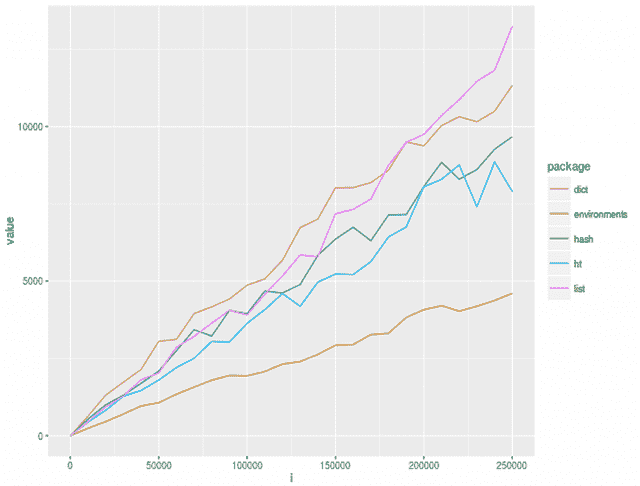
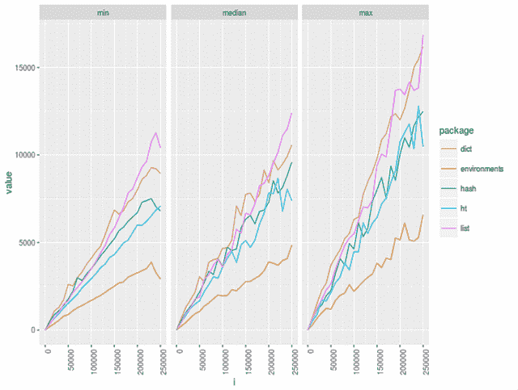
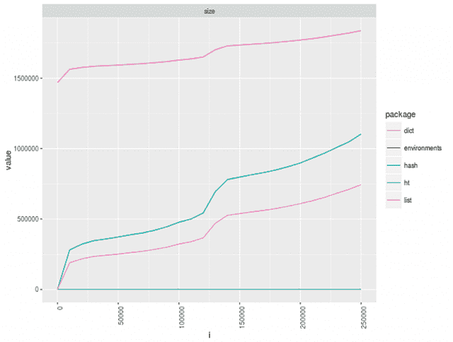
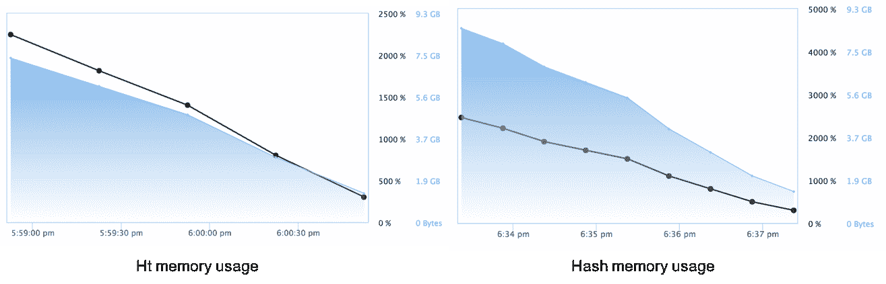

# R 中哈希表实现的快速基准

> 原文：<https://www.dominodatalab.com/blog/a-quick-benchmark-of-hashtable-implementations-in-r>

**更新**:我很谦卑，也很感谢这篇帖子有这么多的反馈！它开始是一个快速和肮脏的基准，但我从 Reddit，对这个帖子的评论，甚至从哈德利本人那里得到了一些很好的反馈！这篇文章现在有一些更新。主要的更新是，如果你的键总是有效的 R 符号，R 的`new.env(hash=TRUE)`实际上提供了最快的散列表！这是我真正喜欢数据科学社区和数据科学过程的原因之一。迭代和同行评审是伟大成果的关键！

* * *

当人们考虑数据科学管道的关键组件时，您可能会考虑建模 API 或可视化库，但不太可能首先想到低级的哈希表。数据科学的一个令人痛苦的事实是，投入典型项目的大部分精力([据报道，80%](http://www.forbes.com/sites/gilpress/2016/03/23/data-preparation-most-time-consuming-least-enjoyable-data-science-task-survey-says/#2fe451d07f75) )都花在了寻找、清理和准备数据上。剩下的“20%”是实际数据分析。数据科学家可用的最有用的数据结构之一是哈希表(也称为关联数组)。

哈希表是名副其实的瑞士陆军电锯。这些数据结构允许用户取一个任意值，比如一个字符串、一个复杂对象或一个数据帧，并使用它作为查找来找到另一个值。在数据科学项目的清理和准备数据阶段，散列表数据结构的常见用途是功能工程(例如，记录您在流中看到单个值的次数)、规范化，甚至是创建简单的直方图。

## r 的~~缺少一个~~本机(和性能)散列表

让许多从其他背景学习 R 编程语言的人感到惊讶的是，R 对散列表的支持在历史上一直是缺乏的。 **更新**:事实证明，R 有一个性能完美的哈希表实现，只是命名不直观或者不容易找到。如果您使用`new.env(hash=TRUE)`创建一个新的环境，R 为您提供了一个运行良好的环境。这是有意义的，因为它是用 C 实现的哈希表的一个瘦包装器，性能是显而易见的。R 提供的`list()`数据结构允许这种关联映射。然而，在堆栈溢出和类似的论坛上，有许多关于使用和增加列表的潜在性能影响的警告。在这篇简短的博文中，我们提供了管理 r 中关联哈希表的 4 种方法的简单基准。我们看看原生的`list()`、迈克尔库恩的 [`dict`包](https://github.com/mkuhn/dict)、克里斯托弗·布朗的 [`hash`包](https://cran.r-project.org/web/packages/hash/index.html)、尼尔富茨的 [`ht`包](https://github.com/nfultz/ht)和默认的`new.env(hash=TRUE)`。

这两个包之间的第一个区别是存储复杂键的能力。例如，您可能想要将一个`data.frame`映射到一个特定的值。下面的代码演示了一个简单的示例:

```py
mydict <- dict()      

mylist <- list()      

myht <- ht()      

myhash <- hash()     

myenv <- new.env(hash=TRUE) 

mykey <- data.frame(product="domino", value="awesome")        

mydict[[mykey]] <- "something" #will fail         

mylist[[mykey]] <- "something" #will fail

myhash[[mykey]] <- "something" #will fail 

myenv[[mykey] <- "something" # will fail      

myht[[mykey]] <- "something" #will succeed

```

原生 R 列表和`dict`包不允许你在 hashtable 中存储一个带有复杂键的条目，比如 data.frame。

```py
mykey <- data.frame(product="domino", value="awesome")

mydict[mykey] <- "something" #will fail

Error in mydict[mykey] <- "something" : invalid subscript type 'list'

mylist <- list()

mylist[mykey] <- "something" #will fail

Error in mylist[mykey] <- "something" : invalid subscript type 'list'

```

`hash`包没有提供同样的错误，但是当你看到表面之下时，这个包似乎错误地存储了密钥，并且实际上不允许你查找给定的原始值:(**更新**:这是我赋值时的一个错误。正如哈德利在一条推文中向我指出的那样，`[[`代表单值，`[`代表多值。所以这个错误完全是伪造的，隐藏了哈希不存储复杂键的事实。)

```py
# UPDATE - Ignore this code block, read update above!

myhash[mykey] <- "something" #will succeed

myhash[mykey]

Error in get(k, x) : invalid first argument

myhash[data.frame(product="domino", value="awesome")]

Error in get(k, x) : invalid first argument

as.list(myhash)

$`1`

[1] "something"

```

~~由于某种原因，作为密钥的`data.frame`被默默地存储为数字`1`。如果用户不知道，这可能会产生一些难以跟踪的错误。~~
`ht`包使用了一个隐藏的摘要，并允许您使用原始键或生成相同摘要值的对象来查找值:

```py
] myht[mykey] <- "something" #will succeed

] myht[mykey]      

[1] "something"

] myht[data.frame(product="domino", value="awesome")]

[1] "something"

```

如果您需要将任意复杂的对象作为关键字存储在一个散列中，`ht`包提供了最强大的功能。

## 哈希表包的性能

我们分析了这些不同哈希表实现的运行时性能。我们使用优秀的`microbenchmark`包来执行每个实验的十次运行。在实验中，我们在每个散列中插入 10，000 到 250，000 个唯一键，增量为 10k。

`microbenchmark`为我们提供了一个数据结构，其中包含每次操作的最小值、最大值、平均值和中值，首先通过运行基准代码预热系统两次(例如，为了解决冷缓存问题)。)当我们查看平均值时，结果很清楚:

随着键的数量超过 100k，运行时开始发散。与其他散列表相比，`ht`和`hash`包的运行时间要短得多。然而，内置的`environment`比所有其他实现都要好得多。考虑到`ht`和`hash`使用环境，这是有意义的，但是为了方便，可能会在原始实现的基础上付出一些性能代价。`dict`和`list()`实现的性能曲线非常相似，这意味着它们可能在引擎盖下类似地工作。无论如何，他们的性能曲线表明，随着这个数字的增长，性能将受到很大影响。当我们绘制最小值、中间值和最大值时，没有什么意外。我们上面看到的模式在所有的包中重复:

性能的另一个方面是数据结构在存储数据时使用的内存量。~~我们使用 R 的`object.size()`函数来确定内存利用率。~~ **更新**:我们从 Hadley 的`pry`包中为`object_size`函数替换了 R 的`object.size()`。由于作者不知道的原因，`ht`和`hash`包返回了一个恒定的大小，如图表底部的两条线所示。还有一个问题是`object_size`为`hash`对象返回一个错误，这个问题已经在适当的 github 中提出。

查看图表，您会注意到`dict`和`list()`在实验的两个点上都看到内存使用的显著增加。它们各自的内存消耗和性能曲线的相似性是一个很强的暗示，即`dict`包是作为`list()`实现的！然而，你会注意到，现在使用`pryr`的`object_size`，我们看到`dict`对象占用了大量内存。我会调查这件事，因为这似乎不是一个正确的行为。

实验数据取自 Hadley Wickham 的【github 上*婴儿名字*数据集】。
由于`object.size()`似乎不能与`ht`和`hash`包一起工作，我们使用 Domino 中的 reproducibility engine 来捕获实验的运行时统计数据。这为我们提供了内存使用量的大致概念。



这些包的内存使用情况几乎是相同的，这意味着它们也可能使用 R Base 包的相同基础设施。

## 摘要

哈希表是一种非常有用的数据结构。在 R 中，如果您需要存储键-值对，并且您的键永远不会是复杂的数据结构，那么`hash`包是明显的赢家。(**更新**:在 R 中，如果你需要存储键值对，并且你的键总是有效的 R 符号，那么内置的`new.env(hash=TRUE)`是明显的赢家！)如果你需要复杂的键，`ht`包提供了与`hash`相似的性能，并增加了使用复杂键的能力。

标题为山中伸弥[词典](https://www.flickr.com/photos/tamaki/620939/)的横幅图片。由 2.0 在 [CC 下授权。](https://creativecommons.org/licenses/by/2.0/)