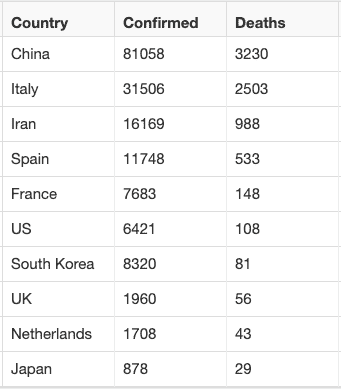
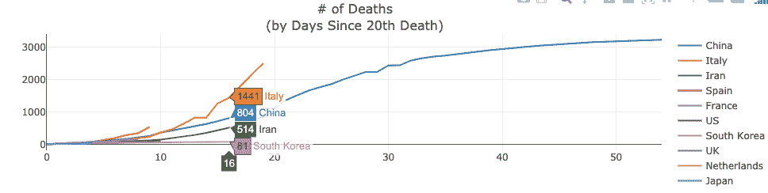
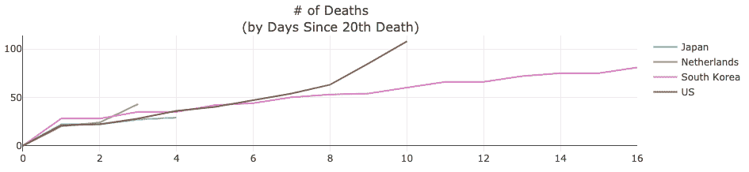
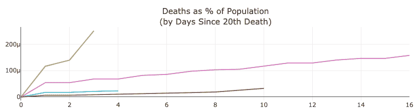
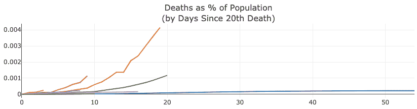
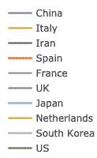

# 独特的国与国新冠肺炎比较

> 原文：<https://www.dominodatalab.com/blog/a-unique-country-to-country-covid-19-comparison>

像你们所有人一样，我的心思和我的生活都被新冠肺炎·疫情迷住了。当我看到冠状病毒在社区和国家传播时，我发现自己想要更深入地了解所有这些背后的数据。在搜索网页、博客和数据源后，我找到了一个可靠的数据源，并利用我在数据科学方面的背景来调查假设并与他人分享见解。

这项分析的数据来自约翰霍普金斯大学的 [2019 新型冠状病毒数据仓库](https://github.com/CSSEGISandData/COVID-19)。基于同样的数据，还有其他可用的分析。两个例子见[这里](https://gisanddata.maps.arcgis.com/apps/opsdashboard/index.html#/bda7594740fd40299423467b48e9ecf6)和[这里](https://shiny.john-coene.com/coronavirus/)。为什么我没有用那些？当我查看数据时，我想找到一种更容易预测处于冠状病毒斗争早期的国家的病例数和死亡总数的方法。我需要对不同国家的数据进行比较。为了做到这一点，我没有按照日历日期绘制数据，而是按照一个共同的 x 轴绘制，这个 x 轴将为每个国家的新冠肺炎趋势提供一个共同的起点。

约翰霍普金斯大学数据收集的第一个日期是 2020 年 1 月 22 日。在这一天，中国报告了与新冠肺炎有关的 547 例确诊病例和 17 例死亡。这是我们能找到的最早的数据。为了将所有国家放在一个共同的立足点上，我们将所有其他国家的时钟倒转，并使它们与中国首先报告的数字一致。每条曲线都来自同一个起点。在查看了许多国家的数据后，我选择了 600 例确诊病例和 20 例死亡病例作为起点。以下是我注意到的一些观察结果。我不是健康或医学专家，甚至不是这方面的新手。这些观察仅仅是基于数据。在得出最终结论之前，应该考虑测试程序、报告系统、地理人口分布、医疗基础设施和其他因素的知识。

### 这些观察基于截至 2020 年 3 月 17 日的数据。

## 按新冠肺炎死亡人数排名的前 10 个国家-显示确诊病例和死亡总数

## 韩国死亡总数保持不变

在目睹第 20 例死亡的 16 天后，韩国总共只有 81 例死亡。相比之下，意大利在经历了第 20 次死亡后的 16 天内共有 1441 人死亡。这种比较既显示了意大利的情况有多糟糕，也显示了韩国的情况相对可控。

意大利看起来有望比中国快 20 天突破 3000 人的死亡大关，而且很快意大利的新冠肺炎死亡人数将超过中国。考虑到每个国家的总人口，这些数字是惊人的。

## 美国、日本和荷兰最有可能看到类似韩国的平坦死亡曲线

在过去的两天里(他们第 20 次死亡后的第 9 天和第 10 天)，美国的死亡人数从 63 人上升到 108 人。这可不好。然而，如果死亡人口的百分比是地面状况的指标，那么，从大的方面来看，美国的这一增长就不那么令人担忧了。此外，在这种假设下，荷兰的数据看起来并不那么令人鼓舞。

## 荷兰、西班牙、意大利和伊朗经历了最糟糕的人口死亡百分比曲线

 

荷兰目前是这个名单上人口死亡曲线百分比最差的国家。在看到第 20 例死亡后的第三天，0.00025%的人口死于新冠肺炎。这比西班牙达到相同比例的时间早了两天。比意大利早四天。比伊朗早 9 天。名单上没有其他国家达到这个比例。

西班牙和荷兰的人口死亡曲线百分比与意大利相似。如果趋势继续，他们可以期待意大利曲线，只是他们会在旅程中更快地到达那里。

我还可以做更多的观察，但我就说到这里。数据将在未来几天发生变化，随着故事的展开，我们都将能够得出自己的结论。

我希望你已经发现这种冠状病毒死亡和病例数据的独特观点是有帮助的。对于那些患有冠状病毒的人或有亲人患病的人，要知道世界上数十亿人正在向你致以良好的祝愿、祈祷和希望早日康复的想法。对于那些在前线帮助拯救生命和保护社区的人们，你们拥有全世界的尊敬和最深切的感激。

[Twitter](/#twitter) [Facebook](/#facebook) [Gmail](/#google_gmail) [Share](https://www.addtoany.com/share#url=https%3A%2F%2Fwww.dominodatalab.com%2Fblog%2Fa-unique-country-to-country-covid-19-comparison%2F&title=A%20Unique%20Country-to-Country%20COVID-19%20Comparison)