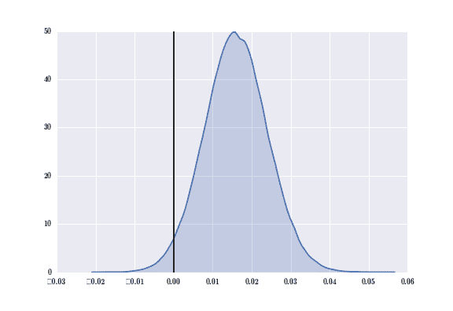
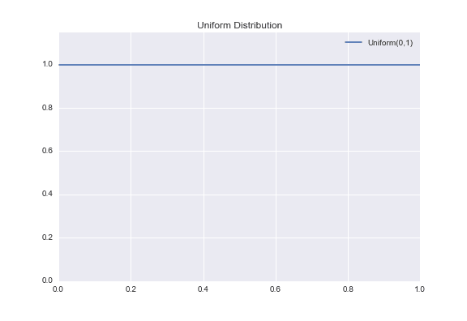
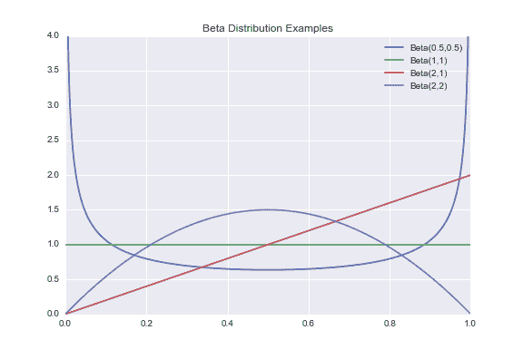
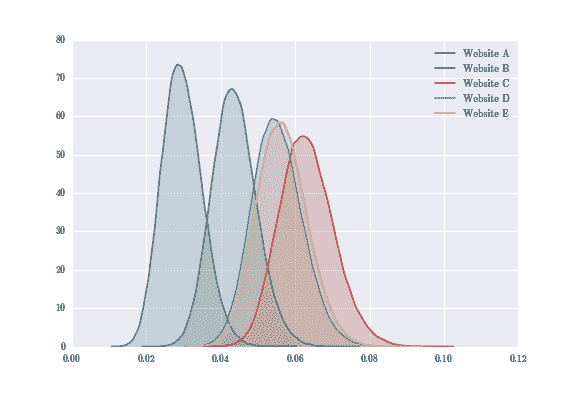
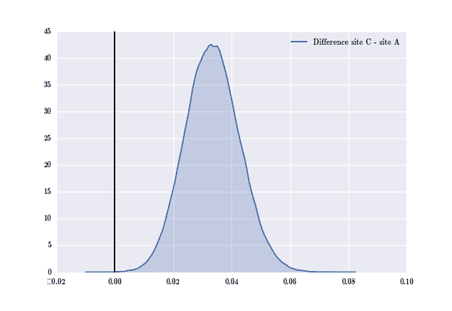
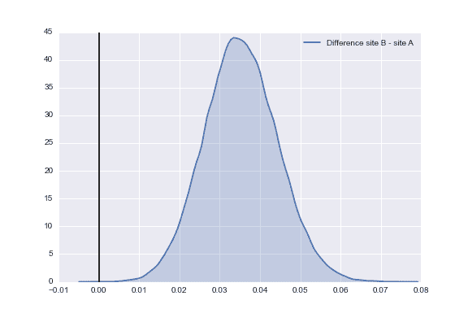
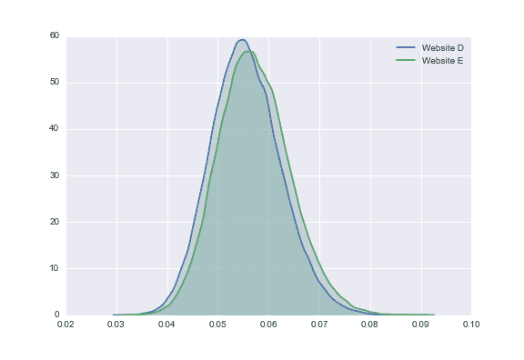
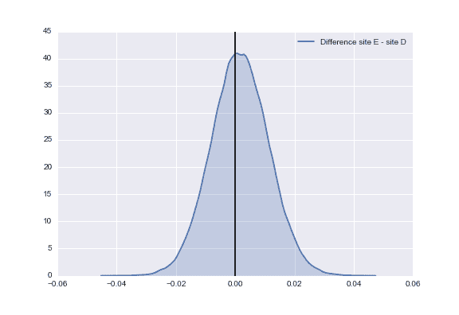
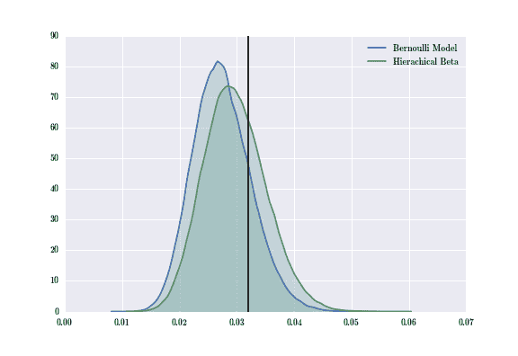

# Python 中层次模型的 A/B 测试

> 原文：<https://www.dominodatalab.com/blog/ab-testing-with-hierarchical-models-in-python>

在这篇文章中，我讨论了一种使用 Beta-二项式层次模型进行 A/B 测试的方法，以纠正测试多个假设时的一个常见缺陷。我将把它与使用伯努利模型计算 p 值的经典方法进行比较，并介绍层次模型相对于经典模型的其他优势。

## 介绍

想象以下场景:你为一家通过广告获得大部分在线流量的公司工作。你当前的广告只有 3%的点击率，而你的老板认为这还不够好。营销团队提出了 26 种新的广告设计，作为公司的数据科学家，你的工作是确定这些新广告中是否有比当前广告更高的点击率。

你设置了一个在线实验，向互联网用户展示 27 个可能的广告中的一个(当前广告或 26 个新设计中的一个)。两周后，你收集每个广告的数据:有多少用户看到了它，它被点击了多少次。

是时候进行一些统计测试了！新设计与当前设计的对比？没有统计学上的显著差异。新设计 B vs 当前设计？没有统计学上的显著差异。你继续运行测试，继续得到不重要的结果。就在你即将失去希望的时候，新设计 Z 诉当前设计....在 alpha = 0.05 的水平上有显著的统计学差异！

你告诉你的老板，你发现了一个比当前设计点击率更高的设计，你的公司将它部署到生产中。然而，在对新设计进行了两个月的统计后，似乎新设计的点击率为 3%。哪里出了问题？

在执行 A/B 测试时，数据科学家经常会陷入一个常见的陷阱，即无法针对多个测试进行纠正。alpha = 0.05 的测试意味着您的统计测试随机产生一个极端或更极端的结果(假设给定的零假设为真)的概率为 0.05。如果您运行 26 个统计测试，那么假阳性的预期数量的上限是 26*0.05 = 1.3。这意味着在我们上面的场景中，我们的数据科学家可以预期至少有一个假阳性结果，不幸的是，这个假阳性结果是她向老板报告的结果。

## 问题是

假设我们正在设计 [Domino 的网站](//www.dominodatalab.com?utm_source=blog&utm_medium=post&utm_campaign=ab-testing-with-hierarchical-models-in-python)，我们正在测试登陆页面的五种不同布局。当用户点击我们的网站时，她会看到五种登陆页面布局中的一种。从那里，用户可以决定是否要在 Domino 上创建一个帐户。

| 网站(全球资讯网的主机站) | 点击 | 注册 | 经验比率 | 真实汇率 |
| A | One thousand and fifty-five | Twenty-eight | Zero point zero two seven | Zero point zero three two |
| B | One thousand and fifty-seven | Forty-five | Zero point zero four three | Zero point zero four one |
| C | One thousand and sixty-five | sixty-nine | Zero point zero six five | Zero point zero five eight |
| D | One thousand and thirty-nine | Fifty-eight | Zero point zero five six | Zero point zero four seven |
| E | One thousand and forty-six | Sixty | Zero point zero five seven | Zero point zero five one |

作为免责声明，这是我创建的模拟数据，用来模仿真实的 A/B 测试数据。每个网站的注册人数是通过从二项式分布中生成一个数字来生成的，其中 n =点击次数，p =真实比率。经验比率代表注册/点击。

## 初步:贝叶斯统计

统计学有两个著名的分支:频率统计和贝叶斯统计。这两个分支有很多不同之处，但我们将重点关注一个关键的不同之处:

*   在频率统计中，我们假设感兴趣的参数是固定的常数。我们着重于计算可能性 Prob(数据|参数),即在给定感兴趣的参数的情况下，我们看到观察到的数据点集的概率。
*   在贝叶斯统计中，我们对感兴趣的参数有不确定性，我们用数学方法在一个*先验分布*中捕获关于这些参数的先验不确定性，正式表示为 Prob(参数)。我们着重于计算后验分布 Prob(参数|数据),表示在我们观察到数据后，围绕感兴趣参数的后验不确定性。

拜贝叶斯定理所赐，我们知道后验概率(参数|数据)与概率(数据|参数)概率(参数)成正比，概率乘以先验分布。

在我们的问题中，感兴趣的参数是人们在每个网站上注册的真实比率，观察到的数据是每个网站获得的点击和注册数量。因为是进行贝叶斯统计，所以对后验分布建模比较感兴趣:
Prob(真实报名率|数据)~ Prob(数据|真实报名率)Prob(真实报名率)。

## 经典伯努利模型

为了在 Python 中构建贝叶斯模型，我们将使用贝叶斯随机建模库 [PyMC](https://github.com/pymc-devs/pymc) 。

```py
import pymc
```

Cam Davidson-Pilon 用 PyMC 写了一本关于贝叶斯模型的伟大著作,我推荐给任何对学习贝叶斯统计或如何用 Python 编程贝叶斯模型感兴趣的人。本节中的 PyMC 代码基于他书中的 A/B 测试示例。

在我们研究 Beta-二项式分层模型方法之前，让我们先来看看我们如何在标准的两个网站案例中使用伯努利模型进行 A/B 测试。回想一下，网站 A 有 1055 次点击和 27 次注册，网站 B 有 1057 次点击和 45 次注册。

```py
# Website A had 1055 clicks and 28 sign-ups

values_A = np.hstack(([0]*(1055-28),[1]*28))

# Website B had 1057 clicks and 45 sign-ups

values_B = np.hstack(([0]*(1057-45),[1]*45))
```

现在，我们可以将每个可能的注册建模为伯努利事件。回想一下，伯努利分布反映了抛硬币的结果。以某种概率 *p* ，硬币翻转正面，以某种概率 *1-p* ，硬币翻转反面。这个模型背后的直觉如下:一个用户访问网站。用户投掷硬币。如果硬币正面朝上，用户就签约。

现在，假设每个网站都有自己的硬币。网站 A 有一枚硬币以概率 p[A] 正面落地，网站 B 有一枚硬币以概率 p[B] 正面落地。这两种概率我们都不知道，但是我们想确定 p[A]p[B]或者反过来是否成立(也有可能 p[A] = p[B] )。

由于我们没有关于 p[A] 或 p[B] 的真实值的信息或偏差，我们将从均匀分布中得出这两个参数。此外，我还创建了一个 delta 函数来创建两个分布之差的后验分布。

```py
# Create a uniform prior for the probabilities p_a and p_b

p_A = pymc.Uniform('p_A', 0, 1)

p_B = pymc.Uniform('p_B', 0, 1)
# Creates a posterior distribution of B - A

@pymc.deterministic

def delta(p_A = p_A, p_B = p_B):

    return p_B - p_A
```

接下来，我们将为每个网站创建一个观察变量，该变量包含每个网站的注册数据。然后，我们使用 *pymc* 运行 MCMC ( [马尔可夫链蒙特卡罗](https://en.wikipedia.org/wiki/Markov_chain_Monte_Carlo))从每个网站的后验分布中取样。对于门外汉来说，MCMC 是一类算法，通过构建具有期望分布特性的平衡分布，从期望分布中进行采样。因为 MCMC 采样器需要时间来收敛到平衡，我们丢弃了前 500，000 个采样点，所以我们只有从(希望)收敛的平衡分布中采样的点。

```py
# Create the Bernoulli variables for the observation

obs_A = pymc.Bernoulli('obs_A', p_A, value = values_A , observed = True)

obs_B = pymc.Bernoulli('obs_B', p_B, value = values_B , observed = True)

# Create the model and run the sampling

model = pymc.Model([p_A, p_B, delta, values_A, values_B])

mcmc = pymc.MCMC(model)

# Sample 1,000,000 million points and throw out the first 500,000

mcmc.sample(1000000, 500000)
```

现在，让我们检查 delta 分布的后验概率(记住，这是网站 B 的后验概率-网站 A 的后验概率)。

```py
delta_distribution = mcmc.trace('delta')[:]

sns.kdeplot(delta_distribution, shade = True)

plt.axvline(0.00, color = 'black')
```



黑线在 x = 0 处，表示两个分布之间的差值为 0。通过观察，我们看到分布的大部分质量在黑线的右边。这意味着从 B 分布中采样的大多数点比从 A 分布中采样的大。

为了得到更多的定量结果，我们可以计算网站 A 比网站 b 获得更多注册的概率。

```py
print("Probability that website A gets MORE sign-ups than site B: %0.3f" % (delta_distribution &amp;lt; 0).mean())

print("Probability that website A gets LESS sign-ups than site B: %0.3f" % (delta_distribution &amp;gt; 0).mean())
```

* * *

```py
The probability that website A gets MORE sign-ups than site B: 0.023
The probability that website A gets LESS sign-ups than site B: 0.977
```

* * *

对于这两个网站，我们看到网站 B 的表现优于网站 a。这对两个网站来说效果很好，但是如果我们对五个网站中的所有网站都这样做，由于多重测试问题，我们可能会遇到“误报问题”。有 10 个可能的配对，所以假设我们在 alpha = 0.05 的水平上独立测试所有可能的配对。对于每个测试，我们有 95%的机会不会得到假阳性，所以所有测试都不会产生假阳性的概率是(0.95)^(10) ，大约等于 0.60。这意味着获得至少一个假阳性结果的概率约为 0.40%或 40%。如果我们有更多的网站，从而有更多的配对来测试，得到假阳性的概率只会增加。

正如你所看到的，如果不修正多重测试，我们很有可能会遇到假阳性结果。在下一节中，我将展示层次模型如何隐式地纠正这种多重测试陷阱，并产生更准确的结果。

## 贝塔分布

在我介绍贝塔-二项式层次模型之前，我想讨论一下贝塔分布的理论动机。让我们考虑区间(0，1)上的[均匀分布](https://en.wikipedia.org/wiki/Uniform_distribution_(continuous))。



如你所见，这是一个简单的分布。它为域(0，1)中的所有点分配相等的概率权重，也称为分布的支持度。然而，如果我们希望(0，1)上的分布不是处处平坦的呢？

这就是 Beta 发行版的用武之地！贝塔分布可以看作是均匀分布(0，1)的推广，因为它允许我们在区间(0，1)上定义更一般的概率密度函数。使用两个参数 **a** 和 **b** ，贝塔( **a** ， **b** )分布由以下概率密度函数定义:

其中 C 是常数，用于将函数的积分归一化为 1(所有概率密度函数必须积分为 1)。这个常数正式名称为[贝塔函数](https://en.wikipedia.org/wiki/Beta_function)。通过改变 **a** 和 **b** 的值，我们可以改变分布的形状和“陡度”，从而允许我们在区间(0，1)上轻松创建各种各样的函数。



请注意，在上面的图中，对应于分布 Beta(1，1)的绿线与 Uniform(0，1)的绿线相同。如果将 **a** ， **b** = 1 代入贝塔分布的 pdf，则得到 pdf(x) = B(1，1)x^(1-1)(1-x)^(1-1)= B(1，1)x⁰(1-x)⁰= B(1，1) 1 1 = 1，其中 B(1，1)是在(1)处计算的贝塔函数
因此 Beta(1，1)的 pdf 处处为 1，所以等价于均匀(0，1)的 pdf，从而证明 Beta 分布确实是均匀(0，1)的推广。

现在，我敢肯定，你们中的许多人都想知道这一部分有什么大的收获，所以他们在这里:

*   贝塔分布是(0，1)上的一个通用概率分布族。
*   这允许我们创建先验分布，它结合了我们的一些信念，从而提供了丰富的先验信息。

在下一节中，我将讨论为什么这很重要，以及如何将 Beta 分布用于 A/B 测试。

## 分层建模

在本节中，我们将使用[二项式分布](https://en.wikipedia.org/wiki/Binomial_distribution)对网站注册进行建模。*二项式(n，p)* 背后的直觉是，如果我们以落地正面的概率*p*n 次抛硬币，我们看到 *k* 正面朝向 0 和 *n* 之间的某个 *k* 的可能性有多大。

在*经典伯努利方法*部分，我说过我们没有关于每个网站真实比率的先验信息，所以我们使用 Uniform(0，1)作为无信息先验。在本节中，我们将假设每个真实注册率都来自 Beta 分布。

现在，注册人数， *k[i]* 用*二项式(n[i] ，p[i] )* 建模，每个网站的真实注册率， *p[i]* 从 Beta 中抽取( **a** ， **b** )。到目前为止，我们忽略了一个重要的问题？我们如何选择 **a** 和 **b** ？

我们可以指定一个先验分布来选择这些超参数，但是我们的先验分布有一个先验分布，它一直向下。

更好的替代方案是从分布
f( **a** ，**b**)~(**a**+**b**)^(-5/2)其中 **a** ， **b** > 0。我肯定这个函数对你们中的许多人来说看起来像数学魔术，但是关于这个概率分布从何而来的深入解释可以在 Andrew Gelman 的书或者 Youtube 上的教程中找到。

该函数背后的一般思想是，它结合了关于平均值 log(a/b)的 [logit](https://en.wikipedia.org/wiki/Logit) 和“样本大小”的 log(a+b)的思想，以定义这两个参数的适当概率分布。如果前面的句子对你来说毫无意义，不要担心。它只是说，如果我们使用这个函数，当对 **a** 和 **b** 进行采样时，我们会得到期望的数学特性。

现在我已经介绍了理论，我们终于可以建立我们的层次模型了。本节中的代码基于 Stater Stich 的[使用层次模型](http://sl8r000.github.io/ab_testing_statistics/use_a_hierarchical_model/)教程。

贝塔先验函数从上面定义的函数中为我们采样 **a** 和 **b** 。PyMC 中的随机装饰器要求我们返回对数似然，所以我们将返回( **a** + **b** )^(-2.5) 的对数。

```py
@pymc.stochastic(dtype=np.float64)

def beta_priors(value=[1.0, 1.0]):

    a, b = value

    if a &amp;lt;= 0 or b &amp;lt;= 0:

        return -np.inf

    else:

        return np.log(np.power((a + b), -2.5))

a = beta_priors[0]

b = beta_priors[1]
```

然后，我们将真实的注册率建模为 Beta 分布，并使用我们观察到的注册数据来构建二项式分布。再次使用 MCMC 从平衡分布中采样 1，000，000 个数据点(再次丢弃前 500，000)。

```py
# The hidden, true rate for each website.

true_rates = pymc.Beta('true_rates', a, b, size=5)

# The observed values

trials = np.array([1055, 1057, 1065, 1039, 1046])

successes = np.array([28, 45, 69, 58, 60])

observed_values = pymc.Binomial('observed_values', trials, true_rates, observed=True, value=successes)

model = pymc.Model([a, b, true_rates, observed_values])

mcmc = pymc.MCMC(model)

# Generate 1,000,000 samples, and throw out the first 500,000

mcmc.sample(1000000, 500000)
```

让我们看看我们的五个后验分布是什么样的。



既然我们已经有了所有五个后验分布，我们就可以很容易地计算出其中任意两个之间的差异。具体来说，我们来看看网站 C 和网站 a 的区别。

```py
diff_CA = mcmc.trace('true_rates')[:][:,2] - mcmc.trace('true_rates')[:][:,0]

sns.kdeplot(diff_CA, shade = True, label = "Difference site C - site A")

plt.axvline(0.0, color = 'black')
```



我们再次看到，该差异分布的大部分质量位于垂直黑线的右侧，这意味着从 C 分布中采样的大部分点大于从 A 分布中采样的点。如果我们量化这些结果，我们得到:

```py
print("Probability that website A gets MORE sign-ups than website C: %0.3f" % (diff_CA &amp;lt; 0).mean())

print("Probability that website A gets LESS sign-ups than website C: %0.3f" % (diff_CA &amp;gt; 0).mean())
```

* * *

```py
The probability that website A gets MORE sign-ups than website C: 0.000
The probability that website A gets LESS sign-ups than website C: 1.000
```

* * *

我们看到，几乎 100%确定网站 C 比网站 A 好。对于那些对这一结果持怀疑态度的人，请记住，我选择的网站 C 模拟数据的真实注册率几乎是网站 A 的两倍，因此网站 C 和网站 A 的后验分布有如此明显的差异是可以预料的。

此外，由于分层模型，我们可以连续执行多个测试，而不必针对多个比较进行调整。比如，我们再来重温一下网站 B 和网站 a 的后验分布的区别。



我们再次看到，这个后验分布的大部分概率位于 x = 0.00 线的右边。我们可以使用与网站 C 和网站 a 之间的差异相同的方法来量化这些结果。

* * *

```py
The probability that website A gets MORE sign-ups than website B: 0.028
The probability that website A gets LESS sign-ups than website B: 0.972
```

* * *

同样，我们看到的结果显示，在统计显著水平上，网站 B 比网站 A 具有更高的注册率，与使用经典伯努利模型时的结果相同。

应该注意的是，层次模型不能克服数据的局限性。例如，让我们考虑网站 D 和网站 E。虽然这两个网站的真实注册率不同(网站 E 比网站 D 好)，但它们的点击和注册数据几乎相同。如果我们为这个网站绘制两个后验分布，我们会看到它们有很大的重叠。



因此，我们的后验差产生了一个以 0.0 为中心的分布，我们不能得出一个网站在统计显著水平上有更高的注册率的结论。



* * *

```py
Probability that website D gets MORE sign-ups than website E: 0.437
Probability that website D gets LESS sign-ups than website E: 0.563
```

* * *

使用分层模型，我可以测试网站 C 和网站 A 具有不同真实注册率的假设，以及网站 B 和网站 A 相继具有不同真实注册率的假设，如果不对我们的统计测试进行一些调整，我们就无法使用伯努利模型进行测试。

## 比较两种方法

现在我已经向您展示了两种不同的方法来进行 A/B 测试:一种方法使用伯努利分布，另一种方法使用贝塔-二项式分布。我使用多重比较测试的问题来激发 Beta-二项式层次模型。现在让我们通过检查由两种方法中的每一种为网站 A 生成的后验分布来比较这两种方法的性能。我在 x = 0.32 处添加了一条黑色垂直线，这是我用来模拟数据的真实概率。

```py
sns.kdeplot(siteA_distribution, shade = True, label = "Bernoulli Model")

sns.kdeplot(mcmc.trace('true_rates')[:][:,0], shade = True, label = "Hierarchical Beta")

plt.axvline(0.032, color = 'black')
```



如你所见，分级贝塔二项式模型的质量比伯努利模型的质量更接近真实速率。在这种情况下，分级模型的后验概率给了我们一个更接近真实比率的估计。

为什么分级β-二项式模型在估计真实利率时似乎更准确？这归结于每种方法中使用的先验分布。在经典的伯努利方法中，我们使用均匀(0，1)作为先验分布。正如我前面提到的，这是一个无信息的先验，因为它对所有可能的概率赋予了同等的权重。另一方面，Beta 先验创建了一个分布，该分布将一些概率质量放向“真实”，因此我们看到了对后验分布的更精确的估计。如果我们稍微改变贝塔分布的值 **a** 和 **b** ，我们可能看不到两个后验概率之间的差异。

有可能存在一些其他的数学函数，我们可以用它作为我们的先验，从而得到一个更精确的后验，但是我们不能保证得到的后验是容易计算的。贝塔分布是二项式分布之前的共轭分布，所以我们保证得到的后验分布很容易计算(在这种情况下，后验分布总是贝塔分布)。

## 多重测试问题

最后，我要解决大家在阅读这篇文章时一直在思考的问题！为什么层次模型解决了多重测试的问题？

让我们考虑两个极端:在一个极端，我们模拟每个网站有相同的真实注册率。这意味着 p[A] = p[B] =...= p[E] ，从而完全汇集来自每个网站的所有注册数据，以估计所有五个网站的“平均”注册率。在另一个极端，我们为每个网站的注册率建模，彼此完全分离，因此只关注个人注册率。分层模型是这两个极端之间的折衷，称为部分池化。

在分层模型中，我们认识到，由于所有五个网站都在模拟相同的现象，当我们单独模拟每个网站时，我们会忽略所有五个网站的一些信息。通过合并所有五个网站上发生的主要影响，同时保留个别影响，我们减少了模型中的统计不确定性，从而减少了多重比较的问题。在[本文](http://www.stat.columbia.edu/~gelman/research/unpublished/multiple2.pdf)(第 7-9 页，第 3.2 节)中可以找到关于*部分池*以及为什么分层模型减少多重比较问题的更详细解释。

需要注意的一点是*部分池*并不是贝叶斯统计所独有的。例如在机器学习中，[多任务学习](https://en.wikipedia.org/wiki/Multi-task_learning)处理训练分类器来学习一组相关问题，使用所有问题的公共表示。当我们应用组收缩惩罚(这减轻了公共表示对每个分类器决策的影响)时，我们看到了*部分池*效应，因为每个分类器的输出包含了减轻的公共表示以及每个问题的单独表示。

最后，我认为值得一提的是最广为人知的处理多重比较的方法:[Bonferroni 校正](https://en.wikipedia.org/wiki/Bonferroni_correction)。如果你还记得你的统计学入门课程，标准的统计推断程序围绕着拒绝零假设(H[0] )如果给定零假设的观察数据的可能性太小。我们量化了“太小”的含义，使用α (alpha)值来表示我们的统计显著性阈值(即α = 0.05)。

Bonferroni 修正声明，如果我们要测试 *n* 假设，那么我们需要将统计显著性的阈值降低到α/ *n* 。例如，如果我们计划在α = 0.05 水平进行测试，我们将测试 10 个假设，那么 Bonferroni 修正声明我们应该在 0.05/10 = 0.005 水平进行测试。这意味着，当我们得到小于 0.05 的 p 值时，我们不是拒绝我们的零假设，而是当我们观察到小于 0.005 的 p 值时，我们拒绝我们的零假设。根据所涉及的统计测试，还有[其他程序来校正多重比较](https://en.wikipedia.org/wiki/Familywise_error_rate#Controlling_procedures)。

## 结论

数据科学家使用 A/B 测试对他们公司的业绩产生有意义的影响。好的 A/B 测试可以带来百万美元的成果，但是好的 A/B 测试也比你想象的要复杂。有许多陷阱会导致无意义的结果。

贝叶斯分层模型为 A/B 测试提供了一种简单的方法，克服了困扰数据科学家的一些陷阱。这篇博文的灵感来自 Slater Stich 的[A/B 测试统计建议](http://sl8r000.github.io/ab_testing_statistics/)系列，所以任何有兴趣了解更多这些陷阱的人都可以看看他的帖子。

如果你想进一步阅读应用贝叶斯方法，我推荐这本[书](http://www.amazon.com/Doing-Bayesian-Analysis-Second-Edition/dp/0124058884/)。除了是一本好书，它还有最可爱的封面。最后， [Udacity](https://www.udacity.com/) 最近发布了一个关于 A/B 测试的[免费在线课程。](https://www.udacity.com/course/ab-testing--ud257)