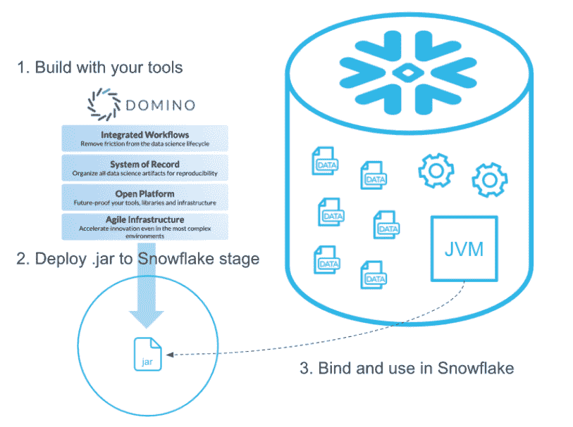
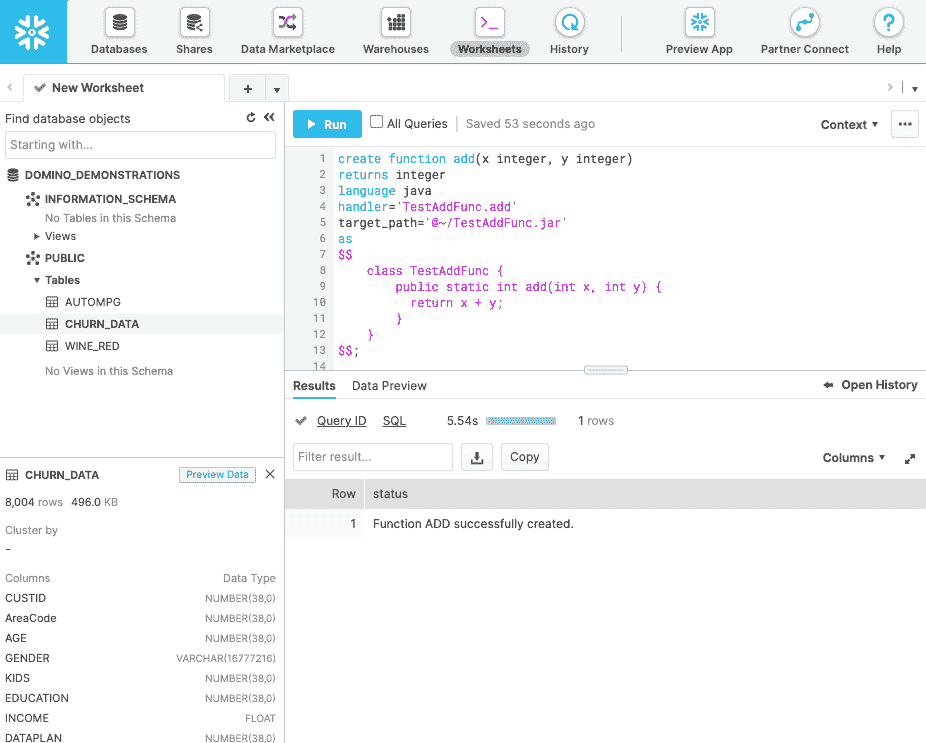

# 通过雪花 Java UDF 集成加速模型速度

> 原文：<https://www.dominodatalab.com/blog/accelerating-model-velocity-through-snowflake-java-udf-integration>

在接下来的十年里，打败竞争对手的公司将是“模型驱动”的企业。这些公司经常进行大量的数据科学工作，以便从“数据驱动”转向“模型驱动”的运营，并为业务提供基于模型的见解。

对于一家公司来说，典型的数据科学之旅始于一个小团队，该团队的任务是解决一些特定的问题。跟踪和管理少量在 Excel 中处理数据的实验相当简单。一旦公司遇到可扩展性障碍，挑战就会浮出水面。在某一点上，随着需求的不断增长，数据量会迅速增加。数据不再存储在 CSV 文件中，而是存储在专门构建的数据湖/数据仓库中。个人笔记本电脑不再能够处理所需的数量。数据科学团队不断壮大，人们再也不能孤立地工作，他们需要能够共享知识、移交项目，并拥有验证和再现能力。

为了恰当地扩展数据科学，公司需要一个整体系统来开发、部署、监控和管理大规模模型——一个记录其数据科学的系统。这是 Domino Enterprise MLOps 平台的核心功能——一个支持对模型、仪表板和数据管道等数据产品进行快速、可重复和协作工作的系统。同样，雪花的数据云也在不断发展壮大，现在已经成为基于云的数据存储和分析(数据仓库即服务空间)的主要参与者之一。

这两个平台都是云不可知的，因此它们可以在 Azure、GCP 和 AWS 上运行。联合客户已经使用 Domino 数据连接器在 Domino 环境和雪花数据云之间检索和写入数据。最近宣布的 Domino Data Lab 和 Snowflake 之间的合作伙伴关系通过将 Snowflake 的 Snowpark 和 Java UDFs 集成到 Domino 中增强了这种体验。Snowpark 是一种新的开发人员体验，它使数据科学家能够利用他们最喜欢的工具，并直接在 Snowflake 中部署代码。

在这篇博文中，我们将重点关注这两个平台提供的 UDF 功能。

## 为什么选择雪花 UDF

一般来说，在关系数据库的环境中，用户定义函数(UDF)是一种扩展底层数据库功能的机制。此外，这种函数可以在标准的 SQL 查询中进行评估，但它可以用不同于 SQL 的语言编写。这个定义使得 UDF 有点类似于存储过程，但是两者之间有许多关键的区别。雪花存储过程使用 JavaScript，并且在大多数情况下使用 SQL。UDF 确实支持 JavaScript 和 SQL，但是也可以用其他语言编写，比如 Java 和 Scala。存储过程是直接调用的(通过 CALL 命令)，但是 UDF 是作为语句的一部分调用的。因此，如果我们需要一个可以在语句中使用的值，或者如果我们需要为每个输入行生成一个值，我们最好的选择是 UDF。



最重要的是，UDF 直接在雪花中执行。如果大数据教会了我们什么，那就是对于大容量和高速度的数据，将计算转移到数据所在的位置是明智的。在实例(甚至不同的云提供商)之间转移千兆字节甚至千兆字节的数据会对性能产生重大影响，并对数据科学团队保持高模型速度和支持公司内部创新工作的能力产生负面影响。这就是 UDF 发挥作用的地方，它们可能是一种通用的机制，可以提高性能并简化许多用例。

例如:

*   加速模型构建和评分
    *   可以在雪花中加载模型训练 Java UDF，并且可以在新数据进入时自动重建模型，而不需要在实例之间传输数据。
    *   预训练模型可以作为 UDF 加载到 Snowflake 中，以便在传入数据进入数据库时对其进行评分(例如异常检测)。
*   高级数据争论和预处理管道
    *   与 SQL 相比，Java UDF 可以使用更广泛的技术进行数据清理、特性工程和模式高级预处理。
    *   现有的预处理、数据接收和数据质量流程可以从 Java/Spark 转换成 Java UDFs。这些管道可以在 Snowflake 中本地运行，它们的执行和可再现性由 Domino 管理。
*   增强的商业智能功能
    *   商业智能工具可以通过 SQL 调用利用执行复杂处理、聚合和转换的 UDF。这使得在 Domino 中运行的 BI 产品(例如 Apache SuperSet)能够提取和应用高级计算和聚合，这在工具或普通 SQL 中通常是不可用的。

## 从 Domino 连接到雪花

从 Domino 连接雪花很简单，因为雪花库和雪花驱动程序已经包含在默认的 Domino Analytics 分布式计算环境中。我们还在之前的一篇博文中介绍了设置凭证和创建初始连接的过程。

连接到雪花之后，我们运行一个简单的 SELECT 语句来确认我们的连接工作正常，并验证雪花版本。

```py
import os

import snowflake.connector as sf

ctx = sf.connect(

user=os.environ["SNOWFLAKE_USER"],

password=os.environ["SNOWFLAKE_PASSWORD"],

account=os.environ["SNOWFLAKE_ACCOUNT"]
)
cur = ctx.cursor()

cur.execute("SELECT current_version()")

cur.fetchone()[0]
```

```py
'5.21.2'
```

出于本演示的目的，我们使用以下 DDL 在雪花中创建了一个表:

```py
CREATE OR REPLACE TABLE DOMINO_DEMONSTRATIONS.PUBLIC.AUTOMPG (

	MPG NUMBER(38,0),

	CYLINDERS NUMBER(38,0),

	DISPLACEMENT NUMBER(38,0),

	HORSEPOWER NUMBER(38,0),

	WEIGHT NUMBER(38,0),

	ACCELERATION FLOAT,

	YEAR NUMBER(38,0),

	ORIGIN NUMBER(38,0),

	NAME VARCHAR(16777216)

);
```

该表由 AutoMPG 数据集填充，可以从 [Kaggle](https://www.kaggle.com/uciml/autompg-dataset) 下载。我们可以运行一个简单的 SELECT 并从 AUTOMPG 表中获取前 3 行。

```py
cur.execute("USE DATABASE DOMINO_DEMONSTRATIONS")

res = cur.execute("SELECT * FROM AUTOMPG LIMIT 3")

for row in res:

    print(row)
```

```py
(18, 8, 307, 130, 3504, 12.0, 70, 1, 'chevrolet chevelle malibu')

(15, 8, 350, 165, 3693, 11.5, 70, 1, 'buick skylark 320')

(18, 8, 318, 150, 3436, 11.0, 70, 1, 'plymouth satellite')
```

既然已经确认了连接，我们就可以转移到 UDF 了。

## 从 Domino 使用雪花 Java UDFs

我们从定义一个简单的 Java UDF 开始。我们的第一个函数是一个非常基本的 Java 方法，它简单地返回两个数的和。Java 代码如下所示:

```py
public static int add(int x, int y) {

    return x + y;

}
```

这个静态方法接受两个参数 x 和 y，并返回它们的和。通常，雪花支持两种类型的 UDF:

*   预编译的 UDF，作为 JAR 文件导入，可以包含多个 Java 函数
*   内嵌 UDF，通常只包含一个函数，由雪花动态编译

在这个例子中，我们将使用一个内嵌的 UDF，所以我们需要做的就是将 Java 代码包装在一个 CREATE FUNCTION 语句中。

```py
create function add(x integer, y integer)

returns integer

language java

handler='TestAddFunc.add'

target_path='@~/TestAddFunc.jar'

as

$$

    class TestAddFunc {

        public static int add(int x, int y) {

          return x + y;

        }

    }

$$;
```

上面的语法是不言自明的 Java 代码由一对＄符号包装。target_path 子句告诉雪花编译后的 Java 代码使用什么文件名，handler 子句给出调用 UDF 时需要执行的 Java 方法的名称。在雪花中运行这个 DDL 会产生一个“函数添加成功完成”的消息。



我们现在可以从 Domino 工作区(本例中为 JupyterLab)测试该函数:

```py
cur.execute("SELECT ADD(5,2)")

cur.fetchone()[0]
```

```py
7
```

让我们定义另一个函数。这个将使用公式 235.215/(1 美国英里)= 235.215 升/100 公里，将英里数转换为升/100 公里。该函数的 DDL 如下所示:

```py
create function l100km(mpg float)

returns double

language java

handler='L100KMFunc.l100km'

target_path='@~/L100KMAddFunc.jar'

as

$$

    class L100KMFunc {

        public static double l100km(float mpg) {

          return (235.214583 / mpg);

        }

    }

$$;
```

我们可以使用 AUTOMPG 表中的 MPG 列调用此函数，以获得数据集中最省油的前 5 辆汽车，同时将 MPG 转换为 L/100km。

```py
res = cur.execute("SELECT NAME, ROUND(L100KM(MPG),2) AS \"L/100KM\" FROM AUTOMPG ORDER BY \"L/100KM\" LIMIT 5")

for row in res:

    print(row)
```

```py
('mazda glc', 5.0)

('honda civic 1500 gl', 5.23)

('vw rabbit c (diesel)', 5.35)

('vw pickup', 5.35)

('vw dasher (diesel)', 5.47)
```

结果集确认该函数是逐行调用的，MPG 到 L/100km 的转换是动态执行的。这是一个相当简单的例子，因为您当然可以在纯 SQL 中进行这种计算，但这里的关键点是，使用这种方法，您可以释放 Java 的全部能力，并即时执行复杂的操作。

现在，让我们针对我们的测试数据实现一个简单的机器学习评分函数。回想一下，Domino 使团队能够使用不同的工具和语言，所以为了让这个例子更加激动人心，假设我们的一个同事使用 R 来拟合针对 AutoMPG 数据的线性模型。该模型解释了 MPG 和马力之间的关系，生成它的 R 代码如下所示:

```py
> head(autompg)

  mpg cylinders displacement horsepower weight acceleration model.year origin                  car.name

1  18         8          307        130   3504         12.0         70      1 chevrolet chevelle malibu

2  15         8          350        165   3693         11.5         70      1         buick skylark 320

3  18         8          318        150   3436         11.0         70      1        plymouth satellite

4  16         8          304        150   3433         12.0         70      1             amc rebel sst

5  17         8          302        140   3449         10.5         70      1               ford torino

6  15         8          429        198   4341         10.0         70      1          ford galaxie 500
```

```py
> model <- lm(formula=mpg~horsepower, data=autompg)
> summary(model)
```

```py
Call:

lm(formula = mpg ~ horsepower, data = autompg)
```

```py
Residuals:
Min 1Q Median 3Q Max
-13.5710 -3.2592 -0.3435 2.7630 16.9240

Coefficients:
Estimate Std. Error t value Pr(>|t|)
(Intercept) 39.935861 0.717499 55.66 <2e-16 ***
horsepower -0.157845 0.006446 -24.49 <2e-16 ***
---
Signif. codes: 0 ‘***’ 0.001 ‘**’ 0.01 ‘*’ 0.05 ‘.’ 0.1 ‘ ’ 1

Residual standard error: 4.906 on 390 degrees of freedom
(6 observations deleted due to missingness)
Multiple R-squared: 0.6059, Adjusted R-squared: 0.6049
F-statistic: 599.7 on 1 and 390 DF, p-value: < 2.2e-16
```

使用截距和马力系数，我们可以定义以下 UDF 函数:

```py
create function mpgPredict(mpg float)

returns double

language java

handler='ML.mpgPredict'

target_path='@~/ML3.jar'

as

$$

    class ML {

        public static double mpgPredict(float horsepower) {

          float intercept = 39.935861f;

          float hp_coeff =  -0.157845f;

          return intercept + hp_coeff * horsepower;

        }

    }

$$;
```

请注意，为了简单起见，我们对系数进行了硬编码，但是我们也可以很容易地从外部文件或另一个表中提取系数，这些表会在每次模型重新训练后更新。一旦预测函数就绪，我们就可以使用它来查看预测与现有数据的匹配程度。

```py
res = cur.execute("SELECT NAME, ROUND(MPGPREDICT(HORSEPOWER),2), MPG FROM AUTOMPG LIMIT 5")

for row in res:

    print(row)
```

```py
('chevrolet chevelle malibu', 19.42, 18)

('buick skylark 320', 13.89, 15)

('plymouth satellite', 16.26, 18)

('amc rebel sst', 16.26, 16)

('ford torino', 17.84, 17)
```

我们也可以使用 UDF 来记录看不见的数据。例如，我们可以计算丰田 RAV4 - a 车辆的预期 MPG，这不在原始 AutoMPG 数据库中。

```py
cur.execute("SELECT 'TOYOTA RAV4' AS MODEL, ROUND(MPGPREDICT(163),2) AS MPG");

cur.fetchone()
```

```py
('TOYOTA RAV4', 14.21)
```

## 预编译的 UDF

Java UDF 存储在一个 JAR 文件中。雪花自动处理内嵌 UDF 的编译和打包。然而，预编译的 UDF 需要一些额外的前期工作。

JAR 文件的组织遵循标准的 Java 归档惯例。如果不熟悉标准的 JAR 文件结构，可以阅读 Java 官方文档中的[打包 JAR 文件中的程序](https://docs.oracle.com/javase/tutorial/deployment/jar/index.html)教程。

在很高的层面上，创建自己的预编译 UDF 需要经历的步骤如下:

1.  编写 Java 类，其中包含您计划作为 UDF 公开的函数。
2.  使用 Java 编译器(javac)将源代码编译成。类文件。
3.  打包你的。类文件复制到 JAR 文件中。您可以使用 Java jar 命令。
4.  添加一个 manifest 文件，它包含关于 JAR 文件中具体包含什么的元信息。

JAR 文件准备好之后，需要将其复制到雪花中的一个外部或命名的内部阶段，该阶段必须对 UDF 的所有者可读。推荐的方法是使用 PUT 命令，例如:

```py
put

    file:///absolute_path_to_the_jar_file/jar_file_name.jar

    @~/udf_stage_dir/

    auto_compress = false

    overwrite = true

    ;
```

注意上面的覆盖标志。当 JAR 文件是一些 CI/CD 管道的一部分时(例如，我们正在重新训练一个模型，并按计划将其打包到一个 JAR 文件中)，这个选项是很有帮助的，并且它需要被定期替换。如果是这种情况，雪花建议在无法调用函数时进行 UDF 更新。

Java 归档格式支持广泛的功能，包括电子签名、压缩、版本控制、版本一致性实施(封装)等。这带来了额外的好处，如安全性、版本控制和可移植性，但更重要的是，存档允许您将额外的文件与类一起打包。这些可以是预训练模型、向量空间模型、附加 Java 类(例如，定制机器学习算法)等。

## 摘要

在这篇博文中，我们介绍了 Domino - Snowflake UDF 集成的一些主要优势。Domino 数据科学平台可以与 Snowflake 中的 UDF 接口，使数据科学家能够将它们用作复杂管道中的构建模块(例如用于数据预处理和数据争论)，或者用于训练模型和数据评分。这种方法的主要优势在于，它支持访问 Scala 和 Java 等语言的复杂特性，并且消除了在实例和云之间移动数据的需要。

虽然在本文中，我们关注的是单向用例(即从 Domino 调用 UDF)，但是双向通信也是完全支持的。人们可以想象雪花中的 UDF 调用模型 API 或 Domino 模型管理器，动态地对传入的数据进行评分，或者在新样本到达数据库时立即执行在线数据漂移检查。

这种类型的自动化使模型能够更快地做出响应，消除由大数据量或计算资源不足导致的可扩展性问题，提高数据科学团队的工作效率，并降低大规模培训和运行模型的成本。

此外，因为访问和创建 UDF 的所有代码都可以驻留在 Domino 中，所以该平台透明地为数据科学团队创建的所有交付物提供了版本控制、可跟踪性和可再现性。这有助于知识发现、移交和法规遵从，并允许数据科学家专注于加速研究和模型部署的工作。

## 关于多米诺

[Domino 的企业 MLOps 平台](https://www.dominodatalab.com/product/domino-enterprise-mlops-platform)通过以下方式解决了难以扩展数据科学的问题:

*   支持最广泛的开源和商业工具及基础设施的生态系统。
*   在每个实验的端到端生命周期中提供可重复性和再现性，无论在开发过程中使用了什么工具。
*   通过在单一平台中提供一致、简化的体验，加速从构思到生产的完整端到端生命周期。
*   满足安全性、治理、法规遵从性和协作方面的 IT 要求。

上面概述的整体方法是使 Domino 成为受超过 20%的财富 100 强公司信任的企业 MLOps 平台的关键特征。

## 关于雪花

[Snowflake](https://www.snowflake.com/) 提供数据云—一个全球网络，成千上万的组织在其中以近乎无限的规模、并发性和性能移动数据。雪花的数据云平台提供的一些关键功能包括:

*   真正的 SaaS 产品，通过弹性虚拟计算实例和虚拟存储服务提供几乎无限的可扩展性。
*   支持广泛的编程语言，如 Go、Java、.NET，Python，C，Node.js，包括 ANSI SQL 兼容性。
*   支持各种数据结构(例如 CSV、XML、JSON、Parquet 等)。
*   通过 ODBC、JDBC、本地连接器(如 Python、Spark)、第三方 ETL 和 BI 工具集成(如 Informatica、ThoughtSpot 等)实现简单的连接
*   近乎零维护的全托管服务。

[](https://cta-redirect.hubspot.com/cta/redirect/6816846/8c274ad2-80a7-4f78-94cc-02aeccd2d52c)