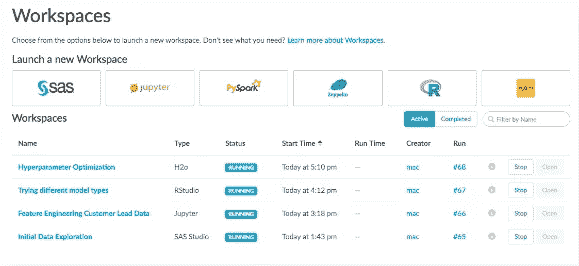

# 在 O'Reilly AI 大会上加速云中的数据科学生命周期

> 原文：<https://www.dominodatalab.com/blog/accelerating-the-data-science-lifecycle-in-the-cloud-at-the-o-reilly-ai-conference>

By Rohit Israni, Director Strategic Business Development, AI Programs, Intel Corporation on September 05, 2018 in

*感谢 Rohit Israni 贡献了这篇客座博文，[最初发布于英特尔人工智能构建者博客](https://builders.intel.com/ai/blog/accelerating-data-science-lifecycle-oreilly-ai)。*

在内部维护数据科学项目可能具有挑战性。为了使数据科学成为竞争优势，公司需要能够快速开发、测试和交付其数据的高影响力模型，并大规模管理这些模型。此外，大规模部署分析解决方案需要大量计算，并会给基础架构资源带来额外压力。为了在数据科学项目上取得成功，企业需要能够轻松扩展硬件、管理软件环境、跟踪工作、监控资源，以及自动化模型部署和监控。

英特尔 AI Builders 合作伙伴 Domino 数据实验室通过其数据科学平台带来了一种全新的模型管理方法。基于预测分析和人工智能，该平台在各种行业都有实际应用，包括金融服务、制造、零售和医疗保健。该平台允许 Domino 的客户从 Python 的英特尔发行版中获益。

该公司在 2018 年 9 月 4 日至 7 日在旧金山举行的人工智能大会上的演示特别关注加速整个数据科学生命周期，从探索性分析到生产模型管理。它将展示如何扩展硬件、管理软件环境、跟踪工作、监控资源，以及自动化模型部署和监控。

人工智能大会由 O'Reilly 和英特尔共同举办。欲了解完整的会议日程和更多详情，[请点击此处](https://conferences.oreilly.com/artificial-intelligence/ai-ca/schedule/2018-09-05)。

不能去现场演示吗？[了解如何在 Domino](https://www.dominodatalab.com/resources/videos/domino-demo/) 中开发和交付模型。

[Twitter](/#twitter) [Facebook](/#facebook) [Gmail](/#google_gmail) [Share](https://www.addtoany.com/share#url=https%3A%2F%2Fwww.dominodatalab.com%2Fblog%2Faccelerating-the-data-science-lifecycle-in-the-cloud-at-the-o-reilly-ai-conference%2F&title=Accelerating%20the%20Data%20Science%20Lifecycle%20in%20the%20Cloud%20at%20the%20O%E2%80%99Reilly%20AI%20Conference)