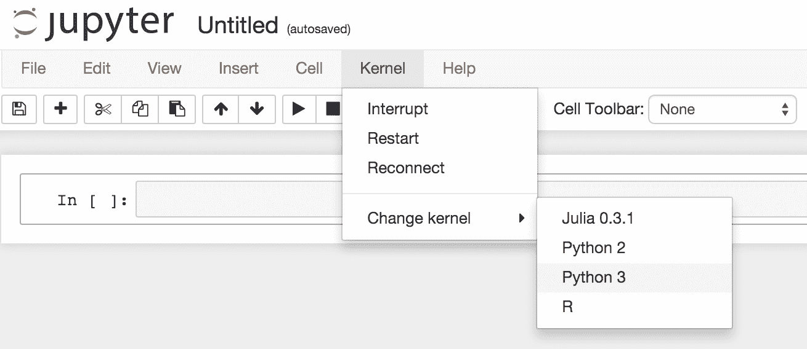

# Jupyter 中的 Python 3 支持

> 原文：<https://www.dominodatalab.com/blog/adding-python-3-to-jupyter>

Domino 让您只需在强大的云硬件上点击一下，就可以启动 Jupyter 笔记本(和其他交互式工具)。我们最近增加了对 Python 3 的测试支持，所以你现在可以在 Python 2 *或* 3 中运行 Jupyter 笔记本:



因此，如果您一直想尝试 Python 3，但不想维护机器上的安装，那么您可以在 Domino 上尝试一下。如果您感兴趣，请[联系我们](mailto:support@dominodatalab.com?utm_source=blog&utm_medium=post&utm_campaign=adding-python-3-to-jupyter),我们将为您提供该测试版功能。

## Python 3 中的新特性

Python 3 包括许多语法改进和其他特性。例如:

*   更好的 unicode 处理(默认情况下所有字符串都是 unicode)，这对于 NLP 项目来说很方便
*   函数注释
*   词典释义
*   许多常见的 API 返回迭代器而不是列表，这可以防止 OOM 错误
*   [还有更](https://docs.python.org/3/whatsnew/3.0.html)

## 安装和设置

出于好奇，这里有一个关于我如何在 Jupyter 中让 Python 3 和 Python 2 并行运行的指南。虽然建立一个独立的 Python 3 Jupyter 内核很简单，但同时支持 Python 2 和 Python 3 却比预期的要复杂。我没有找到一个清晰的指南来设置它，所以我想分享我的经验。

安装涉及几个组件:

*   Jupyter 需要设置为同时使用 Python 2 和 3。这包括安装一些必备的依赖项，并确保 Jupyter 在文件系统上可以使用两个 Python 版本的 [kernelspecs](http://jupyter-client.readthedocs.org/en/latest/kernels.html#kernelspecs) 。
*   因为 Python 3 独立于任何现有的 Python 2 安装，所以有必要建立一个单独的包管理器(pip3)。这用于安装额外的 IPython 依赖项以及一些常见的科学库。
*   最后，安装过程中出现了一些需要清理的错误。

以下是我使用的命令。注释和其他详细信息如下:

```py
apt-get install python3-setuptools python3-dev libzmq-dev

easy_install3 pip
```

```py
# More dependencies needed to run Python 3 in Jupyter
pip3 install ipython==3.2.1 pyzmq jinja2 tornado jsonschema
```

```py
# IPython kernelspecs

ipython3 kernelspec install-self

ipython2 kernelspec install-self
```

```py
# Install some libraries

pip3 install numpy scipy scikit-learn pandas matplotlib
```

```py
# Bug cleanup:
```

```py
# Fix Jupyter terminals by switching IPython back to use Python 2

sed -i.bak 's/python3/python/' /usr/local/bin/ipython
```

```py
# Reset the "default" pip to pip2, if desired

pip2 install --upgrade --force-reinstall pip
```

```py
# Fix a link broken by python3-dev that led to errors when running R

echo | update-alternatives --config libblas.so.3
```

```py
# Make sure the local site packages dir exists
 mkdir -p ~/.local/lib/python3.4/site-packages

```

安装注意事项:

*   在运行笔记本的同时，可以用`! pip3 install --user <package==version>`交互添加新的包，通过运行`! pip3 freeze`检查哪些包已经安装好了。如果你需要额外的软件包，但是交互式运行时安装不理想，请[让我们知道](mailto:support@dominodatalab.com?utm_source=blog&utm_medium=post&utm_campaign=adding-python-3-to-jupyter)，我们可以帮助你设置一个定制的环境。
*   Kernelspec 安装命令来自于 [IPython 文档](http://ipython.readthedocs.org/en/stable/install/kernel_install.html)。
*   在安装了这两个 Python kernelspecs 之后，Jupyter 基本上工作正常，除了终端，它们在会话中被列为“不可用”。我追踪这个 bug 到了一个[依赖问题](http://stackoverflow.com/a/29043849)。运行前面的命令后，IPython 由 Python 3 运行:`/usr/local/bin/ipython`的初始 shebang 行读为`#!/usr/bin/python3`，Python 3 安装找不到运行 Jupyter 终端所需的模块。与其试图修复这个问题，不如直接告诉 IPython 再次使用 Python 2，用`sed`命令编辑初始行为`#!/usr/bin/python`。这很有效，终端重新上线。
*   安装 pip3 会导致`pip`命令运行`pip3`而不是`pip2`。`pip2 install --upgrade --force-reinstall pip`命令将`pip`恢复到`pip2`，这正是我们想要的，这样 Python 2 仍然是“默认”的 Python 版本。
*   `update-alternatives --config libblas.so.3`命令修复由`apt-get install python3-dev`引入的断开的链接。如果没有这个命令，R 脚本会产生以下错误:

    ```py
    Error in dyn.load(file, DLLpath = DLLpath, ...) :

    unable to load shared object '/usr/lib/R/library/stats/libs/stats.so':

    /usr/lib/liblapack.so.3: undefined symbol: ATL_chemv

    During startup - Warning message:

    package 'stats' in options("defaultPackages") was not found
    ```

*   最后一个问题出现了:pip3 的本地安装目录(在这里是`~/.local/lib/python3.4/site-packages/`)不在 Python 3 的`sys.path`上。结果是 Python 的`site`模块(它应该在 Python 启动时将这个路径添加到`sys.path`中)忽略了这个路径，因为它还不存在。提前创建这个目录可以解决这个问题。请注意，运行 Jupyter 的用户必须对该目录具有读/写权限。)

问题、顾虑或只是想测试一下这种环境？[联系我们](mailto:support@dominodatalab.com?utm_source=blog&utm_medium=post&utm_campaign=adding-python-3-to-jupyter)！