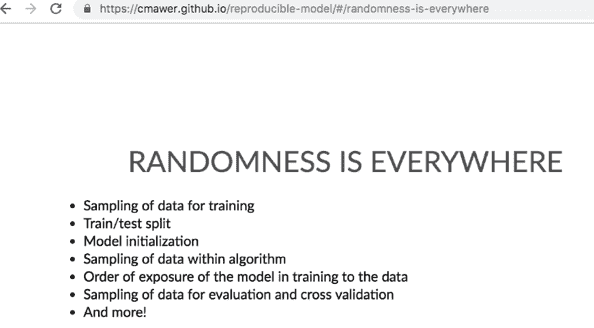
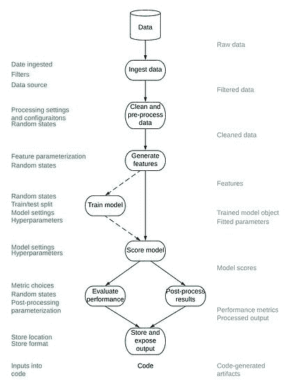
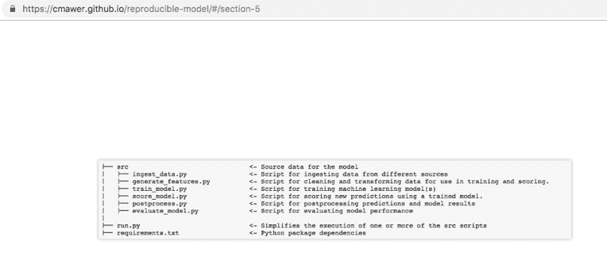
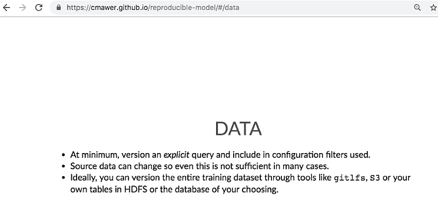
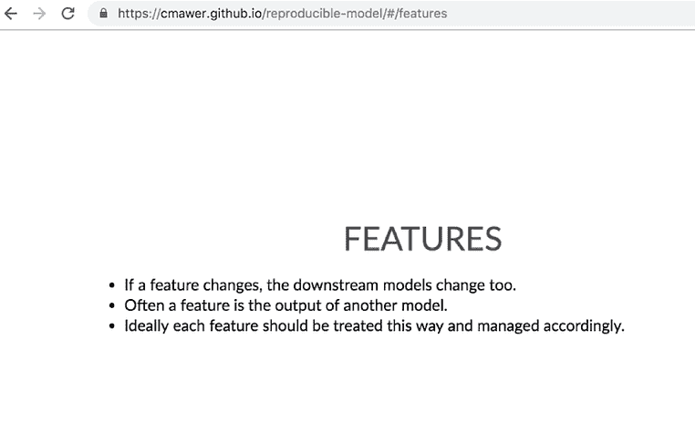
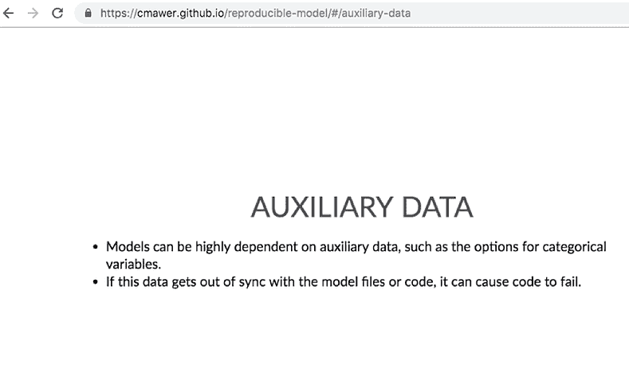

# 解决野生环境中的不可再生性

> 原文：<https://www.dominodatalab.com/blog/addressing-irreproducibility-in-the-wild>

*这份多米诺数据科学领域笔记提供了在最近的 [WiMLDS meetup](https://www.meetup.com/Bay-Area-Women-in-Machine-Learning-and-Data-Science/events/258681235/) 上发表的[克洛伊·莫尔](https://www.linkedin.com/in/chloemawer/)* *的**[可复制机器学习模型](https://www.meetup.com/Bay-Area-Women-in-Machine-Learning-and-Data-Science/events/258681235/)的要点和节选幻灯片。* *Mawer 是 Lineage Logistics 的首席数据科学家，也是西北大学的兼职讲师。特别感谢 Mawer 允许摘录这篇 Domino 数据科学领域笔记中的幻灯片。此处提供全套资料[。](https://cmawer.github.io/reproducible-model/#/the-ingredients-of-a-reproducible-machine-learning-model)*

## 介绍

Chloe Mawer 在最近的 [WiMLDS meetup](https://www.meetup.com/Bay-Area-Women-in-Machine-Learning-and-Data-Science/events/258681235/) 上发表了*“可复制机器学习模型的成分”*演讲。Mawer 的演讲为简化可复制模型的开发和部署提供了实用的见解和最佳实践。这篇文章涵盖了演讲的精华，包括“*为什么再现如此困难？*》，为什么版本化代码不够，以及 Mawer 的可复制模型模板。如欲了解更多关于模型测试、环境管理和代码对齐的信息，请查看 Mawer 的[全互动演示文稿](https://cmawer.github.io/reproducible-model/#/the-ingredients-of-a-reproducible-machine-learning-model)和[再现性模板](https://github.com/cmawer/reproducible-model)的附加内容。我参加了机器学习会议，并向 Mawer 寻求许可，为这篇博文摘录 Mawer 的工作。非常感谢 Mawer 在这篇文章发表前提供了适当的许可和反馈。

## 为什么再现性这么难？

虽然 Mawer 目前是 Lineage Logistics 的首席数据科学家，也是西北大学的兼职讲师，但 Mawer 还利用以前的咨询经验来传达不可再现性的含义和“为什么再现性如此困难”的例子。在之前的一个咨询角色中，Mawer 参与了一个项目，在这个项目中，最初构建算法系统的人不再在公司工作，而她的团队本来是要迭代和添加算法系统的。几乎没有文档、评论、背景等。使得复制算法变得不可能。无法理解当前算法的工作原理大大降低了改进算法的能力，使得在不破坏系统的情况下部署任何改进几乎是不可能的。

虽然这不是一个理想的情况，但这是许多研究人员和数据科学家在寻求推进数据科学工作时面临的常见情况。观众对这些棘手问题幻灯片的反应包括窃笑、叹息和用手机拍摄这些幻灯片。Mawer 还重申了这些痛点并不是新的或本地的，而是全球都知道的，并向 Rodey Green 的“ *[如何编写不可维护的代码](https://github.com/Droogans/unmaintainable-code)”*致敬。

*One of the big problems seen when trying to deploy machine learning models is the inability to reproduce the same predictions as in development. [Slide Credit](https://cmawer.github.io/reproducible-model/#/section) and [Image Credit](https://s3.amazonaws.com/msia423/memes/60-percent-of-time-deployments-work-everytime.jpg)*.*[Slide Credit](https://cmawer.github.io/reproducible-model/#/section-1) and [Image Credit](https://s3.amazonaws.com/msia423/memes/guy-who-wrote-code-gone.jpg).*

然后 Mawer 谈到了可再现性是多么困难，因为有许多看似随机的点，可再现性可能会被破坏，而且开发和部署模型的道路是漫长的。

 *[Slide Credit.](https://cmawer.github.io/reproducible-model/#/randomness-is-everywhere)*

**“路漫漫其修远兮”**

 *"The Path is Long" [Slide Credit](https://cmawer.github.io/reproducible-model/#/section-4) and [Image Credit](https://github.com/cmawer/reproducible-model/blob/gh-pages/figures/all-normal-data.jpeg).*

路径越长，提供的减轻或破坏再现性的成分和机会就越多。

## 解决野生环境中的不可再生性

在 Mawer 讲述了与不可再现性相关的痛点之后，Mawer 提供了关于如何解决不可再现性的实用建议，包括“找到每一个随机状态并将其参数化”以及仅仅“版本化代码是不够的”。

 *[Slide Credit](https://cmawer.github.io/reproducible-model/#/section-5).*

Mawer 的交互式[“参数和设置”幻灯片](https://cmawer.github.io/reproducible-model/#/parameters-and-settings)已被摘录并重新格式化，以方便阅读。

```py
model:
name: example-model
author: Chloe Mawer
version: AA1
description: Predicts a random result given some arbitrary data inputs as an example of this config file
tags:
- classifier
- housing
dependencies: requirements.txt
load_data:
how: csv
csv:
path: data/sample/boston_house_prices.csv
usecols: [CRIM, ZN, INDUS, CHAS, NOX, RM, AGE, DIS, RAD, TAX, PTRATIO, B, LSTAT]
generate_features:
make_categorical:
columns: RAD
RAD:
categories: [1, 2, 3, 5, 4, 8, 6, 7, 24]
one_hot_encode: True
bin_values:
columns: CRIM
quartiles: 2
save_dataset: test/test/boston_house_prices_processed.csv
train_model:
method: xgboost
choose_features:
features_to_use: [ZN, INDUS, CHAS, NOX, RM, AGE, DIS, RAD, TAX, PTRATIO]
get_target:
target: CRIM
split_data:
train_size: 0.5
test_size: 0.25
validate_size: 0.25
random_state: 24
save_split_prefix: test/test/example-boston
params:
max_depth: 100
learning_rate: 50
random_state: 1019
fit:
eval_metric: auc
verbose: True
save_tmo: models/example-boston-crime-prediction.pkl
score_model:
path_to_tmo: models/example-boston-crime-prediction.pkl
predict:
ntree_limit: 0
save_scores: test/true/example-boston-test-scores.csv
evaluate_model:
metrics: [auc, accuracy, logloss]
```

Mawer 还提到了 [YAML](https://yaml.org/) 配置文件如何对模型训练和评分有用。将所有可能的配置提取到一个文件中，使它们能够在模型训练时与代码一起被版本化，这是能够再现模型训练和评分管道的主要步骤。像 JSON 一样，YAML 文件可以很容易地作为字典读入 Python，但与 JSON 不同，YAML 文件是人类可读的，允许在一个地方轻松更改配置。此外，从代码中提取所有的配置将在构建模型管道时做出的决策都放在一个地方。如果分散在不同的剧本中，这样的决定会随着时间而被遗忘。它们的集中声明确保了参数化和配置与代码的未来应用保持一致。最后，Mawer 指出，一旦您使您的整个模型训练和评分管道完全可配置，那么在模型开发期间，只需快速更改 YAML 文件来尝试不同的模型、特性、超参数等等，就可以非常容易地进行迭代。

 *"Mawer suggests structuring yaml configuration files with the Python script names and function names that the parameters are passed into as the keys. This structure makes it clear how to use them once imported into a Python script." [Slide Credit](https://cmawer.github.io/reproducible-model/#/config.yml). *

Mawer 还引用了一些关于数据和特性的见解，包括

 *[Slide Credit.](https://cmawer.github.io/reproducible-model/#/features)* *[Slide Credit.](https://cmawer.github.io/reproducible-model/#/auxiliary-data)*

关于模型测试、环境管理和代码对齐的其他实用见解可在[全互动平台](https://cmawer.github.io/reproducible-model/#/the-ingredients-of-a-reproducible-machine-learning-model)中获得。

## 可复制模板

Mawer 在演讲中还提到了一个[可复制模型模板](https://github.com/cmawer/reproducible-model)的可用性。可复制的[模型模板](https://github.com/cmawer/reproducible-model)摘录如下并重新格式化，以方便阅读。

```py
├── README.md                         <- You are here

│

├── config                            <- Directory for yaml configuration files for model training, scoring, etc

│   ├── logging/                      <- Configuration of python loggers

│

├── data                              <- Folder that contains data used or generated. Only the external/ and sample/ subdirectories are tracked by git.

│   ├── archive/                      <- Place to put archive data is no longer usabled. Not synced with git.

│   ├── external/                     <- External data sources, will be synced with git

│   ├── sample/                       <- Sample data used for code development and testing, will be synced with git

│

├── docs                              <- A default Sphinx project; see sphinx-doc.org for details.

│

├── figures                           <- Generated graphics and figures to be used in reporting.

│

├── models                            <- Trained model objects (TMOs), model predictions, and/or model summaries

│   ├── archive                       <- No longer current models. This directory is included in the .gitignore and is not tracked by git

│

├── notebooks

│   ├── develop                       <- Current notebooks being used in development.

│   ├── deliver                       <- Notebooks shared with others.

│   ├── archive                       <- Develop notebooks no longer being used.

│   ├── template.ipynb                <- Template notebook for analysis with useful imports and helper functions.

│

├── src                               <- Source data for the sybil project

│   ├── archive/                      <- No longer current scripts.

│   ├── helpers/                      <- Helper scripts used in main src files

│   ├── sql/                          <- SQL source code

│   ├── ingest_data.py                <- Script for ingesting data from different sources

│   ├── generate_features.py          <- Script for cleaning and transforming data and generating features used for use in training and scoring.

│   ├── train_model.py                <- Script for training machine learning model(s)

│   ├── score_model.py                <- Script for scoring new predictions using a trained model.

│   ├── postprocess.py                <- Script for postprocessing predictions and model results

│   ├── evaluate_model.py             <- Script for evaluating model performance

│

├── test                              <- Files necessary for running model tests (see documentation below)

│   ├── true                          <- Directory containing sources of truth for what results produced in each test should look like

│   ├── test                          <- Directory where artifacts and results of tests are saved to be compared to the sources of truth. Only .gitkeep in this directory should be synced to Github

│   ├── test.py                       <- Runs the tests defined in test_config.yml and then compares the produced artifacts/results with those defined as expected in the true/ directory

│   ├── test_config.yml               <- Configures the set of tests for comparing artifacts and results. Currently does not include unit testing or other traditional software testing

│

├── run.py                            <- Simplifies the execution of one or more of the src scripts

├── requirements.txt                  <- Python package dependencies 
```

## 结论

[寻求真理，讲真话](https://blog.dominodatalab.com/tag/seek-truth-speak-truth/)是达美乐的核心价值观之一。多米诺骨牌，包括我自己，通过积极寻找和倾听数据科学领域的人，包括 [WiMLDS meetup](https://www.meetup.com/Bay-Area-Women-in-Machine-Learning-and-Data-Science/events/258681235/) 的演讲者和与会者，践行这一价值观。我们从积极听取行业意见中收集的问题和见解有助于为我们的平台、产品和服务提供信息。然而，我们也希望通过[这篇博文](/blog/reproducible-data-science)或[我们的行业事件](https://rev.dominodatalab.com/)来放大和分享研究，从而为关于可再生性的公共讨论做出贡献。再次感谢 [Chloe Mawer](https://www.linkedin.com/in/chloemawer/) 允许摘录*“可复制机器学习模型的成分”*。由于这篇文章提供了为什么可再现性很难的精华，以及一些解决不可再现性的实用建议，关于模型测试、环境管理和代码对齐的其他见解可在[完整资料](https://cmawer.github.io/reproducible-model/#/the-ingredients-of-a-reproducible-machine-learning-model)中获得。

*^(Domino 数据科学领域笔记提供数据科学研究、趋势、技术等亮点，支持数据科学家和数据科学领导者加快工作或职业发展。如果您对本博客系列中涉及的数据科学工作感兴趣，请发送电子邮件至 content(at)dominodatalab(dot)com。)*