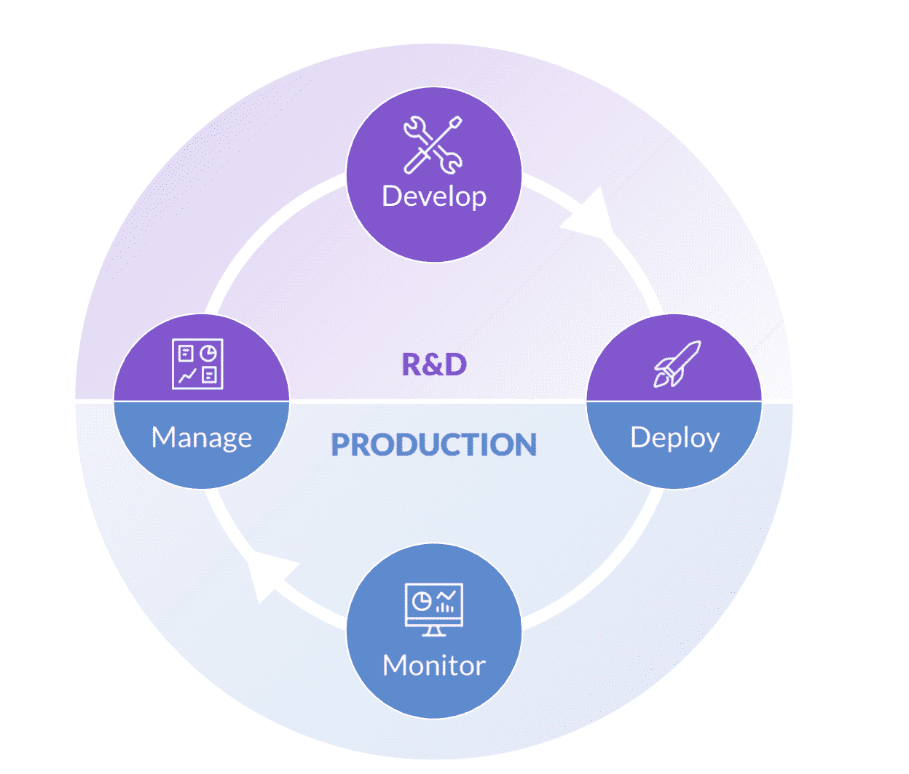

# 深入了解数据科学

> 原文：<https://www.dominodatalab.com/blog/an-in-depth-view-of-data-science>

数据科学是统计学、计算机科学和商业相结合的领域。在组织努力保持竞争力、增加收入和取悦客户时，它受到组织的高度重视，因为数据科学家能够从企业创建的大量数据中获得关于如何改进企业决策的见解。它的价值如此重要，以至于随着组织在数据、技术和人才上花费数千万美元，扩展数据科学已经成为新的业务需求。

在本文中，深入研究数据科学，以及 Domino 的 Enterprise MLOps 平台如何让您在业务中扩展数据科学。

## 什么是数据科学，如何使用数据科学？

数据科学是 STEM 中的一个跨学科领域，它结合了数学和统计学、计算机科学以及商业敏锐度，以在复杂的数据集中发现可用于改善决策的模式。

就目前的形式而言，数据科学在行业和应用方面是无限的；唯一的要求是数据、计算能力、数据科学家，以及成为[模型驱动的](https://www.dominodatalab.com/resources/data-driven-to-model-driven)。随着各级企业以数字方式收集更多类型和数量的信息，以及计算能力比以往任何时候都更容易获得，这变得越来越容易。如今，数据通过多种渠道不断生成，包括交易系统、传感器、摄像头和在线交互。存储方面的改进使得实时捕获、管理和使用这些数据成为可能。

这些进步对从金融和银行业到医疗保健和保险业的各个行业都产生了巨大的影响。他们实现了新的跨行业应用，如客户分析和[欺诈检测](https://www.dominodatalab.com/blog/credit-card-fraud-detection-using-xgboost-smote-and-threshold-moving)。例如，自然语言处理的进步使得医疗保健专业人员可以自动记录患者的就诊记录，减少了记录时间，并减少了患者离开诊所后很长时间内可能出现的歧义。罕见事件检测，如[罕见疾病诊断](https://www.biospace.com/article/rare-diseases/)和信用卡欺诈，在准确性方面有了显著提高

## 什么是数据科学家？

一名成功的数据科学家拥有统计学和计算机科学领域专业知识方面的技能、创新思维和强大的沟通技巧。沟通怎么强调都不为过，因为正是这一特点确保了结果从白板有效地转化为对业务指标的影响。交流的信息通常是模型、流程或算法如何从数据中提取见解，并将其应用于企业内的关键问题。只有当业务理解模型时，他们才会信任模型来驱动业务决策。模型可以以消费者为中心，比如识别关键消费者群体。它们也可以是内部的，比如确定哪个部门的产出最高，或者公司里谁应该加薪。

履行这一角色所需的技能组合以及转型业务影响的潜力，使其被评为“[21 世纪最性感的工作](https://www.dominodatalab.com/blog/data-scientist-still-the-sexiest-job-of-the-21st-century/)”。数据科学家也被称为[独角兽](https://hdsr.mitpress.mit.edu/pub/t37qjoi7/release/3)，因为他们需要复杂多样的技能。因为独角兽很少存在，所以组织倾向于平衡数据科学家团队的技能。

### 数据科学技术

数据科学家有各种各样的技术可供他们使用，通常只受数据的质量和数量以及处理能力的限制。

今天，数据科学中使用的最先进的技术由于其获取信息的性质而被归入人工智能(AI)一词，机器学习、深度学习、自然语言处理(NLP)和计算机视觉都被认为是人工智能领域的分支。这些技术都不是新的。事实上，[深度学习](https://www.dominodatalab.com/blog/deep-learning-introduction)最早是在 1943 年[从理论上描述的。](https://www.dataversity.net/brief-history-deep-learning/)但是低成本、高性能计算和内存的出现使得这些技术得到了广泛应用。

今天最常用的技术是机器学习。据 DeepAI 的人说，“机器学习是计算机科学的一个领域，旨在教会计算机如何在没有明确编程的情况下学习和行动。”根据这个定义，即使是逻辑回归模型也有资格成为机器学习技术。机器学习技术可以分为三类:监督学习、非监督学习和强化学习。

*   监督学习包括回归和决策树等技术，重点是预测目标变量。常见的例子包括预测(任何事物)和分类。
*   无监督学习没有目标变量，聚类等技术用于查找相似记录或行为的组。常见的例子包括创建客户群和异常检测。
*   强化学习侧重于优化特定的决策。这些算法根据过去的决策进行训练，并通过奖励正确的选择和惩罚错误的选择来有效地学习如何优化决策。常见的例子包括推荐引擎和自动驾驶汽车。

### 数据科学工具包

数据科学家和 IT 人员[在数据科学生命周期的所有阶段利用工具](https://blog.dominodatalab.com/data-science-tools/)(DSLC)。这包括访问和准备数据、构建和测试模型以及将它们部署到生产中。对于给定的任务，有许多商业和开源软件包可用。此外，这些工具可能需要用户编写代码或使用拖放菜单。通常，数据科学家更喜欢基于他们的教育、经验和他们正在解决的问题的工具。此外，新的工具和软件包也在不断开发中。

使用拖放的工具通常在知道如何编码方面有最低限度的先决条件(如果有的话)，但是它们也可以限制一个人能完成什么。另一方面，编写代码需要更多的先决知识，但可以在优化解决方案方面产生相当大的好处。拖放和编码就像选择是买现成的毛衣还是自己织；买现成的更容易，但会给出一个更千篇一律的结果，这样袖子可能会太短或腰围太长。另一方面，编织毛衣需要更多的时间，但可以让你创造出你想要的最终产品。

无论您的数据科学团队使用哪种类型的工具，成功的关键是确保所使用的工具集中可用，能够互操作，匹配您团队的技能组合，并允许您构建解决业务问题所需的模型类型。

### 数据科学生命周期(DSLC)

DSLC 包括项目从构思到在商业中使用的各个步骤。最简单的形式有四个阶段:

*   **管理**:*管理*阶段集中于理解项目的目标，并对任务进行优先排序，以满足时间和预算要求。
*   **开发**:在*开发*阶段，数据科学家构建和评估模型，并研究新技术来改进他们之前的工作。
*   **部署**:*部署*阶段将模型移动到一种状态，在这种状态下，数据可以在业务流程中用于决策。
*   **监控**:*监控*阶段是 DSLC 的最后操作阶段，在此阶段，组织确保模型交付其预期的性能。

*数据科学生命周期:*

为了扩大数据科学的规模，DSLC 必须高速发展，因此模型可以在几天或几周内开发和部署，而不是几个月或几年。我们称这个模型为速度。从数据工程师到数据科学家再到业务部门再到开发工程师，会发生许多移交，如果没有适当的架构和技术支持，这可能会减慢移交过程。

实现高模型速度所需的关键能力包括:

*   数据科学家、IT 和业务部门之间的有效协作
*   数据科学家可以立即获得集中式工具和计算
*   整个 DSLC 的治理和安全
*   由自动化和数据科学记录系统驱动的标准模式和实践
*   知识库
*   所有数据科学项目的可见性
*   生产中模型的监控和管理

## Domino 数据实验室的数据科学

也许*也是*经常被称为 21 世纪[最性感的工作](https://www.dominodatalab.com/blog/data-scientist-still-the-sexiest-job-of-the-21st-century)，数据科学是值得大肆宣传的少数学科之一；它是多维的、跨学科的和多方面的。数据科学正在彻底改变企业的运营和组织方式，随着技术的进步，应用程序只会变得更加准确。Domino 通过提供一个[平台](https://www.dominodatalab.com/product/domino-data-science-platform/)来帮助数据科学团队茁壮成长，该平台使他们能够实现高模型速度，同时还确保数据科学的安全性、治理和[可再现性](https://www.dominodatalab.com/blog/seeking-reproducibility-within-social-science-search-and-discovery)。

Amanda Christine West 是一名数据科学家和作家，居住在科罗拉多州的博尔德市。她获得了密歇根大学的学士学位和弗吉尼亚大学的数据科学硕士学位。在数据科学领域，她最热衷于预测分析、数据可视化、大数据和有效的数据科学交流。