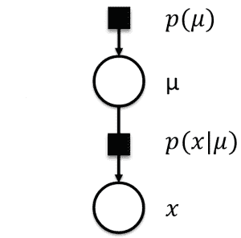
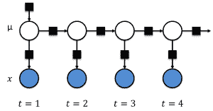

# 基于模型的机器学习导论

> 原文：<https://www.dominodatalab.com/blog/an-introduction-to-model-based-machine-learning>

这篇博客文章跟随我从传统统计建模到机器学习(ML)的旅程，并介绍了一种新的 ML 范式，称为**基于模型的机器学习** (Bishop，2013)。基于模型的机器学习可能会引起统计学家、工程师或希望在其研究或实践中实现机器学习的相关专业人员的特别兴趣。

在我攻读交通工程硕士学位期间(2011-2013 年)，我在研究中使用传统的统计建模来研究与交通相关的问题，如[高速公路撞车事故](http://dx.doi.org/10.1080/19439962.2013.812168)。当我开始攻读博士学位时，我想探索使用机器学习，因为我读过一些强大的学术和行业用例。特别是，我想开发一些方法来了解人们如何在城市中出行，从而更好地规划交通基础设施。

## 采用机器学习的挑战

然而，我发现这种从传统统计建模到机器学习的转变令人望而生畏:

1.  有大量的文献可以阅读，涵盖了数千种 ML 算法。还有一个新的词汇需要学习，比如“特性”、“特性工程”等等。
2.  我必须了解使用哪种算法，或者为什么一种算法比另一种算法更适合我的城市交通研究项目。
3.  如果我的问题似乎不符合任何标准算法，该怎么办？我需要设计一个新的算法吗？

## 决定性的时刻

在阅读了大量文献并观看了几门关于机器学习的 MOOCs 之后，我在 Coursera 上发现了达芙妮·柯勒教授的[关于概率图形模型(PGM)的课程。这后来让我找到了一本由](https://www.coursera.org/learn/probabilistic-graphical-models)[的 Christopher Bishop 教授](https://www.microsoft.com/en-us/research/people/cmbishop/)写的教科书，书名为[“模式识别和机器学习”](http://www.amazon.com/Pattern-Recognition-Learning-Information-Statistics/dp/0387310738/ref=sr_1_2?ie=UTF8&s=books&qid=1263391804&sr=8-2#reader_0387310738)，我发现它很容易理解。所以很自然地，我查阅了 Bishop 的其他出版物，这时我发现了他的论文，标题是[“基于模型的机器学习”](http://rsta.royalsocietypublishing.org/content/371/1984/20120222)。这是我职业生涯的决定性时刻:我爱上了贝叶斯机器学习。如果你喜欢这篇博文，你可能会对毕晓普和他在微软剑桥研究院的同事写的关于这个主题的书感兴趣。

## 什么是基于模型的机器学习(MBML)？

机器学习领域已经发展了数千种学习算法。通常，科学家会从这些算法中进行选择，以解决特定的问题。他们的选择常常受到他们对这些算法的熟悉程度的限制。在这个经典/传统的机器学习框架中，科学家们被约束于做出一些假设，以便使用现有的算法。这与基于模型的机器学习方法形成对比，后者寻求为每个新问题创建定制的解决方案。

MBML 的目标是" ***"提供一个单一的开发框架，支持创建各种定制模型*** "。这一框架源于三个关键理念的重要融合:

1.  贝叶斯观点的采用，
2.  使用因素图(一种概率图形模型)，以及
3.  快速、确定、有效和近似推理算法的应用。

核心思想是所有关于问题域的假设都以模型的形式明确化。在这个框架中，模型只是一组关于世界的假设，以概率图形格式表示，所有参数和变量都表示为随机分量。

## MBML 的关键思想

### 贝叶斯推理

支持机器学习的这种不同框架的第一个关键思想是贝叶斯推理/学习。在 MBML 中，潜在/隐藏参数被表示为具有概率分布的随机变量。这允许以一致和有原则的方式量化模型参数中的不确定性。一旦模型中的观察变量被固定到它们的观察值，最初假设的概率分布(即先验)使用贝叶斯定理被更新。

这与传统/经典的[机器学习框架](https://www.dominodatalab.com/blog/choosing-the-right-machine-learning-framework)形成对比，在传统/经典的机器学习框架中，模型参数被赋予平均值，平均值通过优化目标函数来确定。对数百万个变量的大型模型的贝叶斯推理也是使用贝叶斯定理类似地实现的，但方式更复杂。这是因为贝叶斯定理是一种精确的推理技术，在大型数据集上是难以处理的。在过去的十年中，计算机处理能力的提高使得快速有效的推理算法的研究和开发成为可能，这些算法可以扩展到大数据，如置信传播(BP)、期望传播(EP)和变分贝叶斯(VB)。

### 因子图

MBML 的第二个基石是概率图形模型(PGM)的使用，特别是因子图。PGM 是模型中所有随机变量的联合概率分布的图形表示，用图形表示。因子图是一种 PGM，由表示随机变量的圆形节点、表示条件概率分布(因子)的方形节点和表示节点间条件依赖关系的顶点组成(图 1)。它们为一组随机变量的联合分布建模提供了一个通用框架。

图 1 中整个模型的联合概率 *P* ( *μ* ， *X* )分解为:

*p*(*、*x*=*(*)*(T10)(***

 ***其中 *μ* 是模型参数，X 是观察变量的集合。



Figure 1: A Factor Graph

在因子图中，我们将潜在参数视为随机变量，并使用贝叶斯推理算法和图来学习它们的概率分布。推理/学习仅仅是图中变量子集上的因子的乘积。这允许容易地实现本地消息传递算法。

### 概率规划

计算机科学中有一场革命，叫做概率编程(PP ),编程语言现在被构建成除了用逻辑计算之外，还用不确定性来计算。这意味着现有的编程语言现在可以支持随机变量、变量约束和推理包。使用 PP 语言，您现在可以用几行代码以简洁的形式描述问题的模型。然后调用推理引擎自动生成推理例程(甚至源代码)来解决这个问题。PP 语言的一些著名例子包括[Infer.Net](http://research.microsoft.com/en-us/um/cambridge/projects/infernet/)、[斯坦](http://mc-stan.org/)、BUGS、church、Figarro 和 PyMC。在这篇博文中，我们将通过 R 接口访问 Stan 算法。

## MBML 的阶段

基于模型的机器学习有 3 个步骤，即:

1.  **描述模型**:用因子图描述生成数据的过程。
2.  **观测数据的条件**:将观测变量调节到它们的已知量。
3.  **进行推理**:进行逆向推理，更新潜在变量或参数的先验分布。换句话说，计算以观察变量为条件的潜在变量的后验概率分布。

## 个案研究

### 预测交通拥堵的简单模型

我们通过遵循 MBML 的三个阶段来应用基于模型的方法:

第一阶段:建立一个交通拥堵问题的模型。我们首先列出我们的问题必须满足的假设。我们假设有一个潜在的交通拥堵状态，用均值( *μ* 表示，我们有兴趣学习。我们进一步假设该状态具有高斯分布，该高斯分布具有一些均值和(已知或未知的)标准偏差。这种交通拥堵状态将决定在传感器(X)处观察到的速度测量值。然后我们引入一个条件概率 *P* ( *X* | *μ* )，其中 X 的概率是有条件的，因此我们观察到了 *μ* 。我们还知道，某个后续时间段的流量将取决于之前的流量状态。因此，我们在下一个时间步引入另一个因素图。我们假设其潜在变量具有以先前状态的量为中心的高斯分布，具有某种(已知或未知)标准偏差，即*P*(*μ*[2]|*μ*[1])。这个简单的模型如下面的图 2 所示。



Figure 2\. A Simple Model for Traffic Congestion

**阶段 2** :合并观测数据。我们把观察变量限制在它们的已知量上。这用蓝色阴影表示，如上面的图 2 所示。

**第三阶段**:进行贝叶斯推理。通过使用概率编程语言，我们能够编写一段紧凑的代码，通过简单地调用内置的推理算法来执行推理。

我们建立的定制模型和推理算法一起构成了我们针对交通预测问题的定制机器学习算法。如果你熟悉这些文献，你可能会意识到我们刚刚开发了一种叫做卡尔曼滤波器的通用算法。我们可以通过添加其他假设来扩展我们的模型，以考虑天气、路面、交通网络状况和体育赛事。这些假设可以获得卡尔曼滤波器的变体，适合于我们的应用。如果我们的目标是找到问题的最佳解决方案，这种变体是否已经存在，或者它是否是一种新颖的算法，都是无关紧要的。

如果我们实现了基于模型的算法，并获得了不太准确的结果，我们可以很容易地检查和修改我们的模型假设，以产生一个更好的模型。根据他们的经验，Winn 等人(2015)发现*“理解和改变假设比直接修改机器学习算法更容易和更直观。即使你的目标只是简单地理解卡尔曼滤波器，那么从模型假设出发，是目前为止推导滤波算法最清晰、最简单的方法，也是理解卡尔曼滤波器是关于什么的*。

## 使用概率编程语言学习模型参数

对于本案例研究，我们将使用 Stan 来学习模型参数。Stan 提供了一个 R 接口 RStan，可以用来从 [R 编程语言](http://www.r-project.org/)内部调用 Stan 算法首先，按照这个[链接获取安装 RStan](https://github.com/stan-dev/rstan/wiki/RStan-Getting-Started#prerequisites) 的先决条件。

然后安装最新的`rstan`包及其依赖的包，如下所示:

```py
## omit the 's' in 'https' if your environment does not support https downloads
install.packages('rstan', repos = 'https://cloud.r-project.org/', dependencies = TRUE)

## If all else fails, you can try to install rstan from source via
install.packages("rstan", type = "source")
```

建议您在安装后重启 R，然后再加载`rstan`包。然后像这样加载`rstan`库:

```py
library(rstan)
```

现在，我们可以使用 Stan 建模语言简洁地描述我们的交通拥堵模型，如下所示:

*   以下代码的第一部分指定了由贝叶斯规则决定的数据
*   代码的第二部分定义了参数，使用贝叶斯规则来寻找这些参数的后验分布

```py

traffic_model <- "
data {
// the number of speed measurements, N; constrained to be non-negative
int<lower=0> N;
// vector of observed speed measurements,y1, ..., yN
vector[N] y;
// the standard errors, σ1, ..., σN, of speed measurements
vector[N] sigma;
}
parameters {
real mu; // the mean of the traffic speeds
real<lower=0> tau; // the standard deviation of the traffic speeds
vector[N] theta; // the hidden states
real<lower=0> eps; // the standard deviation of the transition pd
}
model {
theta ~ normal(mu, tau); // the probability dbn of the hidden states
y ~ normal(theta, sigma); // the conditional probability dbn of the observed speeds

for (n in 2:N)
theta[n] ~ normal(theta[n-1], eps); // the transition probability dbn
}
"
```

建议我们在扩展名为`.stan`的单独文本文件中指定上述模型。然而，对于本教程，我们将把它合并到同一个 R Markdown 文件中。

描述完模型后，您可以通过调用 Stan 推理引擎来执行推理，如下面的代码块所示。调用`stan()`函数执行三个基本操作:

1.  首先，使用`stanc()`函数将 Stan 程序翻译成 C++代码，
2.  然后编译生成的 C++代码以创建一个 DSO(也称为动态链接库(DLL))。
3.  最后，运行 DSO 对后验分布进行采样。

下面提到的数据文件可以在这里找到。

```py
traffic <- read.table("data/traffic.txt", header = TRUE)

traffic_data <- list(y = traffic[, "sensor_speed"],
sigma = traffic[, "sigma"],
N = nrow(traffic))

traffic_model_fit <- stan(model_code = traffic_model, model_name = "traffic-prediction",
data = traffic_data, iter = 1000, chains = 4, save_dso = TRUE)
```

## 评估模型结果

现在，我们可以使用`print()`函数来检查`traffic_model_fit`中的结果，包括模型的参数汇总以及对数后验概率。

```py
print(traffic_model_fit, digits = 1)
traceplot(traffic_model_fit)

# extract samples
# return a list of arrays
e <- extract(traffic_model_fit, permuted = TRUE)
mu <- e$mu

# return an array
m <- extract(traffic_model_fit, permuted = FALSE, inc_warmup = FALSE)
print(dimnames(m))

# you can use as.array directly on our stanfit object
m2 <- as.array(traffic_model_fit)
```

## 结论

使用基于模型的机器学习有几个潜在的好处，包括；

*   这种方法提供了一个开发定制模型的系统化过程，以适应我们的具体问题。
*   它为我们的模型提供了透明度，因为我们通过利用有关交通拥堵的先验知识明确定义了我们的模型假设。
*   该方法允许使用概率论以有原则的方式处理不确定性。
*   它不会遭受过拟合，因为模型参数是使用[贝叶斯](https://www.dominodatalab.com/blog/hyperopt-bayesian-hyperparameter-optimization)推理而不是优化来学习的。
*   最后，MBML 将模型开发与推理分开，这允许我们构建几个模型，并使用相同的推理算法来学习模型参数。这反过来有助于快速比较几个备选模型，并选择由观测数据解释的最佳模型。

[](https://cta-redirect.hubspot.com/cta/redirect/6816846/c77ca351-ae85-425a-9ee3-c264b3bc4a69) 

## 参考

如需进一步阅读，请参考以下参考资料。

1.  J.Winn，C. Bishop 和 T. Diethe，基于模型的机器学习，微软研究院，[http://www.mbmlbook.com/](http://www.mbmlbook.com/)，2015 年。
2.  C.M. Bishop，《基于模型的机器学习》Phil Trans R Soc，A 371: 20120222。[http://dx.doi.org/10.1098/rsta.2012.0222](http://dx.doi.org/10.1098/rsta.2012.0222)，2013 年 1 月
3.  T.明卡、j .温、j .吉弗和 d .诺尔斯，Infer.NET，微软剑桥研究院，[http://research.microsoft.com/infernet](http://research.microsoft.com/infernet)，2010 年。
4.  Stan 开发团队，《Stan 建模语言用户指南及参考手册》，版本 2.9.0，[http://mc-stan.org](http://mc-stan.org)，2016。
5.  J.Lunn，A.Thomas，N. Best 和 D. Spiegelhalter，“ ”，统计和计算，10:325-337，2000 年。
6.  名词（noun 的缩写）D. Goodman、V. K. Mansinghka、D. M. Roy、K. Bonawitz 和 J. B.Tenenbaum，“”，载于《人工智能中的不确定性》(UAI)，第 220-229 页，2008 年。
7.  帕蒂尔、a、d .休厄德和 C.J .丰内斯贝克。2010.PyMC:Python 中的贝叶斯随机建模。统计软件杂志，35(4)，第 1-81 页，2010 年。
8.  Stan 开发团队，“RStan:Stan 的 R 接口”，版本 2.9.0。
9.  D.Emaasit、A. Paz 和 J. Salzwedel (2016 年)。。IEEE ITSC 2016。正在审查中。***