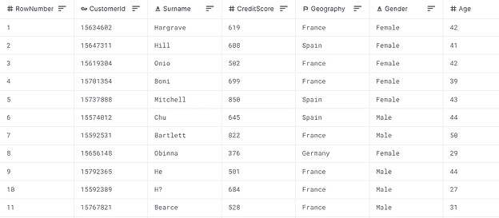
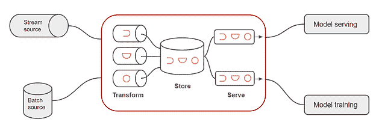
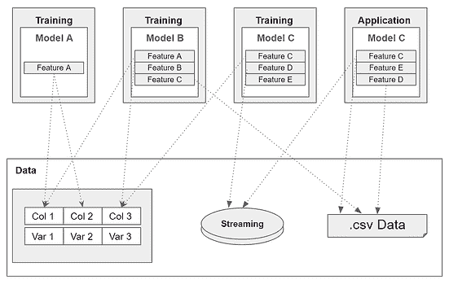
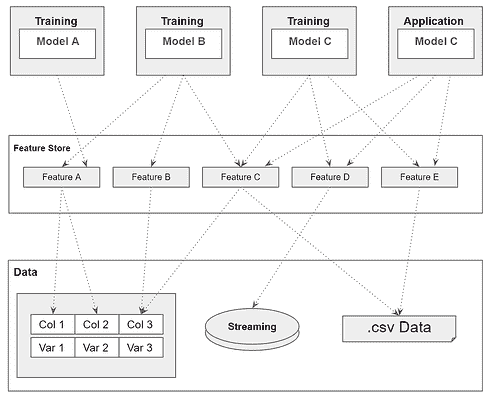

# 关于功能商店您需要知道的一切

> 原文：<https://www.dominodatalab.com/blog/an-introductory-guide-to-feature-stores>

特征是机器学习模型的输入。在整个组织中使用它们的最有效的方式是在一个功能库中，该功能库自动进行数据转换，存储它们并使它们可用于训练和推理。

由于各种特定功能的挑战，ML 项目和应用程序通常是昂贵且难以扩展的。通常，特性不会在一个组织中的团队和不同的 ML 应用中重用，一些团队可能会以不同的方式定义和使用特性。需要额外的努力来为每个 ML 模型提供所需的特性。要素存储通过提高定义的一致性和数据科学团队的效率来纠正这些问题。特性存储允许团队跨数据科学项目和 ML 模型有效地重用特性，从而提高他们的 MLOps 过程的效率和可伸缩性。

在本文中，您将了解特性存储以及如何在 ML 模型的开发中有效地使用特性存储。

## 什么是特性？

在机器学习中，预测模型学习根据过去的例子做出预测。“特征”是用于描述每个例子的属性。

表中的每一行都是一个数据实例，可用于训练或推断。列表示单个要素，每个像元是一个特征值。

在称为 [特征工程](https://www.dominodatalab.com/data-science-dictionary/feature-engineering) 的过程中创建用作 ML 模型的训练数据的特征。在此过程中，数据科学家对原始数据进行转换，以创建可由 ML 模型使用的特征。

## 什么是功能商店？

特性存储是一个中央存储，管理专门为数据科学过程准备的特性。通过使搜索和查找特性变得容易，它们可以很容易地跨项目重用，从而提高效率、治理和[模型速度](https://www.dominodatalab.com/blog/model-velocity)。

大多数 ML 或深度学习(DL)模型需要数百到数千个特征，这些特征可能会根据数据类型进行不同的处理。然而，管理大量的特性并不简单，相同的特性集可能适用于不同的 ML 用例。

例如，一家信用机构使用两种不同的 ML 模型:模型 A 和模型 b。模型 A 使用“客户职业”这一特征来预测特定客户的信用评分。与此同时，另一个不同的模型，模型 B，使用相同的功能来预测该客户在信用机构接洽时升级到某个产品的概率。当几个应用程序使用相同类型的特性时，跨这些模型重用特性是有意义的。

## 功能商店组件

现代功能存储由三个主要组件组成—转换、存储和服务:

 资料来源:Artem Oppermann

### 转换

ML 模型通常需要将原始数据转换成 ML 模型可以使用的特征。例如，ML/DL 模型不能很好地处理被表示为类别或标签的特征(*例如*性别或颜色)。因此，您需要将这种分类数据转换成更合适的格式。其他常见的转换包括数据和计算值的标准化。特征存储协调这些特征转换，主要有两种类型:

1.  批处理转换仅适用于静态数据，可以在数据库、数据仓库或数据湖中找到。这种数据的一个典型例子是历史客户数据，它可以在一个表中找到(*ie* customer_occupation，customer_age **，** country 等)。).
2.  流转换应用于运动中的数据或流源。这意味着数据在通过要素存储管道时会进行在线转换。与数据库或数据仓库中的数据相比，这种数据更新。例如，必须应用流转换的数据将包括每个用户在过去三十分钟内对登录页面的点击次数，或者每个用户在过去一小时内对每个列表的查看次数。

### 存储

在较高层次上，要素存储是 ML 操作使用的要素数据仓库。特征存储在架构上不同于传统的数据仓库，因为它由两部分数据库组成:

1.  “离线数据库”主要用于批量预测和模型训练。数据库存储大量历史特征，用于 ML 模型的训练目的。
2.  第二个数据库称为“在线数据库”，以低延迟向已投入生产的训练模型提供在线功能。该在线数据库满足了为预测模型提供最新功能的需求。

### 上菜

存储在特征存储中的转换后的数据现在可以被检索并提供给 ML/DL 模型用于训练或一旦它们投入生产。这个过程被称为“上菜”。这一步非常重要，因为它可以确保始终使用正确的特征数据。

对于模型训练，检索并使用脱机数据库中的脱机数据。为了向生产中的模型提供特征，通过高性能和低延迟的 API 从在线数据库提供数据。

## 特色商店的优势

开发机器学习模型并不容易，主要是因为人工智能系统非常复杂，需要大量的人工努力。ML 的数据工程和管理是数据科学项目中最耗时的任务。 数据工程师必须为数据科学团队准备各种数据源和相关元数据。然后，数据科学团队确定什么可能对 ML 项目有用，并开发要测试的功能。

除了在数据准备过程中损失宝贵的时间之外，ML 项目和应用成本高昂且难以扩展。 除了在数据准备上浪费宝贵的时间，ML 项目和应用也是昂贵且难以扩展的。创建非标准特征非常耗时，会导致团队之间重复、不一致的工作，并且会使模型无法投入生产，因为用于训练模型的数据无法在生产中重新创建。

为了说明这种复杂性，下图描绘了 ML 基础设施。它表明这些特性是非标准的，因此不太具有可伸缩性:

 来源:Artem 奥特曼

不同的模型访问相同的数据源，以便为每个用例进行单独的数据准备。这意味着大量的精力投入到准备数据和重复的代码中，这带来了巨大的出错可能性。它也有可能使在生产中有效地重新创建特征变得不可能。

下面简要总结了使用非标准化的 ML 基础设施时遇到的问题和挑战:

*   冗余特征构建
*   功能不可重复使用
*   重复代码
*   功能可能在生产中不可用
*   资源密集型数据准备

数据科学团队可以通过使用功能存储来避免这些挑战。通过保护商店中的功能，不同的模型可以轻松地重用这些功能，从而减少模型开发时间并提高模型开发的可重复性。

特征存储充当 ML 的中心枢纽，它可以通过避免数据管道丛林来提高 ML 团队的效率。如果没有特征存储，各种模型可能具有本质上相同或相似的数据管道来准备、创建和访问所需的特征。相比之下，特征存储为所有模型提供了标准化的数据管道。

通过使用特征库可以实现高度的 ML 自动化。具体来说，是验证数据完整性的自动化数据验证规则。这可能涉及检查值是否在有效范围内，是否具有正确的格式和数据类型，以及是否为空。

特征库还可以提高[模型部署](https://www.dominodatalab.com/blog/machine-learning-model-deployment)的速度，通过确保特征始终可用于推理。通过使用集中的数据存储来存储训练数据，数据科学团队可以实现最佳的可伸缩性，并提高 ML 应用程序的效率。

下图显示了特征库如何独立于模型构建特征:

  来源:Artem 奥特曼 

综上所述，一个特性库给一个数据科学团队带来了很多好处，包括以下:

*   特征的可重用性
*   再现性
*   特征的质量保证
*   高效利用数据科学家(*ie*时间显著减少)
*   高度的 ML 自动化
*   洗钱中心的出现
*   数据科学的可扩展性，因为数据、基础设施和标准化流程已经到位，新项目和模型可以更快地扩展和实施

## 功能存储选项

直到最近，如果你想在你的 ML 操作中加入一个特性库，你必须开发你自己的。特色商店主要用于内部 ML 平台，比如优步的米开朗基罗。感谢开源社区，这已经改变了。

即使开源功能商店的选择仍然有限，但随着 [盛宴](https://feast.dev/) 和 [Hopsworks](https://www.hopsworks.ai/) 等产品的出现，选择越来越多。

Hopsworks 功能商店于 2018 年底首次发布，是更大的 Hopsworks 数据科学平台的组成部分。Feast 是一个独立的特性商店，由 [GoJek](https://www.gojek.com/en-id/) 发布，围绕 Google 云服务打造，像 BigQuery、 [Redis](https://redis.io/) 和 Cloud Bigtable，使用 [Apache Beam](https://beam.apache.org/) 进行特性工程。

## 结论

在本文中，您了解了特性存储如何通过将自动化引入 ML 操作来提高效率。特征存储是专门用于 ML 过程的中央数据存储，已经成为现代 ML 栈的关键组件。

通过集中 ML 特性，新的项目和模型可以更快、更可靠地扩展和实现，因为数据、基础设施和标准化的数据过程已经可用。

