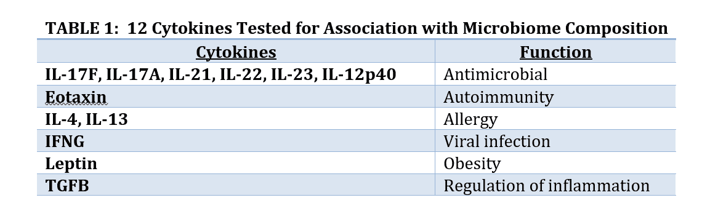
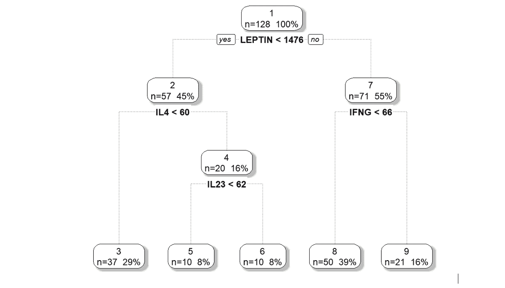
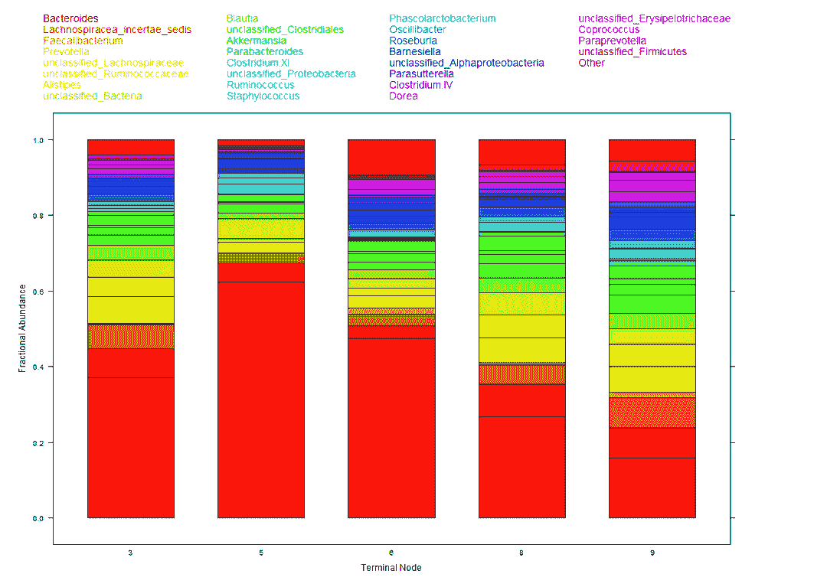
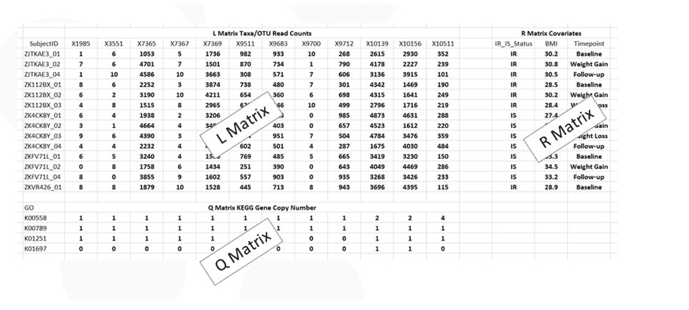
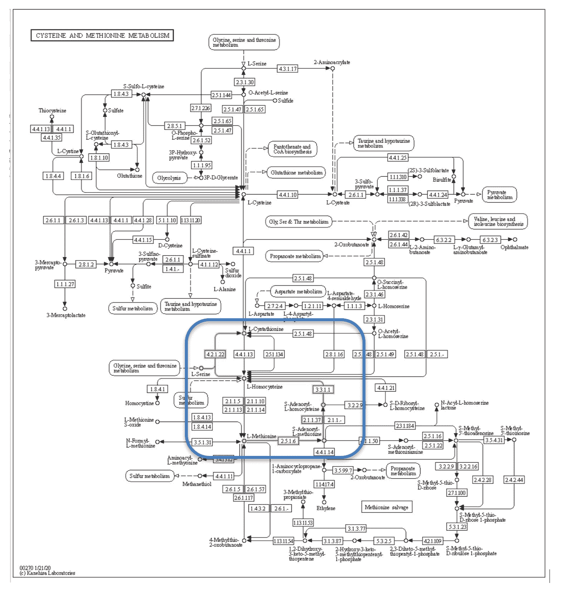
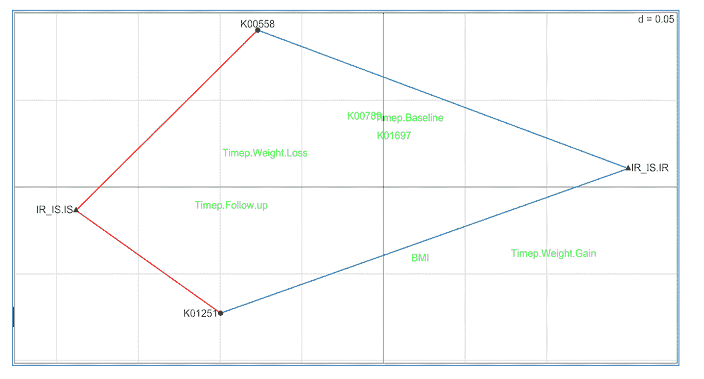
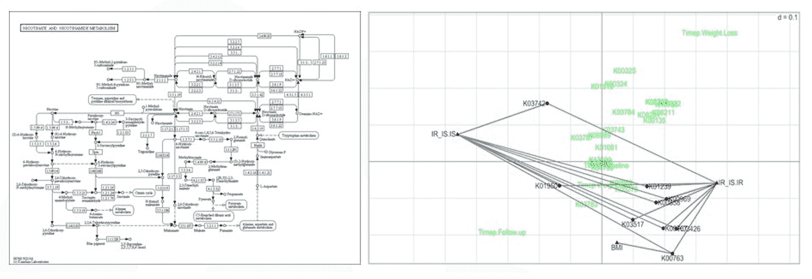

# 分析大 P 小 N 数据——微生物组的例子

> 原文：<https://www.dominodatalab.com/blog/analyzing-large-p-small-n-data-examples-from-microbiome>

## 介绍

高通量筛选技术已经发展到在单个实验中测量样品中所有感兴趣的分子(例如，整个基因组、代谢物的量、微生物组的组成)。这些技术被描述为以不偏不倚和无目标的方式对细胞、组织或有机体中的分子进行“通用检测”^([【1】](#post-7222-footnote-1))。希望这些数据能让研究人员更好地理解他们正在研究的东西。

20 世纪为小数据集开发的经典统计学不适用于变量数量远大于样本数量的数据(大 P 小 N，维数灾难，或 P > > N 数据)。我们之前的多米诺博客上的*^([【2】](#post-7222-footnote-2))，描述了当 P > > N:*

 *1.  点彼此远离
2.  点落在数据分布的外边缘
3.  预测模型对噪音的拟合接近 100%的准确性
4.  点之间的成对距离变得相同

这些行为中的每一种都会对统计分析造成严重破坏。例如，不可能知道你的预测模型是否准确，因为它正在拟合重要的变量或噪声。

## 减少用于分析和解释的数据

使用自动算法进行数据简化存在问题。考虑具有 500 个变量的数据集，使用 PCA 将维度减少到少数用于分析。仔细观察可以发现，PCA 产生了变量的线性组合——这是无法解释的。理解 500 个系数的意义和相互作用是不可能的。每个 PCA 投影都是不可解释的，因此学习是不可能的。

由于我们仍然有一个大 P 小 N 的问题，直接的假设检验是不可能的。相反，这个分析阶段的目标是解释和学习。将这种分析视为探索性的是很重要的。这种探索性的分析并不是通过一次分析所有的数据来发现突出的部分。不要使用算法来减少数据，而是选择有生物学意义并且可以解释的变量子集。在子集分析中发现的任何东西都应该被视为假设生成，并且在后续设计的实验中可能是可检验的。

BioRankings 所做的两项分析在此作为这种方法的例子。这两项研究都涉及高通量筛选数据和来自作为*整合人类微生物组项目*一部分的大约一百名糖尿病前期受试者的成百上千个变量。*^([【3】](#post-7222-footnote-3))*在第一次分析中，选择了 12 种细胞因子来测试细胞因子的变化是否与肠道微生物组的组成变化有关。在第二次分析中，选择来自肠道微生物分类群的基因子集，以测试基因拷贝数是否与从胰岛素敏感性(良好结果)到抗性(不良结果)的转化相关。

### 细胞因子水平与肠道微生物组组成相关吗？

合作者有兴趣了解细胞因子是否与微生物组组成有关。细胞因子是与许多生物学结果如炎症、脓毒症、发育和其他结果相关的小肽。测量了数百种小肽和细胞因子，因此确定了被认为与糖尿病发展相关的 12 个子集，以避免与大 P 小 N 相关的问题，并具有生物学解释可能的集中子集。这 12 个在**表 1** 中列出。由于大 P 小 N 的数据是探索性的，对这 12 种肽的分析并不排除我们对其他肽亚类的分析。

在统计学中，回归分析常用于将结果(因变量)与输入协变量(自变量)联系起来。当因变量为连续变量、分类变量或生存时间变量时，这些模型得到了很好的发展。然而，对于因变量或结果变量是微生物类群组成的情况，不存在回归模型。

为了将微生物组组成(因变量或结果变量)回归到细胞因子(独立变量或输入变量)上，我们推导并发布了一个新的回归模型。^([【4】](#post-7222-footnote-4))DM-RP art 方法结合了递归分割和狄利克雷-多项式概率模型。递归分割找到协变量空间中结果更均匀的区域。^([【5】](#post-7222-footnote-5))狄利克雷多项式概率模型适用于微生物组数据，并提供了假设检验、样本大小和功效计算、效应大小、过度分散和其他经典统计的方法。^【

DM-RPart 寻找微生物组样本的分区或子集，使得子集内样本的分类群组成或比例彼此之间比其他子集中的样本更相似。聚类分析基于忽略协变量中的信息的距离(即无监督学习)来寻找分区。DM-RPart 是一种使用协变量中包含的信息的监督学习算法。

DM-RPart 中的分区由阈值协变量定义–例如，如果样本有瘦素< 1476 put the sample in the left *子节点*，否则将样本放入正确的*子节点*。通过优化狄利克雷-多项式概率模型的*最大似然比* *(MLR)* ，将*父节点*中的样本与分成两个*子节点*的样本进行比较，来自动选择最佳分裂的顺序。通过将父节点划分成两个*子节点*引起的同质性越大，MLR 越高。任何*父节点*的划分是在具有最大 MLR 的协变量分裂上完成的。

我们将 DM-RPart 应用于上述 12 种细胞因子，基于对肠道微生物群的可能作用机制的生物学理论。**图 1** 显示了将 128 个微生物组样本(顶部或根节点)分成 5 个亚组(终端节点)的模型。首先根据瘦素水平高于或低于 1476 的受试者将 128 个样品分开。受试者体内瘦素< 1476 的 57 个样本中，IL4 高于或低于 60 的第二个分裂将他们分成 37 人和 20 人的两个子集。重复这一过程，直到长出一棵大树，然后修剪以避免过度生长。

*图 1:将微生物类群组成回归到 12 种细胞因子的 DM-RPart 模型。*

图 2 中的彩色条形图显示了每个亚群中的微生物组成。每种颜色对应一个分类单元(见图顶部的图例)，颜色段的高度对应该分类单元在种群中的比例。不同亚组的分类群组成有很大差异，表明细胞因子水平的变化与微生物组组成的变化有关。

这 12 种细胞因子的分析是可以解释的。值得注意的是，与肥胖相关的微生物组组成在低瘦素(亚组 3，5，6)和高瘦素(亚组 8，9)中不同，这表明瘦素、肥胖和微生物组可能相关。作为一个可检验的假设，确定低瘦素组和高瘦素组中的每组 N = 32 名受试者将提供 80%的能力来检测微生物组组成的统计学显著差异。

需要强调的是，我们认为大 P 小 N 数据分析只是探索性的。这导致了两个结果。首先，分析不限于一个子集。可以进行尽可能多的具有生物学意义的变量子集的分析。这些分析可以使用适用于子集的任何统计方法，而不限于所有子集的相同分析。第二，如果结果表明有趣的生物学，它们应该被视为产生假设，而不是统计意义上的。研究者应该在后续设计的实验中证实这些结果。

*图 2:来自 DM-RPart* 的五个末端节点中的每一个内样品的分类群组成

### 微生物组基因有助于将健康患者转化为糖尿病前期吗？

在这项分析中，问题是肠道微生物群是否会影响胰岛素活性正常(胰岛素敏感性)的患者，而不是胰岛素活性降低或糖尿病前期(胰岛素抵抗)的患者。受试者先吃增加体重的食物，然后再吃减轻体重的食物。在整个研究过程中，在 4 个时间点对每位患者的微生物群、胰岛素状态(敏感/耐受)和其他几种表型进行了测量。

我们修改了生态学中使用的一个分析，称为 RLQ^([【7】](#post-7222-footnote-7))来回答这个问题。RLQ 同时分析了包含在三个表格中的信息:

*   r(样品的微生物组组成)
*   l(样本的表型)
*   q(细菌基因拷贝数)。

**图 3** 显示了 RLQ 数据布局。表 L 和 R 中的行对应于受试者，L 中的条目对应于分类群计数，R 中的条目对应于表型值(例如，胰岛素敏感性或抗性)。表 L 和 Q 的列对应于分类群，Q 中的条目是由 Q 表行指定的每个基因的拷贝数。

*图 3:RLQ 分析数据表。*

由于细菌中的基因组很大(它们必须编码细菌的所有活动)，微生物组中有数千个细菌基因，这使得 Q 表非常大，分析大 P 小 n。因此，考虑对基因子集进行重点分析非常重要。

**图 4** 是来自 KEGG 数据库的半胱氨酸和蛋氨酸代谢途径。^([【8】](#post-7222-footnote-8))该途径描述了这两种分子的合成和降解，涉及数十个步骤和基因。为了减少数据，我们将分析重点放在蓝框中红线所示的蛋氨酸降解途径上。甲硫氨酸降解为 L-胱硫醚，产生与血管疾病(高同型半胱氨酸血症)相关的中间化合物 L-高半胱氨酸，并可能与糖尿病相关。我们将 Q 表限制在被认为与糖尿病相关的甲硫氨酸降解途径中的 4 个基因。

*图 4:来自 KEGG 数据库的蛋氨酸降解途径。*

**图 5** 显示了 RLQ 分析结果。基因 K00558 (DNA(胞嘧啶-5)-甲基转移酶 1)和基因 K01251(腺苷高半胱氨酸酶)与胰岛素敏感性正相关(红线将每个基因连接到 IR_IS。IS ),并与胰岛素抵抗负相关(蓝线连接每一个与 IR_IS。IR)。不相关的基因和性状显示为绿色。

这些结果表明，增加具有高 K00558 和 K01251 基因拷贝数的分类群在肠道中的患病率可能会减缓或阻止从胰岛素敏感性向抗性的转化，从而减少向糖尿病的转化。这是一个可检验的假设。

*图 5:甲硫氨酸途径的 RLQ 分析*

如上所述，高通量筛选实验是探索性的，并且基于主题领域的专业知识(例如甲硫氨酸降解)选择的一组减少的变量的集中分析不妨碍进行其他分析。烟酸酯/烟酰胺降解途径被认为与胰岛素敏感性和身体质量指数有关，对该途径中基因的聚焦 RLQ 分析如图**图 6** 所示。发现更多的基因与胰岛素状态相关(正相关和负相关),一个基因 K00763 与身体质量指数正相关——k 00763 的更多拷贝意味着更高的受试者身体质量指数。所有这些都是可检验的假设。

*图 6:烟酸途径的 RLQ 分析*

## 摘要

由于大多数组学研究是在没有假设的情况下设计的——衡量一切，看看会得出什么结果——将数据分析视为探索性的是合适的。在子集分析中发现的任何东西都应该被视为假设生成和潜在可测试的。

通过将生物学知识纳入多组学数据的分析，可能会揭示生物学机制的理解。我们正在将这些实验从“测量一切，看看我们能发现什么”转移到“我们已经测量了一切，现在让我们详细说明有趣的假设，看看它们是否经得起推敲”。

 

#### 参考

1.  [https://obgyn . online library . Wiley . com/doi/full/10.1576/toag . 13 . 3 . 189 . 27672](https://obgyn.onlinelibrary.wiley.com/doi/full/10.1576/toag.13.3.189.27672)[↑](#post-7222-footnote-ref-1)
2.  [https://blog.dominodatalab.com/the-curse-of-dimensionality](https://blog.dominodatalab.com/the-curse-of-dimensionality)↑
3.  [https://www.nature.com/collections/fiabfcjbfj](https://www.nature.com/collections/fiabfcjbfj)↑
4.  [https://www.nature.com/articles/s41598-019-56397-9](https://www.nature.com/articles/s41598-019-56397-9)↑
5.  [https://cran . r-project . org/web/packages/RP art/vignettes/long intro . pdf](https://cran.r-project.org/web/packages/rpart/vignettes/longintro.pdf)[↑](#post-7222-footnote-ref-5)
6.  [https://journals.plos.org/plosone/article?id = 10.1371/journal . pone . 0052078](https://journals.plos.org/plosone/article?id=10.1371/journal.pone.0052078)[↑](#post-7222-footnote-ref-6)
7.  [https://esa journals . online library . Wiley . com/doi/10.1890/03-0178](https://esajournals.onlinelibrary.wiley.com/doi/10.1890/03-0178)[↑](#post-7222-footnote-ref-7)
8.  [https://www.genome.jp/kegg/kegg2.html](https://www.genome.jp/kegg/kegg2.html)↑*