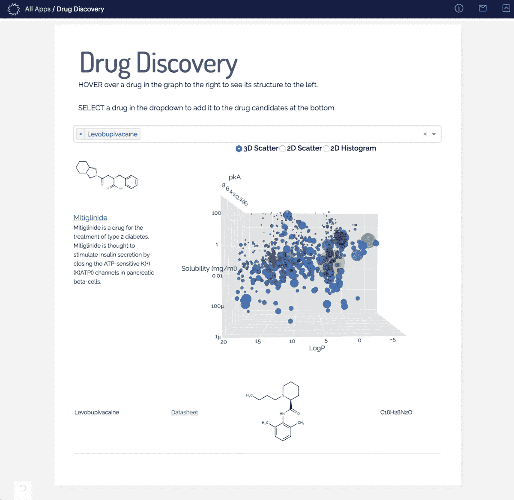

# 宣布 Domino 3.0 和 Launchpad

> 原文：<https://www.dominodatalab.com/blog/announcing-domino-3-0-and-launchpad>

By Mac Steele, Director of Product, Domino Data Lab on October 17, 2018 in

尽管所有公司都在数据科学领域进行投资，但令人震惊的是，很少有人看到任何真正的商业影响。最近的一项研究量化了这一差距，揭示了 85%的人认为模型将使他们的公司获得或保持竞争优势，但只有 5%的人广泛使用它们。

原因很简单；对于公司来说，让模型超越他们的数据科学团队并投入生产是极其困难的。正如一位数据科学领袖敏锐而令人难忘地指出的那样，“我们建立新总部的速度比我们将模型投入生产的速度还要快。”

今天，我们正在帮助改变这种状况，推出了 Domino 3.0，这是我们屡获殊荣的数据科学平台的下一个版本，并推出了 Launchpad，这是一个新模块，旨在帮助公司通过解决他们在将模型投入生产(ModelOps)时面临的运营挑战和瓶颈，最大限度地发挥数据科学投资的影响。

**解决数据科学中的最后一英里问题**

现在有了 Domino 3.0，公司可以通过消除模型交付瓶颈来填补数据科学投资、执行和实现竞争优势之间的差距。

Domino 的新模块 Domino Launchpad 通过以下方式帮助公司解决数据科学中的最后一英里问题:

*   **消除模型交付的技术障碍**通过 Docker 自动提供基础设施，并支持 Shiny、Flask 和 Dash 等流行工具；
*   **改善利益相关者之间的协作**通过单一门户发现模型产品和使用数据，确保更快的反馈循环，以验证模型的影响；和
*   **加速模型迭代速度**通过自动模型版本控制和实验历史的完全可再现性，实现更快、更连续的模型迭代。

Domino 3.0 背后的动机来自于与领先的数据科学组织合作，看看哪些对他们有用，哪些没用。最新的 Domino 3.0 功能旨在帮助数据科学领导者确保他们的投资产生切实的业务影响。

**穆迪分析公司利用 Domino 将模型迭代速度提高了 4 倍**

穆迪分析提供专业知识和工具，包括数据、模型、软件和专业服务，帮助公司高效发展和管理金融风险。作为金融建模领域的先驱，穆迪分析团队通过几十年的磨练，基于独特的金融数据集创建模型，然后应用这些模型解决客户的业务挑战，从而建立了竞争优势。通过将一些数据科学项目集中在 Domino 上，Moody's Analytics 极大地提高了模型生命周期的效率，并扩展了他们与客户和合作伙伴构建协作模型的能力。为了实现这一转变，Moody's Analytics 需要加快模型开发的速度，并增加生产模型的迭代次数。他们通过 Domino 实现了这一点，减少了端到端的模型开发周期，并将模型作为 API 和应用程序交付给下游消费者。例如，在使用 Domino 的早期体验中，Moody's Analytics 将预计九个月的项目减少到了四个月。该公司还使用 Domino 将生产模型的迭代速度提高了四倍。穆迪分析的风险和金融分析董事总经理 Jacob Grotta 表示:“凭借穆迪分析的专业知识和工作流程，加上 Domino 和 AWS 基础设施，我们能够加快模型开发，这意味着信息可以更快地到达需要它的客户手中。“我们的客户非常兴奋，因为他们的需求将会以新的方式得到满足，这在以前是不可能的。”

**了解关于 Domino 3.0 和 Launchpad 的更多信息**

最近，在 Forrester Research 的 Forrester Wave 报告“基于笔记本的预测分析和机器学习解决方案”中，Domino 被评为领导者。

要了解有关 Domino 3.0 的更多信息，请注册参加网络研讨会“领先企业如何应对 ModelOps 挑战”，该研讨会将于 11 月 14 日上午 10:00(太平洋标准时间)由 Forrester Research、Bayer Worldwide 和 Domino 共同举办。在此注册。

*用强大的交互式模型产品取悦利益相关者*

[Twitter](/#twitter) [Facebook](/#facebook) [Gmail](/#google_gmail) [Share](https://www.addtoany.com/share#url=https%3A%2F%2Fwww.dominodatalab.com%2Fblog%2Fannouncing-domino-3-0-and-launchpad%2F&title=Announcing%20Domino%203.0%20and%20Launchpad)