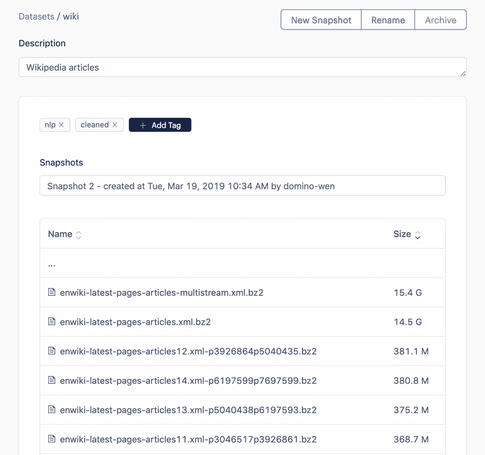
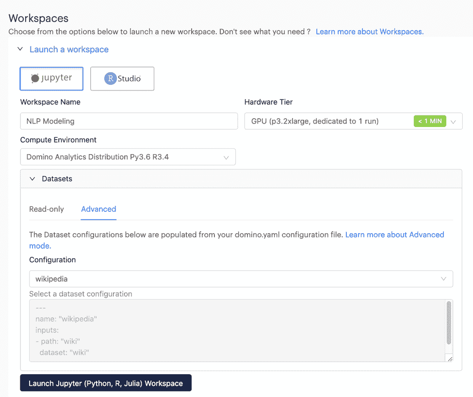
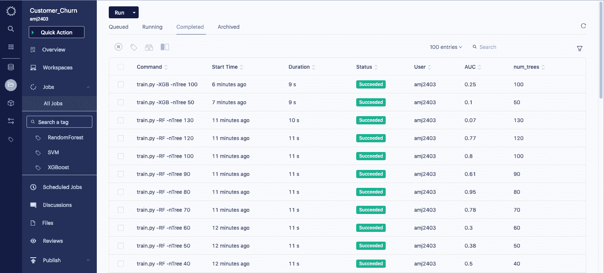
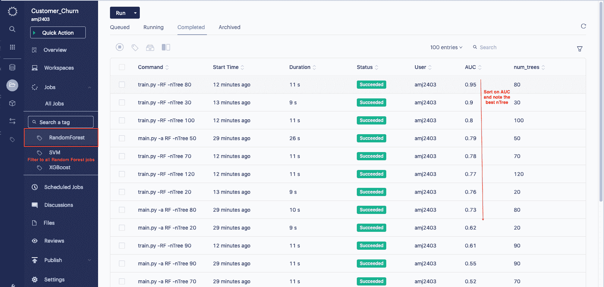
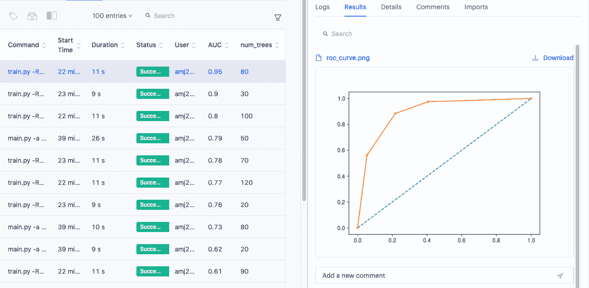
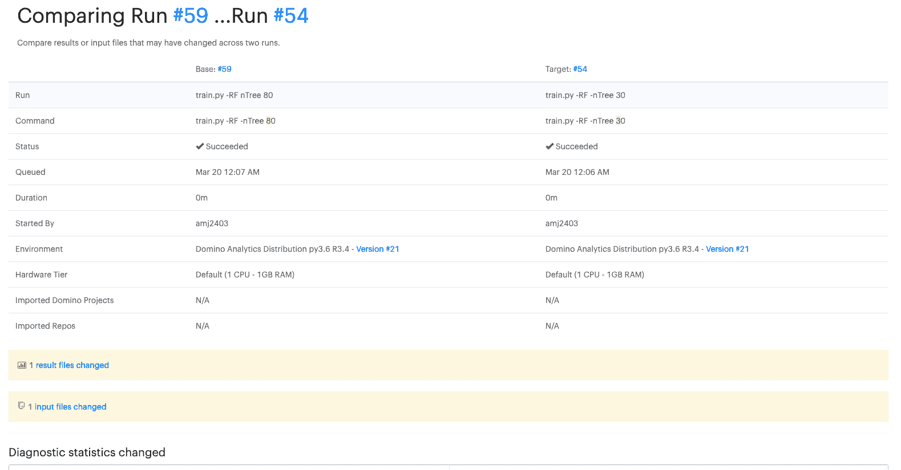

# Domino 3.3:数据集和实验管理器

> 原文：<https://www.dominodatalab.com/blog/announcing-domino-3-3-datasets-and-experiment-manager>

[我们在 Domino 的使命](https://blog.dominodatalab.com/model-management-era-model-driven-business/)是让组织能够将模型放在其业务的核心。模型与软件非常不同，例如，它们在开发过程中需要更多的数据，涉及更多的实验性研究过程，并且它们的行为具有不确定性，因此组织需要新产品和流程来支持数据科学团队大规模开发、部署和管理它们。

今天，我们宣布 Domino 中有两个主要的新功能，可以让数据科学家更容易、更快地开发模型。“数据集”为数据科学家提供了在开发模型时利用大量数据资源所需的灵活性。“实验管理器”为数据科学家提供了一种方法来跟踪、查找和组织他们在研究过程中测试过的所有想法。

正如人们经常引用的那样，[数据科学家花费 80%的时间“争论”数据](https://www.mckinsey.com/~/media/mckinsey/industries/advanced%20electronics/our%20insights/how%20artificial%20intelligence%20can%20deliver%20real%20value%20to%20companies/mgi-artificial-intelligence-discussion-paper.ashx)——数据准备、数据工程、特征提取——除了模型开发和培训之外，所有这些都是耗时的活动。这一痛点在拥有从事大量实验的数据科学家团队的组织中被放大了。

## 多米诺数据集

数据集提供了高性能的修订数据存储，使数据科学家能够跟踪、共享和重用基于文件的大型数据资源，以便团队能够更快地迭代研究并加速模型开发。数据集不是将数据存储在 Domino 项目文件中，而是提供本地化的数据集合，可随时用于数据科学实验。数据集被设计为处理需要大量单个文件和/或大规模文件的使用情形。通过消除冗余工作并确保每个人都使用最新和最棒的产品，共享和重用数据集中的精选数据的能力可以大大减少花费在争论数据上的时间。

“数据集功能为我们节省了大量时间，”机器智能公司 Numenta 的首席软件工程师 Luiz Scheinkman 说。“过去处理数据需要几个小时，所以我们要通宵运行这些流程。使用 Domino 数据集，我们可以对数据进行预处理，并在 21 分钟内将预处理后的数据附加到实验中。这意味着我们可以迭代，看到我们的结果，并在一天中不断改进——这在加快整个模型开发过程中有着巨大的差异。”

Domino 数据集还将数据的版本控制与代码的版本控制分离开来，允许更高的保真度和实验的完全可再现性。数据集允许更细粒度的数据隐私和保护应用。有关 3.3 中数据集的更多信息，请参见 Domino 支持网站并观看本教程:

## 多米诺实验经理

除了数据集，Domino 3.3 还引入了实验管理器。数据科学不同于软件开发等其他工作流，因为它涉及开放式探索和实验，以找到最佳解决方案。传统的知识管理系统无法无缝地跟踪和组织这样的工作，因此数据科学家经常求助于手动将元数据保存在电子表格中，或者更糟的是，丢失他们实验的许多线程。数据科学家和数据科学领导者需要一个单一视图来跟踪、组织和管理不同细节级别的实验。实验管理器在 Domino 中提供了这种可见性，就像数据科学家经历训练和调优模型的迭代过程时的“现代实验室笔记本”一样。对实验的状态、性能和影响的单一、高性能视图使数据科学团队能够管理实验，以便找到相关的过去工作、执行元分析和回顾。

实验管理器允许用户对实验进行搜索、分组、排序和过滤，从而可以轻松地找到特定的过去结果，并查看实验的粒度细节，同时将这些实验置于更广泛的想法背景下进行测试。

借助实验管理器，数据科学家可以在一个屏幕上比较两次不同运行的结果，以进行快速分析，并访问实验的详细日志记录。

关于 3.3 中实验管理器的更多信息，请参见 Domino 支持站点。

Domino 3.3 目前已经上市——请务必查看产品演示，了解最新的平台功能。