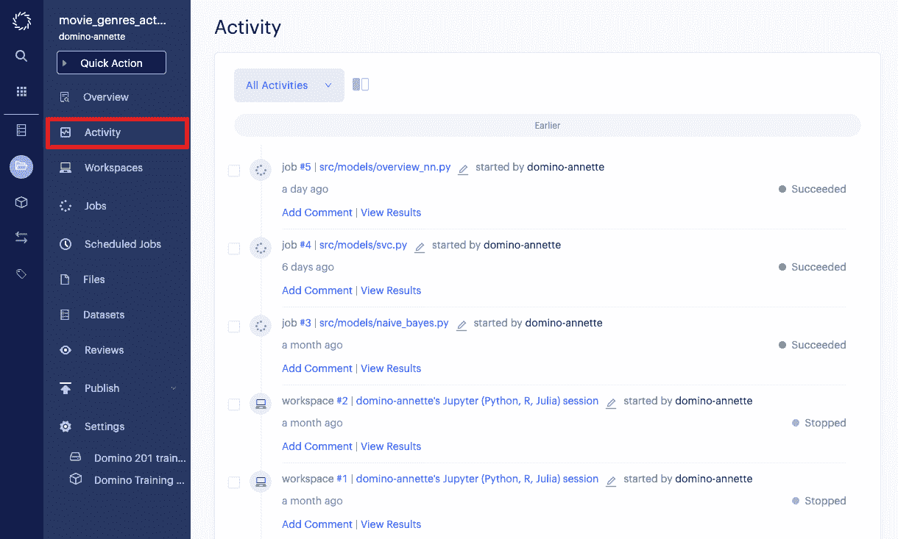
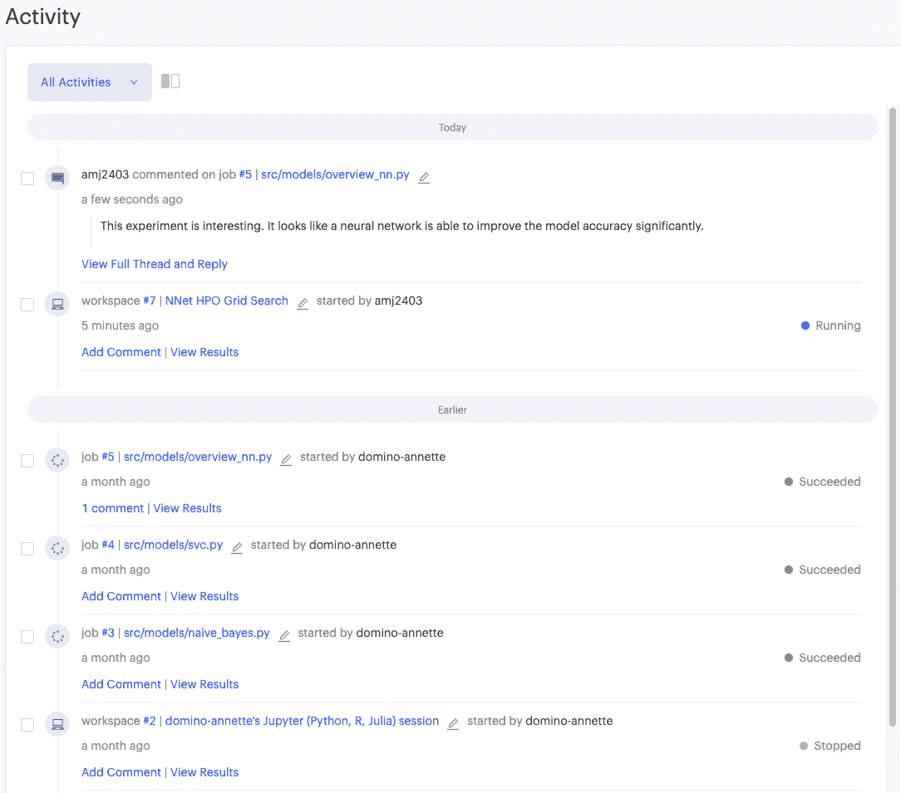
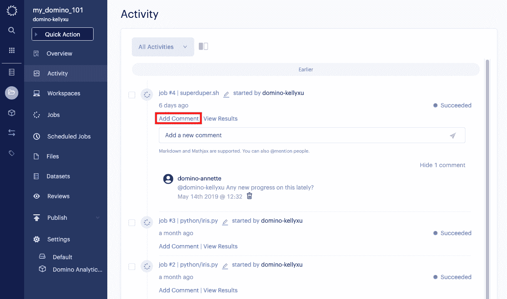

# 宣布 Domino 3.4:通过 Activity Feed 加强协作

> 原文：<https://www.dominodatalab.com/blog/announcing-domino-3-4-furthering-collaboration-with-activity-feed>

我们的上一个版本，[Domino 3.3](https://blog.dominodatalab.com/announcing-domino-3-3-datasets-and-experiment-manager/)看到了两个主要功能的增加: [数据集](https://support.dominodatalab.com/hc/en-us/articles/360020125052-Datasets-overview) 和 [实验管理器](https://blog.dominodatalab.com/announcing-domino-3-3-datasets-and-experiment-manager/) 。“数据集”是一种高性能的修订数据存储，为数据科学家提供了在开发模型时利用大型数据资源所需的灵活性。“实验经理”充当数据科学家的“现代实验室笔记本”，用于跟踪、组织和查找他们研究过程中测试的所有内容。

本着继续关注支持协作、组织和透明的精神，Domino 在 Domino 3.4 中引入了对实验管理器的补充:活动提要。

## **活动馈送**

Activity Feed 是实验室中的一个新页面，它提供了一个易于跟踪的、按时间顺序排列的项目变更日志。

 3.4 Activity Feed

虽然有助于跟踪个人的进步，但在与团队合作时，活动提要确实大放异彩。有了 Activity Feed，让新团队成员入职并让他们快速上手变得更快、更容易。新的团队成员可以很容易地回顾过去的工作，目前的进展，并看到谁联系任何以前的工作的问题。类似地，在离开项目后，团队成员很容易通过滚动活动提要来恢复工作。

除了能够跟踪项目随时间的变化，数据科学家还可以轻松访问作业或工作空间的结果，点击作业编号以在实验管理器中查看更多详细信息，并从活动提要中轻松比较作业。如果数据科学家只想要特定的视图，也可以通过工作、工作区和评论进行过滤。

 3.4 Activity Feed

本着促进协作和交流的精神，用户可以对每个事件发表评论并在线回复。

 3.4 Activity Feed

Activity Feed 诞生于改善协作和讨论的目标。作为实验管理器的完美补充，用户现在可以更容易地跟踪项目的进展。

关于 3.4 中的活动 Feed，详见 [多米诺骨牌支持站点](https://support.dominodatalab.com/hc/en-us/articles/360001055303#activity) 。

Domino 3.4 目前已正式上市—[联系我们](https://www.dominodatalab.com/contact-us/)了解更多信息，请务必查看产品演示，了解最新的平台功能。