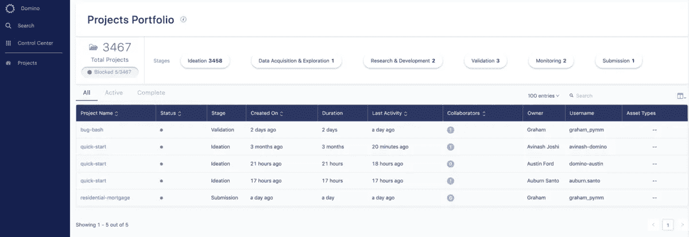
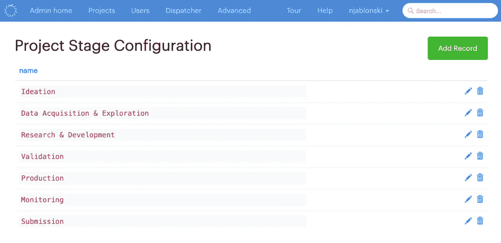
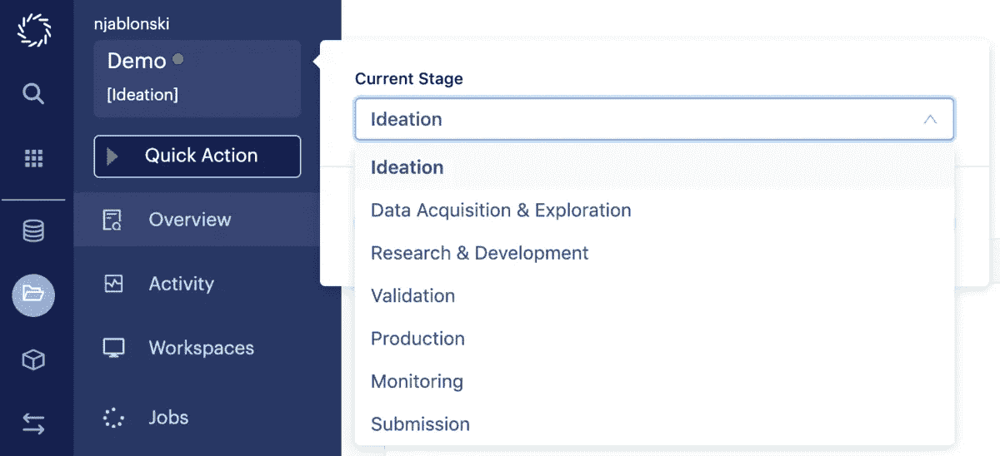
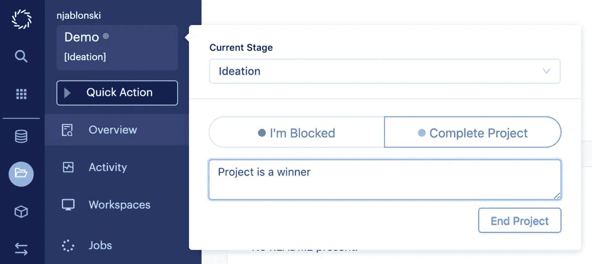
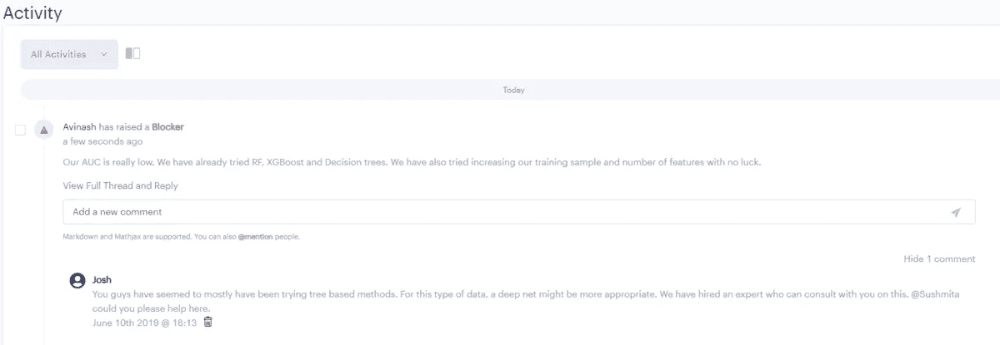
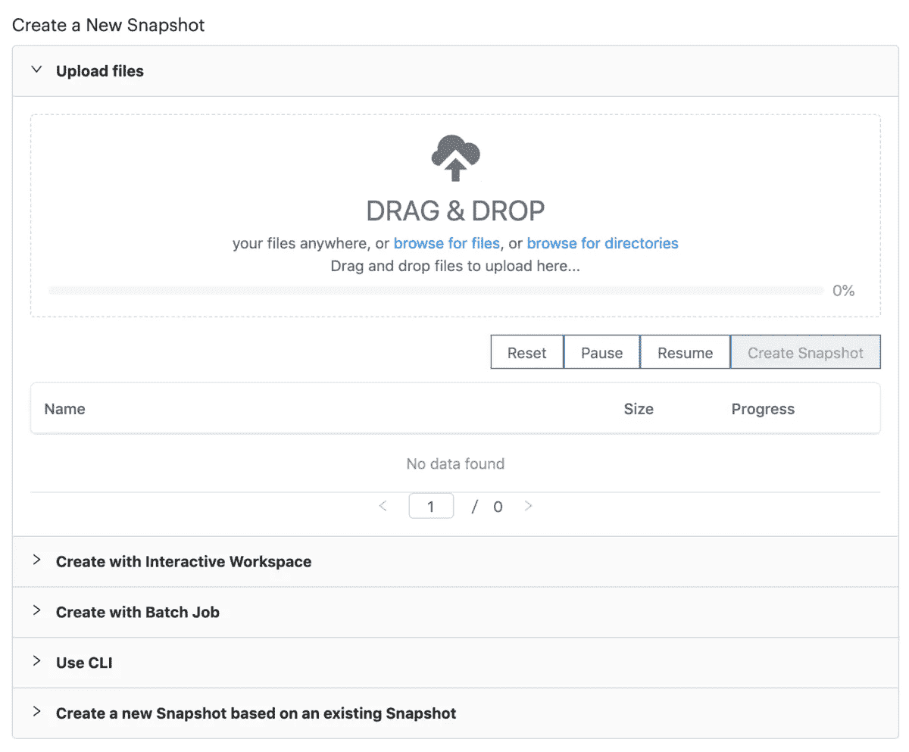
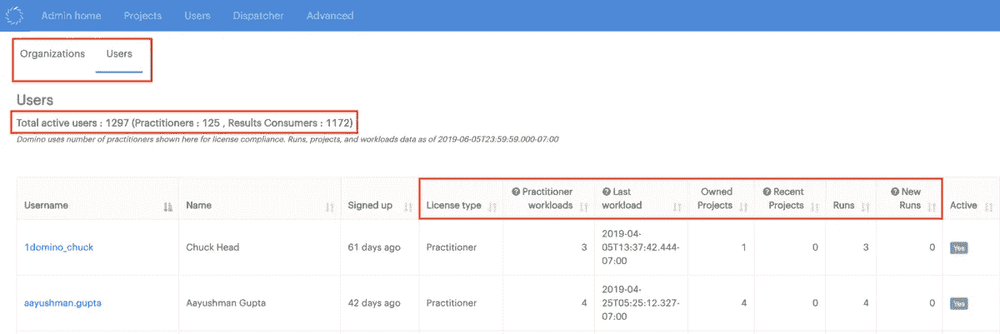

# 宣布试用和 Domino 3.5:数据科学领导者的控制中心

> 原文：<https://www.dominodatalab.com/blog/announcing-domino-3-5-control-center-for-data-science-leaders-and-trial>

By Kelly Xu, Product Marketing Manager on June 26, 2019 in [Product Updates](/blog/product-updates/)

即使是最复杂的数据科学组织也很难跟踪他们的数据科学项目。数据科学领导者希望在任何给定的时刻，不仅知道有多少数据科学项目正在进行中，还想知道在模型开发方面有哪些最新的更新和障碍，以及哪些项目需要他们立即关注。

但是，虽然有大量的工具可供个人数据科学家使用，但数据科学领导者的需求并没有得到很好的满足。例如，一家财富管理公司的分析副总裁最近告诉我们，他不得不拿着笔和记事本在办公室里走来走去，从一个人走到另一个人，以便获得正在进行的项目的实际数量，因为他们的传统任务跟踪工具与数据科学团队使用的工作流不太一致。事实证明，最终的统计结果与提供给首席执行官的最初估计相差甚远。

数据科学领导者面临着一系列与可见性和治理相关的常见挑战:

*   **他们需要帮助跟踪项目**
*   **他们需要帮助跟踪生产中的模型**
*   **他们需要帮助建立一种遵循最佳实践的文化**

考虑到不准确信息的潜在影响(从错误设定的预期、资金不匹配到项目延迟),数据科学领导者在纽约举行的 [Rev 2 数据科学领导者峰会](https://rev.dominodatalab.com/)上挤满了房间，观看我们专门为他们设计的新“控制中心”功能的现场演示，这并不奇怪。

[https://www.youtube.com/embed/aO3YkDwsm6Q](https://www.youtube.com/embed/aO3YkDwsm6Q)

附注:如果你错过了今年的 [Rev](https://rev.dominodatalab.com/) ，可以在[这里](https://rev.dominodatalab.com/rev-2019/)找到专题演讲和录音。

去年秋天，我们向 IT 利益相关者提供了 Domino [控制中心](https://blog.dominodatalab.com/domino-3-0-new-features-and-user-experiences-to-help-the-world-run-on-models/),帮助他们了解计算使用和支出情况。今天，我们宣布在 Domino 3.5 中对控制中心进行重大扩展，为数据科学领导者提供新功能。

Domino 3.5 允许数据科学领导者定义他们自己的数据科学项目生命周期。控制中心新增了项目组合仪表板，使数据科学领导者能够轻松跟踪和管理项目，全面了解最新发展。它还通过显示被阻止的项目来实时显示需要立即关注的项目。

## 项目组合仪表板

数据科学领导者可以在项目组合仪表板中开始他们的一天，该仪表板显示了按可配置的生命周期阶段细分的进行中项目的摘要，并提供了所有项目的即时状态更新。

## 项目阶段配置

每个组织都有自己的数据科学生命周期来满足他们的业务需求。在 Domino 3.5 中，我们允许数据科学领导者和管理者定义他们自己的项目生命周期，并在他们的团队中实施。

数据科学家可以在整个生命周期中更新他们的项目阶段，并通过电子邮件通知他们的合作者。

项目所有者和参与者可以使用“项目阶段”菜单，通过阻止程序的描述将项目标记为被阻止。一旦解决，项目就可以解冻。另一方面，当数据科学家用项目结论的描述将项目标记为完成时，Domino 也会捕获这些元数据，用于项目跟踪和将来的引用。所有这些捕获的元数据对于组织学习、组织项目和帮助避免将来类似的问题都是有用的。

所有这些信息为 Domino 的新项目组合仪表板提供了动力。数据科学主管可以点击查看任何正在进行的项目的更多背景信息，并发现需要关注的受阻项目。

在下面的假设项目中，我们的首席数据科学家 Josh 看到其中一个被阻止的项目是 Avinash 和 Niole 的客户流失项目。虽然他不记得这个项目的细节，但他可以看到它正处于 R&D 阶段，几周后会有一个艰难的停顿。深入到项目中，他可以看到剩下的目标是获得 AUC 在 0.8 以上的分类模型。

Josh 可以转到活动源，以获得有关阻止程序、原因的详细信息，并建议采取行动。在这个例子中，他将要求客户流失团队尝试深度神经网络。他可以标记另一个团队的深度学习专家 Sushmitha，并请她指导这项工作。

管理项目、跟踪生产资产和监控组织健康状况需要新的工具。这些独特的功能是为数据科学领导者定制的。在 Domino，当您在团队中使用这些优势时，我们很高兴地看到这些优势正在向您走来。

所有这些只是 Domino 中的一些新特性，在 3.5 版本中，我们还对现有特性进行了一些其他增强。例如， [Activity feed](https://blog.dominodatalab.com/announcing-domino-3-4-furthering-collaboration-with-activity-feed/) 得到了增强，可以显示正在评论的文件的预览。它还显示了项目阶段的更新，以及合作者是否提出了任何阻碍因素。用户还可以根据活动类型进行筛选。这与电子邮件通知相结合，将确保随时了解项目的情况。

## 资料组

Domino 3.5 为用户提供了直接从计算机上的数据创建大型数据集快照的选项。CLI 上的上传限制已增加到 50 GB 和最多 50，000 个文件。在相同的上传限制下，用户也可以直接通过浏览器上传文件。CLI 和浏览器上传提供了一种无缝方式，可将笔记本电脑上的数据迁移和贡献到一个位置，以进行数据科学工作。团队可以利用共享的、精选的数据，消除潜在的冗余数据争论工作，并确保完全可重复的实验。

## 许可证使用报告

为了补充数据科学领导者控制中心的新功能，我们还推出了用户活动分析增强功能，以促进许可证报告和合规性。它提供了每个团队成员的 Domino 活动水平的详细视图，以便数据科学和 It 领导可以管理他们的 Domino 许可证分配，并对他们的成本有可见性和可预测性。Domino 管理员可以快速识别活动和非活动用户，并决定是否应该给他们分配一个许可证。在预算规划和合同续签期间跟踪用户活动和增长的能力，使得规划未来支出变得更加容易。

## 试验

除了为数据科学领导者带来激动人心的突破性新功能，我们还推出了新的[试用环境]https://www . dominodatalab . com/Trial/对于那些想尝试一下并评估它是否对你的工作有用的人来说，它是完美的。这个最新版本中的新特性也将出现在我们的测试环境中！这是访问 Domino 并开始体验像[经销商轮胎](https://www.dominodatalab.com/customers/dealer-tire/)和 [Redhat](https://www.dominodatalab.com/customers/) 这样的公司在他们的数据科学组织中利用的秘方[的一种快速而简单的方法。](https://www.dominodatalab.com/customers/)

Domino 3.5 目前已经上市——请务必[试试 Domino](https://www.dominodatalab.com/trial/) 看看最新的平台功能。

[Twitter](/#twitter) [Facebook](/#facebook) [Gmail](/#google_gmail) [Share](https://www.addtoany.com/share#url=https%3A%2F%2Fwww.dominodatalab.com%2Fblog%2Fannouncing-domino-3-5-control-center-for-data-science-leaders-and-trial%2F&title=Announcing%20Trial%20and%20Domino%203.5%3A%20Control%20Center%20for%20Data%20Science%20Leaders%20)