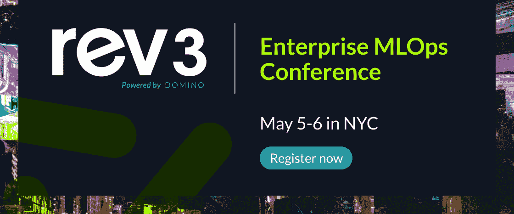

# 保存日期！Rev 3 将于今年 5 月在纽约回归！

> 原文：<https://www.dominodatalab.com/blog/announcing-rev-3-dates-keynote-speakers-and-registration>

由多米诺数据实验室于 2022 年 2 月 8 日在[公司更新](/blog/company-updates/)

我们很高兴再次在 Rev 3 现场相聚，这是一年一度不容错过的企业 MLOps 峰会！

2022 年 5 月 4 日至 6 日，纽约 Marriott Marquis 酒店。

这有望成为迄今为止最雄心勃勃的企业 MLOps 峰会。而且，注册现在是开放的，有最好的交易，所以你可以保证你和你的团队不会错过这个开创性的经验。立即注册！

 

Rev 3 汇集了数据科学和 IT 领导者及其团队，分享关于 MLOps 最佳实践的战略和实践见解，以推动其组织内的进步。

为前所未有的三天洞察力和学习做好计划，重点是建立一个持续的学习机器。

## 注重持续学习

模型的力量在于它们不断学习的能力:随着数据的变化，模型也在改进。今年 Rev 着眼于如何将这种持续学习融入到你的模型、团队和生活中。从不容错过的杰出主题演讲嘉宾阵容开始:

*   James Clear ，畅销书作家和个人发展教练。Clear 将谈到“原子习惯”
*   **Mike Hayes，**VMware 首席数字化转型官。"永不满足:海军海豹突击队指挥官谈卓越、敏捷和有意义的生活."
*   **詹妮弗·杜德纳(Jennifer Doudna)，博士，** 2020 年诺贝尔奖获得者，加州大学伯克利分校分子和细胞生物学及化学教授。
*   **Linda Avery，**高级副总裁，&首席数据分析官，威瑞森
*   [访问我们的演讲人页面](https://rev.dominodatalab.com/speakers?utm_campaign=rev_2021&utm_source=blog&utm_medium=domino_website)了解更多关于这些以及我们的专家阵容的信息。

## 数据科学团队教育

这些鼓舞人心的演讲者只是 Rev 3 所提供的一个暗示。该议程包含培训、实践见解、学习和网络，将遵循三个不同的轨道:

**数据科学管理** -赢得转型战略、雇佣和建立团队的艺术、创建跨职能协作以及支持数据科学家。

**模型驱动的业务** -支持组织战略、运营效率和重大商业价值的数据科学、机器学习和 MLOps 的应用。

**MLOps 提示、工具和技巧** -从探索和实验到部署和监控的整个 MLOps 生命周期中的技巧、工具和建议。

[立即注册](https://rev.dominodatalab.com?utm_campaign=rev_2021&utm_source=blog&utm_medium=domino_website)获得最优惠的价格，并确保您的团队沉浸在所有这些无与伦比的学习中。

## 数据科学领导者的必备

如你所知，我们对迄今为止最重要的一次变革感到兴奋。这是唯一一次深入探讨数据科学领导力的独特挑战以及机器学习和企业 MLOps 如何支持组织战略、运营效率和重大商业价值的峰会。您将了解关于如何提高数据科学团队的工作效率、增强治理和安全性、加快模型速度的重要见解，以及数据科学生命周期中的其他主题。

...这一切都发生在我身上。

Rev 3 是您希望参加的活动，如果企业 MLOps 是您带领您的企业走向数据科学成功的责任。

不要错过今年的活动。[现在就注册](https://rev.dominodatalab.com?utm_campaign=rev_2021&utm_source=blog&utm_medium=domino_website)，锁定您的空间，并节省(做一只早起的鸟儿是值得的)！

为了更深入地了解更多的发言人和会议，我们的 [Rev 3 网站](https://rev.dominodatalab.com?utm_campaign=rev_2021&utm_source=blog&utm_medium=domino_website)现已上线，提供了详细议程、发言人、会议议程、常见问题解答、地点后勤以及最新的健康和安全信息。

## 赞助机会

赞助商有机会成为全球 2000 强企业、其支持合作伙伴、行业领袖和数据科学家的焦点。[立即了解更多关于赞助的信息](https://rev.dominodatalab.com/sponsors?utm_campaign=rev_2021&utm_source=blog&utm_medium=domino_website) *。*

最后，一个关于保持你的健康和安全的注意事项。请放心，我们致力于吸引人且安全的现场活动。Rev 3 将遵循所有最新的疾控中心和纽约当地的指导。

今年五月在纽约见！