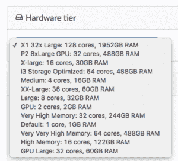
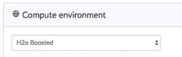
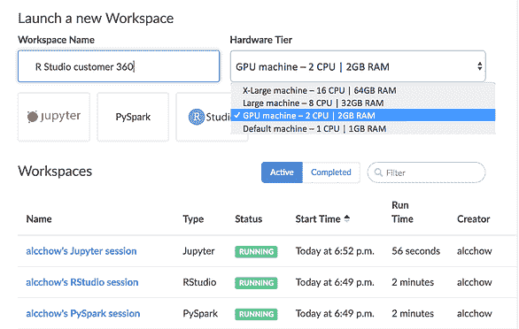
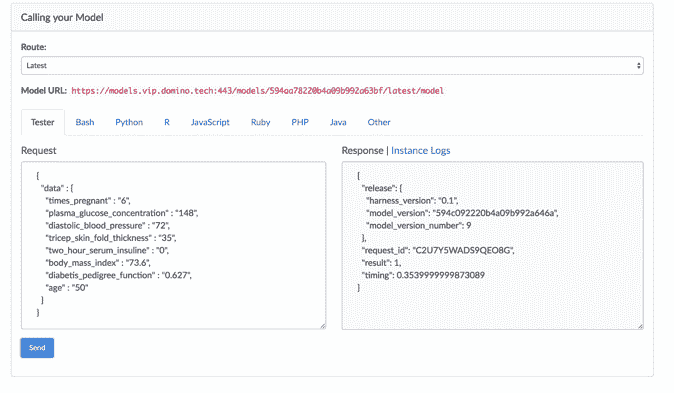
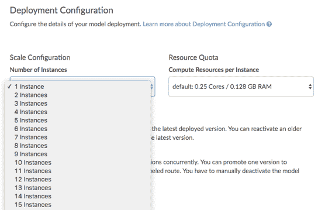
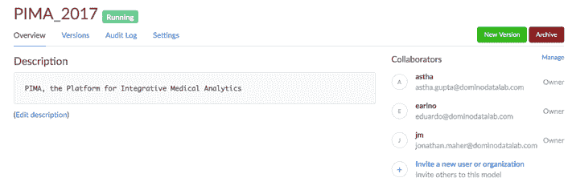

# 回答关于 Strata 自动气象站模型交付的问题

> 原文：<https://www.dominodatalab.com/blog/answering-questions-model-delivery-aws-strata>

*这篇文章是达美乐在纽约 Strata 展台回答的常见问题的摘要。我们回答了关于访问 EC2 机器、管理环境和模型交付的问题。*

参加像 [Strata](https://conferences.oreilly.com/strata/strata-ny) 这样的活动的最大好处之一是有机会与数据科学家和数据科学经理共度时光。我们直接了解了数据科学家在日常工作中面临的挑战，包括花费在 DevOp 式任务上的时间。我们听到许多数据科学经理谈论他们的计划获得更大的灵活性，以便数据科学家可以自由选择工具和进行实验。我们从数据科学家和数据科学经理那里了解到，有多少公司仍在寻找数据科学有效实现商业价值所需的流程和基础设施。我们还听说许多公司开始将云迁移视为其长期战略的重要组成部分。

这种类型的会议很棒，因为它们给了我们很多关于构建特性的想法。然而，在 Strata 召开的这些会议也很棒，因为它们验证了我们已经推出的产品。事实上，我们最近关于 AWS 上[模型交付的声明仅仅强调了](http://www.businesswire.com/news/home/20170927005189/en/Domino-Data-Lab-Accelerates-Model-Delivery-AWS)[我们与亚马逊](https://www.dominodatalab.com/aws-data-science/?utm_source=blog&utm_medium=post&utm_campaign=answering-questions-model-delivery-aws-strata)联合解决方案的一些优势。甚至我们认为更基本的功能，包括轻松访问 EC2 机器、环境管理和模型交付，也受到了 [Domino 客户](https://www.dominodatalab.com/customers/?utm_source=blog&utm_medium=post&utm_campaign=answering-questions-model-delivery-aws-strata)的欢迎。

## 轻松访问 EC2 机器

以可扩展计算为例。如今，从事数据科学工作的人很少能像 Domino 提供的那样获得计算能力。大多数数据科学家要么仍在他们的个人机器上工作，要么被困在他们无法控制的共享服务器上。尽管硬件层选择菜单很简单，但它仍然是演示中最受工作数据科学家欢迎的功能之一。

我们与 AWS 的合作意味着 Domino 客户可以快速、轻松地获得他们工作所需的计算能力。当然，我们还添加了支持数据科学团队的人员正在寻找的报告和 IT 管理功能。

## 环境管理和工作空间

与*计算管理*配合，Domino 的*环境管理*也解决了许多公司面临的问题。因为 Strata 在纽约，我们采访了各种金融服务公司的人。法规遵从性一直是一个重要的话题。我问来自几家银行的人，*“你们的模型验证团队是如何重现模型建立时的环境的？”*事实证明，没有人有好的答案。这是一个文档挑战，对数据科学家可以使用的工具有限制，或者可能只是增加了许多额外的工作。

多米诺解决了这个问题。我们在受监管行业的客户喜欢这样一个事实，即从最初的勘探到生产，环境与模型同行。看到这一点的人赞赏他们在工作方式上获得的灵活性，以及他们使用的任何环境都将得到保护并可供内部和外部审计人员使用的保证。

环境管理还有另外一个好处，那就是客户可以选择将哪些工具加载到环境中，并提供给他们的团队使用。很容易让每个人都能访问 Jupyter、RStudio 以及 SQL、Spark 等工具。Domino 客户也在他们的共享环境中加载专有软件，如 Matlab 和 SAS。结果是*集中管理数据科学团队*想要使用的所有工具。

 *Sneak Peek of Upcoming Workspace within a Single Page View*

## 模型发布

因为我们刚刚[宣布了新的模型交付](http://www.businesswire.com/news/home/20170927005189/en/Domino-Data-Lab-Accelerates-Model-Delivery-AWS)功能，这一领域引起了很大的兴趣。我们经常听到从一个模型完成到投入生产之间的昂贵的延迟。成本不仅仅是 DevOps 的成本，也不是在生产中使用过时模型的成本。主要成本是模型迭代次数的减少。公司从部署的模型中学习的能力受到了损害，改进的速度也是如此。

有了 AWS 上的 Domino，就消除了 DevOps 开销。人们得到了高可用性的基础设施，以及一个可控制的过程来部署他们所需要的任何规模的模型，从小型原型到 web 规模的面向消费者的应用程序。当然，我们仍然有一个完整的模型发布管理过程，但是没有所有花费如此多的不必要的开销。

模型发布有几个方面是人们真正欣赏的。一个是在生产环境中轻松测试模型的能力。那些构建模型的人可以确认模型确实做了他们期望的事情。使用 Domino 意味着模型不需要在新环境中重新实现，并且消除了一轮又一轮的测试。

接下来，我们使分配资源以支持生产中的模型变得容易。决定应该投入多少计算能力来支持生产模型就像使用*下拉菜单*一样简单。

最后，我们让跟踪生产模型的一切变得容易:谁拥有它们、*何时建造*、*何时投产*、*何时版本变更*等等。Domino 的协作特性扩展到监控和管理模型，以便关键任务预测模型可以获得适当级别的支持。

当然，对于 AWS 上的 Domino 来说，还有更多让我们的用户感到兴奋的东西。我们已经写了我们支持的 128 个核心 X1 实例。(是的，您可以配置谁可以访问它们。)最近，我们讨论了[G3 GPU](//blog.dominodatalab.com/new-g3-instances-in-aws-worth-it-for-ml/)的价值，以及速度优势是否值得付出。由于集中的知识和容易看到其他人正在做什么的能力，分布式团队变得更快和更有效。首席信息官和 IT 团队很乐意[结束影子 IT](https://www.dominodatalab.com/resources/wild-west-data-science/?utm_source=blog&utm_medium=post&utm_campaign=answering-questions-model-delivery-aws-strata) ，同时仍然支持数据科学工作需求。

如果您未能加入我们的 Strata，并且您有兴趣了解更多有关我们的客户如何使用该平台并迁移到云的信息，请[下载我们的“*云中的数据科学*”白皮书](https://www.dominodatalab.com/resources/data-science-cloud/?utm_source=blog&utm_medium=post&utm_campaign=answering-questions-model-delivery-aws-strata)。