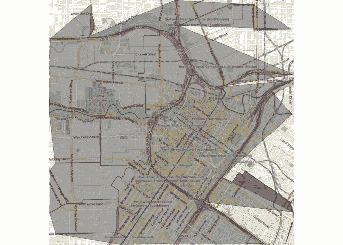

# 应用空间数据科学与 R

> 原文：<https://www.dominodatalab.com/blog/applied-spatial-data-science-with-r>

## 介绍

我最近开始写我的博士论文，这篇论文利用了大量不同的空间数据类型。在这个过程中，我发现有很多关于使用 R 进行空间数据分析的概念是我不知道的。本报告的目的是记录一些概念和我最喜欢的空间数据分析包。本报告组织如下:首先，我们需要问为什么 R 是空间分析的一个很好的选择工具；其次，我们将经历一个典型的数据分析生命周期，从获取空间数据到数据准备、探索、可视化和地质统计分析。

### 为什么使用 R 进行空间数据分析

你可能会问自己:既然有商业和开源的地理信息系统(GIS ),如 ESRI ArcMap 和 QGIS，为什么还要使用 R 进行空间分析呢？以下是我的一些理由:

*   r 是免费和开源的
*   再现性:研究人员可以再现他们自己的分析或其他人的分析，并验证他们的发现
*   包:有大量的 R 包用于空间数据分析、统计建模、可视化、机器学习等等。

#### r 空间数据分析包

我最喜欢的一些空间数据分析包包括:

*   [sp](https://cran.r-project.org/web/packages/sp/index.html) :这个包提供了空间数据的类和方法；用于绘制地图、处理坐标等的实用函数。
*   这个包提供了导入和导出不同的栅格和矢量地理空间数据格式的方法；坐标参考系统；预测等。
*   [rgeos](https://cran.r-project.org/web/packages/rgeos/index.html) :提供处理拓扑操作的函数。
*   [ggplot2](https://ggplot2.tidyverse.org/) :由 [Hadely Wickham](http://had.co.nz/) 开发的最受欢迎的数据可视化软件包
*   ggmap :提供在静态地图上可视化空间数据的功能，这些地图来自 Google Maps、Open Street Maps、cloudmade 和 stamen。
*   [leaflet](http://rstudio.github.io/leaflet/) : leaflet for R 提供了控制和集成 Leaflet 的功能，Leaflet 是 R 内部的一个用于交互式地图的 JavaScript 库。
*   我的大部分空间数据都有日期时间度量。这个包提供了操作日期和时间的函数。

## 数据准备

### 数据

在本教程中，我们将使用从 2010 年 1 月至 2010 年 8 月期间收集的来自休斯顿警察局的犯罪数据。 **ggmap** 软件包的创建者【大卫·卡尔】好心地收集数据，对其进行处理，并通过他的软件包提供给用户。

所以让我们安装一些我最喜欢的包，我们将在本教程中使用。

```py
## These are some of my favorite packages for spatial data analysis
suppressPackageStartupMessages(library(ggmap))
suppressPackageStartupMessages(library(sp))
suppressPackageStartupMessages(library(rgdal))
suppressPackageStartupMessages(library(rgeos))
suppressPackageStartupMessages(library(ggplot2))
suppressPackageStartupMessages(library(leaflet))
suppressPackageStartupMessages(library(dplyr))
suppressPackageStartupMessages(library(magrittr))
suppressPackageStartupMessages(library(readr))
suppressPackageStartupMessages(library(lubridate))
suppressPackageStartupMessages(library(RColorBrewer))
suppressPackageStartupMessages(library(classInt))
```

### 读取空间数据

犯罪数据是逗号分隔值(CSV)格式，并且很小，只有 13MB。

```py
crime_df <- read_csv("data/crime.csv")

## We need to understand the structure of this dataset
str(crime_df)

## Classes 'tbl_df', 'tbl' and 'data.frame': 86314 obs. of 17 variables:
## $ time : POSIXct, format: "2010-01-01 06:00:00" "2010-01-01 06:00:00" ...
## $ date : chr "1/1/2010" "1/1/2010" "1/1/2010" "1/1/2010" ...
## $ hour : int 0 0 0 0 0 0 0 0 0 0 ...
## $ premise : chr "18A" "13R" "20R" "20R" ...
## $ offense : chr "murder" "robbery" "aggravated assault" "aggravated assault" ...
## $ beat : chr "15E30" "13D10" "16E20" "2A30" ...
## $ block : chr "9600-9699" "4700-4799" "5000-5099" "1000-1099" ...
## $ street : chr "marlive" "telephone" "wickview" "ashland" ...
## $ type : chr "ln" "rd" "ln" "st" ...
## $ suffix : chr "-" "-" "-" "-" ...
## $ number : int 1 1 1 1 1 1 1 1 1 1 ...
## $ month : chr "january" "january" "january" "january" ...
## $ day : chr "friday" "friday" "friday" "friday" ...
## $ location: chr "apartment parking lot" "road / street / sidewalk" "residence / house" "residence / house" ...
## $ address : chr "9650 marlive ln" "4750 telephone rd" "5050 wickview ln" "1050 ashland st" ...
## $ lon : num -95.4 -95.3 -95.5 -95.4 -95.4 ...
## $ lat : num 29.7 29.7 29.6 29.8 29.7 ...
```

快速浏览一下数据结构就会发现，这是一个包含 86，314 个观察值和 17 个变量的数据框架。

让我们快速查看一些数据记录和一些汇总统计数据，以熟悉我们的数据。这可以使用`head()`和`summary()`命令来完成。

```py
head(crime_df, n = 5)

## Source: local data frame [5 x 17]
##
## time date hour premise offense beat
## (time) (chr) (int) (chr) (fctr) (chr)
## 1 2010-01-01 06:00:00 1/1/2010 0 18A murder 15E30
## 2 2010-01-01 06:00:00 1/1/2010 0 13R robbery 13D10
## 3 2010-01-01 06:00:00 1/1/2010 0 20R aggravated assault 16E20
## 4 2010-01-01 06:00:00 1/1/2010 0 20R aggravated assault 2A30
## 5 2010-01-01 06:00:00 1/1/2010 0 20A aggravated assault 14D20
## Variables not shown: block (chr), street (chr), type (chr), suffix (chr),
## number (int), month (fctr), day (fctr), location (chr), address (chr),
## lon (dbl), lat (dbl)

summary(crime_df)

## time date hour
## Min. :2010-01-01 06:00:00 Length:86314 Min. : 0.00
## 1st Qu.:2010-03-08 01:00:00 Class :character 1st Qu.: 8.00
## Median :2010-05-06 12:00:00 Mode :character Median :14.00
## Mean :2010-05-04 18:47:44 Mean :13.28
## 3rd Qu.:2010-07-02 20:00:00 3rd Qu.:19.00
## Max. :2010-09-01 04:00:00 Max. :23.00
##
## premise offense beat
## Length:86314 aggravated assault: 7177 Length:86314
## Class :character auto theft : 7946 Class :character
## Mode :character burglary :17802 Mode :character
## murder : 157
## rape : 378
## robbery : 6298
## theft :46556
## block street type
## Length:86314 Length:86314 Length:86314
## Class :character Class :character Class :character
## Mode :character Mode :character Mode :character
##
##
##
##
## suffix number month day
## Length:86314 Min. :1.000 may :11920 friday :13414
## Class :character 1st Qu.:1.000 july :11290 monday :12535
## Mode :character Median :1.000 april :11068 saturday :12525
## Mean :1.012 june :11052 sunday :11019
## 3rd Qu.:1.000 august :10962 thursday :12342
## Max. :9.000 march :10922 tuesday :12503
## (Other):19100 wednesday:11976
## location address lon lat
## Length:86314 Length:86314 Min. :-99.51 Min. :27.51
## Class :character Class :character 1st Qu.:-95.51 1st Qu.:29.69
## Mode :character Mode :character Median :-95.41 Median :29.74
## Mean :-95.42 Mean :29.76
## 3rd Qu.:-95.34 3rd Qu.:29.81
## Max. :-91.95 Max. :37.34
## NA's :5 NA's :5
```

汇总统计数据显示，我们需要将变量“日期”、“冒犯”、“月”和“日”的格式改为日期和因子。我们还需要在“坐标”变量中去掉 NAs 的 5 个数据记录，因为这将影响我们的一些空间分析。

```py
## Because the sp package is not able to find an inherited method
## for function ‘coordinates’ for signature ‘"tbl_df", let's convert our local dataframe.
## The variables "offense", "month", "day" should be factors
crime_df <- data.frame(crime_df) %>% filter(lon != "NA")
crime_df$offense <- as.factor(crime_df$offense)
crime_df$month <- as.factor(crime_df$month)
crime_df$day <- as.factor(crime_df$day)
crime_df$date <- as.Date(crime_df$date)
```

### 空间点数据框架

为了利用几个空间包中的类和方法，包括 **sp** 包，我们需要将*“犯罪 _ df”*本地数据帧转换成**“空间点数据帧”**。

```py
## Convert to SpatialPointsDataFrame with longitude and latitude so as to use spatial packages
## The Coordinate Reference System is a Geographic CRS called WGS84
coords <- SpatialPoints(crime_df[, c("lon", "lat")])
crime_spatial_df <- SpatialPointsDataFrame(coords, crime_df)
proj4string(crime_spatial_df) <- CRS("+proj=longlat +ellps=WGS84")
```

请注意，我们使用了一些新的函数，即 SpatialPoints、SpatialPointsDataFrame、CRS 和 proj4string。这些来自用于空间分析的 **sp** 包。这个包的基础类是**空间**，从它生成其他子类，包括:

```py
getClass("Spatial")

## Class "Spatial" [package "sp"]
##
## Slots:
##
## Name: bbox proj4string
## Class: matrix CRS
##
## Known Subclasses:
## Class "SpatialPoints", directly
## Class "SpatialMultiPoints", directly
## Class "SpatialGrid", directly
## Class "SpatialLines", directly
## Class "SpatialPolygons", directly
## Class "SpatialPointsDataFrame", by class "SpatialPoints", distance 2
## Class "SpatialPixels", by class "SpatialPoints", distance 2
## Class "SpatialMultiPointsDataFrame", by class "SpatialMultiPoints", distance 2
## Class "SpatialGridDataFrame", by class "SpatialGrid", distance 2
## Class "SpatialLinesDataFrame", by class "SpatialLines", distance 2
## Class "SpatialPixelsDataFrame", by class "SpatialPoints", distance 3
## Class "SpatialPolygonsDataFrame", by class "SpatialPolygons", distance 2
```

我们可以看到**空间点**和**空间点数据帧**是**空间类**的子类。这种类系统脱离了 R 的基础类系统，为处理空间数据类型提供了更丰富的表示。

现在让我们来看看这种新数据类型的结构。

```py
str(crime_spatial_df)

## Formal class 'SpatialPointsDataFrame' [package "sp"] with 5 slots
## ..@ data :'data.frame': 86309 obs. of 17 variables:
## .. ..$ time : POSIXct[1:86309], format: "2010-01-01 06:00:00" ...
## .. ..$ date : chr [1:86309] "1/1/2010" "1/1/2010" "1/1/2010" "1/1/2010" ...
## .. ..$ hour : int [1:86309] 0 0 0 0 0 0 0 0 0 0 ...
## .. ..$ premise : chr [1:86309] "18A" "13R" "20R" "20R" ...
## .. ..$ offense : Factor w/ 7 levels "aggravated assault",..: 4 6 1 1 1 3 3 3 3 3 ...
## .. ..$ beat : chr [1:86309] "15E30" "13D10" "16E20" "2A30" ...
## .. ..$ block : chr [1:86309] "9600-9699" "4700-4799" "5000-5099" "1000-1099" ...
## .. ..$ street : chr [1:86309] "marlive" "telephone" "wickview" "ashland" ...
## .. ..$ type : chr [1:86309] "ln" "rd" "ln" "st" ...
## .. ..$ suffix : chr [1:86309] "-" "-" "-" "-" ...
## .. ..$ number : int [1:86309] 1 1 1 1 1 1 1 1 1 1 ...
## .. ..$ month : Factor w/ 8 levels "april","august",..: 4 4 4 4 4 4 4 4 4 4 ...
## .. ..$ day : Factor w/ 7 levels "friday","monday",..: 1 1 1 1 1 1 1 1 1 1 ...
## .. ..$ location: chr [1:86309] "apartment parking lot" "road / street / sidewalk" "residence / house" "residence / house" ...
## .. ..$ address : chr [1:86309] "9650 marlive ln" "4750 telephone rd" "5050 wickview ln" "1050 ashland st" ...
## .. ..$ lon : num [1:86309] -95.4 -95.3 -95.5 -95.4 -95.4 ...
## .. ..$ lat : num [1:86309] 29.7 29.7 29.6 29.8 29.7 ...
## ..@ coords.nrs : num(0)
## ..@ coords : num [1:86309, 1:2] -95.4 -95.3 -95.5 -95.4 -95.4 ...
## .. ..- attr(*, "dimnames")=List of 2
## .. .. ..$ : NULL
## .. .. ..$ : chr [1:2] "lon" "lat"
## ..@ bbox : num [1:2, 1:2] -99.5 27.5 -91.9 37.3
## .. ..- attr(*, "dimnames")=List of 2
## .. .. ..$ : chr [1:2] "lon" "lat"
## .. .. ..$ : chr [1:2] "min" "max"
## ..@ proj4string:Formal class 'CRS' [package "sp"] with 1 slot
## .. .. ..@ projargs: chr "+proj=longlat +ellps=WGS84"
```

您可以看到该类是 **SpatialPointsDataFrame** ，有 5 个插槽/组件，包括:

1.  **数据**:读入 R 的原点数据，
2.  **coords.nrs** :坐标的数据类型
3.  **坐标**:这些是坐标
4.  **bbox** :这是坐标的边界框，并且
5.  **proj4string** :这是坐标参考系统。

我们使用函数`CRS()`分配一个坐标参考系统，在本例中为 **WGS84** 。我们知道这是一个**地理**坐标参考系统(CRS)类型，因为坐标是经度和纬度格式。

或者，您可以使用如下的`coordinates()`命令。

```py
# Or using the "coordinates" method
crime_spatial_df1 <- crime_df
coordinates(crime_spatial_df1) <- c("lon", "lat")
proj4string(crime_spatial_df1) <- CRS("+proj=longlat +ellps=WGS84")
```

#### 坐标参考系统

理解坐标参考系统(CRS)很重要。这些对于空间地理编码数据非常有帮助。有两种类型的 CRS，即:

1.  地理坐标系统(经度、纬度)，例如 WGS84
2.  笛卡尔/投影/平面坐标系(x，y)

投影坐标参考系统由分为两大类的几个系统组成，即:

1.  州平面图(NADS83):这主要在美国使用，例如内华达州平面图 NADS 83。
2.  通用横轴墨卡托(UTM)，例如内华达(UTM 11N 区)、南非(UTM 34S 和 35S 区)

如果您看到以下格式的坐标数据，那么它是在地理坐标系中。

1.  (-94.324, 42.234)
2.  (33.33 44.4)，(33d19'47"N 44d23.9'E)，(38SMB4488)，(38n 444000 3688000)

基准:基准是定义局部坐标系的一组参数和地面控制点。示例:WGS84、NADS83

我们现在有了一个具有正确坐标系和时间数据的空间点数据框。我们应该保存一份副本作为 R 数据文件。

```py
## So we can quickly read in our processed data without having to re-process it.
saveRDS(crime_spatial_df, "data/crime_spatial_df.rds")
```

或者，我们可以将处理后的数据保存为 ESRI shape file，以保持空间完整性，如果您需要将它用于其他 GIS 系统，也可以这样做。 **rgdal** 包提供了`writeOGR()`命令，用于写出空间数据类型。

```py
## Also create a shapefile of this data
writeOGR(crime_spatial_df, dsn = "data/shapefiles", layer = "crime-shapefile", driver = "ESRI Shapefile", overwrite_layer = TRUE)
```

##### ESRI 形状文件多边形

我们将使用的另一个数据集是休斯顿地区的行政人口普查区。这些数据可以从美国人口普查网站获得。

```py
## Create a SpatialPolygonsDataFrame by reading in shapefile data
unzip("data/shapefiles/tl_2015_48_tract.zip", exdir = "data/shapefiles", overwrite = TRUE)
texas_shp <- readOGR(dsn = "data/shapefiles", layer = "tl_2015_48_tract")

## OGR data source with driver: ESRI Shapefile
## Source: "data/shapefiles", layer: "tl_2015_48_tract"
## with 5265 features
## It has 12 fields

class(texas_shp)
## [1] "SpatialPolygonsDataFrame"
## attr(,"package")
## [1] "sp"
```

或者，我们可以使用 **maptools** 包中的`readShapeSpatial()`函数来读取 shapefile 数据。

```py
texas_shp2 <- readShapeSpatial("data/shapefiles/tl_2015_48_tract.shp", proj4string = CRS("+proj=longlat +datum=WGS84"))
```

我们的 shapefile 属于类**“空间多边形数据帧”**。我们可以通过使用`plot()`功能绘图来快速查看。

```py
## Use plot method to plot it
plot(texas_shp)
```


## 数据探索

R 中的一些基础方法可以用来探索空间对象，如`plot()`、`summary()`、`print()`等。例如，`summary()`给出空间实体的数量、投影信息和边界框，`print()`显示空间对象中的数据视图。

sp 包为操作空间对象提供了更丰富的方法。

用于探索任何空间对象的边界区域的方法是`bbox()`方法。第一行报告东西方向，第二行报告南北方向。

```py
bbox(crime_spatial_df)

## min max
## lon -99.50555 -91.94627
## lat 27.50711 37.33690
```

我们可以使用`proj4string()`方法探索任何空间物体的投影系统。如果需要，这种方法也可用于为空间对象指定不同的坐标系。这可以通过以下方式完成:

```py
proj4string(crime_spatial_df)

## [1] "+proj=longlat +ellps=WGS84"
```

我们可以通过使用“@”符号代替“$”符号来探索/提取空间点数据框中的各个槽。例如，让我们看看数据和坐标槽:

```py
# Explore the SpatialPointsDataFrame
head(crime_spatial_df@data)

## time date hour premise offense beat
## 1 2010-01-01 06:00:00 1-01-20 0 18A murder 15E30
## 2 2010-01-01 06:00:00 1-01-20 0 13R robbery 13D10
## 3 2010-01-01 06:00:00 1-01-20 0 20R aggravated assault 16E20
## 4 2010-01-01 06:00:00 1-01-20 0 20R aggravated assault 2A30
## 5 2010-01-01 06:00:00 1-01-20 0 20A aggravated assault 14D20
## 6 2010-01-01 06:00:00 1-01-20 0 20R burglary 18F60
## block street type suffix number month day
## 1 9600-9699 marlive ln - 1 january friday
## 2 4700-4799 telephone rd - 1 january friday
## 3 5000-5099 wickview ln - 1 january friday
## 4 1000-1099 ashland st - 1 january friday
## 5 8300-8399 canyon - 1 january friday
## 6 9300-9399 rowan ln - 1 january friday
## location address lon lat
## 1 apartment parking lot 9650 marlive ln -95.43739 29.67790
## 2 road / street / sidewalk 4750 telephone rd -95.29888 29.69171
## 3 residence / house 5050 wickview ln -95.45586 29.59922
## 4 residence / house 1050 ashland st -95.40334 29.79024
## 5 apartment 8350 canyon -95.37791 29.67063
## 6 residence / house 9350 rowan ln -95.54830 29.70223
```

```py
head(crime_spatial_df@coords, 4)

## lon lat
## [1,] -95.43739 29.67790
## [2,] -95.29888 29.69171
## [3,] -95.45586 29.59922
## [4,] -95.40334 29.79024

# Restrict the data to downtown only
downtown_crime <- subset(crime_df,
-95.39681 <= lon & lon <= -95.34188 &
29.73631 <= lat & lat <= 29.78400)
```

## 数据可视化

r 有几个用于可视化空间数据的包。我们将看看 R 中的传统绘图系统，它们带有一个 R 安装，通常称为“base-R”包。一个例子是在 **sp** 包中用于空间数据的`plot()`函数。我们还将探索“外部”包，包括 ggplot2、ggmap 和传单。

### 使用传统绘图系统可视化数据

**sp*包提供了通过增量添加图层来绘制空间数据的功能。让我们从绘制德克萨斯州休斯顿的形状文件开始。

```py
plot(texas_shp, col = "grey", axes = TRUE)
```


然后让我们将犯罪数据添加到地图上。使用参数`add = TRUE`将另一层添加到绘图上。

```py
plot(texas_shp, col = "grey", axes = TRUE)
plot(crime_spatial_df, pch = 21, bg = "red", cex = .5, add = TRUE)
```


然后添加标题和图例。

```py
plot(texas_shp, col = "grey", axes = TRUE)
plot(crime_spatial_df, pch = 21, bg = "red", cex = .5, add = TRUE)
title("Locations of Offensive Crimes in Houston, Texas")
legend("topleft", title = "Legend", legend = "Crime Locations", pch = 21, pt.bg = "red", bty = "n")
```


虽然绘制空间数据的基本函数足以生成地图，但我们希望“外部”R 库能够提供更多功能并生成漂亮的地图，如 ggplot2、ggmap、fleed。

### 使用外部库可视化数据

#### ggplot2

ggplot2 适用于数据框，而不是**空间***类的对象。所以我们必须使用 ggplot2 中的`fortify()`函数来转换它们。

```py
crime_df <- data.frame(crime_spatial_df)
texas_shp_df <- fortify(texas_shp)

## Regions defined for each Polygons
```

现在我们可以利用 **ggplot2 的**强大的绘图功能。

```py
p <- ggplot() +
geom_polygon(data = texas_shp_df, aes(x=long, y=lat, group = group)) + coord_equal() +
geom_point(data = crime_df, aes(x = lon, y = lat, color = "red")) +
labs(title = "Locations of Offensive Crimes in Houston, Texas") +
xlab("Longitude") +
ylab("Latitude")

p
```


#### ggmap

为德克萨斯州的休斯顿市创建静态背景图层

```py
## Use "get_map" command to download the images and format them for plotting
map_dat <- get_map(location = "houston", source = "osm", zoom = 14)

## Map from URL : http://maps.googleapis.com/maps/api/staticmap?center=houston&zoom=14&size=640x640&scale=2&maptype=terrain&sensor=false

## Information from URL : http://maps.googleapis.com/maps/api/geocode/json?address=houston&sensor=false
```

使用“ggmap”命令进行绘图

```py
houstonMap <- ggmap(map_dat, extent = "device", legend = "topleft")
houstonMap
```


绘制形状文件

```py
houstonMap2 <- houstonMap +
geom_polygon(aes(x = long, y = lat, group = group), data = texas_shp_df, colour = "black",
alpha = .4, size = .3)

houstonMap2
```



使用经度和纬度变量对市区犯罪数据进行地理编码

```py
houstonMap3 <- houstonMap2 +
geom_point(aes(x = lon, y = lat), data = downtown_crime, alpha = 0.5, color="darkred", size = 3)

houstonMap3
## Warning: Removed 42 rows containing missing values (geom_point).
```


#### 传单

R 的传单是一个软件包，它提供了开发优雅漂亮的传单地图的功能。[传单](http://leafletjs.com/)是领先的交互式地图开源 JavaScript 库。

让我们首先创建一个休斯顿地区的地图，然后添加图层(功能)。这可以使用`leaflet()`命令来完成。我们应该使用`addTiles`命令添加的第一层是“瓷砖”。

```py
m <- leaflet() %>% setView(lng = -95.3698028, lat = 29.7604267, zoom = 12) %>% addTiles()
m
```


然后将 shapefile 数据添加到地图上。使用`addPolygon`命令，这被添加为另一个层，多边形。

```py
m1 <- m %>% addPolygons(data = texas_shp, fillColor = "transparent", color = "black", weight = 1)
m1
```


最后将犯罪数据添加到地图上。使用`addMarkers`命令将其添加为另一个层，点。

```py
m2 <- m %>% addCircles(data = crime_spatial_df, weight = 1.5, color = "red")
m2
```


#### 参考

如需进一步阅读，请参考以下参考资料。

1.  [应用 R](http://www.asdar-book.org/) 进行空间数据分析。罗杰·比万、爱德华·佩贝斯马和戈麦斯·卢比奥。用户！系列，斯普林格。第二版。2013 年，xviii+405 页，软皮封面。国际标准书号:978-1-4614-7617-7
2.  [利用遥感全球地图进行地理可视化](https://www.dominodatalab.com/blog/geographic-visualization-with-rs-ggmaps)
3.  [使用 lubridate 1.3.0 对 R 中的日期和时间做更多的事情](https://cran.r-project.org/web/packages/lubridate/vignettes/lubridate.html)
4.  [R](https://github.com/Robinlovelace/Creating-maps-in-R)中空间数据可视化介绍。罗宾·洛夫莱斯(< R.Lovelace@leeds.ac.uk >)，詹姆斯·切希尔，雷切尔·奥德罗伊德等人诉 1.3，2015 年 9 月
5.  [R 传单](http://rstudio.github.io/leaflet/basemaps.html)
6.  [ggplot2 文档](https://ggplot2.tidyverse.org/)
7.  [用 Dplyr 操作数据](https://www.dominodatalab.com/blog/manipulating-data-with-dplyr)